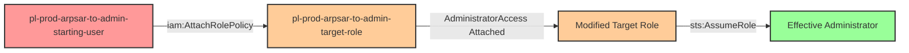

# One-Hop Privilege Escalation: iam:AttachRolePolicy + sts:AssumeRole

* **Category:** Privilege Escalation
* **Sub-Category:** principal-lateral-movement
* **Path Type:** one-hop
* **Target:** to-admin
* **Environments:** prod
* **Technique:** Attaching administrator policy to an assumable role to gain admin access

## Overview

This scenario demonstrates a privilege escalation vulnerability where a user has permission to both attach managed policies to a role AND assume that role. Unlike self-escalation scenarios where a role modifies its own permissions, this scenario involves lateral movement - a user modifying a different principal (a role) and then assuming it to gain elevated privileges.

The combination of `iam:AttachRolePolicy` and `sts:AssumeRole` on the same target role creates a complete privilege escalation path. Even if the target role initially has minimal or no privileges, the attacker can attach the AWS-managed `AdministratorAccess` policy to it and then assume the newly-privileged role to gain full administrative access.

This pattern is particularly dangerous because it may appear safe at first glance - the user doesn't directly have admin permissions, and the target role may only have read-only access. However, write access to a role's policy combined with the ability to assume that role is functionally equivalent to having administrative access.

## Understanding the attack scenario

### Principals in the attack path

- `arn:aws:iam::PROD_ACCOUNT:user/pl-prod-arpsar-to-admin-starting-user` (Scenario-specific starting user)
- `arn:aws:iam::PROD_ACCOUNT:role/pl-prod-arpsar-to-admin-target-role` (Target role that gets modified and assumed)

### Attack Path Diagram



### Attack Steps

1. **Initial Access**: Start as `pl-prod-arpsar-to-admin-starting-user` (credentials provided via Terraform outputs)
2. **Attach Admin Policy**: Use `iam:AttachRolePolicy` to attach the AWS-managed `AdministratorAccess` policy to `pl-prod-arpsar-to-admin-target-role`
3. **Wait for Propagation**: Wait 15 seconds for IAM policy changes to propagate across AWS infrastructure
4. **Assume Modified Role**: Use `sts:AssumeRole` to obtain temporary credentials for the now-privileged target role
5. **Verification**: Verify administrator access using the assumed role credentials

### Scenario specific resources created

| ARN | Purpose |
| -- | -- |
| `arn:aws:iam::PROD_ACCOUNT:user/pl-prod-arpsar-to-admin-starting-user` | Scenario-specific starting user with access keys and inline policy granting iam:AttachRolePolicy and sts:AssumeRole |
| `arn:aws:iam::PROD_ACCOUNT:role/pl-prod-arpsar-to-admin-target-role` | Target role with minimal permissions that can be modified and assumed |

## Executing the attack

### Using the automated demo_attack.sh

To demonstrate the privilege escalation path, run the provided demo script:

```bash
cd modules/scenarios/single-account/privesc-one-hop/to-admin/iam-attachrolepolicy+sts-assumerole
./demo_attack.sh
```

The script will:
1. Display a step-by-step walkthrough with color-coded output
2. Show the commands being executed and their results
3. Verify successful privilege escalation
4. Output standardized test results for automation

### Cleaning up the attack artifacts

After demonstrating the attack, clean up the attached administrator policy:

```bash
cd modules/scenarios/single-account/privesc-one-hop/to-admin/iam-attachrolepolicy+sts-assumerole
./cleanup_attack.sh
```

## Detection and prevention


### MITRE ATT&CK Mapping

- **Tactic**: Privilege Escalation (TA0004)
- **Technique**: T1098 - Account Manipulation
- **Sub-technique**: Modifying cloud account permissions to escalate privileges


## Prevention recommendations

- **Implement SCPs to restrict policy attachment**: Use service control policies to prevent attachment of highly privileged managed policies like `AdministratorAccess` or `PowerUserAccess`
- **Separate attachment and assumption permissions**: Avoid granting both `iam:AttachRolePolicy` and `sts:AssumeRole` to the same principal for the same role
- **Use resource-based conditions on AttachRolePolicy**: Restrict which policies can be attached using the `iam:PolicyARN` condition key to prevent attachment of admin policies
- **Monitor CloudTrail for AttachRolePolicy events**: Alert on `AttachRolePolicy` API calls, especially when followed by `AssumeRole` on the same resource within a short time window
- **Implement permissions boundaries**: Use IAM permissions boundaries to limit the maximum permissions a role can have, even if admin policies are attached
- **Enable MFA for sensitive operations**: Require MFA for both policy attachment operations and role assumption to add an additional security layer
- **Use IAM Access Analyzer**: Regularly scan for privilege escalation paths involving policy modification and role assumption combinations
- **Apply least privilege**: Grant `iam:AttachRolePolicy` only when absolutely necessary, and scope it to specific roles with resource ARN conditions
- **Implement approval workflows**: Require manual approval for attaching managed policies to roles, especially AWS-managed policies with broad permissions
- **Monitor role permission changes**: Set up CloudWatch alarms for changes to role policies and investigate any unexpected modifications
