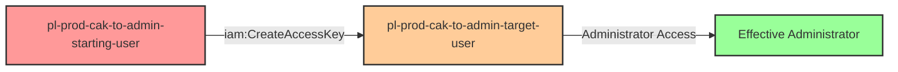

# Privilege Escalation via iam:CreateAccessKey

**Category:** Privilege Escalation
**Sub-Category:** credential-access
**Path Type:** one-hop
**Target:** to-admin
**Environments:** prod
**Pathfinding.cloud ID:** iam-002
**Technique:** Creating access keys for privileged users to gain administrative access

## Overview

This scenario demonstrates a critical privilege escalation vulnerability where a user has permission to create access keys for other IAM users, including those with administrative privileges. The `iam:CreateAccessKey` permission allows an attacker to generate new programmatic credentials for any user they have permission to target, effectively assuming that user's identity and permissions.

In many environments, IAM users with administrative access are created for emergency access or legacy purposes. If a less privileged user has `iam:CreateAccessKey` permission on these admin accounts, they can bypass all intended access controls by simply creating new credentials and authenticating as the privileged user. This is particularly dangerous because it allows complete identity takeover without requiring the victim's existing credentials.

This attack is straightforward to execute, difficult to prevent through traditional IAM boundaries, and can provide instant administrative access to an entire AWS environment. Organizations often overlook this privilege escalation path because it doesn't modify permissions directly - instead, it exploits the ability to generate new authentication credentials for existing privileged accounts.

## Understanding the attack scenario

### Principals in the attack path

- `arn:aws:iam::PROD_ACCOUNT:user/pl-prod-cak-to-admin-starting-user` (Scenario-specific starting user with limited permissions)
- `arn:aws:iam::PROD_ACCOUNT:user/pl-prod-cak-to-admin-target-user` (Target admin user with AdministratorAccess policy)

### Attack Path Diagram



### Attack Steps

1. **Initial Access**: Start as `pl-prod-cak-to-admin-starting-user` (credentials provided via Terraform outputs)
2. **Create Access Keys**: Use `iam:CreateAccessKey` to create new programmatic credentials for the admin user `pl-prod-cak-to-admin-target-user`
3. **Switch Context**: Configure AWS CLI with the newly created access key and secret key
4. **Verification**: Verify administrator access by listing IAM users or performing other admin-level actions

### Scenario specific resources created

| ARN | Purpose |
| -- | -- |
| `arn:aws:iam::PROD_ACCOUNT:user/pl-prod-cak-to-admin-starting-user` | Scenario-specific starting user with access keys and iam:CreateAccessKey permission |
| `arn:aws:iam::PROD_ACCOUNT:user/pl-prod-cak-to-admin-target-user` | Target admin user with AdministratorAccess managed policy attached |

## Executing the attack

### Using the automated demo_attack.sh

To demonstrate the privilege escalation path, run the provided demo script:

```bash
cd modules/scenarios/single-account/privesc-one-hop/to-admin/iam-createaccesskey
./demo_attack.sh
```

The script will:
1. Display a step-by-step walkthrough with color-coded output
2. Show the commands being executed and their results
3. Verify successful privilege escalation
4. Output standardized test results for automation

### Cleaning up the attack artifacts

After demonstrating the attack, clean up the access keys created during the demo:

```bash
cd modules/scenarios/single-account/privesc-one-hop/to-admin/iam-createaccesskey
./cleanup_attack.sh
```

The cleanup script will remove all access keys created for the target admin user during the demonstration, restoring the environment to its original state while preserving the deployed infrastructure.

## Detection and prevention


### MITRE ATT&CK Mapping

- **Tactic**: TA0004 - Privilege Escalation, TA0003 - Persistence
- **Technique**: T1098.001 - Account Manipulation: Additional Cloud Credentials


## Prevention recommendations

- Implement least privilege principles - avoid granting `iam:CreateAccessKey` permissions unless absolutely necessary
- Use resource-based conditions to restrict which users can have access keys created: `"Condition": {"StringNotEquals": {"aws:username": ["admin-user"]}}`
- Implement Service Control Policies (SCPs) at the organization level to prevent access key creation on privileged accounts
- Monitor CloudTrail for `CreateAccessKey` API calls, especially on users with elevated permissions
- Enable MFA requirements for sensitive IAM operations using condition keys like `aws:MultiFactorAuthPresent`
- Use IAM Access Analyzer to identify and remediate privilege escalation paths involving `iam:CreateAccessKey`
- Consider using IAM roles instead of IAM users for administrative access, as roles cannot have access keys created by other principals
- Implement automated alerting on access key creation events for admin accounts using CloudWatch Events or EventBridge
