# Privilege Escalation via iam:DeleteAccessKey + iam:CreateAccessKey

* **Category:** Privilege Escalation
* **Sub-Category:** credential-access
* **Path Type:** one-hop
* **Target:** to-admin
* **Environments:** prod
* **Pathfinding.cloud ID:** iam-003
* **Technique:** Bypassing AWS's 2-access-key limit by deleting an existing key before creating a new one for an admin user

## Overview

This scenario demonstrates a sophisticated variation of the `iam:CreateAccessKey` privilege escalation technique. AWS limits each IAM user to a maximum of two access keys. When a target admin user already has two active access keys, a simple `iam:CreateAccessKey` attack would fail. However, if an attacker has both `iam:DeleteAccessKey` and `iam:CreateAccessKey` permissions, they can bypass this limitation by first deleting one of the existing keys, then creating a new one under their control.

This attack is particularly dangerous because it works even when standard `iam:CreateAccessKey` exploitation would be blocked by AWS's built-in safety limits. Organizations that believe they're protected because their admin users maintain two active keys are vulnerable to this bypass technique. The attacker can identify which keys exist, delete one (potentially disrupting legitimate automation or access), and then create a new key they control.

This technique represents a common oversight in IAM security monitoring. While many organizations watch for `CreateAccessKey` API calls on privileged accounts, they may not correlate these events with preceding `DeleteAccessKey` calls. The combination of these two permissions creates a privilege escalation path that's more subtle and harder to detect than the standard access key creation attack, especially if the deleted key wasn't actively monitored.

## Understanding the attack scenario

### Principals in the attack path

- `arn:aws:iam::PROD_ACCOUNT:user/pl-prod-dakcak-to-admin-starting-user` (Scenario-specific starting user with limited permissions)
- `arn:aws:iam::PROD_ACCOUNT:user/pl-prod-dakcak-to-admin-target-user` (Target admin user with AdministratorAccess policy and 2 existing access keys)

### Attack Path Diagram

```mermaid
graph LR
    A[pl-prod-dakcak-to-admin-starting-user] -->|iam:ListAccessKeys| B[Enumerate Keys]
    B -->|iam:DeleteAccessKey| C[Delete Existing Key]
    C -->|iam:CreateAccessKey| D[pl-prod-dakcak-to-admin-target-user]
    D -->|Administrator Access| E[Effective Administrator]

    style A fill:#ff9999,stroke:#333,stroke-width:2px
    style B fill:#ffcc99,stroke:#333,stroke-width:2px
    style C fill:#ffcc99,stroke:#333,stroke-width:2px
    style D fill:#ffcc99,stroke:#333,stroke-width:2px
    style E fill:#99ff99,stroke:#333,stroke-width:2px
```



### Attack Steps

1. **Initial Access**: Start as `pl-prod-dakcak-to-admin-starting-user` (credentials provided via Terraform outputs)
2. **List Access Keys**: Use `iam:ListAccessKeys` to enumerate existing access keys for the target admin user
3. **Delete Access Key**: Use `iam:DeleteAccessKey` to remove one of the two existing access keys, freeing up a slot
4. **Create New Access Key**: Use `iam:CreateAccessKey` to create new programmatic credentials for the admin user under attacker control
5. **Switch Context**: Configure AWS CLI with the newly created access key and secret key
6. **Verification**: Verify administrator access by listing IAM users or performing other admin-level actions

### Scenario specific resources created

| ARN | Purpose |
| -- | -- |
| `arn:aws:iam::PROD_ACCOUNT:user/pl-prod-dakcak-to-admin-starting-user` | Scenario-specific starting user with access keys and permissions to delete and create access keys |
| `arn:aws:iam::PROD_ACCOUNT:user/pl-prod-dakcak-to-admin-target-user` | Target admin user with AdministratorAccess managed policy attached and 2 pre-existing access keys |

## Executing the attack

### Using the automated demo_attack.sh

To demonstrate the privilege escalation path, run the provided demo script:

```bash
cd modules/scenarios/single-account/privesc-one-hop/to-admin/iam-deleteaccesskey+createaccesskey
./demo_attack.sh
```

The script will:
1. Display a step-by-step walkthrough with color-coded output
2. Show the commands being executed and their results
3. Demonstrate bypassing the 2-key limit by deleting an existing key
4. Verify successful privilege escalation
5. Output standardized test results for automation

### Cleaning up the attack artifacts

After demonstrating the attack, clean up the access key created during the demo:

```bash
cd modules/scenarios/single-account/privesc-one-hop/to-admin/iam-deleteaccesskey+createaccesskey
./cleanup_attack.sh
```

The cleanup script will remove the access key created for the target admin user during the demonstration, restoring the environment to its original state while preserving the deployed infrastructure.

## Detection and prevention


### MITRE ATT&CK Mapping

- **Tactic**: TA0004 - Privilege Escalation, TA0003 - Persistence
- **Technique**: T1098.001 - Account Manipulation: Additional Cloud Credentials


## Prevention recommendations

- Implement least privilege principles - avoid granting `iam:DeleteAccessKey` and `iam:CreateAccessKey` permissions unless absolutely necessary
- Use resource-based conditions to restrict which users can have access keys deleted or created: `"Condition": {"StringNotEquals": {"aws:username": ["admin-user"]}}`
- Implement Service Control Policies (SCPs) at the organization level to prevent access key operations on privileged accounts
- Monitor CloudTrail for `DeleteAccessKey` followed by `CreateAccessKey` API calls within a short timeframe, especially on users with elevated permissions
- Set up CloudWatch alarms that trigger when `DeleteAccessKey` and `CreateAccessKey` are called on the same user within a defined time window (e.g., 5 minutes)
- Enable MFA requirements for sensitive IAM operations using condition keys like `aws:MultiFactorAuthPresent`
- Use IAM Access Analyzer to identify and remediate privilege escalation paths involving `iam:DeleteAccessKey` and `iam:CreateAccessKey` permissions
- Consider using IAM roles instead of IAM users for administrative access, as roles cannot have access keys created by other principals
- Implement automated alerting on access key deletion events for admin accounts using CloudWatch Events or EventBridge
- Maintain an inventory of all access keys for privileged accounts and alert on unexpected key lifecycle events (creation, deletion, rotation)
