# Privilege Escalation via iam:PassRole + Bedrock AgentCore Code Interpreter

* **Category:** Privilege Escalation
* **Sub-Category:** service-passrole
* **Path Type:** one-hop
* **Target:** to-admin
* **Environments:** prod
* **Pathfinding.cloud ID:** bedrock-001
* **Technique:** Pass privileged IAM role to Bedrock code interpreter and extract credentials from MicroVM Metadata Service

## Overview

This scenario demonstrates a novel privilege escalation vulnerability discovered by Nigel Sood at Sonrai Security in 2025. An attacker with `iam:PassRole` and Bedrock AgentCore permissions can create a code interpreter with a privileged IAM role. Code interpreters run on Firecracker MicroVMs that expose a MicroVM Metadata Service (MMDS) at 169.254.169.254, similar to EC2's Instance Metadata Service (IMDS). By invoking Python code within the interpreter session, the attacker can access the metadata service to extract temporary credentials for the execution role, gaining its full permissions.

This represents a significant expansion of the traditional PassRole attack surface into AWS's AI/ML tooling ecosystem. Unlike EC2 or Lambda functions which require infrastructure deployment, code interpreters provide immediate interactive access to credentials through their metadata service.

The vulnerability is particularly dangerous because:
- Code interpreters provide immediate, interactive credential access (no waiting for service initialization)
- The attack can be executed entirely through API calls without deploying persistent infrastructure
- Many organizations are adopting Bedrock for AI/ML workloads without awareness of this escalation path
- Traditional CSPM tools may not detect this as a privilege escalation risk

## Understanding the attack scenario

### Principals in the attack path

- `arn:aws:iam::PROD_ACCOUNT:user/pl-prod-bci-to-admin-starting-user` (Scenario-specific starting user)
- `arn:aws:iam::PROD_ACCOUNT:role/pl-prod-bci-to-admin-target-role` (Target privileged role with admin permissions)

### Attack Path Diagram

```mermaid
graph LR
    A[pl-prod-bci-to-admin-starting-user] -->|iam:PassRole| B[Create Code Interpreter]
    B -->|bedrock-agentcore:CreateCodeInterpreter| C[Code Interpreter with Admin Role]
    C -->|bedrock-agentcore:StartCodeInterpreterSession| D[Active Session]
    D -->|bedrock-agentcore:InvokeCodeInterpreter| E[Execute Python Code]
    E -->|HTTP GET 169.254.169.254| F[MicroVM Metadata Service]
    F -->|Return Credentials| G[Extract Admin Role Credentials]
    G -->|Use Credentials| H[Administrator Access]

    style A fill:#ff9999,stroke:#333,stroke-width:2px
    style C fill:#ffcc99,stroke:#333,stroke-width:2px
    style F fill:#ffcc99,stroke:#333,stroke-width:2px
    style H fill:#99ff99,stroke:#333,stroke-width:2px
```



### Attack Steps

1. **Initial Access**: Start as `pl-prod-bci-to-admin-starting-user` (credentials provided via Terraform outputs)
2. **Create Code Interpreter**: Use `bedrock-agentcore:CreateCodeInterpreter` and pass the privileged target role via `iam:PassRole`
3. **Start Session**: Initiate a code interpreter session with `bedrock-agentcore:StartCodeInterpreterSession`
4. **Execute Credential Extraction**: Use `bedrock-agentcore:InvokeCodeInterpreter` to run Python code that accesses the MicroVM Metadata Service at 169.254.169.254
5. **Extract Credentials**: Read temporary credentials from `/latest/meta-data/iam/security-credentials/execution_role`
6. **Verification**: Use the extracted credentials to verify administrator access

### Scenario specific resources created

| ARN | Purpose |
| -- | -- |
| `arn:aws:iam::PROD_ACCOUNT:user/pl-prod-bci-to-admin-starting-user` | Scenario-specific starting user with access keys |
| `arn:aws:iam::PROD_ACCOUNT:role/pl-prod-bci-to-admin-target-role` | Target privileged role with AdministratorAccess policy |
| `arn:aws:iam::PROD_ACCOUNT:policy/pl-prod-bci-to-admin-starting-user-policy` | Policy granting PassRole and Bedrock AgentCore permissions |

## Executing the attack

### Using the automated demo_attack.sh

To demonstrate the privilege escalation path, run the provided demo script:

```bash
cd modules/scenarios/single-account/privesc-one-hop/to-admin/iam-passrole+bedrockagentcore-codeinterpreter
./demo_attack.sh
```

The script will:
1. Display a step-by-step walkthrough with color-coded output
2. Show the commands being executed and their results
3. Create a code interpreter with the privileged role
4. Extract credentials from the MicroVM Metadata Service
5. Verify successful privilege escalation with admin operations
6. Output standardized test results for automation

### Cleaning up the attack artifacts

After demonstrating the attack, clean up the code interpreter and session:

```bash
cd modules/scenarios/single-account/privesc-one-hop/to-admin/iam-passrole+bedrockagentcore-codeinterpreter
./cleanup_attack.sh
```

## Detection and prevention

### What should CSPM tools detect?

A properly configured Cloud Security Posture Management (CSPM) tool should identify this vulnerability by detecting:

1. **Privilege Escalation Path**: Principal with `iam:PassRole` permission on privileged roles combined with `bedrock-agentcore:CreateCodeInterpreter`
2. **Overly Permissive PassRole**: IAM policy allowing PassRole on roles with administrative or sensitive permissions
3. **Broad Bedrock Permissions**: Principal with unrestricted `bedrock-agentcore:*` permissions
4. **Trust Policy Issues**: Roles that trust bedrock-agentcore.amazonaws.com without restrictive conditions
5. **Toxic Combination**: User/role with both PassRole and Bedrock AgentCore permissions that can access privileged roles

### MITRE ATT&CK Mapping

- **Tactic**: TA0004 - Privilege Escalation, TA0006 - Credential Access
- **Technique**: T1098.001 - Account Manipulation: Additional Cloud Credentials
- **Technique**: T1552.005 - Unsecured Credentials: Cloud Instance Metadata API
- **Sub-technique**: Extracting credentials from AWS service metadata endpoints

## Prevention recommendations

1. **Restrict PassRole Permissions**: Limit `iam:PassRole` to specific non-privileged roles using resource-based conditions:
   ```json
   {
     "Effect": "Allow",
     "Action": "iam:PassRole",
     "Resource": "arn:aws:iam::*:role/bedrock-limited-*",
     "Condition": {
       "StringEquals": {
         "iam:PassedToService": "bedrock-agentcore.amazonaws.com"
       }
     }
   }
   ```

2. **Implement Service Control Policies (SCPs)**: Use SCPs to prevent PassRole on administrative roles:
   ```json
   {
     "Effect": "Deny",
     "Action": "iam:PassRole",
     "Resource": [
       "arn:aws:iam::*:role/*Admin*",
       "arn:aws:iam::*:role/*admin*"
     ],
     "Condition": {
       "StringEquals": {
         "iam:PassedToService": "bedrock-agentcore.amazonaws.com"
       }
     }
   }
   ```

3. **Restrict Bedrock AgentCore Permissions**: Avoid granting broad `bedrock-agentcore:*` permissions. Separate responsibilities:
   - Grant `CreateCodeInterpreter` only to trusted automation
   - Grant `InvokeCodeInterpreter` only to users who need interactive access
   - Never combine with `iam:PassRole` on privileged roles

4. **Monitor CloudTrail Events**: Set up alerts for suspicious Bedrock AgentCore activity:
   - `CreateCodeInterpreter` with privileged role ARNs
   - `InvokeCodeInterpreter` API calls with HTTP requests to 169.254.169.254
   - `StartCodeInterpreterSession` followed immediately by credential usage from different IP addresses

5. **Role Trust Policy Restrictions**: Add conditions to roles trusted by bedrock-agentcore.amazonaws.com:
   ```json
   {
     "Effect": "Allow",
     "Principal": {
       "Service": "bedrock-agentcore.amazonaws.com"
     },
     "Action": "sts:AssumeRole",
     "Condition": {
       "StringEquals": {
         "aws:SourceAccount": "123456789012"
       },
       "ArnLike": {
         "aws:SourceArn": "arn:aws:bedrock:us-east-1:123456789012:code-interpreter/*"
       }
     }
   }
   ```

6. **Use IAM Access Analyzer**: Enable IAM Access Analyzer to identify privilege escalation paths involving PassRole and AWS service integrations

7. **Principle of Least Privilege**: Design Bedrock execution roles with minimal permissions required for the specific use case, never administrative access

8. **Network Monitoring**: Monitor for unusual network patterns from Bedrock resources, including requests to metadata service endpoints

## Cost Estimate

**Free Tier**: This scenario operates within AWS Free Tier limits for Bedrock AgentCore. No charges are expected for normal testing activities.

**Note**: Bedrock AgentCore code interpreters are billed based on usage. Standard testing should remain within free tier limits, but extended or automated testing may incur minimal charges.

## References

This privilege escalation technique was discovered by **Nigel Sood** at **Sonrai Security** in 2025:

- [AWS AgentCore: The Overlooked Privilege Escalation Path in Bedrock AI Tooling](https://sonraisecurity.com/blog/aws-agentcore-privilege-escalation-bedrock-scp-fix/) - Sonrai Security Blog
- [Sandboxed to Compromised: New Research Exposes Credential Exfiltration Paths in AWS Code Interpreters](https://sonraisecurity.com/blog/sandboxed-to-compromised-new-research-exposes-credential-exfiltration-paths-in-aws-code-interpreters/) - Sonrai Security Blog

**Credit**: Special thanks to Nigel Sood and the Sonrai Security research team for discovering and responsibly disclosing this privilege escalation path.

## Technical Background

### MicroVM Metadata Service (MMDS)

Bedrock code interpreters run on Firecracker MicroVMs, which expose a metadata service similar to EC2's IMDS:

- **Endpoint**: 169.254.169.254 (same as EC2 IMDS)
- **Credential Path**: `/latest/meta-data/iam/security-credentials/execution_role`
- **Format**: JSON response containing AccessKeyId, SecretAccessKey, Token, and Expiration
- **Access**: No IMDSv2 token requirement (unlike EC2)

### Why This Matters

This attack path is significant because:

1. **Novel Service Vector**: Expands traditional PassRole attacks beyond EC2/Lambda/Glue into AI/ML services
2. **Interactive Access**: Provides immediate, interactive credential extraction (no deployment wait times)
3. **Low Visibility**: Many organizations are unaware of this escalation path in their Bedrock implementations
4. **Detection Gap**: Traditional privilege escalation detection may not cover Bedrock AgentCore
5. **Growing Attack Surface**: As organizations adopt AI/ML, more services may expose similar patterns

### Comparison to Traditional PassRole Attacks

| Aspect | EC2 PassRole | Lambda PassRole | Bedrock Code Interpreter PassRole |
|--------|--------------|-----------------|-----------------------------------|
| **Setup Time** | Minutes (instance boot) | Seconds (cold start) | Immediate (session start) |
| **Interactivity** | SSH/SSM required | Invocation only | Native Python interpreter |
| **Credential Access** | IMDS with IMDSv2 | Environment variables | MMDS without token requirement |
| **Infrastructure** | Persistent instance | Ephemeral function | Ephemeral interpreter |
| **Cost** | Ongoing | Per-invocation | Per-session |
| **Detection Maturity** | High | High | Low |

## Deployment Instructions

This scenario is deployed as part of the Pathfinding Labs framework. To enable it:

1. **Edit terraform.tfvars**:
   ```hcl
   enable_single_account_privesc_one_hop_to_admin_iam_passrole_bedrockagentcore_codeinterpreter = true
   ```

2. **Apply Terraform**:
   ```bash
   terraform init
   terraform plan
   terraform apply
   ```

3. **Retrieve Credentials** (automatic in demo_attack.sh):
   ```bash
   terraform output -json | jq -r '.single_account_privesc_one_hop_to_admin_iam_passrole_bedrockagentcore_codeinterpreter.value'
   ```

4. **Run the Demo**:
   ```bash
   cd modules/scenarios/single-account/privesc-one-hop/to-admin/iam-passrole+bedrockagentcore-codeinterpreter
   ./demo_attack.sh
   ```

## Additional Notes

- **Bedrock Region Availability**: This scenario requires a region where Amazon Bedrock AgentCore is available
- **Service Quotas**: Default Bedrock quotas should be sufficient for testing
- **Cleanup**: The cleanup script removes code interpreters and sessions but preserves the IAM infrastructure
- **Research Credit**: This technique represents cutting-edge cloud security research and demonstrates the evolving nature of AWS privilege escalation paths
