# Privilege Escalation via iam:PassRole + cloudformation:CreateStackSet + cloudformation:CreateStackInstances

**Category:** Privilege Escalation
**Sub-Category:** service-passrole
**Path Type:** one-hop
**Target:** to-admin
**Environments:** prod
**Technique:** Passing administrative execution role to CloudFormation StackSet to create escalated IAM resources

## Overview

This scenario demonstrates a sophisticated privilege escalation vulnerability where a user with both `iam:PassRole` and `cloudformation:CreateStackSet` permissions can escalate privileges by passing an administrative execution role to CloudFormation StackSets. CloudFormation StackSets are designed to deploy stacks across multiple AWS accounts and regions, but they can also be used within a single account to create resources with elevated permissions.

The attack exploits the StackSet execution model, which requires two roles: an administration role (used by the AWS service) and an execution role (used to perform the actual resource creation). When a user can pass a privileged execution role to a StackSet and deploy CloudFormation templates, they can create IAM resources such as roles, users, or policies with any permissions defined in the template. The attacker then assumes the newly created escalated role to gain administrative access.

This privilege escalation path is particularly dangerous because it leverages a legitimate AWS service (CloudFormation StackSets) to create privileged resources indirectly. Many organizations grant `cloudformation:CreateStackSet` permissions without fully understanding the privilege escalation implications when combined with `iam:PassRole` on administrative execution roles. The attack is stealthy, as the resource creation appears to be a normal infrastructure deployment operation, and it provides persistence through the newly created IAM role.

## Understanding the attack scenario

### Principals in the attack path

- `arn:aws:iam::PROD_ACCOUNT:user/pl-prod-pcfss-to-admin-starting-user` (Scenario-specific starting user with PassRole and CreateStackSet permissions)
- `arn:aws:iam::PROD_ACCOUNT:role/pl-prod-pcfss-to-admin-execution-role` (Privileged execution role with administrative permissions)
- `arn:aws:iam::PROD_ACCOUNT:role/pl-prod-pcfss-to-admin-escalated-role` (Escalated admin role created by the StackSet)

### Attack Path Diagram

```mermaid
graph LR
    A[pl-prod-pcfss-to-admin-starting-user] -->|iam:PassRole + cloudformation:CreateStackSet + cloudformation:CreateStackInstances| B[CloudFormation StackSet]
    B -->|Uses execution role permissions| C[pl-prod-pcfss-to-admin-execution-role]
    C -->|Creates IAM role| D[pl-prod-pcfss-to-admin-escalated-role]
    D -->|sts:AssumeRole| E[Effective Administrator]

    style A fill:#ff9999,stroke:#333,stroke-width:2px
    style B fill:#ffcc99,stroke:#333,stroke-width:2px
    style C fill:#ffcc99,stroke:#333,stroke-width:2px
    style D fill:#ffcc99,stroke:#333,stroke-width:2px
    style E fill:#99ff99,stroke:#333,stroke-width:2px
```



### Attack Steps

1. **Initial Access**: Start as `pl-prod-pcfss-to-admin-starting-user` (credentials provided via Terraform outputs)
2. **Prepare CloudFormation Template**: Create a CloudFormation template that defines an IAM role with administrative permissions and a trust policy allowing the starting user to assume it
3. **Create StackSet**: Use `cloudformation:CreateStackSet` to create a new StackSet, passing the privileged `pl-prod-pcfss-to-admin-execution-role` via `iam:PassRole`
4. **Deploy Stack Instance**: Create a stack instance within the StackSet to deploy the template in the current account and region
5. **Wait for Completion**: Monitor the StackSet operation until the escalated role is successfully created
6. **Assume Escalated Role**: Use `sts:AssumeRole` to assume the newly created `pl-prod-pcfss-to-admin-escalated-role`
7. **Verification**: Verify administrator access by listing IAM users or performing other admin-level actions

### Scenario specific resources created

| ARN | Purpose |
| -- | -- |
| `arn:aws:iam::PROD_ACCOUNT:user/pl-prod-pcfss-to-admin-starting-user` | Scenario-specific starting user with access keys, iam:PassRole, and cloudformation:CreateStackSet permissions |
| `arn:aws:iam::PROD_ACCOUNT:role/pl-prod-pcfss-to-admin-execution-role` | Privileged execution role with AdministratorAccess policy that can be passed to StackSets |
| `arn:aws:iam::PROD_ACCOUNT:role/pl-prod-pcfss-to-admin-escalated-role` | Escalated admin role created by the StackSet with full administrative permissions |

## Executing the attack

### Using the automated demo_attack.sh

To demonstrate the privilege escalation path, run the provided demo script:

```bash
cd modules/scenarios/single-account/privesc-one-hop/to-admin/iam-passrole+cloudformation-createstackset+cloudformation-createstackinstances
./demo_attack.sh
```

The script will:
1. Display a step-by-step walkthrough with color-coded output
2. Show the commands being executed and their results
3. Create a CloudFormation template defining an escalated IAM role
4. Create a StackSet and deploy a stack instance with the execution role
5. Wait for the StackSet operation to complete
6. Assume the escalated role and verify administrative access
7. Output standardized test results for automation

### Cleaning up the attack artifacts

After demonstrating the attack, clean up the StackSet and escalated role created during the demo:

```bash
cd modules/scenarios/single-account/privesc-one-hop/to-admin/iam-passrole+cloudformation-createstackset+cloudformation-createstackinstances
./cleanup_attack.sh
```

The cleanup script will remove the StackSet, delete the stack instances, and clean up the escalated IAM role created during the demonstration, restoring the environment to its original state while preserving the deployed infrastructure.

## Detection and prevention

### MITRE ATT&CK Mapping

- **Tactic**: TA0004 - Privilege Escalation, TA0003 - Persistence
- **Technique**: T1098.001 - Account Manipulation: Additional Cloud Credentials

## Prevention recommendations

- Implement strict least privilege for `iam:PassRole` permissions - use resource-based conditions to limit which roles can be passed: `"Resource": "arn:aws:iam::*:role/approved-stackset-roles/*"`
- Restrict `cloudformation:CreateStackSet` permissions to only authorized infrastructure automation principals
- Apply permission boundaries to StackSet execution roles to limit what resources they can create, even with administrative policies attached
- Use Service Control Policies (SCPs) to prevent StackSet execution roles from creating IAM resources: `"Effect": "Deny", "Action": ["iam:CreateRole", "iam:PutRolePolicy"], "Resource": "*"`
- Monitor CloudTrail for `CreateStackSet` and `CreateStackInstances` API calls, especially when they create IAM resources
- Implement CloudFormation stack policies and StackSet operation preferences to require approval workflows for IAM resource creation
- Use AWS IAM Access Analyzer to identify roles with overly permissive PassRole capabilities
- Consider using CloudFormation service-managed StackSets with Organizations, which provide more controlled permission models than self-managed StackSets
- Enable MFA requirements for sensitive CloudFormation operations using condition keys like `aws:MultiFactorAuthPresent`
- Regularly audit StackSet execution roles to ensure they follow least privilege principles and have appropriate permission boundaries
