# Privilege Escalation via iam:PassRole + ecs:RegisterTaskDefinition + ecs:RunTask

* **Category:** Privilege Escalation
* **Sub-Category:** service-passrole
* **Path Type:** one-hop
* **Target:** to-admin
* **Environments:** prod
* **Technique:** ECS Fargate task execution with admin role to grant starting user administrative access

## Overview

This scenario demonstrates a privilege escalation vulnerability where a user has permissions to pass IAM roles to ECS tasks (`iam:PassRole`), register ECS task definitions (`ecs:RegisterTaskDefinition`), and run ECS tasks (`ecs:RunTask`). The attacker can create a malicious ECS task definition that uses an administrative execution role, then launch it on AWS Fargate to modify IAM permissions and grant themselves administrator access.

ECS Fargate provides serverless container execution where tasks receive temporary credentials based on their task execution role. By combining `iam:PassRole` with ECS task definition registration and task execution permissions, an attacker can leverage the container platform to run arbitrary code with elevated privileges. Unlike EC2 instances, ECS Fargate tasks are ephemeral, execute quickly, and leave minimal forensic evidence beyond CloudTrail logs.

The attack works by registering a task definition that specifies an admin role and contains a containerized AWS CLI command to attach the AdministratorAccess policy to the starting user. When the task runs on Fargate, it executes with the admin role's credentials and persistently elevates the attacker's privileges. This technique is particularly stealthy because ECS tasks can complete in seconds and automatically clean up their infrastructure.

## Understanding the attack scenario

### Principals in the attack path

- `arn:aws:iam::PROD_ACCOUNT:user/pl-prod-precsrt-to-admin-starting-user` (Scenario-specific starting user with PassRole and ECS permissions)
- `arn:aws:iam::PROD_ACCOUNT:role/pl-prod-precsrt-to-admin-target-role` (Admin role passed to ECS task for execution)

### Attack Path Diagram

```mermaid
graph LR
    A[pl-prod-precsrt-to-admin-starting-user] -->|ecs:RegisterTaskDefinition with admin role| B[ECS Task Definition]
    B -->|ecs:RunTask| C[ECS Fargate Task]
    C -->|Executes with| D[pl-prod-precsrt-to-admin-target-role]
    D -->|iam:AttachUserPolicy| E[pl-prod-precsrt-to-admin-starting-user + AdministratorAccess]
    E --> F[Effective Administrator]

    style A fill:#ff9999,stroke:#333,stroke-width:2px
    style B fill:#ffcc99,stroke:#333,stroke-width:2px
    style C fill:#ffcc99,stroke:#333,stroke-width:2px
    style D fill:#ffcc99,stroke:#333,stroke-width:2px
    style E fill:#ffcc99,stroke:#333,stroke-width:2px
    style F fill:#99ff99,stroke:#333,stroke-width:2px
```



### Attack Steps

1. **Initial Access**: Start as `pl-prod-precsrt-to-admin-starting-user` (credentials provided via Terraform outputs)
2. **Register Task Definition**: Use `ecs:RegisterTaskDefinition` with `iam:PassRole` to create an ECS task definition that:
   - Uses the admin target role as the task execution role
   - Specifies a container with AWS CLI installed
   - Defines a command to attach AdministratorAccess policy to the starting user
3. **Launch Task**: Use `ecs:RunTask` to execute the task on AWS Fargate
4. **Policy Attachment**: The ECS task runs with the admin role's credentials and attaches AdministratorAccess to the starting user
5. **Verification**: Verify administrator access by listing IAM users with the starting user's credentials

### Scenario specific resources created

| ARN | Purpose |
| -- | -- |
| `arn:aws:iam::PROD_ACCOUNT:user/pl-prod-precsrt-to-admin-starting-user` | Scenario-specific starting user with access keys and ECS permissions |
| `arn:aws:iam::PROD_ACCOUNT:role/pl-prod-precsrt-to-admin-target-role` | Admin role that can be passed to ECS tasks (trusts ecs-tasks.amazonaws.com) |
| `arn:aws:ecs:REGION:PROD_ACCOUNT:cluster/pl-prod-precsrt-cluster` | ECS cluster for running Fargate tasks |

## Executing the attack

### Using the automated demo_attack.sh

To demonstrate the privilege escalation path, run the provided demo script:

```bash
cd modules/scenarios/single-account/privesc-one-hop/to-admin/iam-passrole+ecs-registertaskdefinition+ecs-runtask
./demo_attack.sh
```

The script will:
1. Display a step-by-step walkthrough with color-coded output
2. Show the commands being executed and their results
3. Verify successful privilege escalation
4. Output standardized test results for automation

### Cleaning up the attack artifacts

After demonstrating the attack, clean up the ECS task definition, running tasks, and detach the AdministratorAccess policy from the starting user:

```bash
cd modules/scenarios/single-account/privesc-one-hop/to-admin/iam-passrole+ecs-registertaskdefinition+ecs-runtask
./cleanup_attack.sh
```

## Detection and prevention


### MITRE ATT&CK Mapping

- **Tactic**: TA0004 - Privilege Escalation, TA0002 - Execution
- **Technique**: T1078.004 - Valid Accounts: Cloud Accounts
- **Technique**: T1610 - Deploy Container


## Prevention recommendations

- Restrict `iam:PassRole` permissions using resource-based conditions to limit which roles can be passed and to which AWS services
- Implement condition keys like `iam:PassedToService` with value `ecs-tasks.amazonaws.com` to explicitly control PassRole usage
- Avoid granting broad `ecs:RegisterTaskDefinition` and `ecs:RunTask` permissions; use resource tags or naming patterns to limit task operations
- Monitor CloudTrail for `RegisterTaskDefinition` and `RunTask` events where task roles have administrative privileges
- Implement Service Control Policies (SCPs) that prevent passing roles with administrative permissions to ECS tasks
- Use IAM Access Analyzer to identify privilege escalation paths involving PassRole combined with ECS operations
- Enable AWS Config rules to detect ECS task definitions with overly permissive execution roles
- Alert on `AttachUserPolicy` and `PutUserPolicy` API calls, especially when the principal is an ECS task role
- Implement IAM permission boundaries on users to limit the maximum permissions that can be attached
- Require approval workflows for ECS task definitions that reference privileged IAM roles
- Use VPC Flow Logs and CloudWatch Logs to monitor ECS task network activity and command execution
- Restrict ECS cluster access using resource-based policies and condition keys to enforce least privilege
