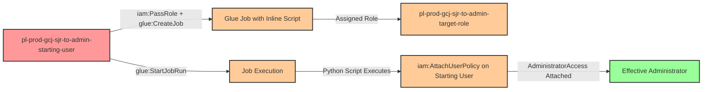

# Privilege Escalation via iam:PassRole + glue:CreateJob + glue:StartJobRun

**Category:** Privilege Escalation
**Sub-Category:** service-passrole
**Path Type:** one-hop
**Target:** to-admin
**Environments:** prod
**Technique:** Pass privileged role to AWS Glue Job with inline Python script for privilege escalation

## Overview

This scenario demonstrates a privilege escalation vulnerability where a user with `iam:PassRole`, `glue:CreateJob`, and `glue:StartJobRun` permissions can create an AWS Glue ETL job with an administrative role and inline Python code that grants the starting user administrative access.

AWS Glue jobs are serverless ETL (Extract, Transform, Load) workloads that run Python or Scala scripts to process data. When creating a Glue job, you can specify an IAM role that the job will assume during execution. If an attacker can pass a privileged role to a Glue job and control the job's code (via inline script or command parameters), they can execute arbitrary Python code with administrative permissions.

This is a powerful "PassRole + Service" privilege escalation pattern similar to PassRole with Lambda, but using AWS Glue's job execution feature. Unlike the CreateDevEndpoint technique which requires SSH access and has high costs (~$2.20/hour), this attack uses Python shell jobs which are much more cost-effective (~$0.44/DPU-hour with 0.0625 DPU minimum), making it practical for demonstrations. The attacker creates a job with malicious inline Python code, manually starts the job execution, and the job modifies IAM permissions to grant the starting user administrative access.

## Understanding the attack scenario

### Principals in the attack path

- `arn:aws:iam::PROD_ACCOUNT:user/pl-prod-gcj-sjr-to-admin-starting-user` (Scenario-specific starting user)
- `arn:aws:iam::PROD_ACCOUNT:role/pl-prod-gcj-sjr-to-admin-target-role` (Admin role passed to Glue job)

### Attack Path Diagram



### Attack Steps

1. **Initial Access**: Start as `pl-prod-gcj-sjr-to-admin-starting-user` (credentials provided via Terraform outputs)
2. **Create Glue Job**: Use `glue:CreateJob` to create a Python shell job with inline script containing malicious code, passing the admin role via `iam:PassRole`
3. **Inline Python Script**: The job is configured with Python code that uses boto3 to attach the AdministratorAccess policy to the starting user:
   ```python
   import boto3
   iam = boto3.client('iam')
   iam.attach_user_policy(
       UserName='pl-prod-gcj-sjr-to-admin-starting-user',
       PolicyArn='arn:aws:iam::aws:policy/AdministratorAccess'
   )
   ```
4. **Start Job Run**: Use `glue:StartJobRun` to manually trigger execution of the Glue job
5. **Wait for Completion**: Monitor job execution status using `glue:GetJobRun` (typically completes in 1-2 minutes)
6. **Verification**: Verify administrator access by executing privileged operations (e.g., `aws iam list-users`)

### Scenario specific resources created

| ARN | Purpose |
| -- | -- |
| `arn:aws:iam::PROD_ACCOUNT:user/pl-prod-gcj-sjr-to-admin-starting-user` | Scenario-specific starting user with access keys |
| `arn:aws:iam::PROD_ACCOUNT:role/pl-prod-gcj-sjr-to-admin-target-role` | Administrative role passed to Glue job |
| `arn:aws:iam::PROD_ACCOUNT:policy/pl-prod-gcj-sjr-to-admin-passrole-policy` | Policy allowing PassRole on target role, glue:CreateJob, and glue:StartJobRun |

## Executing the attack

### Cost Considerations

AWS Glue Python shell jobs cost approximately **$0.44 per DPU-hour**. Python shell jobs use a minimum of **0.0625 DPU** (1/16th DPU). A typical job run for this demonstration takes **1-2 minutes**, resulting in costs of approximately **$0.10 per month** for testing purposes.

**Estimated costs:**
- **Per job run:** ~$0.001-0.002 (1-2 minutes)
- **10 demo runs:** ~$0.01-0.02
- **Monthly (daily testing):** ~$0.03-0.06

This is significantly more cost-effective than Glue development endpoints (~$2.20/hour) and makes it practical for frequent demonstrations and testing.

### Using the automated demo_attack.sh

To demonstrate the privilege escalation path, run the provided demo script:

```bash
cd modules/scenarios/single-account/privesc-one-hop/to-admin/iam-passrole+glue-createjob+glue-startjobrun
./demo_attack.sh
```

The script will:
1. Display a step-by-step walkthrough with color-coded output
2. Show the commands being executed and their results
3. Create a Glue Python shell job with inline malicious code
4. Pass the admin role to the Glue job during creation
5. Start the job execution manually
6. Wait for the job to complete (typically 1-2 minutes)
7. Verify successful privilege escalation by demonstrating admin access
8. Output standardized test results for automation

### Cleaning up the attack artifacts

After demonstrating the attack, clean up the Glue job and remove the AdministratorAccess policy from the starting user:

```bash
cd modules/scenarios/single-account/privesc-one-hop/to-admin/iam-passrole+glue-createjob+glue-startjobrun
./cleanup_attack.sh
```

The cleanup script will:
- Delete the Glue job created during the demo
- Detach the AdministratorAccess policy from the starting user
- Remove any temporary resources

## Detection and prevention

### What CSPM tools should detect

A properly configured CSPM solution should identify:
- IAM user with `iam:PassRole` permission on privileged roles
- IAM user with `glue:CreateJob` and `glue:StartJobRun` permissions
- Combination of PassRole and Glue permissions enabling privilege escalation
- IAM role with administrative permissions that can be passed to Glue services
- Glue trust policy allowing the Glue service to assume privileged roles
- Privilege escalation path from user to admin via Glue job creation
- Glue jobs created with inline commands (higher risk than S3-stored scripts)

### Runtime Detection Indicators

CloudTrail events to monitor:
- **CreateJob** with inline `Command` parameter (not referencing S3 script)
- **CreateJob** where the `Role` parameter references an administrative role
- **StartJobRun** immediately after CreateJob (suspicious timing)
- **AttachUserPolicy** or **PutUserPolicy** API calls from Glue service principal
- Short-lived Glue jobs (created, run, and deleted quickly)
- Glue jobs that make IAM modifications instead of typical ETL operations

### MITRE ATT&CK Mapping

- **Tactic**: Privilege Escalation (TA0004)
- **Technique**: T1078.004 - Valid Accounts: Cloud Accounts
- **Sub-technique**: Creating cloud compute resources with elevated privileges to execute malicious code

## Prevention recommendations

- **Restrict PassRole permissions**: Limit `iam:PassRole` to only the specific roles and services needed. Use resource-level restrictions:
  ```json
  {
    "Effect": "Allow",
    "Action": "iam:PassRole",
    "Resource": "arn:aws:iam::*:role/specific-glue-role",
    "Condition": {
      "StringEquals": {
        "iam:PassedToService": "glue.amazonaws.com"
      }
    }
  }
  ```

- **Implement SCPs to prevent privilege escalation**: Use Service Control Policies to deny PassRole on administrative roles:
  ```json
  {
    "Effect": "Deny",
    "Action": "iam:PassRole",
    "Resource": "arn:aws:iam::*:role/*admin*",
    "Condition": {
      "StringEquals": {
        "iam:PassedToService": "glue.amazonaws.com"
      }
    }
  }
  ```

- **Require S3-stored scripts**: Enforce policies that deny `glue:CreateJob` when inline commands are used. Require all Glue job scripts to be stored in audited S3 buckets:
  ```json
  {
    "Effect": "Deny",
    "Action": "glue:CreateJob",
    "Resource": "*",
    "Condition": {
      "StringLike": {
        "glue:CommandName": "pythonshell"
      },
      "Null": {
        "glue:ScriptLocation": "true"
      }
    }
  }
  ```

- **Monitor CloudTrail for Glue job creation**: Alert on `CreateJob` API calls, especially when combined with PassRole on privileged roles or when using inline commands. Look for unusual patterns of Glue job creation by users who don't typically use Glue.

- **Restrict glue:CreateJob and glue:StartJobRun permissions**: Only grant these permissions to users who legitimately need to create and run Glue jobs (data engineers, ETL developers). These are powerful permissions that should be tightly controlled.

- **Use IAM Access Analyzer**: Enable IAM Access Analyzer to automatically detect privilege escalation paths involving PassRole and Glue services. Review findings regularly and remediate identified risks.

- **Implement least privilege for Glue roles**: When creating IAM roles for Glue services, grant only the minimum permissions required for the specific ETL tasks. Avoid using administrative policies like `AdministratorAccess` or `PowerUserAccess` on Glue service roles. Typical Glue jobs need S3, Glue Data Catalog, and CloudWatch Logs access—not IAM permissions.

- **Require MFA for sensitive operations**: Implement MFA requirements for operations like `glue:CreateJob`, `glue:StartJobRun`, and `iam:PassRole` to add an additional layer of security against compromised credentials.

- **Enforce job approval workflows**: Implement organizational policies requiring code review and approval before Glue jobs can be created or modified, especially for jobs with elevated IAM roles.

- **Tag and monitor Glue resources**: Apply mandatory tagging to Glue jobs and monitor for jobs created without proper tags or by unauthorized users. Use AWS Config rules to enforce tagging policies and detect jobs with administrative roles.

- **Use VPC endpoints and private subnets**: Configure Glue jobs to run within private VPCs without public internet access, reducing the attack surface even if a job is created with elevated privileges.

- **Separate Glue accounts**: Consider running production Glue workloads in dedicated AWS accounts with strict cross-account access controls, limiting the blast radius of compromised Glue permissions.

## References

- [AWS Glue Jobs Documentation](https://docs.aws.amazon.com/glue/latest/dg/author-job.html)
- [AWS Glue Python Shell Jobs](https://docs.aws.amazon.com/glue/latest/dg/add-job-python.html)
- [AWS IAM PassRole Documentation](https://docs.aws.amazon.com/IAM/latest/UserGuide/id_roles_use_passrole.html)
- [Rhino Security Labs - AWS IAM Privilege Escalation Methods](https://rhinosecuritylabs.com/aws/aws-privilege-escalation-methods-mitigation/)
