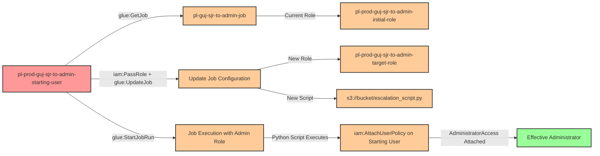

# Privilege Escalation via iam:PassRole + glue:UpdateJob + glue:StartJobRun

**Category:** Privilege Escalation
**Sub-Category:** service-passrole
**Path Type:** one-hop
**Target:** to-admin
**Environments:** prod
**Pathfinding.cloud ID:** glue-005
**Technique:** Modify existing Glue Job to use privileged role and malicious script for privilege escalation

## Overview

This scenario demonstrates a privilege escalation vulnerability where a user with `iam:PassRole`, `glue:UpdateJob`, and `glue:StartJobRun` permissions can modify an existing AWS Glue ETL job to execute with an administrative role and malicious Python code that grants the starting user administrative access.

Unlike the `glue:CreateJob` privilege escalation technique (glue-003) where an attacker creates a new Glue job, this scenario exploits the ability to **update an existing job** that already exists in the environment. This approach can be stealthier because:
- Existing Glue jobs are common in production environments running legitimate ETL workloads
- Updating a job generates different CloudTrail events than creating new resources
- Security monitoring may focus more on resource creation than modification
- The attack can blend in with normal job maintenance activities

When updating a Glue job, an attacker can change both the IAM role the job uses (via `iam:PassRole`) and the script location. By pointing the job to a malicious Python script and passing an administrative role, they can execute arbitrary code with elevated privileges when the job runs.

This is part of the "PassRole + Service" privilege escalation family, demonstrating how AWS Glue's flexibility becomes a security risk when update permissions are not properly restricted. The attack is cost-effective (~$0.44/DPU-hour with 0.0625 DPU minimum), making it practical for demonstrations and real-world exploitation.

## Understanding the attack scenario

### Principals in the attack path

- `arn:aws:iam::PROD_ACCOUNT:user/pl-prod-guj-sjr-to-admin-starting-user` (Scenario-specific starting user)
- `arn:aws:iam::PROD_ACCOUNT:role/pl-prod-guj-sjr-to-admin-initial-role` (Initial non-privileged role assigned to pre-existing job)
- `arn:aws:iam::PROD_ACCOUNT:role/pl-prod-guj-sjr-to-admin-target-role` (Admin role passed during job update)
- `arn:aws:glue::PROD_ACCOUNT:job/pl-guj-sjr-to-admin-job` (Pre-existing Glue job to be modified)

### Attack Path Diagram



### Attack Steps

1. **Initial Access**: Start as `pl-prod-guj-sjr-to-admin-starting-user` (credentials provided via Terraform outputs)
2. **Discover Existing Job**: Use `glue:GetJob` to view the pre-existing Glue job configuration (role: `pl-prod-guj-sjr-to-admin-initial-role`, script: `s3://bucket/benign_script.py`)
3. **Update Job Configuration**: Use `glue:UpdateJob` to modify the job, changing:
   - **Role**: From non-privileged initial role to `pl-prod-guj-sjr-to-admin-target-role` (has AdministratorAccess)
   - **Script**: From benign script to malicious escalation script location
4. **Malicious Script**: The updated script location points to Python code that uses boto3 to attach AdministratorAccess policy to the starting user:
   ```python
   import boto3
   iam = boto3.client('iam')
   iam.attach_user_policy(
       UserName='pl-prod-guj-sjr-to-admin-starting-user',
       PolicyArn='arn:aws:iam::aws:policy/AdministratorAccess'
   )
   ```
5. **Start Job Run**: Use `glue:StartJobRun` to manually trigger execution of the now-modified Glue job
6. **Wait for Completion**: Monitor job execution status using `glue:GetJobRun` (typically completes in 1-2 minutes)
7. **Verification**: Verify administrator access by executing privileged operations (e.g., `aws iam list-users`)

### Scenario specific resources created

| ARN | Purpose |
| -- | -- |
| `arn:aws:iam::PROD_ACCOUNT:user/pl-prod-guj-sjr-to-admin-starting-user` | Scenario-specific starting user with access keys |
| `arn:aws:iam::PROD_ACCOUNT:role/pl-prod-guj-sjr-to-admin-initial-role` | Initial non-privileged role that the Glue job starts with (only AWSGlueServiceRole permissions) |
| `arn:aws:iam::PROD_ACCOUNT:role/pl-prod-guj-sjr-to-admin-target-role` | Administrative role that will be passed to the job during update |
| `arn:aws:iam::PROD_ACCOUNT:policy/pl-prod-guj-sjr-to-admin-passrole-policy` | Policy allowing PassRole on target role, glue:UpdateJob, and glue:StartJobRun |
| `arn:aws:s3:::pl-glue-scripts-guj-sjr-ACCOUNT_ID-SUFFIX/benign_script.py` | Original benign Python script that the job starts with |
| `arn:aws:s3:::pl-glue-scripts-guj-sjr-ACCOUNT_ID-SUFFIX/escalation_script.py` | Malicious Python script that performs privilege escalation |
| `arn:aws:glue::PROD_ACCOUNT:job/pl-guj-sjr-to-admin-job` | Pre-existing Glue Python shell job that will be updated during the attack |

## Executing the attack

### Key Differences from glue:CreateJob Technique

This scenario differs from the `glue:CreateJob` privilege escalation (glue-003) in several important ways:

| Aspect | CreateJob (glue-003) | UpdateJob (glue-005) |
|--------|---------------------|---------------------|
| **Permission Required** | `glue:CreateJob` | `glue:UpdateJob` |
| **Starting Point** | No pre-existing job | Existing job already deployed |
| **CloudTrail Event** | `CreateJob` | `UpdateJob` |
| **Detection Difficulty** | Easier (new resource) | Harder (modification of existing) |
| **Stealth Factor** | Lower (unusual to create jobs) | Higher (updates blend with maintenance) |
| **Script Method** | Inline command or S3 | S3 script location change |
| **Cleanup Required** | Delete created job | Restore job to original config |

**When UpdateJob is more dangerous:**
- Organizations that don't monitor job configuration changes
- Environments with many existing Glue jobs (blends in)
- Teams that regularly update jobs (normal activity pattern)
- CSPM tools focused only on resource creation, not modification

### Cost Considerations

AWS Glue Python shell jobs cost approximately **$0.44 per DPU-hour**. Python shell jobs use a minimum of **0.0625 DPU** (1/16th DPU). A typical job run for this demonstration takes **1-2 minutes**, resulting in costs of approximately **$0.10 per month** for testing purposes.

**Estimated costs:**
- **Per job run:** ~$0.001-0.002 (1-2 minutes)
- **10 demo runs:** ~$0.01-0.02
- **Monthly (daily testing):** ~$0.03-0.06

This is significantly more cost-effective than Glue development endpoints (~$2.20/hour) and makes it practical for frequent demonstrations and testing.

### Using the automated demo_attack.sh

To demonstrate the privilege escalation path, run the provided demo script:

```bash
cd modules/scenarios/single-account/privesc-one-hop/to-admin/iam-passrole+glue-updatejob+glue-startjobrun
./demo_attack.sh
```

The script will:
1. Display a step-by-step walkthrough with color-coded output
2. Show the commands being executed and their results
3. Display the current (benign) configuration of the pre-existing Glue job
4. Update the Glue job to use the admin role and malicious script
5. Start the job execution manually
6. Wait for the job to complete (typically 1-2 minutes)
7. Verify successful privilege escalation by demonstrating admin access
8. Output standardized test results for automation

### Cleaning up the attack artifacts

After demonstrating the attack, restore the Glue job to its original configuration and remove the AdministratorAccess policy from the starting user:

```bash
cd modules/scenarios/single-account/privesc-one-hop/to-admin/iam-passrole+glue-updatejob+glue-startjobrun
./cleanup_attack.sh
```

The cleanup script will:
- Restore the Glue job to its original configuration (initial role and benign script)
- Detach the AdministratorAccess policy from the starting user
- Verify the job configuration is back to its original state
- Preserve the Glue job infrastructure (only removes attack artifacts)

## Detection and prevention

### What CSPM tools should detect

A properly configured CSPM solution should identify:
- IAM user with `iam:PassRole` permission on privileged roles
- IAM user with `glue:UpdateJob` and `glue:StartJobRun` permissions
- Combination of PassRole and Glue update permissions enabling privilege escalation
- IAM role with administrative permissions that can be passed to Glue services
- Glue trust policy allowing the Glue service to assume privileged roles
- Privilege escalation path from user to admin via Glue job modification
- Glue jobs with roles that have excessive permissions (e.g., AdministratorAccess)
- **Configuration drift:** Glue job role or script changes from baseline configuration

### Runtime Detection Indicators

CloudTrail events to monitor:

**Critical Events:**
- **UpdateJob** where the `Role` parameter is changed to a more privileged role
- **UpdateJob** where the `ScriptLocation` parameter is changed to a different S3 location
- **StartJobRun** immediately after UpdateJob (suspicious timing - typically < 5 minutes)
- **AttachUserPolicy** or **PutUserPolicy** API calls from Glue service principal
- **UpdateJob** performed by users who don't typically manage Glue infrastructure

**Detection Patterns:**
- Job role changed from standard service role to administrative role
- Script location changed from approved bucket to external/unknown bucket
- Multiple UpdateJob calls in short succession (reconnaissance/testing)
- Job updated and immediately executed (not following change management process)
- Glue jobs that make IAM modifications instead of typical ETL operations
- Job configuration changes outside of normal business hours
- UpdateJob by user without typical data engineering job responsibilities

**Configuration Baselines:**
- Track approved role ARNs for each Glue job
- Monitor for script location changes from trusted buckets
- Alert on any job running with AdministratorAccess or PowerUserAccess
- Detect jobs with IAM permissions (iam:*, sts:AssumeRole, etc.)

### MITRE ATT&CK Mapping

- **Tactic**: Privilege Escalation (TA0004)
- **Technique**: T1078.004 - Valid Accounts: Cloud Accounts
- **Sub-technique**: T1565.001 - Data Manipulation: Stored Data Manipulation (modifying existing job configuration)

## Prevention recommendations

- **Restrict PassRole permissions**: Limit `iam:PassRole` to only the specific roles and services needed. Use resource-level restrictions with conditions:
  ```json
  {
    "Effect": "Allow",
    "Action": "iam:PassRole",
    "Resource": "arn:aws:iam::*:role/approved-glue-roles-*",
    "Condition": {
      "StringEquals": {
        "iam:PassedToService": "glue.amazonaws.com"
      }
    }
  }
  ```

- **Implement SCPs to prevent privilege escalation**: Use Service Control Policies to deny PassRole on administrative roles:
  ```json
  {
    "Effect": "Deny",
    "Action": "iam:PassRole",
    "Resource": [
      "arn:aws:iam::*:role/*admin*",
      "arn:aws:iam::*:role/*Admin*"
    ],
    "Condition": {
      "StringEquals": {
        "iam:PassedToService": "glue.amazonaws.com"
      }
    }
  }
  ```

- **Separate CreateJob and UpdateJob permissions**: Grant `glue:CreateJob` and `glue:UpdateJob` to different personas. Data engineers who create new ETL jobs shouldn't necessarily have permission to modify all existing jobs:
  ```json
  {
    "Effect": "Allow",
    "Action": "glue:UpdateJob",
    "Resource": "arn:aws:glue:*:*:job/team-specific-prefix-*",
    "Condition": {
      "StringEquals": {
        "aws:RequestedRegion": "us-east-1"
      }
    }
  }
  ```

- **Monitor CloudTrail for Glue job updates**: Alert on `UpdateJob` API calls, especially when:
  - The `Role` parameter changes to a more privileged role
  - The `ScriptLocation` parameter changes to a different S3 bucket
  - UpdateJob is followed quickly by StartJobRun (< 5 minutes)
  - Updates are performed by users who don't typically manage Glue resources
  - Changes occur outside of approved change windows

- **Implement configuration baselines**: Use AWS Config rules to track approved configurations for each Glue job:
  - Monitor for role ARN changes
  - Alert on script location changes from trusted S3 buckets
  - Detect jobs running with administrative policies
  - Enforce tagging requirements for all jobs

- **Restrict glue:UpdateJob permissions**: Only grant these permissions to users who legitimately need to modify Glue jobs. Consider requiring approval workflows for job configuration changes:
  ```json
  {
    "Effect": "Allow",
    "Action": "glue:UpdateJob",
    "Resource": "*",
    "Condition": {
      "StringEquals": {
        "aws:PrincipalTag/GlueAdmin": "true"
      }
    }
  }
  ```

- **Use IAM Access Analyzer**: Enable IAM Access Analyzer to automatically detect privilege escalation paths involving PassRole and Glue services. Review findings regularly and remediate identified risks.

- **Implement least privilege for Glue roles**: When creating IAM roles for Glue services, grant only the minimum permissions required for the specific ETL tasks. Avoid using administrative policies like `AdministratorAccess` or `PowerUserAccess` on Glue service roles. Typical Glue jobs need:
  - S3 read/write access to specific buckets
  - Glue Data Catalog access
  - CloudWatch Logs write access
  - **Not** IAM permissions (iam:*, sts:AssumeRole)

- **Require MFA for sensitive operations**: Implement MFA requirements for operations like `glue:UpdateJob`, `glue:StartJobRun`, and `iam:PassRole` to add an additional layer of security against compromised credentials.

- **Enforce job approval workflows**: Implement organizational policies requiring code review and approval before Glue jobs can be modified, especially for jobs with elevated IAM roles or access to sensitive data.

- **Restrict script locations**: Use SCPs or IAM conditions to require all Glue job scripts to be stored in approved, audited S3 buckets:
  ```json
  {
    "Effect": "Deny",
    "Action": ["glue:CreateJob", "glue:UpdateJob"],
    "Resource": "*",
    "Condition": {
      "StringNotLike": {
        "glue:ScriptLocation": "s3://approved-glue-scripts-bucket/*"
      }
    }
  }
  ```

- **Tag and monitor Glue resources**: Apply mandatory tagging to Glue jobs and monitor for jobs modified without proper tags or by unauthorized users. Use AWS Config rules to enforce tagging policies and detect jobs with administrative roles.

- **Use VPC endpoints and private subnets**: Configure Glue jobs to run within private VPCs without public internet access, reducing the attack surface even if a job is modified with elevated privileges.

- **Separate Glue accounts**: Consider running production Glue workloads in dedicated AWS accounts with strict cross-account access controls, limiting the blast radius of compromised Glue permissions.

- **Implement change detection**: Use AWS Config or third-party tools to detect when Glue job configurations change:
  - Alert when job role ARN changes
  - Alert when script location changes
  - Compare current configuration to approved baseline
  - Trigger automatic rollback for unauthorized changes

- **Audit Glue job execution**: Review CloudWatch Logs for Glue jobs to identify:
  - Jobs making IAM API calls (unusual for ETL workloads)
  - Jobs accessing unexpected AWS services
  - Failed API calls indicating reconnaissance
  - Jobs with short execution times (may indicate malicious use)

## References

- [AWS Glue UpdateJob API Documentation](https://docs.aws.amazon.com/glue/latest/webapi/API_UpdateJob.html)
- [AWS Glue Jobs Documentation](https://docs.aws.amazon.com/glue/latest/dg/author-job.html)
- [AWS Glue Python Shell Jobs](https://docs.aws.amazon.com/glue/latest/dg/add-job-python.html)
- [AWS IAM PassRole Documentation](https://docs.aws.amazon.com/IAM/latest/UserGuide/id_roles_use_passrole.html)
- [Rhino Security Labs - AWS IAM Privilege Escalation Methods](https://rhinosecuritylabs.com/aws/aws-privilege-escalation-methods-mitigation/)
- [MITRE ATT&CK - T1565.001 Data Manipulation: Stored Data Manipulation](https://attack.mitre.org/techniques/T1565/001/)
