# Privilege Escalation via iam:PassRole + lambda:CreateFunction + lambda:CreateEventSourceMapping (DynamoDB Stream)

* **Category:** Privilege Escalation
* **Sub-Category:** service-passrole
* **Path Type:** one-hop
* **Target:** to-admin
* **Environments:** prod
* **Technique:** Pass privileged role to Lambda function, link to DynamoDB stream for passive execution without requiring InvokeFunction permission

## Overview

This scenario demonstrates a sophisticated privilege escalation vulnerability where a user has permissions to create Lambda functions and pass privileged roles to them, combined with the ability to create event source mappings to DynamoDB streams. Unlike traditional Lambda-based privilege escalation that requires `lambda:InvokeFunction`, this technique leverages event-driven architecture to trigger execution passively.

The attacker creates a Lambda function with a privileged role attached, then connects it to a DynamoDB stream. When any data is written to the table (either by the attacker inserting a test record or by legitimate application activity), the Lambda function executes automatically with the privileged role's permissions. This makes the attack stealthier as it doesn't require direct function invocation and can piggyback on normal business operations.

This pattern is particularly dangerous in production environments where DynamoDB tables receive frequent updates from applications, microservices, or automated processes. The attacker's malicious Lambda function will execute every time the table is modified, potentially going unnoticed among legitimate Lambda invocations.

## Understanding the attack scenario

### Principals in the attack path

- `arn:aws:iam::PROD_ACCOUNT:user/pl-prod-prcfcesmd-to-admin-starting-user` (Scenario-specific starting user)
- `arn:aws:iam::PROD_ACCOUNT:role/pl-prod-prcfcesmd-to-admin-target-role` (Privileged role with AdministratorAccess)
- `arn:aws:lambda:REGION:PROD_ACCOUNT:function/malicious-escalation-function` (Attacker-created Lambda function)
- `arn:aws:dynamodb:REGION:PROD_ACCOUNT:table/pl-prod-prcfcesmd-to-admin-trigger-table` (DynamoDB table with streams enabled)

### Attack Path Diagram

```mermaid
graph LR
    A[pl-prod-prcfcesmd-to-admin-starting-user] -->|lambda:CreateFunction + iam:PassRole| B[Lambda Function with Target Role]
    B -->|lambda:CreateEventSourceMapping| C[DynamoDB Stream Trigger]
    C -->|Event triggers Lambda execution| D[Lambda executes with admin role]
    D -->|iam:AttachUserPolicy| E[Starting user gains admin access]

    style A fill:#ff9999,stroke:#333,stroke-width:2px
    style B fill:#ffcc99,stroke:#333,stroke-width:2px
    style C fill:#ffcc99,stroke:#333,stroke-width:2px
    style D fill:#ffcc99,stroke:#333,stroke-width:2px
    style E fill:#99ff99,stroke:#333,stroke-width:2px
```



### Attack Steps

1. **Initial Access**: Start as `pl-prod-prcfcesmd-to-admin-starting-user` (credentials provided via Terraform outputs)
2. **Create Malicious Lambda Code**: Write Lambda function code that attaches AdministratorAccess policy to the starting user
3. **Package Lambda Deployment**: Create deployment package (ZIP file) containing the malicious code
4. **Create Lambda Function**: Use `lambda:CreateFunction` with `iam:PassRole` to create function with privileged target role
5. **Link to DynamoDB Stream**: Use `lambda:CreateEventSourceMapping` to connect Lambda to DynamoDB table stream
6. **Trigger Execution**: Insert a test record into DynamoDB table to trigger Lambda execution (or wait for legitimate activity)
7. **Automatic Privilege Escalation**: Lambda executes with target role permissions and grants admin access to starting user
8. **Verification**: Verify administrator access with starting user credentials

### Scenario specific resources created

| ARN | Purpose |
| -- | -- |
| `arn:aws:iam::PROD_ACCOUNT:user/pl-prod-prcfcesmd-to-admin-starting-user` | Scenario-specific starting user with access keys |
| `arn:aws:iam::PROD_ACCOUNT:role/pl-prod-prcfcesmd-to-admin-target-role` | Privileged role with AdministratorAccess policy |
| `arn:aws:iam::PROD_ACCOUNT:policy/pl-prod-prcfcesmd-to-admin-starting-policy` | Allows PassRole, CreateFunction, CreateEventSourceMapping permissions |
| `arn:aws:dynamodb:REGION:PROD_ACCOUNT:table/pl-prod-prcfcesmd-to-admin-trigger-table` | DynamoDB table with streams enabled to trigger Lambda execution |

## Executing the attack

### Using the automated demo_attack.sh

To demonstrate the privilege escalation path, run the provided demo script:

```bash
cd modules/scenarios/single-account/privesc-one-hop/to-admin/iam-passrole+lambda-createfunction+createeventsourcemapping-dynamodb
./demo_attack.sh
```

The script will:
1. Display a step-by-step walkthrough with color-coded output
2. Show the commands being executed and their results
3. Verify successful privilege escalation
4. Output standardized test results for automation

### Cleaning up the attack artifacts

After demonstrating the attack, clean up the Lambda function, event source mapping, and modified IAM policies:

```bash
cd modules/scenarios/single-account/privesc-one-hop/to-admin/iam-passrole+lambda-createfunction+createeventsourcemapping-dynamodb
./cleanup_attack.sh
```

## Detection and prevention

### MITRE ATT&CK Mapping

- **Tactic**: Privilege Escalation (TA0004), Persistence (TA0003)
- **Technique**: T1098.001 - Account Manipulation: Additional Cloud Credentials
- **Technique**: T1578 - Modify Cloud Compute Infrastructure
- **Sub-technique**: Creating serverless functions with elevated privileges for passive execution

## Prevention recommendations

- **Restrict PassRole permissions**: Use resource-based conditions to limit which roles can be passed to Lambda functions. Implement a condition like `"StringEquals": {"iam:PassedToService": "lambda.amazonaws.com"}` combined with specific role ARN restrictions.
- **Implement Service Control Policies (SCPs)**: Prevent creation of Lambda functions with administrative roles at the organization level using SCPs that deny `lambda:CreateFunction` when PassRole is used with privileged roles.
- **Monitor Lambda creation with privileged roles**: Set up CloudTrail alerts for `CreateFunction` API calls where the role ARN contains sensitive keywords like "admin", "elevated", or matches patterns of privileged roles.
- **Restrict CreateEventSourceMapping**: Limit which principals can create event source mappings, especially for DynamoDB streams that process sensitive data. Use resource-based policies on DynamoDB tables to control stream access.
- **Enable Lambda function signing**: Require code signing for Lambda functions to prevent unauthorized code deployment.
- **Use IAM Access Analyzer**: Regularly scan for privilege escalation paths involving PassRole and Lambda creation permissions. IAM Access Analyzer can identify these risky permission combinations.
- **Implement least privilege for Lambda roles**: Ensure Lambda execution roles have only the minimum permissions needed. Avoid attaching AdministratorAccess or broad policies to roles that can be passed to Lambda.
- **Monitor DynamoDB stream consumers**: Track which Lambda functions are consuming DynamoDB streams and alert on new or unexpected event source mappings, especially to tables containing sensitive data.
- **Require MFA for sensitive operations**: Enforce MFA for operations like `lambda:CreateFunction` when PassRole is involved, or for `lambda:CreateEventSourceMapping` on critical tables.
- **Use resource tags and conditions**: Tag Lambda execution roles appropriately and use IAM conditions to prevent high-privilege roles from being passed to Lambda functions (e.g., `"StringNotEquals": {"aws:ResourceTag/Privilege": "High"}`).
