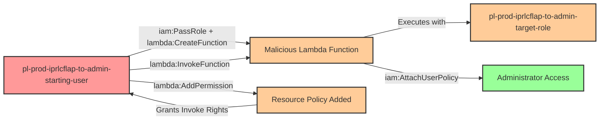

# Privilege Escalation via iam:PassRole + lambda:CreateFunction + lambda:AddPermission

* **Category:** Privilege Escalation
* **Sub-Category:** service-passrole
* **Path Type:** one-hop
* **Target:** to-admin
* **Environments:** prod
* **Technique:** Creating Lambda function with admin role and granting self-invocation permission to execute malicious code

## Overview

This scenario demonstrates a privilege escalation vulnerability where a user has permissions to pass an IAM role to Lambda, create Lambda functions, add resource-based permissions to those functions, and invoke them. Unlike the simpler `lambda:InvokeFunction` path, this scenario requires the attacker to explicitly grant themselves invocation permissions using `lambda:AddPermission` before they can execute the function.

The attack leverages AWS Lambda's dual permission model: both IAM permissions (identity-based) and resource-based policies control who can invoke a function. When a user creates a Lambda function, they don't automatically have permission to invoke it unless granted through IAM or resource policy. The `lambda:AddPermission` API allows the function creator to add resource-based permissions that grant invocation rights to specific principals, including themselves.

By combining `iam:PassRole`, `lambda:CreateFunction`, and `lambda:AddPermission`, an attacker can create a malicious Lambda function with an administrative execution role, grant themselves permission to invoke it through a resource-based policy, execute code with admin privileges, and escalate their own permissions permanently by attaching the AdministratorAccess policy to their starting user.

## Understanding the attack scenario

### Principals in the attack path

- `arn:aws:iam::PROD_ACCOUNT:user/pl-prod-iprlcflap-to-admin-starting-user` (Scenario-specific starting user)
- `arn:aws:iam::PROD_ACCOUNT:role/pl-prod-iprlcflap-to-admin-target-role` (Admin role passed to Lambda)

### Attack Path Diagram



### Attack Steps

1. **Initial Access**: Start as `pl-prod-iprlcflap-to-admin-starting-user` (credentials provided via Terraform outputs)
2. **Create Lambda Function**: Use `lambda:CreateFunction` with `iam:PassRole` to create a Lambda function that uses the admin target role as its execution role. The function code uses the admin role's credentials to attach AdministratorAccess policy to the starting user
3. **Add Invocation Permission**: Use `lambda:AddPermission` to add a resource-based policy statement allowing the starting user to invoke the function
4. **Invoke Function**: Use `lambda:InvokeFunction` to execute the Lambda function, which attaches AdministratorAccess to the starting user
5. **Verification**: Verify administrator access with the starting user's credentials

### Scenario specific resources created

| ARN | Purpose |
| -- | -- |
| `arn:aws:iam::PROD_ACCOUNT:user/pl-prod-iprlcflap-to-admin-starting-user` | Scenario-specific starting user with access keys |
| `arn:aws:iam::PROD_ACCOUNT:role/pl-prod-iprlcflap-to-admin-target-role` | Admin role that can be passed to Lambda functions |
| Policy attached to starting user | Grants `iam:PassRole` on target role, `lambda:CreateFunction`, `lambda:AddPermission`, and `lambda:InvokeFunction` |

## Executing the attack

### Using the automated demo_attack.sh

To demonstrate the privilege escalation path, run the provided demo script:

```bash
cd modules/scenarios/single-account/privesc-one-hop/to-admin/iam-passrole+lambda-createfunction+lambda-addpermission
./demo_attack.sh
```

The script will:
1. Display a step-by-step walkthrough with color-coded output
2. Show the commands being executed and their results
3. Verify successful privilege escalation
4. Output standardized test results for automation

### Cleaning up the attack artifacts

After demonstrating the attack, clean up the Lambda function and policy changes created during the demo:

```bash
cd modules/scenarios/single-account/privesc-one-hop/to-admin/iam-passrole+lambda-createfunction+lambda-addpermission
./cleanup_attack.sh
```

## Detection and prevention


### MITRE ATT&CK Mapping

- **Tactic**: TA0004 - Privilege Escalation, TA0002 - Execution
- **Technique**: T1078.004 - Valid Accounts: Cloud Accounts
- **Technique**: T1648 - Serverless Execution


## Prevention recommendations

- Restrict `iam:PassRole` permissions using strict resource conditions to limit which roles can be passed to Lambda
- Implement condition keys like `iam:PassedToService` to restrict PassRole specifically to `lambda.amazonaws.com` only when necessary
- Avoid granting broad `lambda:CreateFunction` permissions; use resource tags or naming patterns to limit function creation scope
- Monitor CloudTrail for `CreateFunction` events where execution roles have administrative privileges
- Implement Service Control Policies (SCPs) that prevent passing roles with administrative permissions to Lambda functions
- Monitor for `AddPermission` API calls on Lambda functions, especially when principals grant themselves invocation rights
- Use IAM Access Analyzer to identify privilege escalation paths involving PassRole and Lambda permissions
- Enable AWS Config rules to detect Lambda functions with overly permissive execution roles or resource-based policies
- Require MFA for sensitive operations like creating Lambda functions with privileged roles or modifying function policies
- Implement preventive controls that block Lambda functions from being created with roles containing sensitive policies like AdministratorAccess
- Use AWS Lambda function URL authentication requirements to prevent unauthorized invocation attempts
- Enable CloudTrail insights to detect unusual patterns of Lambda function creation followed by immediate invocation
