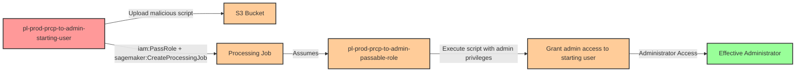

# Privilege Escalation via iam:PassRole + sagemaker:CreateProcessingJob

**Category:** Privilege Escalation
**Sub-Category:** service-passrole
**Path Type:** one-hop
**Target:** to-admin
**Environments:** prod
**Pathfinding.cloud ID:** sagemaker-003
**Technique:** Pass an admin role to a SageMaker processing job with a malicious script to execute code with elevated privileges

## Overview

This scenario demonstrates a critical privilege escalation vulnerability where a user with `iam:PassRole` and `sagemaker:CreateProcessingJob` permissions can execute arbitrary code with administrative privileges. Amazon SageMaker Processing Jobs are designed for data processing and ML feature engineering tasks, but they can be exploited to run malicious code when combined with an overly permissive execution role.

The attack works by uploading a malicious processing script to S3, then creating a SageMaker processing job that executes this script with an admin-level IAM role. The processing job runs in a container environment with the passed role's permissions, allowing the attacker to execute any AWS API calls with administrative access. This could include creating new access keys for the original user, modifying IAM policies, accessing sensitive data, or pivoting to other resources.

This technique was discovered by Spencer Gietzen of Rhino Security Labs in 2019 and represents a common pattern in cloud privilege escalation: exploiting AWS service trust relationships to execute code with elevated permissions. Unlike direct IAM permission modification, this attack leverages a legitimate AWS service (SageMaker) as an execution platform, making it potentially harder to detect. The attack is particularly dangerous because SageMaker processing jobs have broad network access and can run arbitrary code in Python, making them ideal vehicles for post-exploitation activities.

## Understanding the attack scenario

### Principals in the attack path

- `arn:aws:iam::PROD_ACCOUNT:user/pl-prod-prcp-to-admin-starting-user` (Scenario-specific starting user with PassRole and CreateProcessingJob permissions)
- `arn:aws:iam::PROD_ACCOUNT:role/pl-prod-prcp-to-admin-passable-role` (Admin role that can be passed to SageMaker service)
- `arn:aws:s3:::pl-prod-prcp-to-admin-bucket-{ACCOUNT_ID}-{SUFFIX}` (S3 bucket for storing malicious processing script)
- `arn:aws:sagemaker:REGION:PROD_ACCOUNT:processing-job/pl-prod-prcp-to-admin-processing-job` (Processing job that executes with admin privileges)

### Attack Path Diagram



### Attack Steps

1. **Initial Access**: Start as `pl-prod-prcp-to-admin-starting-user` (credentials provided via Terraform outputs)
2. **Upload Malicious Script**: Create a Python script that uses boto3 to grant admin permissions to the starting user, then upload it to the S3 bucket
3. **Create Processing Job**: Use `sagemaker:CreateProcessingJob` to create a processing job that:
   - Uses the uploaded malicious script as its processing code
   - Passes the admin-privileged role using `iam:PassRole`
   - Executes on an ml.t3.medium instance
4. **Script Execution**: The processing job executes the malicious script with the admin role's permissions
5. **Grant Admin Access**: The script attaches AdministratorAccess policy to the starting user or creates access keys for an admin user
6. **Verification**: Verify administrator access by listing IAM users or performing other admin-level actions

### Scenario specific resources created

| ARN | Purpose |
| -- | -- |
| `arn:aws:iam::PROD_ACCOUNT:user/pl-prod-prcp-to-admin-starting-user` | Scenario-specific starting user with iam:PassRole and sagemaker:CreateProcessingJob permissions |
| `arn:aws:iam::PROD_ACCOUNT:role/pl-prod-prcp-to-admin-passable-role` | Admin role with AdministratorAccess that trusts sagemaker.amazonaws.com service |
| `arn:aws:s3:::pl-prod-prcp-to-admin-bucket-{ACCOUNT_ID}-{SUFFIX}` | S3 bucket for storing the malicious processing script and job outputs |

## Executing the attack

### Using the automated demo_attack.sh

To demonstrate the privilege escalation path, run the provided demo script:

```bash
cd modules/scenarios/single-account/privesc-one-hop/to-admin/iam-passrole+sagemaker-createprocessingjob
./demo_attack.sh
```

The script will:
1. Display a step-by-step walkthrough with color-coded output
2. Show the commands being executed and their results
3. Verify successful privilege escalation
4. Output standardized test results for automation

### Cleaning up the attack artifacts

After demonstrating the attack, clean up the processing jobs and any policies or access keys created during the demo:

```bash
cd modules/scenarios/single-account/privesc-one-hop/to-admin/iam-passrole+sagemaker-createprocessingjob
./cleanup_attack.sh
```

The cleanup script will remove all SageMaker processing jobs, delete any inline policies attached to the starting user, and remove any access keys created during the demonstration, restoring the environment to its original state while preserving the deployed infrastructure.

## Detection and prevention


### MITRE ATT&CK Mapping

- **Tactic**: TA0004 - Privilege Escalation, TA0002 - Execution
- **Technique**: T1078.004 - Valid Accounts: Cloud Accounts
- **Sub-technique**: T1098.001 - Account Manipulation: Additional Cloud Credentials


## Prevention recommendations

- Implement least privilege principles - avoid granting `iam:PassRole` and `sagemaker:CreateProcessingJob` together unless absolutely necessary for legitimate ML workflows
- Use resource-based conditions on `iam:PassRole` to restrict which roles can be passed: `"Condition": {"StringEquals": {"iam:PassedToService": "sagemaker.amazonaws.com"}}`
- Add condition keys to prevent passing highly privileged roles: `"Condition": {"StringNotLike": {"iam:PassedToService": "*admin*"}}`
- Implement Service Control Policies (SCPs) at the organization level to restrict PassRole permissions on administrative roles
- Monitor CloudTrail for `CreateProcessingJob` API calls, especially those using roles with elevated permissions
- Use IAM Access Analyzer to identify and remediate privilege escalation paths involving PassRole to SageMaker services
- Implement VPC configurations for SageMaker processing jobs to restrict network access and prevent data exfiltration
- Enable AWS Config rules to detect SageMaker processing jobs using overly permissive execution roles
- Require MFA for sensitive IAM operations using condition keys like `aws:MultiFactorAuthPresent`
- Audit existing SageMaker execution roles regularly to ensure they follow least privilege principles
- Use SageMaker Studio's built-in role management features to create appropriately scoped execution roles
- Implement automated alerting on SageMaker processing job creation events that use administrative roles using CloudWatch Events or EventBridge
