# IAM UpdateAssumeRolePolicy Privilege Escalation to Admin

## Understanding the Attack Scenario

### Description
This scenario demonstrates how a principal with `iam:UpdateAssumeRolePolicy` permission can escalate to administrative privileges by modifying the trust policy of an existing admin role to grant themselves access.

### Attack Path

```mermaid
graph LR
    A[pl-pathfinder-starting-user-prod] -->|sts:AssumeRole| B[pl-prod-one-hop-updateassumerolepolicy-role]
    B -->|iam:UpdateAssumeRolePolicy| C[Modify Trust Policy of Admin Role]
    C -->|sts:AssumeRole| D[pl-prod-one-hop-updateassumerolepolicy-admin-role]
    D -->|AdministratorAccess| E[Full Admin Privileges]

    style A fill:#ff9999,stroke:#333,stroke-width:2px
    style B fill:#ffcc99,stroke:#333,stroke-width:2px
    style C fill:#ff6666,stroke:#333,stroke-width:2px
    style D fill:#cc99ff,stroke:#333,stroke-width:2px
    style E fill:#99ff99,stroke:#333,stroke-width:2px
```



### Principals

| Principal | Type | Initial Permissions | Post-Escalation Permissions |
|-----------|------|-------------------|---------------------------|
| pl-pathfinder-starting-user-prod | IAM User | Basic read-only | No change |
| pl-prod-one-hop-updateassumerolepolicy-role | IAM Role | iam:UpdateAssumeRolePolicy on admin role | Administrator (via role assumption) |
| pl-prod-one-hop-updateassumerolepolicy-admin-role | IAM Role | AdministratorAccess (but initially not assumable by attacker) | Becomes assumable by attacker |

### Resources

| Resource | Type | Purpose |
|----------|------|---------|
| pl-prod-one-hop-updateassumerolepolicy-role | IAM Role | Starting role with UpdateAssumeRolePolicy permission |
| pl-prod-one-hop-updateassumerolepolicy-admin-role | IAM Role | Target admin role with restricted trust policy |
| UpdateAssumeRolePolicyPermission | IAM Policy | Grants permission to modify trust policy |

## Attack Execution

### Prerequisites
- AWS CLI configured with pl-pathfinder-starting-user-prod credentials
- Terraform has been applied to create the scenario resources

### Attack Steps

1. **Assume the starting role** that has UpdateAssumeRolePolicy permission
2. **Modify the trust policy** of the admin role to trust the attacker's principal
3. **Assume the admin role** using the newly granted trust
4. **Verify administrative access** by performing privileged operations

### Demo
Run the attack demonstration:
```bash
cd modules/scenarios/single-account/privesc-one-hop/to-admin/iam-updateassumerolepolicy
./demo_attack.sh
```

## CSPM Detection

### What to Look For

1. **Overly Permissive UpdateAssumeRolePolicy Permissions**
   - Roles that can modify trust policies of privileged roles
   - UpdateAssumeRolePolicy permissions on admin or high-privilege roles
   - Lack of condition constraints on UpdateAssumeRolePolicy actions

2. **Trust Policy Modifications**
   - CloudTrail events for UpdateAssumeRolePolicy API calls
   - Changes to trust policies of privileged roles
   - Addition of new principals to existing trust relationships

3. **Privilege Escalation Paths**
   - Roles that can indirectly gain admin access through trust policy modification
   - Attack paths involving trust policy manipulation
   - Unintended access to high-privilege roles

### Expected CSPM Alerts

- ⚠️ **High Risk**: Role can modify trust policy of administrative role
- ⚠️ **Privilege Escalation**: UpdateAssumeRolePolicy on privileged role detected
- ⚠️ **Trust Policy Risk**: Role can grant itself access to admin permissions
- ⚠️ **Attack Path**: Indirect administrative access via trust policy modification

## Defensive Measures

### Prevention

1. **Restrict UpdateAssumeRolePolicy Permission**
   ```json
   {
     "Version": "2012-10-17",
     "Statement": [
       {
         "Effect": "Deny",
         "Action": "iam:UpdateAssumeRolePolicy",
         "Resource": "arn:aws:iam::*:role/*admin*"
       }
     ]
   }
   ```

2. **Use Service Control Policies (SCPs)**
   - Prevent UpdateAssumeRolePolicy on critical roles organization-wide
   - Require MFA for trust policy modifications

3. **Implement Resource Tags and Conditions**
   ```json
   {
     "Effect": "Allow",
     "Action": "iam:UpdateAssumeRolePolicy",
     "Resource": "*",
     "Condition": {
       "StringNotEquals": {
         "aws:ResourceTag/Protected": "true"
       }
     }
   }
   ```

### Detection

1. **CloudTrail Monitoring**
   - Alert on UpdateAssumeRolePolicy API calls
   - Monitor changes to trust policies of privileged roles
   - Track role assumption after trust policy changes

2. **Config Rules**
   - Detect roles with UpdateAssumeRolePolicy permissions
   - Monitor trust policy configurations
   - Alert on trust policy drift

3. **Regular Audits**
   - Review IAM permissions for UpdateAssumeRolePolicy
   - Audit trust policies of all privileged roles
   - Validate least privilege implementation

## MITRE ATT&CK Mapping

- **Tactic**: Privilege Escalation (TA0004)
- **Technique**: Valid Accounts: Cloud Accounts (T1078.004)
- **Sub-technique**: Account Manipulation: Additional Cloud Roles (T1098.003)

## Additional Notes

### Why This Works
- Trust policies determine who can assume a role
- UpdateAssumeRolePolicy allows modification of these trust relationships
- No additional permissions are needed once trust is established
- The admin role retains all its permissions throughout the attack

### Real-World Context
This attack pattern is particularly dangerous because:
- It's a subtle form of privilege escalation
- Changes to trust policies may not be closely monitored
- The attacker gains full admin access without creating new resources
- The modification can be reversed to hide tracks

## Clean Up

To remove any modifications made during the demo:
```bash
./cleanup_attack.sh
```

This will restore the original trust policy of the admin role.