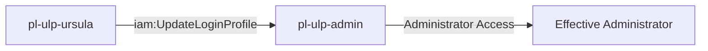

# One-Hop Privilege Escalation: iam:UpdateLoginProfile

**Scenario Type:** One-Hop
**Target:** Admin Access
**Technique:** Password reset for admin user via iam:UpdateLoginProfile

## Overview

This scenario demonstrates a privilege escalation vulnerability where a role has permission to update login profiles for an administrator user. The attacker can assume a role with `iam:UpdateLoginProfile` permission on an admin user who already has a console password, change that password to one they control, and then use those credentials to gain administrator access through the AWS Management Console.

## Understanding the attack scenario

### Principals in the attack path

- `arn:aws:iam::PROD_ACCOUNT:user/pl-pathfinder-starting-user-prod`
- `arn:aws:iam::PROD_ACCOUNT:role/pl-ulp-ursula`
- `arn:aws:iam::PROD_ACCOUNT:user/pl-ulp-admin`

### Attack Path Diagram



### Attack Steps

1. **Scaffolding aka Initial Access**: `pl-pathfinder-starting-user-prod` assumes the role `pl-ulp-ursula` to begin the scenario
2. **Update Login Profile**: `pl-ulp-ursula` uses `iam:UpdateLoginProfile` to change the console password for the admin user `pl-ulp-admin`
3. **Console Login**: Use the AWS Management Console with the newly set password to login as `pl-ulp-admin`
4. **Verification**: Verify administrator access through both console and API

### Scenario specific resources created

| ARN | Purpose |
| -- | -- |
| `arn:aws:iam::PROD_ACCOUNT:role/pl-ulp-ursula` | Starting principal |
| `arn:aws:iam::PROD_ACCOUNT:policy/pl-prod-one-hop-updateloginprofile-policy` | Allows `iam:UpdateLoginProfile` on `pl-ulp-admin` only |
| `arn:aws:iam::PROD_ACCOUNT:user/pl-ulp-admin` | Destination principal |

## Executing the attack

### Using the automated demo_attack.sh

To demonstrate the privilege escalation path, run the provided demo script:

```bash
cd modules/scenarios/single-account/privesc-one-hop/to-admin/iam-updateloginprofile
./demo_attack.sh
```

The script will:
1. Display a step-by-step walkthrough with color-coded output
2. Show the commands being executed and their results
3. Update the existing console password with a unique random suffix
4. Display console login URL and new credentials
5. Verify successful privilege escalation via API access
6. Output standardized test results for automation

### Cleaning up the attack artifacts

After demonstrating the attack, restore the original password for the admin user:

```bash
cd modules/scenarios/single-account/privesc-one-hop/to-admin/iam-updateloginprofile
./cleanup_attack.sh
```

## Detection and prevention

### MITRE ATT&CK Mapping

- **Tactic**: Privilege Escalation, Persistence
- **Technique**: T1098.001 - Account Manipulation: Additional Cloud Credentials
- **Sub-technique**: Modifying existing console login credentials for privileged accounts

## Prevention recommendations

- Avoid granting `iam:UpdateLoginProfile` permissions on privileged users
- Use resource-based conditions to restrict which users can have login profiles updated
- Implement SCPs to prevent login profile updates on admin users
- Monitor CloudTrail for `UpdateLoginProfile` API calls on privileged accounts
- Force password reset on next login after any UpdateLoginProfile event
- Use IAM Access Analyzer to identify privilege escalation paths
- Implement break-glass procedures with MFA for emergency access
- Alert on any password changes for privileged accounts