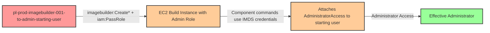

# Privilege Escalation via iam:PassRole + imagebuilder:CreateComponent + imagebuilder:CreateImageRecipe + imagebuilder:CreateInfrastructureConfiguration + imagebuilder:CreateImage

* **Category:** Privilege Escalation
* **Sub-Category:** new-passrole
* **Path Type:** one-hop
* **Target:** to-admin
* **Environments:** prod
* **Pathfinding.cloud ID:** imagebuilder-001
* **Technique:** Creating an EC2 Image Builder pipeline with malicious component shell commands that execute on an EC2 build instance running with an admin instance profile

## Overview

This scenario demonstrates a privilege escalation path where a user with `iam:PassRole` and EC2 Image Builder permissions can gain administrative access by abusing the Image Builder build pipeline. The attacker creates a component containing malicious shell commands, assembles an image recipe and infrastructure configuration specifying an admin instance profile, then triggers an image build. The EC2 build instance executes the component commands with the admin role's credentials available via the Instance Metadata Service (IMDS), allowing the attacker's code to attach `AdministratorAccess` to the starting user.

EC2 Image Builder components define shell commands that run during the image build process. Image Builder does not restrict what commands can be included in components -- any valid shell command will execute on the build instance. When the infrastructure configuration specifies an instance profile with an administrative role, the build instance has full admin credentials accessible through IMDS. The malicious component simply uses the AWS CLI (pre-installed on Amazon Linux and most base AMIs) to call IAM APIs and escalate privileges.

This attack requires multiple Image Builder API calls to set up the pipeline (CreateComponent, CreateImageRecipe, CreateInfrastructureConfiguration, CreateImage), making it more involved than some other PassRole attacks. However, each step is straightforward. The build process takes 10-30+ minutes since it involves launching an EC2 instance, running the build, and creating an AMI. Organizations that allow users to create Image Builder pipelines without restricting which instance profiles can be used are vulnerable. The cost impact is $0/mo at rest, but EC2 charges accrue during the build process.

## Understanding the attack scenario

### Principals in the attack path

- `arn:aws:iam::PROD_ACCOUNT:user/pl-prod-imagebuilder-001-to-admin-starting-user` (Scenario-specific starting user with PassRole and Image Builder permissions)
- `arn:aws:iam::PROD_ACCOUNT:role/pl-prod-imagebuilder-001-to-admin-admin-role` (Admin role that trusts ec2.amazonaws.com, attached via instance profile to the build instance)

### Attack Path Diagram



### Attack Steps

1. **Initial Access**: Start as `pl-prod-imagebuilder-001-to-admin-starting-user` (credentials provided via Terraform outputs)
2. **Create Malicious Component**: Use `imagebuilder:CreateComponent` to create a component with shell commands that use the AWS CLI to attach `AdministratorAccess` to the starting user.
3. **Create Image Recipe**: Use `imagebuilder:CreateImageRecipe` to create a recipe referencing the malicious component and a base AMI (e.g., Amazon Linux 2).
4. **Create Infrastructure Configuration**: Use `imagebuilder:CreateInfrastructureConfiguration` to create an infrastructure configuration specifying the admin instance profile via `iam:PassRole`.
5. **Start Image Build**: Use `imagebuilder:CreateImage` to start a build using the recipe and infrastructure configuration. An EC2 instance launches with the admin instance profile.
6. **Wait for Build Execution**: The build process takes 10-30+ minutes. During the build phase, the component shell commands execute with admin role credentials from IMDS.
7. **Automatic Escalation**: The component commands attach `AdministratorAccess` to the starting user.
8. **Verification**: Verify administrator access by listing IAM users or performing other admin-level actions as the starting user.

### Scenario specific resources created

| ARN | Purpose |
| -- | -- |
| `arn:aws:iam::PROD_ACCOUNT:user/pl-prod-imagebuilder-001-to-admin-starting-user` | Scenario-specific starting user with access keys, iam:PassRole, and Image Builder permissions |
| `arn:aws:iam::PROD_ACCOUNT:role/pl-prod-imagebuilder-001-to-admin-admin-role` | Admin role trusting ec2.amazonaws.com, attached to the build instance via instance profile |
| `arn:aws:iam::PROD_ACCOUNT:instance-profile/pl-prod-imagebuilder-001-to-admin-admin-profile` | Instance profile for the admin role, used by Image Builder infrastructure configuration |
| Security Group `pl-prod-imagebuilder-001-to-admin-build-sg` | Egress-only security group for the Image Builder build instance |
| Inline policy `pl-prod-imagebuilder-001-to-admin-required-permissions` on `pl-prod-imagebuilder-001-to-admin-starting-user` | Inline user policy granting required iam:PassRole, Image Builder, and dependent permissions |

### Prerequisites (provisioned by Terraform)

The following must exist in the account before the attack can succeed. These are not part of the attacker's permissions -- they are pre-existing infrastructure:

- **VPC with subnet** that has outbound internet access (for the build instance to reach AWS APIs and SSM)
- **Security group** allowing outbound traffic (egress-only; no inbound required)
- **EC2 Image Builder Service-Linked Role** (`AWSServiceRoleForImageBuilder`) -- created in the prod environment module
- **Instance profile** with an admin role trusting `ec2.amazonaws.com` -- the target of the `iam:PassRole` escalation

## Executing the attack

### Using the automated demo_attack.sh

To demonstrate the privilege escalation path, run the provided demo script:

```bash
cd modules/scenarios/single-account/privesc-one-hop/to-admin/imagebuilder-001-iam-passrole+imagebuilder-createcomponent+imagebuilder-createimagerecipe+imagebuilder-createinfrastructureconfiguration+imagebuilder-createimage
./demo_attack.sh
```

The script will:
1. Display a step-by-step walkthrough with color-coded output
2. Show the commands being executed and their results
3. Wait for the image build to complete (10-30+ minutes)
4. Verify successful privilege escalation
5. Output standardized test results for automation

**Note:** This scenario incurs EC2 costs while the build instance is running. The build process takes 10-30+ minutes. Be sure to clean up promptly after the demonstration.

### Cleaning up the attack artifacts

After demonstrating the attack, clean up the Image Builder resources and attached admin policy:

```bash
cd modules/scenarios/single-account/privesc-one-hop/to-admin/imagebuilder-001-iam-passrole+imagebuilder-createcomponent+imagebuilder-createimagerecipe+imagebuilder-createinfrastructureconfiguration+imagebuilder-createimage
./cleanup_attack.sh
```

The cleanup script will delete the Image Builder image, recipe, component, infrastructure configuration, and any AMIs created during the demonstration, detach the `AdministratorAccess` policy from the starting user, and restore the environment to its original state while preserving the deployed infrastructure.

## Detection and prevention


### MITRE ATT&CK Mapping

- **Tactic**: TA0004 - Privilege Escalation, TA0002 - Execution
- **Technique**: T1078.004 - Valid Accounts: Cloud Accounts
- **Technique**: T1578 - Modify Cloud Compute Infrastructure


## Prevention recommendations

- Restrict `iam:PassRole` with resource conditions to limit which roles can be passed: `"Resource": "arn:aws:iam::*:role/specific-imagebuilder-role"` rather than allowing all roles
- Implement Service Control Policies (SCPs) to prevent passing administrative roles to EC2 or Image Builder infrastructure configurations
- Monitor CloudTrail for `imagebuilder:CreateComponent`, `imagebuilder:CreateInfrastructureConfiguration`, and `imagebuilder:CreateImage` API calls, especially when combined with `iam:PassRole` to high-privilege roles
- Use IAM Access Analyzer to identify principals with `iam:PassRole` permissions on administrative roles
- Apply permission boundaries to instance profile roles used with Image Builder to cap the maximum privileges available to build instances
- Require specific IAM conditions on `iam:PassRole` such as `iam:PassedToService` restricted to `imagebuilder.amazonaws.com` combined with role name restrictions to prevent passing admin roles
- Enable GuardDuty and configure alerts for unexpected Image Builder pipeline creation and IAM policy attachment events
- Audit all instance profiles with administrative permissions to ensure they are not accessible to Image Builder pipelines controlled by unprivileged users
