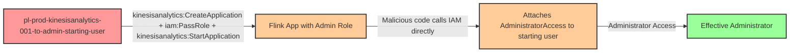

# Privilege Escalation via iam:PassRole + kinesisanalytics:CreateApplication + kinesisanalytics:StartApplication

* **Category:** Privilege Escalation
* **Sub-Category:** new-passrole
* **Path Type:** one-hop
* **Target:** to-admin
* **Environments:** prod
* **Pathfinding.cloud ID:** kinesisanalytics-001
* **Technique:** Creating a Managed Apache Flink application referencing a malicious JAR in S3 and an admin service execution role to execute arbitrary API calls with elevated privileges

## Overview

This scenario demonstrates a privilege escalation path where a user with `iam:PassRole`, `kinesisanalytics:CreateApplication`, and `kinesisanalytics:StartApplication` permissions can gain administrative access by abusing Amazon Managed Service for Apache Flink (formerly Kinesis Data Analytics v2). The attacker creates a Flink application referencing a malicious JAR stored in S3, then starts it with an admin role as the service execution role. When the application runs, the injected code executes with the admin role's credentials and attaches `AdministratorAccess` to the starting user.

The Flink application JAR is pre-built and uploaded to S3 by Terraform. At runtime, the Managed Apache Flink service reads the JAR from S3 via `S3ContentLocation` when starting the application. The application runs as a fully managed service with full network access, allowing the malicious code to directly call IAM APIs. When combined with `iam:PassRole`, the attacker specifies an admin-privileged service execution role, and the Flink runtime provides those credentials to the application code automatically.

This attack is notable because Flink applications have full network access by default, unlike some other AWS compute services that operate in network-isolated environments. This means the malicious code can directly call AWS APIs to escalate privileges without needing to exfiltrate credentials through an intermediary like S3. Organizations that grant Kinesis Analytics permissions without restricting `iam:PassRole` to specific roles are vulnerable to this path. The cost impact is $0/mo at rest since no resources are running until the application is started.

## Understanding the attack scenario

### Principals in the attack path

- `arn:aws:iam::PROD_ACCOUNT:user/pl-prod-kinesisanalytics-001-to-admin-starting-user` (Scenario-specific starting user with PassRole and Kinesis Analytics permissions)
- `arn:aws:iam::PROD_ACCOUNT:role/pl-prod-kinesisanalytics-001-to-admin-admin-role` (Admin role that trusts kinesisanalytics.amazonaws.com, passed as the service execution role)

### Attack Path Diagram



### Attack Steps

1. **Initial Access**: Start as `pl-prod-kinesisanalytics-001-to-admin-starting-user` (credentials provided via Terraform outputs)
2. **Create Malicious Application**: Use `kinesisanalytics:CreateApplication` to create a Managed Apache Flink application referencing a malicious JAR in S3 via `S3ContentLocation`. The code uses the AWS SDK to attach `AdministratorAccess` to the starting user.
3. **Start Application with Admin Role**: Use `iam:PassRole` and `kinesisanalytics:StartApplication` to start the application with the admin role as the service execution role.
4. **Wait for Application Startup**: The Flink application takes a few minutes to provision and begin executing.
5. **Automatic Escalation**: The application code executes with the admin role's credentials, calls `iam:AttachUserPolicy`, and attaches `AdministratorAccess` to the starting user.
6. **Verification**: Verify administrator access by listing IAM users or performing other admin-level actions as the starting user.

### Scenario specific resources created

| ARN | Purpose |
| -- | -- |
| `arn:aws:iam::PROD_ACCOUNT:user/pl-prod-kinesisanalytics-001-to-admin-starting-user` | Scenario-specific starting user with access keys, iam:PassRole, and Kinesis Analytics permissions |
| `arn:aws:iam::PROD_ACCOUNT:role/pl-prod-kinesisanalytics-001-to-admin-admin-role` | Admin role trusting kinesisanalytics.amazonaws.com, used as the service execution role |
| `arn:aws:s3:::pl-kinesisanalytics-001-code-PROD_ACCOUNT-SUFFIX` | S3 bucket containing the pre-built exploit Flink JAR |
| Inline policy `pl-prod-kinesisanalytics-001-to-admin-required-permissions` on `pl-prod-kinesisanalytics-001-to-admin-starting-user` | Inline user policy granting required iam:PassRole and Kinesis Analytics permissions |
| Inline policy `pl-prod-kinesisanalytics-001-to-admin-helpful-permissions` on `pl-prod-kinesisanalytics-001-to-admin-starting-user` | Inline user policy granting helpful additional permissions for demonstration and cleanup |

## Executing the attack

### Using the automated demo_attack.sh

To demonstrate the privilege escalation path, run the provided demo script:

```bash
cd modules/scenarios/single-account/privesc-one-hop/to-admin/kinesisanalytics-001-iam-passrole+kinesisanalytics-createapplication+kinesisanalytics-startapplication
./demo_attack.sh
```

The script will:
1. Display a step-by-step walkthrough with color-coded output
2. Show the commands being executed and their results
3. Wait for the Flink application to start and execute the malicious code
4. Verify successful privilege escalation
5. Output standardized test results for automation

### Cleaning up the attack artifacts

After demonstrating the attack, clean up the Flink application and attached admin policy:

```bash
cd modules/scenarios/single-account/privesc-one-hop/to-admin/kinesisanalytics-001-iam-passrole+kinesisanalytics-createapplication+kinesisanalytics-startapplication
./cleanup_attack.sh
```

The cleanup script will stop and delete the Flink application created during the demonstration, detach the `AdministratorAccess` policy from the starting user, and restore the environment to its original state while preserving the deployed infrastructure.

## Detection and prevention


### MITRE ATT&CK Mapping

- **Tactic**: TA0004 - Privilege Escalation, TA0002 - Execution
- **Technique**: T1078.004 - Valid Accounts: Cloud Accounts
- **Technique**: T1578 - Modify Cloud Compute Infrastructure


## Prevention recommendations

- Restrict `iam:PassRole` with resource conditions to limit which roles can be passed: `"Resource": "arn:aws:iam::*:role/specific-flink-role"` rather than allowing all roles
- Implement Service Control Policies (SCPs) to prevent passing administrative roles to Kinesis Analytics or any compute service
- Monitor CloudTrail for `kinesisanalytics:CreateApplication` and `kinesisanalytics:StartApplication` API calls, especially when combined with `iam:PassRole` to high-privilege roles
- Use IAM Access Analyzer to identify principals with `iam:PassRole` permissions on administrative roles
- Apply permission boundaries to Kinesis Analytics service execution roles to cap the maximum privileges available to Flink applications
- Require specific IAM conditions on `iam:PassRole` such as `iam:PassedToService` restricted to `kinesisanalytics.amazonaws.com` combined with role name restrictions to prevent passing admin roles
- Enable GuardDuty and configure alerts for unexpected Kinesis Analytics application creation and IAM policy attachment events
- Audit all roles with `kinesisanalytics.amazonaws.com` in their trust policy to ensure they follow least privilege principles
