# Privilege Escalation via iam:PassRole + lambda:CreateFunction + lambda:InvokeFunction

* **Category:** Privilege Escalation
* **Sub-Category:** new-passrole
* **Path Type:** one-hop
* **Target:** to-admin
* **Environments:** prod
* **Cost Estimate:** $0/mo
* **Technique:** Creating Lambda function with admin role and invoking it to extract temporary credentials
* **Terraform Variable:** `enable_single_account_privesc_one_hop_to_admin_lambda_001_iam_passrole_lambda_createfunction_lambda_invokefunction`
* **Schema Version:** 1.0.0
* **Pathfinding.cloud ID:** lambda-001
* **Attack Path:** starting_user → (PassRole + lambda:CreateFunction) → Lambda with admin role → (lambda:InvokeFunction) → extract admin credentials → admin access
* **Attack Principals:** `arn:aws:iam::{account_id}:user/pl-prod-lambda-001-to-admin-starting-user`; `arn:aws:iam::{account_id}:role/pl-prod-lambda-001-to-admin-target-role`
* **Required Permissions:** `iam:PassRole` on `arn:aws:iam::*:role/pl-prod-lambda-001-to-admin-target-role`; `lambda:CreateFunction` on `*`; `lambda:InvokeFunction` on `*`
* **Helpful Permissions:** `iam:ListRoles` (Discover available privileged roles); `lambda:GetFunction` (Verify function creation); `lambda:DeleteFunction` (Clean up attack artifacts)
* **MITRE Tactics:** TA0004 - Privilege Escalation, TA0002 - Execution
* **MITRE Techniques:** T1098.001 - Account Manipulation: Additional Cloud Credentials, T1648 - Serverless Execution

## Attack Overview

This scenario demonstrates a privilege escalation vulnerability where a user has permissions to pass an IAM role to Lambda, create Lambda functions, and invoke them. The attacker can create a Lambda function with an administrative execution role, invoke the function to extract the temporary credentials that Lambda receives, and use those credentials to gain administrator access.

This is a powerful privilege escalation technique because Lambda functions automatically receive temporary security credentials for their execution role through the AWS SDK. An attacker can create a simple function that returns these credentials (via `boto3.Session().get_credentials()` or environment variables), invoke it, and immediately gain the privileges of the passed role.

The attack leverages the AWS serverless execution model where services like Lambda are granted temporary credentials based on their execution role. By combining `iam:PassRole` with Lambda creation and invocation permissions, an attacker can effectively "borrow" the privileges of any role they can pass to Lambda.

### MITRE ATT&CK Mapping

- **Tactic**: TA0004 - Privilege Escalation, TA0002 - Execution
- **Technique**: T1098.001 - Account Manipulation: Additional Cloud Credentials
- **Technique**: T1648 - Serverless Execution

### Principals in the attack path

- `arn:aws:iam::PROD_ACCOUNT:user/pl-prod-lambda-001-to-admin-starting-user` (Scenario-specific starting user)
- `arn:aws:iam::PROD_ACCOUNT:role/pl-prod-lambda-001-to-admin-target-role` (Admin role passed to Lambda)

### Attack Path Diagram

```mermaid
graph LR
    A[pl-prod-lambda-001-to-admin-starting-user] -->|iam:PassRole + lambda:CreateFunction| B[Lambda Function]
    B -->|Executes with| C[pl-prod-lambda-001-to-admin-target-role]
    C -->|lambda:InvokeFunction| D[Extract Credentials]
    D -->|Use Credentials| E[Administrator Access]

    style A fill:#ff9999,stroke:#333,stroke-width:2px
    style B fill:#ffcc99,stroke:#333,stroke-width:2px
    style C fill:#ffcc99,stroke:#333,stroke-width:2px
    style D fill:#ffcc99,stroke:#333,stroke-width:2px
    style E fill:#99ff99,stroke:#333,stroke-width:2px
```



### Attack Steps

1. **Initial Access**: Start as `pl-prod-lambda-001-to-admin-starting-user` (credentials provided via Terraform outputs)
2. **Create Lambda Function**: Use `lambda:CreateFunction` with `iam:PassRole` to create a Lambda function that uses the admin target role as its execution role
3. **Invoke Function**: Use `lambda:InvokeFunction` to execute the Lambda function and extract the temporary credentials
4. **Switch Context**: Configure AWS CLI to use the extracted temporary credentials (access key, secret key, and session token)
5. **Verification**: Verify administrator access with the extracted credentials

### Scenario specific resources created

| ARN | Purpose |
| -- | -- |
| `arn:aws:iam::PROD_ACCOUNT:user/pl-prod-lambda-001-to-admin-starting-user` | Scenario-specific starting user with access keys |
| `arn:aws:iam::PROD_ACCOUNT:role/pl-prod-lambda-001-to-admin-target-role` | Admin role that can be passed to Lambda functions |
| Policy attached to starting user | Grants `iam:PassRole` on target role, `lambda:CreateFunction`, and `lambda:InvokeFunction` |

## Attack Lab

### Prerequisites

1. Install the `plabs` CLI:
   ```bash
   brew install pathfinding-labs/tap/plabs
   ```
2. Configure your AWS profiles in `~/.plabs/plabs.yaml` (or run `plabs init` if you haven't already)

### Deploy with plabs non-interactive

```bash
plabs enable enable_single_account_privesc_one_hop_to_admin_lambda_001_iam_passrole_lambda_createfunction_lambda_invokefunction
plabs apply
```

### Deploy with plabs tui

1. Launch the TUI: `plabs`
2. Navigate to this scenario in the scenarios list
3. Press `space` to enable it
4. Press `d` to deploy

### Executing the automated demo_attack script

The script will:
1. Display a step-by-step walkthrough with color-coded output
2. Show the commands being executed and their results
3. Verify successful privilege escalation
4. Output standardized test results for automation

#### Resources created by attack script

- A temporary Lambda function created with the admin execution role to extract credentials

#### With plabs non-interactive

```bash
plabs demo --list
plabs demo lambda-001-iam-passrole+lambda-createfunction+lambda-invokefunction
```

#### With plabs tui

1. Launch the TUI: `plabs`
2. Navigate to this scenario in the scenarios list
3. Press `r` to run the demo script

### Cleanup

#### With plabs non-interactive

```bash
plabs cleanup --list
plabs cleanup lambda-001-iam-passrole+lambda-createfunction+lambda-invokefunction
```

#### With plabs tui

1. Launch the TUI: `plabs`
2. Navigate to this scenario in the scenarios list
3. Press `c` to run the cleanup script

### Teardown with plabs non-interactive

```bash
plabs disable enable_single_account_privesc_one_hop_to_admin_lambda_001_iam_passrole_lambda_createfunction_lambda_invokefunction
plabs apply
```

### Teardown with plabs tui

1. Launch the TUI: `plabs`
2. Navigate to this scenario in the scenarios list
3. Press `space` to disable it
4. Press `D` to destroy

## Detecting Misconfiguration (CSPM)

### What CSPM tools should detect

- IAM user has `iam:PassRole` permission allowing it to pass an administrative role to Lambda
- IAM user has `lambda:CreateFunction` permission enabling creation of functions with privileged execution roles
- IAM user has `lambda:InvokeFunction` permission enabling execution of functions that can exfiltrate credentials
- Privilege escalation path exists: starting user can gain admin privileges via Lambda execution role

### Prevention recommendations

- Restrict `iam:PassRole` permissions using strict resource conditions to limit which roles can be passed
- Implement condition keys like `iam:PassedToService` to restrict PassRole to specific AWS services only when necessary
- Avoid granting broad `lambda:CreateFunction` permissions; use resource tags or naming patterns to limit function creation
- Monitor CloudTrail for `CreateFunction` events where execution roles have administrative privileges
- Implement Service Control Policies (SCPs) that prevent passing roles with administrative permissions to Lambda
- Use IAM Access Analyzer to identify privilege escalation paths involving PassRole
- Enable AWS Config rules to detect Lambda functions with overly permissive execution roles
- Require MFA for sensitive operations like creating Lambda functions with privileged roles

## Detection Abuse (CloudSIEM)

### CloudTrail events to monitor

- `IAM: PassRole` — Starting user passes an administrative role to a Lambda function; critical when the target role has elevated permissions
- `Lambda: CreateFunction20150331` — New Lambda function created with a privileged execution role; high severity when the execution role has admin access
- `Lambda: Invoke` — Lambda function invoked; high severity when preceded by CreateFunction with a privileged role

### Detonation logs

_Detonation log integration (Stratus Red Team / Grimoire) is planned for a future release._
