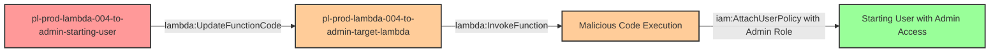

# Privilege Escalation via lambda:UpdateFunctionCode + lambda:InvokeFunction

* **Category:** Privilege Escalation
* **Sub-Category:** existing-passrole
* **Path Type:** one-hop
* **Target:** to-admin
* **Environments:** prod
* **Cost Estimate:** $0/mo
* **Pathfinding.cloud ID:** lambda-004
* **Technique:** Modifying existing Lambda function code and manually invoking it to execute malicious logic under privileged execution role
* **Terraform Variable:** `enable_single_account_privesc_one_hop_to_admin_lambda_004_lambda_updatefunctioncode_lambda_invokefunction`
* **Schema Version:** 1.0.0
* **Attack Path:** starting_user → (lambda:UpdateFunctionCode) → existing Lambda function → (lambda:InvokeFunction) → Lambda executes with admin role → (iam:AttachUserPolicy) → admin access
* **Attack Principals:** `arn:aws:iam::{account_id}:user/pl-prod-lambda-004-to-admin-starting-user`; `arn:aws:lambda:{region}:{account_id}:function/pl-prod-lambda-004-to-admin-target-lambda`; `arn:aws:iam::{account_id}:role/pl-prod-lambda-004-to-admin-target-role`
* **Required Permissions:** `lambda:UpdateFunctionCode` on `arn:aws:lambda:*:*:function/pl-prod-lambda-004-to-admin-target-lambda`; `lambda:InvokeFunction` on `arn:aws:lambda:*:*:function/pl-prod-lambda-004-to-admin-target-lambda`
* **Helpful Permissions:** `lambda:GetFunction` (Discover Lambda function details including handler name and execution role); `lambda:ListFunctions` (Discover available Lambda functions to target); `iam:GetRole` (View Lambda execution role permissions to identify high-value targets)
* **MITRE Tactics:** TA0004 - Privilege Escalation, TA0003 - Persistence
* **MITRE Techniques:** T1078.004 - Valid Accounts: Cloud Accounts, T1525 - Implant Internal Image

## Attack Overview

This scenario demonstrates a critical privilege escalation vulnerability where an attacker with both `lambda:UpdateFunctionCode` and `lambda:InvokeFunction` permissions can compromise existing Lambda functions to execute arbitrary code under the function's privileged execution role. This is a more powerful variant of the lambda-updatefunctioncode scenario because the attacker can immediately invoke the malicious code without waiting for event triggers.

The vulnerability lies in treating code deployment permissions as less sensitive than IAM policy modifications. In reality, the ability to modify code that executes with elevated privileges, combined with the ability to invoke that code on-demand, is functionally equivalent to having those privileges yourself. If a Lambda function runs with an administrative role, anyone who can update its code and invoke it can execute arbitrary operations with administrative access immediately.

This attack is particularly dangerous because it provides instant, repeatable execution of malicious code with administrative privileges. Unlike scenarios that rely on CloudWatch Events, S3 triggers, or other external events, the attacker has full control over when and how many times the malicious payload executes. This makes it ideal for persistent access, data exfiltration, and privilege escalation operations.

### MITRE ATT&CK Mapping

- **Tactic**: TA0004 - Privilege Escalation, TA0003 - Persistence
- **Technique**: T1078.004 - Valid Accounts: Cloud Accounts
- **Technique**: T1525 - Implant Internal Image

### Principals in the attack path

- `arn:aws:iam::PROD_ACCOUNT:user/pl-prod-lambda-004-to-admin-starting-user` (Scenario-specific starting user with limited permissions)
- `arn:aws:lambda:REGION:PROD_ACCOUNT:function/pl-prod-lambda-004-to-admin-target-lambda` (Pre-existing Lambda function with privileged role)
- `arn:aws:iam::PROD_ACCOUNT:role/pl-prod-lambda-004-to-admin-target-role` (Lambda execution role with AdministratorAccess)

### Attack Path Diagram



### Attack Steps

1. **Initial Access**: Start as `pl-prod-lambda-004-to-admin-starting-user` (credentials provided via Terraform outputs)
2. **Discover Target Function**: Use `lambda:ListFunctions` to identify Lambda functions with privileged execution roles
3. **Inspect Function Details**: Use `lambda:GetFunction` to retrieve handler name and execution role ARN
4. **Craft Malicious Code**: Create Python code that uses the Lambda's execution role to attach AdministratorAccess to the starting user
5. **Critical Requirement**: Name the code file `lambda_function.py` to match the handler `lambda_function.lambda_handler`
6. **Package Deployment**: Zip the malicious code into a deployment package
7. **Update Function Code**: Use `lambda:UpdateFunctionCode` to replace the existing function code
8. **Invoke Function**: Use `lambda:InvokeFunction` to immediately trigger execution of the malicious code
9. **Verification**: Verify administrator access has been granted to the starting user

### Scenario specific resources created

| ARN | Purpose |
| -- | -- |
| `arn:aws:iam::PROD_ACCOUNT:user/pl-prod-lambda-004-to-admin-starting-user` | Scenario-specific starting user with access keys |
| `arn:aws:lambda:REGION:PROD_ACCOUNT:function/pl-prod-lambda-004-to-admin-target-lambda` | Pre-existing Lambda function that runs benign code (victim workload) |
| `arn:aws:iam::PROD_ACCOUNT:role/pl-prod-lambda-004-to-admin-target-role` | Lambda execution role with AdministratorAccess policy attached |
| Inline policy on starting user | Grants starting user lambda:UpdateFunctionCode and lambda:InvokeFunction permissions |

## Attack Lab

### Prerequisites

1. Install the `plabs` CLI:
   ```bash
   brew install pathfinding-labs/tap/plabs
   ```
2. Configure your AWS profiles in `~/.plabs/plabs.yaml` (or run `plabs init` if you haven't already)

### Deploy with plabs non-interactive

```bash
plabs enable enable_single_account_privesc_one_hop_to_admin_lambda_004_lambda_updatefunctioncode_lambda_invokefunction
plabs apply
```

### Deploy with plabs tui

1. Launch the TUI: `plabs`
2. Navigate to this scenario in the scenarios list
3. Press `space` to enable it
4. Press `d` to deploy

### Executing the automated demo_attack script

The script will:
1. Display a step-by-step walkthrough with color-coded output
2. Show the commands being executed and their results
3. Verify successful privilege escalation
4. Output standardized test results for automation

#### Resources created by attack script

- Malicious Lambda deployment package (zip file) with attacker-controlled code
- `AdministratorAccess` policy attachment on the starting user

#### With plabs non-interactive

```bash
plabs demo --list
plabs demo lambda-004-lambda-updatefunctioncode+lambda-invokefunction
```

#### With plabs tui

1. Launch the TUI: `plabs`
2. Navigate to this scenario in the scenarios list
3. Press `r` to run the demo script

### Cleanup

#### With plabs non-interactive

```bash
plabs cleanup --list
plabs cleanup lambda-004-lambda-updatefunctioncode+lambda-invokefunction
```

#### With plabs tui

1. Launch the TUI: `plabs`
2. Navigate to this scenario in the scenarios list
3. Press `c` to run the cleanup script

### Teardown with plabs non-interactive

```bash
plabs disable enable_single_account_privesc_one_hop_to_admin_lambda_004_lambda_updatefunctioncode_lambda_invokefunction
plabs apply
```

### Teardown with plabs tui

1. Launch the TUI: `plabs`
2. Navigate to this scenario in the scenarios list
3. Press `space` to disable it
4. Press `D` to destroy

## Detecting Misconfiguration (CSPM)

### What CSPM tools should detect

A properly configured Cloud Security Posture Management (CSPM) tool should identify:

1. **Overly Permissive Lambda Update Access**: Users or roles with `lambda:UpdateFunctionCode` on highly privileged Lambda functions
2. **Lambda Invoke Permissions**: Users or roles with `lambda:InvokeFunction` on the same functions they can update
3. **Lambda Functions with Administrative Roles**: Lambda functions whose execution roles have administrative or overly broad permissions
4. **Privilege Escalation Path**: The combination of Lambda code update permissions, invoke permissions, and privileged execution roles creates a high-severity escalation path
5. **Lack of Code Signing**: Lambda functions without code signing enforcement allow arbitrary code execution
6. **Missing Resource Conditions**: Lambda policies without resource-specific conditions that limit which functions can be modified and invoked

### Prevention recommendations

- **Implement Code Signing**: Require Lambda functions to use code signing to prevent unauthorized code modifications
- **Apply Least Privilege**: Lambda execution roles should only have permissions required for their specific business function, never AdministratorAccess
- **Restrict Update Permissions**: Limit `lambda:UpdateFunctionCode` to dedicated CI/CD roles with strict condition keys
- **Separate Update and Invoke Permissions**: Never grant both `lambda:UpdateFunctionCode` and `lambda:InvokeFunction` to the same principal for high-privilege functions
- **Use Resource Conditions**: Apply resource-based IAM conditions to restrict which Lambda functions can be modified and invoked by which principals
- **Enable CloudTrail Monitoring**: Alert on `UpdateFunctionCode` and `InvokeFunction` API calls, especially for high-privilege functions, and correlate them to detect suspicious sequences
- **Implement SCPs**: Use Service Control Policies to prevent attachment of administrative policies to Lambda execution roles
- **Separate Deployment and Execution**: Use separate AWS accounts or strict boundaries between deployment infrastructure and production workloads
- **Enable Lambda Function URLs Protection**: If using function URLs, ensure authentication is required
- **IAM Access Analyzer**: Use AWS IAM Access Analyzer to identify external access and privilege escalation paths involving Lambda functions
- **Version Control Integration**: Implement deployment pipelines that enforce code review and approval before Lambda updates
- **Implement Resource Tagging**: Tag sensitive Lambda functions and use tag-based conditions to prevent unauthorized modifications

## Detection Abuse (CloudSIEM)

### CloudTrail events to monitor

- `Lambda: UpdateFunctionCode20150331v2` — Lambda function code modified; high severity when followed by an invocation, especially for functions with privileged execution roles
- `Lambda: Invoke` — Lambda function invoked; correlate with recent UpdateFunctionCode events to detect attacker-controlled execution
- `IAM: AttachUserPolicy` — Managed policy attached to an IAM user; critical when the policy grants elevated or administrative access

### Detonation logs

_Detonation log integration (Stratus Red Team / Grimoire) is planned for a future release._
