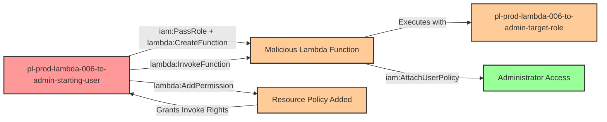

# Privilege Escalation via iam:PassRole + lambda:CreateFunction + lambda:AddPermission

* **Category:** Privilege Escalation
* **Sub-Category:** new-passrole
* **Path Type:** one-hop
* **Target:** to-admin
* **Environments:** prod
* **Cost Estimate:** $0/mo
* **Pathfinding.cloud ID:** lambda-006
* **Technique:** Creating Lambda function with admin role and granting self-invocation permission to execute malicious code
* **Terraform Variable:** `enable_single_account_privesc_one_hop_to_admin_lambda_006_iam_passrole_lambda_createfunction_lambda_addpermission`
* **Schema Version:** 1.0.0
* **Attack Path:** starting_user → (lambda:CreateFunction with admin role) → malicious Lambda → (lambda:AddPermission) → allow self invoke → (lambda:InvokeFunction) → execute as admin role → attach AdministratorAccess → admin access
* **Attack Principals:** `arn:aws:iam::{account_id}:user/pl-prod-lambda-006-to-admin-starting-user`; `arn:aws:iam::{account_id}:role/pl-prod-lambda-006-to-admin-target-role`
* **Required Permissions:** `iam:PassRole` on `arn:aws:iam::*:role/pl-prod-lambda-006-to-admin-target-role`; `lambda:CreateFunction` on `*`; `lambda:AddPermission` on `*`; `lambda:InvokeFunction` on `*`
* **Helpful Permissions:** `iam:ListRoles` (Discover available privileged roles); `lambda:GetFunction` (Verify function creation and retrieve details); `lambda:GetPolicy` (Verify resource-based policy was added); `lambda:DeleteFunction` (Clean up attack artifacts)
* **MITRE Tactics:** TA0004 - Privilege Escalation, TA0002 - Execution
* **MITRE Techniques:** T1078.004 - Valid Accounts: Cloud Accounts, T1648 - Serverless Execution

## Attack Overview

This scenario demonstrates a privilege escalation vulnerability where a user has permissions to pass an IAM role to Lambda, create Lambda functions, add resource-based permissions to those functions, and invoke them. Unlike the simpler `lambda:InvokeFunction` path, this scenario requires the attacker to explicitly grant themselves invocation permissions using `lambda:AddPermission` before they can execute the function.

The attack leverages AWS Lambda's dual permission model: both IAM permissions (identity-based) and resource-based policies control who can invoke a function. When a user creates a Lambda function, they don't automatically have permission to invoke it unless granted through IAM or resource policy. The `lambda:AddPermission` API allows the function creator to add resource-based permissions that grant invocation rights to specific principals, including themselves.

By combining `iam:PassRole`, `lambda:CreateFunction`, and `lambda:AddPermission`, an attacker can create a malicious Lambda function with an administrative execution role, grant themselves permission to invoke it through a resource-based policy, execute code with admin privileges, and escalate their own permissions permanently by attaching the AdministratorAccess policy to their starting user.

### MITRE ATT&CK Mapping

- **Tactic**: TA0004 - Privilege Escalation, TA0002 - Execution
- **Technique**: T1078.004 - Valid Accounts: Cloud Accounts
- **Technique**: T1648 - Serverless Execution

### Principals in the attack path

- `arn:aws:iam::PROD_ACCOUNT:user/pl-prod-lambda-006-to-admin-starting-user` (Scenario-specific starting user)
- `arn:aws:iam::PROD_ACCOUNT:role/pl-prod-lambda-006-to-admin-target-role` (Admin role passed to Lambda)

### Attack Path Diagram



### Attack Steps

1. **Initial Access**: Start as `pl-prod-lambda-006-to-admin-starting-user` (credentials provided via Terraform outputs)
2. **Create Lambda Function**: Use `lambda:CreateFunction` with `iam:PassRole` to create a Lambda function that uses the admin target role as its execution role. The function code uses the admin role's credentials to attach AdministratorAccess policy to the starting user
3. **Add Invocation Permission**: Use `lambda:AddPermission` to add a resource-based policy statement allowing the starting user to invoke the function
4. **Invoke Function**: Use `lambda:InvokeFunction` to execute the Lambda function, which attaches AdministratorAccess to the starting user
5. **Verification**: Verify administrator access with the starting user's credentials

### Scenario specific resources created

| ARN | Purpose |
| -- | -- |
| `arn:aws:iam::PROD_ACCOUNT:user/pl-prod-lambda-006-to-admin-starting-user` | Scenario-specific starting user with access keys |
| `arn:aws:iam::PROD_ACCOUNT:role/pl-prod-lambda-006-to-admin-target-role` | Admin role that can be passed to Lambda functions |
| Policy attached to starting user | Grants `iam:PassRole` on target role, `lambda:CreateFunction`, `lambda:AddPermission`, and `lambda:InvokeFunction` |

## Attack Lab

### Prerequisites

1. Install the `plabs` CLI:
   ```bash
   brew install pathfinding-labs/tap/plabs
   ```
2. Configure your AWS profiles in `~/.plabs/plabs.yaml` (or run `plabs init` if you haven't already)

### Deploy with plabs non-interactive

```bash
plabs enable enable_single_account_privesc_one_hop_to_admin_lambda_006_iam_passrole_lambda_createfunction_lambda_addpermission
plabs apply
```

### Deploy with plabs tui

1. Launch the TUI: `plabs`
2. Navigate to this scenario in the scenarios list
3. Press `space` to enable it
4. Press `d` to deploy

### Executing the automated demo_attack script

The script will:
1. Display a step-by-step walkthrough with color-coded output
2. Show the commands being executed and their results
3. Verify successful privilege escalation
4. Output standardized test results for automation

#### Resources created by attack script

- A malicious Lambda function with the admin target role as its execution role
- A resource-based policy statement on the Lambda function granting the starting user invocation rights
- `AdministratorAccess` policy attached to the starting user

#### With plabs non-interactive

```bash
plabs demo --list
plabs demo lambda-006-iam-passrole+lambda-createfunction+lambda-addpermission
```

#### With plabs tui

1. Launch the TUI: `plabs`
2. Navigate to this scenario in the scenarios list
3. Press `r` to run the demo script

### Cleanup

#### With plabs non-interactive

```bash
plabs cleanup --list
plabs cleanup lambda-006-iam-passrole+lambda-createfunction+lambda-addpermission
```

#### With plabs tui

1. Launch the TUI: `plabs`
2. Navigate to this scenario in the scenarios list
3. Press `c` to run the cleanup script

### Teardown with plabs non-interactive

```bash
plabs disable enable_single_account_privesc_one_hop_to_admin_lambda_006_iam_passrole_lambda_createfunction_lambda_addpermission
plabs apply
```

### Teardown with plabs tui

1. Launch the TUI: `plabs`
2. Navigate to this scenario in the scenarios list
3. Press `space` to disable it
4. Press `D` to destroy

## Detecting Misconfiguration (CSPM)

### What CSPM tools should detect

- IAM user has `iam:PassRole` permission targeting a role with administrative privileges
- IAM user has `lambda:CreateFunction` permission allowing creation of functions with privileged roles
- IAM user has `lambda:AddPermission` allowing modification of Lambda resource-based policies
- Privilege escalation path detected: user can combine PassRole + CreateFunction + AddPermission + InvokeFunction to achieve admin access
- Lambda execution role `pl-prod-lambda-006-to-admin-target-role` has administrative permissions and is passable by a non-admin principal

### Prevention recommendations

- Restrict `iam:PassRole` permissions using strict resource conditions to limit which roles can be passed to Lambda
- Implement condition keys like `iam:PassedToService` to restrict PassRole specifically to `lambda.amazonaws.com` only when necessary
- Avoid granting broad `lambda:CreateFunction` permissions; use resource tags or naming patterns to limit function creation scope
- Implement Service Control Policies (SCPs) that prevent passing roles with administrative permissions to Lambda functions
- Use IAM Access Analyzer to identify privilege escalation paths involving PassRole and Lambda permissions
- Enable AWS Config rules to detect Lambda functions with overly permissive execution roles or resource-based policies

## Detection Abuse (CloudSIEM)

### CloudTrail events to monitor

- `IAM: PassRole` — Starting user passes an admin role to a Lambda function; critical when the target role has elevated permissions
- `Lambda: CreateFunction20150331` — New Lambda function created; high severity when the execution role has administrative privileges
- `Lambda: AddPermission20150331v2` — Resource-based policy added to a Lambda function; suspicious when the principal granting rights is the same as the function creator
- `Lambda: Invoke` — Lambda function invoked; correlate with preceding CreateFunction and AddPermission events for full attack chain

### Detonation logs

_Detonation log integration (Stratus Red Team / Grimoire) is planned for a future release._
