# Privilege Escalation via lambda:UpdateFunctionCode + lambda:AddPermission

* **Category:** Privilege Escalation
* **Sub-Category:** access-resource
* **Path Type:** one-hop
* **Target:** to-admin
* **Environments:** prod
* **Technique:** Modifying existing Lambda function code and adding resource-based permissions to execute malicious logic under privileged execution role

## Overview

This scenario demonstrates a sophisticated privilege escalation attack that combines two Lambda permissions: `lambda:UpdateFunctionCode` to modify function code and `lambda:AddPermission` to grant invocation access. This combination allows an attacker to compromise existing Lambda functions, bypass resource-based access restrictions, and execute arbitrary code under the function's privileged execution role.

Unlike simpler Lambda-based escalations, this scenario requires the attacker to overcome an additional security barrier: the Lambda function may have a restrictive resource-based policy that doesn't initially allow the attacker to invoke it. By using `lambda:AddPermission`, the attacker can add themselves to the function's resource policy, granting invocation rights and completing the privilege escalation chain.

This attack is particularly dangerous in environments where Lambda functions are deployed with administrative roles and code update permissions are granted broadly for deployment automation. The addition of `lambda:AddPermission` makes this escalation path more resilient to resource-based policy protections that organizations might implement as a defense-in-depth measure.

## Understanding the attack scenario

### Principals in the attack path

- `arn:aws:iam::PROD_ACCOUNT:user/pl-prod-lufclap-to-admin-starting-user` (Scenario-specific starting user)
- `arn:aws:lambda:REGION:PROD_ACCOUNT:function/pl-prod-lufclap-to-admin-target-lambda` (Pre-existing Lambda function with privileged role)
- `arn:aws:iam::PROD_ACCOUNT:role/pl-prod-lufclap-to-admin-lambda-exec-role` (Lambda execution role with AdministratorAccess)

### Attack Path Diagram

```mermaid
graph LR
    A[pl-prod-lufclap-to-admin-starting-user] -->|lambda:UpdateFunctionCode| B[pl-prod-lufclap-to-admin-target-lambda]
    B -->|lambda:AddPermission| C[Self-Grant Invoke Permission]
    C -->|lambda:InvokeFunction| D[Malicious Code Execution]
    D -->|iam:AttachUserPolicy with Admin Role| E[Starting User with Admin Access]

    style A fill:#ff9999,stroke:#333,stroke-width:2px
    style B fill:#ffcc99,stroke:#333,stroke-width:2px
    style C fill:#ffcc99,stroke:#333,stroke-width:2px
    style D fill:#ffcc99,stroke:#333,stroke-width:2px
    style E fill:#99ff99,stroke:#333,stroke-width:2px
```



### Attack Steps

1. **Initial Access**: Start as `pl-prod-lufclap-to-admin-starting-user` (credentials provided via Terraform outputs)
2. **Discover Target Function**: Use `lambda:ListFunctions` to identify Lambda functions with privileged execution roles
3. **Inspect Function Details**: Use `lambda:GetFunction` to retrieve handler name, execution role ARN, and current resource policy
4. **Craft Malicious Code**: Create Python code that uses the Lambda's execution role to attach AdministratorAccess to the starting user
5. **Critical Requirement**: Name the code file `lambda_function.py` to match the handler `lambda_function.lambda_handler`
6. **Package Deployment**: Zip the malicious code into a deployment package
7. **Update Function Code**: Use `lambda:UpdateFunctionCode` to replace the existing function code with malicious payload
8. **Add Invocation Permission**: Use `lambda:AddPermission` to add a resource-based policy statement allowing self-invocation
9. **Execute Payload**: Use `lambda:InvokeFunction` to trigger execution of the malicious code under the privileged role
10. **Verification**: Verify administrator access has been granted to the starting user

### Scenario specific resources created

| ARN | Purpose |
| -- | -- |
| `arn:aws:iam::PROD_ACCOUNT:user/pl-prod-lufclap-to-admin-starting-user` | Scenario-specific starting user with access keys |
| `arn:aws:lambda:REGION:PROD_ACCOUNT:function/pl-prod-lufclap-to-admin-target-lambda` | Pre-existing Lambda function that runs benign code (victim workload) |
| `arn:aws:iam::PROD_ACCOUNT:role/pl-prod-lufclap-to-admin-lambda-exec-role` | Lambda execution role with AdministratorAccess policy attached |

## Executing the attack

### Using the automated demo_attack.sh

To demonstrate the privilege escalation path, run the provided demo script:

```bash
cd modules/scenarios/single-account/privesc-one-hop/to-admin/lambda-updatefunctioncode+lambda-addpermission
./demo_attack.sh
```

The script will:
1. Display a step-by-step walkthrough with color-coded output
2. Show the commands being executed and their results
3. Verify successful privilege escalation
4. Output standardized test results for automation

### Cleaning up the attack artifacts

After demonstrating the attack, clean up the AdministratorAccess policy attachment, resource-based policy modifications, and restore original Lambda code:

```bash
cd modules/scenarios/single-account/privesc-one-hop/to-admin/lambda-updatefunctioncode+lambda-addpermission
./cleanup_attack.sh
```

## Detection and prevention

### What CSPM Should Detect

A properly configured Cloud Security Posture Management (CSPM) tool should identify:

1. **Overly Permissive Lambda Update Access**: Users or roles with `lambda:UpdateFunctionCode` on highly privileged Lambda functions
2. **Lambda Functions with Administrative Roles**: Lambda functions whose execution roles have administrative or overly broad permissions
3. **Resource Policy Modification Access**: Principals with `lambda:AddPermission` on privileged Lambda functions can bypass resource policy protections
4. **Privilege Escalation Path**: The combination of Lambda code update permissions, resource policy modification, and privileged execution roles creates an escalation path
5. **Lack of Code Signing**: Lambda functions without code signing enforcement allow arbitrary code execution
6. **Missing Resource Conditions**: Lambda policies without resource-specific conditions that limit which functions can be modified

### MITRE ATT&CK Mapping

- **Tactic**: TA0004 - Privilege Escalation, TA0002 - Execution
- **Technique**: T1078.004 - Valid Accounts: Cloud Accounts
- **Technique**: T1648 - Serverless Execution

## Prevention recommendations

- **Implement Code Signing**: Require Lambda functions to use code signing to prevent unauthorized code modifications
- **Apply Least Privilege**: Lambda execution roles should only have permissions required for their specific business function, never AdministratorAccess
- **Restrict Update Permissions**: Limit `lambda:UpdateFunctionCode` to dedicated CI/CD roles with strict condition keys
- **Protect Resource Policies**: Deny `lambda:AddPermission` except for specific trusted principals using SCPs or permission boundaries
- **Use Resource Conditions**: Apply resource-based IAM conditions to restrict which Lambda functions can be modified by which principals
- **Enable CloudTrail Monitoring**: Alert on `UpdateFunctionCode`, `AddPermission`, and `InvokeFunction` API calls, especially for high-privilege functions
- **Implement SCPs**: Use Service Control Policies to prevent attachment of administrative policies to Lambda execution roles
- **Separate Deployment and Execution**: Use separate AWS accounts or strict boundaries between deployment infrastructure and production workloads
- **Enable Lambda Function URLs Protection**: If using function URLs, ensure authentication is required and resource policies are enforced
- **IAM Access Analyzer**: Use AWS IAM Access Analyzer to identify external access and privilege escalation paths involving Lambda functions
- **Version Control Integration**: Implement deployment pipelines that enforce code review and approval before Lambda updates
- **Monitor Resource Policy Changes**: Alert on `AddPermission` API calls and review Lambda resource policy modifications regularly
