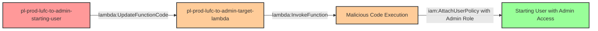

# Privilege Escalation via lambda:UpdateFunctionCode

**Category:** Privilege Escalation
**Sub-Category:** access-resource
**Path Type:** one-hop
**Target:** to-admin
**Environments:** prod
**Technique:** Modifying existing Lambda function code to execute malicious logic under privileged execution role

## Overview

This scenario demonstrates a critical but often overlooked privilege escalation vector where an attacker with `lambda:UpdateFunctionCode` permission can compromise existing Lambda functions to execute arbitrary code under the function's privileged execution role. Unlike scenarios that require creating new infrastructure, this attack exploits pre-existing production workloads.

The vulnerability lies in treating code deployment permissions as less sensitive than IAM policy modifications. In reality, the ability to modify code that executes with elevated privileges is functionally equivalent to having those privileges yourself. If a Lambda function runs with an administrative role, anyone who can update its code can execute arbitrary operations with administrative access.

This scenario is particularly dangerous in real-world environments where Lambda functions are common, often highly privileged, and code update permissions may be granted too broadly for deployment automation or developer access.

## Understanding the attack scenario

### Principals in the attack path

- `arn:aws:iam::PROD_ACCOUNT:user/pl-prod-lufc-to-admin-starting-user` (Scenario-specific starting user)
- `arn:aws:lambda:REGION:PROD_ACCOUNT:function/pl-prod-lufc-to-admin-target-lambda` (Pre-existing Lambda function with privileged role)
- `arn:aws:iam::PROD_ACCOUNT:role/pl-prod-lufc-to-admin-target-role` (Lambda execution role with AdministratorAccess)

### Attack Path Diagram



### Attack Steps

1. **Initial Access**: Start as `pl-prod-lufc-to-admin-starting-user` (credentials provided via Terraform outputs)
2. **Discover Target Function**: Use `lambda:ListFunctions` to identify Lambda functions with privileged execution roles
3. **Inspect Function Details**: Use `lambda:GetFunction` to retrieve handler name and execution role ARN
4. **Craft Malicious Code**: Create Python code that uses the Lambda's execution role to attach AdministratorAccess to the starting user
5. **Critical Requirement**: Name the code file `lambda_function.py` to match the handler `lambda_function.lambda_handler`
6. **Package Deployment**: Zip the malicious code into a deployment package
7. **Update Function Code**: Use `lambda:UpdateFunctionCode` to replace the existing function code
8. **Execute Payload**: Use `lambda:InvokeFunction` to trigger execution of the malicious code
9. **Verification**: Verify administrator access has been granted to the starting user

### Scenario specific resources created

| ARN | Purpose |
| -- | -- |
| `arn:aws:iam::PROD_ACCOUNT:user/pl-prod-lufc-to-admin-starting-user` | Scenario-specific starting user with access keys |
| `arn:aws:lambda:REGION:PROD_ACCOUNT:function/pl-prod-lufc-to-admin-target-lambda` | Pre-existing Lambda function that runs benign code (victim workload) |
| `arn:aws:iam::PROD_ACCOUNT:role/pl-prod-lufc-to-admin-target-role` | Lambda execution role with AdministratorAccess policy attached |
| `arn:aws:iam::PROD_ACCOUNT:policy/pl-prod-lufc-to-admin-lambda-access-policy` | Grants starting user lambda:UpdateFunctionCode and lambda:InvokeFunction |

## Executing the attack

### Using the automated demo_attack.sh

To demonstrate the privilege escalation path, run the provided demo script:

```bash
cd modules/scenarios/single-account/privesc-one-hop/to-admin/lambda-updatefunctioncode
./demo_attack.sh
```

The script will:
1. Display a step-by-step walkthrough with color-coded output
2. Show the commands being executed and their results
3. Verify successful privilege escalation
4. Output standardized test results for automation

### Cleaning up the attack artifacts

After demonstrating the attack, clean up the AdministratorAccess policy attachment and restore original Lambda code:

```bash
cd modules/scenarios/single-account/privesc-one-hop/to-admin/lambda-updatefunctioncode
./cleanup_attack.sh
```

## Detection and prevention

### What CSPM Should Detect

A properly configured Cloud Security Posture Management (CSPM) tool should identify:

1. **Overly Permissive Lambda Update Access**: Users or roles with `lambda:UpdateFunctionCode` on highly privileged Lambda functions
2. **Lambda Functions with Administrative Roles**: Lambda functions whose execution roles have administrative or overly broad permissions
3. **Privilege Escalation Path**: The combination of Lambda code update permissions and privileged execution roles creates an escalation path
4. **Lack of Code Signing**: Lambda functions without code signing enforcement allow arbitrary code execution
5. **Missing Resource Conditions**: Lambda policies without resource-specific conditions that limit which functions can be modified

### MITRE ATT&CK Mapping

- **Tactic**: TA0004 - Privilege Escalation, TA0003 - Persistence
- **Technique**: T1078.004 - Valid Accounts: Cloud Accounts
- **Technique**: T1525 - Implant Internal Image (modifying serverless function code)

## Prevention recommendations

- **Implement Code Signing**: Require Lambda functions to use code signing to prevent unauthorized code modifications
- **Apply Least Privilege**: Lambda execution roles should only have permissions required for their specific business function, never AdministratorAccess
- **Restrict Update Permissions**: Limit `lambda:UpdateFunctionCode` to dedicated CI/CD roles with strict condition keys
- **Use Resource Conditions**: Apply resource-based IAM conditions to restrict which Lambda functions can be modified by which principals
- **Enable CloudTrail Monitoring**: Alert on `UpdateFunctionCode` and `InvokeFunction` API calls, especially for high-privilege functions
- **Implement SCPs**: Use Service Control Policies to prevent attachment of administrative policies to Lambda execution roles
- **Separate Deployment and Execution**: Use separate AWS accounts or strict boundaries between deployment infrastructure and production workloads
- **Enable Lambda Function URLs Protection**: If using function URLs, ensure authentication is required
- **IAM Access Analyzer**: Use AWS IAM Access Analyzer to identify external access and privilege escalation paths involving Lambda functions
- **Version Control Integration**: Implement deployment pipelines that enforce code review and approval before Lambda updates
