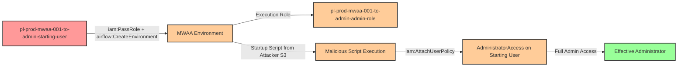

# Privilege Escalation via iam:PassRole + airflow:CreateEnvironment

* **Category:** Privilege Escalation
* **Sub-Category:** new-passrole
* **Path Type:** one-hop
* **Target:** to-admin
* **Environments:** prod
* **Cost Estimate:** $37/mo
* **Pathfinding.cloud ID:** mwaa-001
* **Interactive Demo:** Yes
* **Technique:** Pass privileged role to MWAA environment with malicious startup script for privilege escalation
* **Terraform Variable:** `enable_single_account_privesc_one_hop_to_admin_mwaa_001_iam_passrole_airflow_createenvironment`
* **Schema Version:** 1.0.0
* **Attack Path:** starting_user → (iam:PassRole + airflow:CreateEnvironment) → MWAA environment with admin execution role → startup script executes with admin credentials → attaches AdministratorAccess to starting_user → admin access
* **Attack Principals:** `arn:aws:iam::{account_id}:user/pl-prod-mwaa-001-to-admin-starting-user`; `arn:aws:iam::{account_id}:role/pl-prod-mwaa-001-to-admin-admin-role`
* **Required Permissions:** `iam:PassRole` on `arn:aws:iam::*:role/pl-prod-mwaa-001-to-admin-admin-role`; `airflow:CreateEnvironment` on `*`; `ec2:CreateNetworkInterface` on `*`; `ec2:CreateNetworkInterfacePermission` on `*`; `ec2:DescribeNetworkInterfaces` on `*`; `ec2:DescribeSubnets` on `*`; `ec2:DescribeSecurityGroups` on `*`; `ec2:DescribeVpcs` on `*`; `ec2:CreateVpcEndpoint` on `*`; `ec2:DeleteVpcEndpoints` on `*`; `ec2:DescribeVpcEndpoints` on `*`; `ec2:DescribeVpcEndpointServices` on `*`; `s3:GetEncryptionConfiguration` on `*`
* **Helpful Permissions:** `airflow:GetEnvironment` (Check environment status and wait for it to be ready); `airflow:DeleteEnvironment` (Clean up the MWAA environment after the attack); `ec2:DescribeRouteTables` (Verify subnets have routes to NAT Gateway)
* **MITRE Tactics:** TA0004 - Privilege Escalation, TA0002 - Execution
* **MITRE Techniques:** T1098 - Account Manipulation, T1059 - Command and Scripting Interpreter

## Attack Overview

This scenario demonstrates a privilege escalation vulnerability where a user with `iam:PassRole` and `airflow:CreateEnvironment` permissions can create an Amazon Managed Workflows for Apache Airflow (MWAA) environment with an administrative execution role and a malicious startup script that executes with elevated privileges.

Amazon MWAA is a managed service for Apache Airflow that simplifies running data pipelines. When creating an MWAA environment, you specify an execution role that the environment uses for all operations, including running startup scripts. A critical but often overlooked feature is that MWAA environments can be configured with a startup script that runs BEFORE Airflow initializes, executing with the full permissions of the execution role.

The attack exploits the fact that MWAA allows referencing S3 buckets in external AWS accounts for the DAGs folder and startup script. This means an attacker does not need any S3 permissions in the victim account - they can host a malicious startup script in their own AWS account on a public S3 bucket. When the MWAA environment starts up (which takes 20-30 minutes), the startup script executes with the execution role's credentials, allowing the attacker to attach AdministratorAccess to their starting user and achieve full administrative access.

### MITRE ATT&CK Mapping

- **Tactic**: Privilege Escalation (TA0004), Execution (TA0002)
- **Technique**: T1098 - Account Manipulation
- **Technique**: T1059 - Command and Scripting Interpreter
- **Sub-technique**: Using managed service startup scripts to execute privileged operations

### Principals in the attack path

- `arn:aws:iam::PROD_ACCOUNT:user/pl-prod-mwaa-001-to-admin-starting-user` (Scenario-specific starting user with PassRole and CreateEnvironment permissions)
- `arn:aws:iam::PROD_ACCOUNT:role/pl-prod-mwaa-001-to-admin-admin-role` (Admin execution role passed to MWAA environment)

### Attack Path Diagram



### Attack Steps

1. **Initial Access**: Start as `pl-prod-mwaa-001-to-admin-starting-user` (credentials provided via Terraform outputs)
2. **Prepare Malicious Script**: Host a startup script on an attacker-controlled public S3 bucket containing:
   ```bash
   #!/bin/bash
   aws iam attach-user-policy \
       --user-name pl-prod-mwaa-001-to-admin-starting-user \
       --policy-arn arn:aws:iam::aws:policy/AdministratorAccess
   ```
3. **Create MWAA Environment**: Use `airflow:CreateEnvironment` to create an MWAA environment, passing the admin execution role via `iam:PassRole` and pointing to the attacker's S3 bucket for the DAGs folder and startup script
4. **Wait for Environment Creation**: MWAA environment provisioning takes approximately 20-30 minutes
5. **Startup Script Executes**: When the environment initializes, the startup script runs with the execution role's admin credentials
6. **Policy Attachment**: The script attaches AdministratorAccess to the starting user
7. **Verification**: Verify administrator access by executing privileged operations (e.g., `aws iam list-users`)

### Scenario specific resources created

| Resource | Purpose |
| -- | -- |
| `arn:aws:iam::PROD_ACCOUNT:user/pl-prod-mwaa-001-to-admin-starting-user` | Scenario-specific starting user with access keys |
| `arn:aws:iam::PROD_ACCOUNT:role/pl-prod-mwaa-001-to-admin-admin-role` | Administrative execution role passed to MWAA environment |
| `pl-prod-mwaa-001-vpc` (VPC) | Dedicated VPC with private subnets and NAT Gateway for MWAA |
| `pl-mwaa-001-attacker-bucket-{account_id}-{suffix}` (S3) | S3 bucket containing DAGs folder and malicious startup script |

## Attack Lab

### Prerequisites

1. Install the `plabs` CLI:
   ```bash
   brew install pathfinding-labs/tap/plabs
   ```
2. Configure your AWS profiles in `~/.plabs/plabs.yaml` (or run `plabs init` if you haven't already)

### Deploy with plabs non-interactive

```bash
plabs enable enable_single_account_privesc_one_hop_to_admin_mwaa_001_iam_passrole_airflow_createenvironment
plabs apply
```

### Deploy with plabs tui

1. Launch the TUI: `plabs`
2. Navigate to this scenario in the scenarios list
3. Press `space` to enable it
4. Press `d` to deploy

### Cost Considerations

> **CRITICAL COST WARNING**: This scenario involves Amazon MWAA which has significant ongoing costs. **Destroy the environment immediately after testing to avoid charges.**

**MWAA Environment Costs:**
- **mw1.small instance**: ~$0.49/hour (~$350/month if left running)
- **NAT Gateway**: ~$0.045/hour + data processing (~$32/month minimum)
- **Environment creation time**: 20-30 minutes (unavoidable)

**Estimated costs for a single demo:**
- **Quick test (destroy within 1 hour)**: ~$1-2
- **Left running for 1 day**: ~$15-20
- **Left running for 1 month**: ~$380+

**Cost mitigation:**
1. Run the cleanup script immediately after verification
2. Verify environment deletion in the AWS Console
3. Set up billing alerts for unexpected charges
4. Consider using this scenario only when specifically testing MWAA-related detection capabilities

### Executing the automated demo_attack script

The script will:
1. Display a step-by-step walkthrough with color-coded output
2. Show the commands being executed and their results
3. Create an S3 bucket with a malicious startup script (or use an external bucket)
4. Create an MWAA environment with the admin execution role
5. Wait for environment creation (20-30 minutes with progress updates)
6. Verify successful privilege escalation by demonstrating admin access
7. Output standardized test results for automation

#### Resources created by attack script

- MWAA environment with admin execution role and malicious startup script
- S3 bucket containing DAGs folder and malicious startup script (attacker-controlled)
- `AdministratorAccess` policy attached to the starting user

#### With plabs non-interactive

```bash
plabs demo --list
plabs demo mwaa-001-iam-passrole+airflow-createenvironment
```

#### With plabs tui

1. Launch the TUI: `plabs`
2. Navigate to this scenario in the scenarios list
3. Press `r` to run the demo script

### Cleanup

After demonstrating the attack, **immediately** clean up the MWAA environment to stop incurring costs.

The cleanup script will:
- Delete the MWAA environment (takes 15-20 minutes to fully delete)
- Detach the AdministratorAccess policy from the starting user
- Remove the attacker's S3 bucket and startup script
- Clean up any VPC resources created for the environment

> **Important**: MWAA environment deletion takes 15-20 minutes. Verify in the AWS Console that the environment has been fully deleted to stop charges.

#### With plabs non-interactive

```bash
plabs cleanup --list
plabs cleanup mwaa-001-iam-passrole+airflow-createenvironment
```

#### With plabs tui

1. Launch the TUI: `plabs`
2. Navigate to this scenario in the scenarios list
3. Press `c` to run the cleanup script

### Teardown with plabs non-interactive

```bash
plabs disable enable_single_account_privesc_one_hop_to_admin_mwaa_001_iam_passrole_airflow_createenvironment
plabs apply
```

### Teardown with plabs tui

1. Launch the TUI: `plabs`
2. Navigate to this scenario in the scenarios list
3. Press `space` to disable it
4. Press `D` to destroy

## Detecting Misconfiguration (CSPM)

### What CSPM tools should detect

A properly configured CSPM solution should identify:
- IAM user with `iam:PassRole` permission on privileged roles
- IAM user with `airflow:CreateEnvironment` permission
- Combination of PassRole and MWAA permissions enabling privilege escalation
- IAM role with administrative permissions that can be passed to MWAA service
- MWAA trust policy allowing the airflow service to assume privileged roles
- Privilege escalation path from user to admin via MWAA environment creation

### Prevention recommendations

- **Restrict PassRole permissions**: Limit `iam:PassRole` to only the specific roles and services needed. Use resource-level restrictions:
  ```json
  {
    "Effect": "Allow",
    "Action": "iam:PassRole",
    "Resource": "arn:aws:iam::*:role/specific-mwaa-role",
    "Condition": {
      "StringEquals": {
        "iam:PassedToService": "airflow.amazonaws.com"
      }
    }
  }
  ```

- **Implement SCPs to prevent privilege escalation**: Use Service Control Policies to deny PassRole on administrative roles to MWAA:
  ```json
  {
    "Effect": "Deny",
    "Action": "iam:PassRole",
    "Resource": "arn:aws:iam::*:role/*admin*",
    "Condition": {
      "StringEquals": {
        "iam:PassedToService": "airflow.amazonaws.com"
      }
    }
  }
  ```

- **Restrict external S3 bucket references**: Implement SCPs or IAM policies that deny `airflow:CreateEnvironment` when the source bucket or startup script references external AWS accounts:
  ```json
  {
    "Effect": "Deny",
    "Action": "airflow:CreateEnvironment",
    "Resource": "*",
    "Condition": {
      "StringNotEquals": {
        "airflow:SourceBucketArn": "arn:aws:s3:::your-approved-bucket-*"
      }
    }
  }
  ```

- **Disable startup scripts**: If startup scripts are not required in your organization, deny their use entirely or require them to come from approved, audited S3 locations.

- **Monitor CloudTrail for MWAA environment creation**: Alert on `CreateEnvironment` API calls, especially when combined with PassRole on privileged roles or when referencing external S3 buckets.

- **Restrict airflow:CreateEnvironment permissions**: Only grant this permission to users who legitimately need to create MWAA environments (data engineering teams, platform administrators). This is a powerful permission that should be tightly controlled.

- **Use IAM Access Analyzer**: Enable IAM Access Analyzer to automatically detect privilege escalation paths involving PassRole and MWAA services.

- **Implement least privilege for MWAA execution roles**: When creating IAM roles for MWAA, grant only the minimum permissions required for the specific workflows. Typical MWAA environments need S3 access for DAGs, CloudWatch Logs access, and specific data service permissions - not IAM modification capabilities.

- **Require VPC endpoints and private subnets**: Configure MWAA environments to run within private VPCs without public access, reducing the attack surface and limiting data exfiltration paths.

- **Implement environment approval workflows**: Require code review and approval before MWAA environments can be created, especially reviewing execution roles and startup scripts.

- **Enable MWAA audit logging**: Configure comprehensive logging for MWAA environments to capture all API calls and startup script execution for forensic analysis.

## Detection Abuse (CloudSIEM)

### CloudTrail events to monitor

- `MWAA: CreateEnvironment` — MWAA environment created; critical when the `ExecutionRoleArn` references an administrative role or when `StartupScriptS3Path` references an external AWS account
- `IAM: PassRole` — Role passed to a service; monitor when the passed role has administrative permissions and the service is `airflow.amazonaws.com`
- `IAM: AttachUserPolicy` — Policy attached to a user; high severity when originating from an MWAA execution role context
- `IAM: PutUserPolicy` — Inline policy written to a user; high severity when originating from an MWAA execution role context

**CloudWatch Logs indicators:**
- MWAA startup script logs showing AWS CLI commands
- Unexpected IAM API calls in MWAA worker logs
- Errors related to IAM modifications from MWAA context

### Detonation logs

_Detonation log integration (Stratus Red Team / Grimoire) is planned for a future release._

## References

- [Amazon MWAA Documentation](https://docs.aws.amazon.com/mwaa/latest/userguide/what-is-mwaa.html)
- [MWAA Execution Role Permissions](https://docs.aws.amazon.com/mwaa/latest/userguide/mwaa-create-role.html)
- [MWAA Startup Script Configuration](https://docs.aws.amazon.com/mwaa/latest/userguide/using-startup-script.html)
- [AWS IAM PassRole Documentation](https://docs.aws.amazon.com/IAM/latest/UserGuide/id_roles_use_passrole.html)
- [Rhino Security Labs - AWS IAM Privilege Escalation Methods](https://rhinosecuritylabs.com/aws/aws-privilege-escalation-methods-mitigation/)
