# Privilege Escalation via airflow:UpdateEnvironment

* **Category:** Privilege Escalation
* **Sub-Category:** existing-passrole
* **Path Type:** one-hop
* **Target:** to-admin
* **Environments:** prod
* **Cost Estimate:** $37/mo
* **Pathfinding.cloud ID:** mwaa-002
* **Interactive Demo:** Yes
* **Technique:** Update existing MWAA environment's DAG source bucket to attacker-controlled bucket containing malicious DAG that executes with admin credentials
* **Terraform Variable:** `enable_single_account_privesc_one_hop_to_admin_mwaa_002_airflow_updateenvironment`
* **Schema Version:** 1.0.0
* **Attack Path:** starting_user → (airflow:UpdateEnvironment) → changes DAG source to attacker's bucket → (airflow:CreateCliToken) → triggers malicious DAG → DAG executes with admin execution role credentials → attaches AdministratorAccess to starting_user → admin access
* **Attack Principals:** `arn:aws:iam::{account_id}:user/pl-prod-mwaa-002-to-admin-starting-user`; `arn:aws:iam::{account_id}:role/pl-prod-mwaa-002-to-admin-admin-role`
* **Required Permissions:** `airflow:UpdateEnvironment` on `arn:aws:airflow:*:*:environment/pl-prod-mwaa-002-to-admin-env`; `airflow:CreateCliToken` on `arn:aws:airflow:*:*:environment/pl-prod-mwaa-002-to-admin-env`; `ec2:DescribeSubnets` on `*`; `ec2:DescribeVpcs` on `*`; `ec2:DescribeSecurityGroups` on `*`; `s3:GetEncryptionConfiguration` on `*`
* **Helpful Permissions:** `airflow:GetEnvironment` (Check environment status and wait for update to complete); `iam:ListAttachedUserPolicies` (Verify that AdministratorAccess was attached after the attack)
* **MITRE Tactics:** TA0004 - Privilege Escalation, TA0002 - Execution
* **MITRE Techniques:** T1098 - Account Manipulation, T1059 - Command and Scripting Interpreter

## Attack Overview

This scenario demonstrates a privilege escalation vulnerability where a user with `airflow:UpdateEnvironment` permission can exploit an existing Amazon Managed Workflows for Apache Airflow (MWAA) environment that has an administrative execution role attached. Unlike creating a new environment from scratch (mwaa-001), this attack leverages pre-existing infrastructure by updating the environment configuration to change the DAG source bucket to an attacker-controlled S3 bucket.

MWAA environments execute DAGs with the full permissions of their execution role. When an attacker updates the environment's source bucket to point to an S3 bucket they control (which only needs a resource policy allowing the execution role to read from it), they can then use `airflow:CreateCliToken` to obtain a CLI token and trigger any DAG in the attacker's bucket. The malicious DAG executes with administrative credentials, allowing the attacker to attach AdministratorAccess to their starting user or perform any other privileged operation.

This attack is particularly dangerous because:

1. **Lower Permission Footprint**: Unlike mwaa-001 (CreateEnvironment) which requires `iam:PassRole` and extensive VPC permissions, UpdateEnvironment only requires EC2 describe permissions and `s3:GetEncryptionConfiguration` for bucket validation
2. **Exploits Existing Infrastructure**: Security teams may overlook the risk of `airflow:UpdateEnvironment` permission, focusing on environment creation
3. **On-Demand Execution**: Unlike startup scripts which only run when the environment restarts, DAGs can be triggered immediately using `airflow:CreateCliToken` and the Airflow CLI API
4. **Appears as Maintenance**: Environment updates look like routine configuration changes

### MITRE ATT&CK Mapping

- **Tactic**: TA0004 - Privilege Escalation, TA0002 - Execution
- **Technique**: T1098 - Account Manipulation
- **Technique**: T1059 - Command and Scripting Interpreter
- **Sub-technique**: Using managed service DAG execution to perform privileged operations

### Principals in the attack path

- `arn:aws:iam::PROD_ACCOUNT:user/pl-prod-mwaa-002-to-admin-starting-user` (Scenario-specific starting user with UpdateEnvironment permission)
- `arn:aws:airflow:REGION:PROD_ACCOUNT:environment/pl-prod-mwaa-002-to-admin-env` (Existing MWAA environment to be modified)
- `arn:aws:iam::PROD_ACCOUNT:role/pl-prod-mwaa-002-to-admin-admin-role` (Admin execution role attached to the MWAA environment)

### Attack Path Diagram

```mermaid
graph LR
    A[pl-prod-mwaa-002-to-admin-starting-user] -->|airflow:UpdateEnvironment| B[Existing MWAA Environment]
    B -->|Update SourceBucketArn| C[Attacker's Bucket with Malicious DAG]
    A -->|airflow:CreateCliToken| D[CLI Token]
    D -->|Trigger DAG via API| E[Malicious DAG Executes]
    E -->|Executes with| F[pl-prod-mwaa-002-to-admin-admin-role]
    F -->|iam:AttachUserPolicy| G[Starting User + AdministratorAccess]
    G -->|Full Admin Access| H[Effective Administrator]

    style A fill:#ff9999,stroke:#333,stroke-width:2px
    style B fill:#ffcc99,stroke:#333,stroke-width:2px
    style C fill:#ffcc99,stroke:#333,stroke-width:2px
    style D fill:#ffcc99,stroke:#333,stroke-width:2px
    style E fill:#ffcc99,stroke:#333,stroke-width:2px
    style F fill:#ffcc99,stroke:#333,stroke-width:2px
    style G fill:#99ff99,stroke:#333,stroke-width:2px
    style H fill:#99ff99,stroke:#333,stroke-width:2px
```



### Attack Steps

1. **Initial Access**: Start as `pl-prod-mwaa-002-to-admin-starting-user` (credentials provided via Terraform outputs)

2. **Prepare Malicious DAG**: Host a DAG file on an attacker-controlled S3 bucket with a resource policy allowing the target environment's execution role to read from it. The DAG contains:
   ```python
   from airflow import DAG
   from airflow.operators.python import PythonOperator
   from datetime import datetime
   import boto3

   def escalate_privileges():
       iam = boto3.client('iam')
       user_name = "pl-prod-mwaa-002-to-admin-starting-user"
       policy_arn = "arn:aws:iam::aws:policy/AdministratorAccess"
       iam.attach_user_policy(UserName=user_name, PolicyArn=policy_arn)
       return f"Privilege escalation successful for {user_name}"

   with DAG(
       dag_id='privesc_dag',
       start_date=datetime(2024, 1, 1),
       schedule_interval=None,
       catchup=False,
   ) as dag:
       escalate_task = PythonOperator(
           task_id='escalate_privileges',
           python_callable=escalate_privileges
       )
   ```

3. **Update Environment**: Use `airflow:UpdateEnvironment` to modify the existing MWAA environment, changing the `SourceBucketArn` to point to the attacker's bucket

4. **Wait for Environment Update**: MWAA environment updates take approximately 10-30 minutes to complete

5. **Wait for DAG Sync**: After the environment is available, wait 60 seconds for MWAA to sync DAGs from the new bucket

6. **Get CLI Token**: Use `airflow:CreateCliToken` to obtain a CLI token for API access

7. **Trigger Malicious DAG**: Use the CLI token to call the Airflow REST API and trigger the `privesc_dag`

8. **DAG Executes**: The malicious DAG runs with the execution role's admin credentials and attaches AdministratorAccess to the starting user

9. **Verification**: Verify administrator access by executing privileged operations (e.g., `aws iam list-users`)

### Required Permissions

| Permission | Resource | Purpose |
|------------|----------|---------|
| `airflow:UpdateEnvironment` | MWAA environment | Change the DAG source bucket |
| `airflow:CreateCliToken` | MWAA environment | Obtain CLI token to trigger DAGs |
| `ec2:DescribeSubnets` | * | MWAA validates these even when not changing network config |
| `ec2:DescribeVpcs` | * | MWAA validates these even when not changing network config |
| `ec2:DescribeSecurityGroups` | * | MWAA validates these even when not changing network config |
| `s3:GetEncryptionConfiguration` | * | MWAA validates bucket encryption settings |

**Note**: Unlike mwaa-001, this attack does NOT require `iam:PassRole`, `ec2:CreateNetworkInterface`, or `ec2:CreateVpcEndpoint` permissions.

### Scenario specific resources created

| ARN | Purpose |
| -- | -- |
| `arn:aws:iam::PROD_ACCOUNT:user/pl-prod-mwaa-002-to-admin-starting-user` | Scenario-specific starting user with access keys and required permissions |
| `arn:aws:airflow:REGION:PROD_ACCOUNT:environment/pl-prod-mwaa-002-to-admin-env` | Existing MWAA environment that can be updated by the starting user |
| `arn:aws:iam::PROD_ACCOUNT:role/pl-prod-mwaa-002-to-admin-admin-role` | Administrative execution role attached to the MWAA environment |
| `pl-prod-mwaa-002-vpc` (VPC) | Dedicated VPC with private subnets and NAT Gateway for MWAA |
| `pl-mwaa-002-legitimate-bucket-{account_id}-{suffix}` (S3) | Original S3 bucket containing DAGs folder for the MWAA environment |
| `pl-mwaa-002-attacker-bucket-{account_id}-{suffix}` (S3) | Attacker's S3 bucket containing the malicious DAG |

## Attack Lab

### Prerequisites

1. Install the `plabs` CLI:
   ```bash
   brew install pathfinding-labs/tap/plabs
   ```
2. Configure your AWS profiles in `~/.plabs/plabs.yaml` (or run `plabs init` if you haven't already)

### Deploy with plabs non-interactive

```bash
plabs enable enable_single_account_privesc_one_hop_to_admin_mwaa_002_airflow_updateenvironment
plabs apply
```

### Deploy with plabs tui

1. Launch the TUI: `plabs`
2. Navigate to this scenario in the scenarios list
3. Press `space` to enable it
4. Press `d` to deploy

### Cost Considerations

> **CRITICAL COST WARNING**: This scenario involves Amazon MWAA which has significant ongoing costs. **Destroy the environment immediately after testing to avoid charges.**

**MWAA Environment Costs:**
- **mw1.small instance**: ~$0.49/hour (~$350/month if left running)
- **NAT Gateway**: ~$0.045/hour + data processing (~$32/month minimum)
- **Environment update time**: 10-30 minutes (unavoidable)

**Estimated costs for a single demo:**
- **Quick test (destroy within 1 hour)**: ~$1-2
- **Left running for 1 day**: ~$15-20
- **Left running for 1 month**: ~$380+

**Cost mitigation:**
1. Run `./cleanup_attack.sh` immediately after verification
2. Verify environment deletion in the AWS Console
3. Set up billing alerts for unexpected charges
4. Consider using this scenario only when specifically testing MWAA-related detection capabilities

### Executing the automated demo_attack script

The script will:
1. Display a step-by-step walkthrough with color-coded output
2. Show the commands being executed and their results
3. Update the existing MWAA environment to use the attacker's DAG bucket
4. Wait for environment update (10-30 minutes with progress updates)
5. Wait for DAG synchronization (60 seconds)
6. Obtain a CLI token and trigger the malicious DAG
7. Verify successful privilege escalation by demonstrating admin access
8. Output standardized test results for automation

#### Resources created by attack script

- AdministratorAccess policy attached to `pl-prod-mwaa-002-to-admin-starting-user`
- MWAA environment source bucket updated to attacker's bucket (`pl-mwaa-002-attacker-bucket-{account_id}-{suffix}`)

#### With plabs non-interactive

```bash
plabs demo --list
plabs demo mwaa-002-airflow-updateenvironment
```

#### With plabs tui

1. Launch the TUI: `plabs`
2. Navigate to this scenario in the scenarios list
3. Press `r` to run the demo script

### Cleanup

After demonstrating the attack, **immediately** clean up to stop incurring costs and restore the environment. The cleanup script will:
- Detach the AdministratorAccess policy from the starting user
- Restore the MWAA environment's original DAG source bucket configuration
- Wait for environment update to complete (10-30 minutes)

> **Important**: MWAA environment updates take 10-30 minutes. Verify in the AWS Console that the environment has been restored to avoid leaving the malicious configuration active.

#### With plabs non-interactive

```bash
plabs cleanup --list
plabs cleanup mwaa-002-airflow-updateenvironment
```

#### With plabs tui

1. Launch the TUI: `plabs`
2. Navigate to this scenario in the scenarios list
3. Press `c` to run the cleanup script

### Teardown with plabs non-interactive

```bash
plabs disable enable_single_account_privesc_one_hop_to_admin_mwaa_002_airflow_updateenvironment
plabs apply
```

### Teardown with plabs tui

1. Launch the TUI: `plabs`
2. Navigate to this scenario in the scenarios list
3. Press `space` to disable it
4. Press `D` to destroy

## Detecting Misconfiguration (CSPM)

### What CSPM tools should detect

A properly configured CSPM solution should identify:
- IAM user with `airflow:UpdateEnvironment` and `airflow:CreateCliToken` permissions on MWAA environments with privileged execution roles
- MWAA environment with administrative execution role attached
- Combination of UpdateEnvironment permission and overly permissive execution role enabling privilege escalation
- IAM role with administrative permissions that can be assumed by the MWAA service
- Privilege escalation path from user to admin via MWAA environment update and DAG execution

### Prevention recommendations

- **Restrict UpdateEnvironment Permissions**: Limit `airflow:UpdateEnvironment` to specific environments using resource-based conditions. Never grant blanket update permissions across all environments:
  ```json
  {
    "Effect": "Allow",
    "Action": "airflow:UpdateEnvironment",
    "Resource": "arn:aws:airflow:*:*:environment/approved-env-*",
    "Condition": {
      "StringEquals": {
        "aws:ResourceTag/UpdateAllowed": "true"
      }
    }
  }
  ```

- **Restrict CreateCliToken Permissions**: Limit `airflow:CreateCliToken` to users who legitimately need CLI access to MWAA environments. This permission allows triggering any DAG in the environment.

- **Minimize MWAA Execution Role Permissions**: Execution roles for MWAA environments should follow the principle of least privilege. Avoid granting IAM modification permissions. Typical MWAA environments need S3 access for DAGs, CloudWatch Logs access, and specific data service permissions - not IAM modification capabilities.

- **Implement SCPs to Prevent Source Bucket Modification**: Use Service Control Policies to deny environment updates that change source bucket paths to unauthorized locations:
  ```json
  {
    "Effect": "Deny",
    "Action": "airflow:UpdateEnvironment",
    "Resource": "*",
    "Condition": {
      "StringNotLike": {
        "airflow:SourceBucketArn": "arn:aws:s3:::your-approved-bucket-*"
      }
    }
  }
  ```

- **Restrict External S3 Bucket References**: Implement policies that deny environment updates when the source bucket references S3 buckets outside your organization's control.

- **Implement Change Control for MWAA Environments**: Require approval workflows for MWAA environment updates in production. Use AWS Systems Manager Change Manager or third-party tools to gate configuration changes.

- **Use IAM Access Analyzer**: Enable IAM Access Analyzer to automatically detect privilege escalation paths involving UpdateEnvironment permissions and privileged execution roles.

- **Separate DAG Management**: Store approved DAGs in a centralized, tightly-controlled S3 bucket with versioning enabled. Monitor for any attempts to reference DAGs from other locations.

- **Enable MWAA Audit Logging**: Configure comprehensive logging for MWAA environments to capture all API calls and DAG execution for forensic analysis.

- **Regular Permission Audits**: Periodically review which principals have `airflow:UpdateEnvironment` and `airflow:CreateCliToken` permissions and which environments have privileged execution roles. Ensure this combination is necessary for legitimate business functions.

## Detection Abuse (CloudSIEM)

### CloudTrail events to monitor

- `MWAA: UpdateEnvironment` — API calls that modify `SourceBucketArn` or `DagS3Path`; high severity when the new source bucket references an external S3 bucket or different AWS account, or targets environments with administrative execution roles
- `MWAA: CreateCliToken` — CLI token obtained for Airflow API access; critical when occurring shortly after an UpdateEnvironment operation
- `IAM: AttachUserPolicy` — Managed policy attached to an IAM user; critical when originating from an MWAA execution role context
- `IAM: PutUserPolicy` — Inline policy added to an IAM user; critical when originating from an MWAA execution role context

**CloudWatch Logs indicators:**
- MWAA task logs showing unexpected AWS CLI commands or boto3 IAM operations
- IAM API calls in MWAA worker logs that don't match expected workflow operations
- Errors related to IAM modifications from MWAA context
- New DAG files appearing with suspicious code patterns

**Behavioral indicators:**
- MWAA environment updates outside of change windows
- Source bucket changes to buckets not owned by the organization
- Environment updates performed by users who don't normally manage MWAA
- Rapid sequence of UpdateEnvironment → CreateCliToken → IAM policy modifications
- Unusual DAG executions after environment configuration changes

### Detonation logs

_Detonation log integration (Stratus Red Team / Grimoire) is planned for a future release._

## Comparison with mwaa-001

| Aspect | mwaa-001 (CreateEnvironment) | mwaa-002 (UpdateEnvironment) |
|--------|------------------------------|------------------------------|
| **Required Permissions** | iam:PassRole, airflow:CreateEnvironment, extensive VPC/EC2 permissions | airflow:UpdateEnvironment, airflow:CreateCliToken, EC2 describe permissions, s3:GetEncryptionConfiguration |
| **Infrastructure** | Creates new environment | Exploits existing environment |
| **Attack Complexity** | Higher - needs to provision VPC, subnets, NAT | Lower - just updates configuration |
| **Code Execution Method** | Startup script (runs on environment restart) | DAG execution (triggered on demand) |
| **Execution Timing** | After environment creation (~30 min) | After DAG sync (~60 sec after update completes) |
| **Detection** | New environment creation is more visible | Update appears as routine maintenance |
| **Sub-Category** | new-passrole | existing-passrole |

## References

- [Amazon MWAA Documentation](https://docs.aws.amazon.com/mwaa/latest/userguide/what-is-mwaa.html)
- [MWAA Execution Role Permissions](https://docs.aws.amazon.com/mwaa/latest/userguide/mwaa-create-role.html)
- [MWAA DAGs Configuration](https://docs.aws.amazon.com/mwaa/latest/userguide/configuring-dag-folder.html)
- [MWAA UpdateEnvironment API](https://docs.aws.amazon.com/mwaa/latest/API/API_UpdateEnvironment.html)
- [MWAA CreateCliToken API](https://docs.aws.amazon.com/mwaa/latest/API/API_CreateCliToken.html)
- [Airflow REST API Reference](https://airflow.apache.org/docs/apache-airflow/stable/stable-rest-api-ref.html)
- [Rhino Security Labs - AWS IAM Privilege Escalation Methods](https://rhinosecuritylabs.com/aws/aws-privilege-escalation-methods-mitigation/)
