# Privilege Escalation via iam:PassRole + omics:CreateWorkflow + omics:StartRun

* **Category:** Privilege Escalation
* **Sub-Category:** new-passrole
* **Path Type:** one-hop
* **Target:** to-admin
* **Environments:** prod
* **Pathfinding.cloud ID:** omics-001
* **Technique:** Creating a HealthOmics WDL workflow that exfiltrates admin execution role credentials to S3, which the attacker retrieves and uses to escalate privileges

## Overview

This scenario demonstrates a privilege escalation path where a user with `iam:PassRole`, `omics:CreateWorkflow`, and `omics:StartRun` permissions can gain administrative access by abusing AWS HealthOmics (formerly Amazon Omics). The attacker creates a WDL (Workflow Description Language) workflow containing code that captures the admin execution role's credentials and writes them to an S3 bucket. After the workflow run completes, the attacker retrieves the exfiltrated credentials from S3 and uses them to attach `AdministratorAccess` to the starting user.

AWS HealthOmics runs workflows in a network-isolated environment that only has access to S3, ECR, and KMS endpoints. This means that unlike many other compute services, the malicious code cannot directly call IAM APIs to escalate privileges. Instead, the attacker must use a two-stage approach: first exfiltrate the execution role's credentials to an S3 bucket accessible to the attacker, then retrieve those credentials and use them from outside the HealthOmics environment. The execution role's credentials are available to workflow tasks through the standard AWS credential chain, and the network isolation only restricts outbound connectivity -- not the credential scope.

Additionally, HealthOmics requires container images to be referenced via **private ECR URIs** -- it cannot pull directly from public registries like `public.ecr.aws`. This scenario deploys a private ECR repository with the `aws-cli` image pre-seeded via CodeBuild. In real environments, genomics teams commonly maintain private ECR repositories for their workflow container images, so an attacker would leverage whatever images already exist in the victim's ECR registry.

This indirect exfiltration pattern is notable because it demonstrates that network isolation alone does not prevent privilege escalation when overly permissive roles are attached to compute workloads. The credentials written to S3 are temporary STS credentials with the full permissions of the admin execution role. Organizations that grant HealthOmics permissions without restricting `iam:PassRole` to specific, least-privilege roles are vulnerable. The cost impact is $0/mo at rest since no resources run until a workflow is started.

## Understanding the attack scenario

### Principals in the attack path

- `arn:aws:iam::PROD_ACCOUNT:user/pl-prod-omics-001-to-admin-starting-user` (Scenario-specific starting user with PassRole, HealthOmics, and S3 permissions)
- `arn:aws:iam::PROD_ACCOUNT:role/pl-prod-omics-001-to-admin-admin-role` (Admin role that trusts omics.amazonaws.com, passed as the workflow execution role)

### Attack Path Diagram

```mermaid
graph LR
    A[pl-prod-omics-001-to-admin-starting-user] -->|omics:CreateWorkflow + iam:PassRole + omics:StartRun| B[HealthOmics Workflow with Admin Role]
    B -->|Exfiltrates credentials to S3| C[S3 Bucket]
    C -->|Attacker retrieves credentials| D[Uses admin creds to attach AdministratorAccess]
    D -->|Administrator Access| E[Effective Administrator]

    style A fill:#ff9999,stroke:#333,stroke-width:2px
    style B fill:#ffcc99,stroke:#333,stroke-width:2px
    style C fill:#ffcc99,stroke:#333,stroke-width:2px
    style D fill:#ffcc99,stroke:#333,stroke-width:2px
    style E fill:#99ff99,stroke:#333,stroke-width:2px
```



### Attack Steps

1. **Initial Access**: Start as `pl-prod-omics-001-to-admin-starting-user` (credentials provided via Terraform outputs)
2. **Create Malicious Workflow**: Use `omics:CreateWorkflow` to create a WDL workflow that captures the execution role's AWS credentials from the container credential provider and writes them to an S3 bucket using the `aws s3 cp` command (available in the ECR-hosted aws-cli image).
3. **Start Workflow Run**: Use `iam:PassRole` and `omics:StartRun` to start the workflow with the admin role as the execution role, specifying the S3 output location.
4. **Wait for Workflow Completion**: The workflow task executes in the network-isolated HealthOmics environment, captures the admin credentials, and writes them to S3.
5. **Retrieve Exfiltrated Credentials**: Use `s3:GetObject` to retrieve the stolen admin role credentials from the S3 bucket.
6. **Escalate Privileges**: Configure the AWS CLI with the exfiltrated admin credentials and attach `AdministratorAccess` to the starting user.
7. **Verification**: Verify administrator access by listing IAM users or performing other admin-level actions as the starting user.

### Required infrastructure for exploitation

The following components must be in place for this privilege escalation to be exploitable. In a real-world scenario, these represent the vulnerable configuration an attacker would find in a victim's environment.

#### IAM -- Attacker's starting permissions

| Permission | Resource | Why it's needed |
| -- | -- | -- |
| `iam:PassRole` | The admin role ARN | Allows the attacker to pass the admin role as the HealthOmics workflow execution role |
| `omics:CreateWorkflow` | `*` | Allows creating a malicious WDL workflow definition |
| `omics:StartRun` | `*` | Allows starting a workflow run that executes the malicious WDL with the passed admin role |
| `s3:GetObject` | The output bucket | Allows retrieving the exfiltrated admin credentials from S3 |

#### IAM -- Target admin role

| Configuration | Detail | Why it's needed |
| -- | -- | -- |
| Trust policy | `omics.amazonaws.com` as trusted principal | HealthOmics must be able to assume this role to execute workflow tasks |
| Permissions | `AdministratorAccess` (or any overly permissive policy) | The role whose credentials the attacker wants to steal -- this is what makes it a privilege escalation target |
| S3 access | `s3:PutObject` on the output bucket | HealthOmics requires the execution role to have write access to the output S3 location; the WDL task also uses this to write the exfiltrated credentials |

#### S3 bucket

| Configuration | Detail | Why it's needed |
| -- | -- | -- |
| Bucket exists | `pl-prod-omics-001-to-admin-output-ACCOUNT_ID-SUFFIX` | HealthOmics requires an S3 output URI for workflow runs; also serves as the credential exfiltration channel |
| Accessible to attacker | Starting user has `s3:GetObject` on the bucket | Attacker must be able to retrieve the exfiltrated credentials after the workflow completes |
| Accessible to admin role | Admin role has `s3:PutObject` on the bucket | The WDL task running as the admin role writes credentials here |

#### ECR -- Private container image (external dependency)

| Configuration | Detail | Why it's needed |
| -- | -- | -- |
| Private ECR repository | Must exist in the same region as the HealthOmics workflow | HealthOmics **cannot pull from public registries** -- it only accepts private ECR image URIs |
| Repository policy | `omics.amazonaws.com` granted `ecr:BatchGetImage` + `ecr:GetDownloadUrlForLayer` | HealthOmics must be authorized to pull the container image from ECR |
| Container image present | At least one image with a valid tag | The image must actually exist in the repo -- HealthOmics does not trigger pull-through cache or lazy fetches |

**This is an external dependency that limits real-world exploitability.** The three IAM permissions (`iam:PassRole`, `omics:CreateWorkflow`, `omics:StartRun`) are necessary but **not sufficient**. If the target account has no private ECR repositories with HealthOmics-accessible images in the same region, the attack fails even with all the IAM permissions in place.

In practice, this is rarely a blocker: any organization using HealthOmics **will** have private ECR images, since HealthOmics requires them for all workflows. An account with `omics:*` permissions but no ECR images would be unusual. If the attacker also has `ecr:CreateRepository` + `ecr:SetRepositoryPolicy` + ECR push permissions, they could provision the image themselves (expanding the required permission set beyond a one-hop path).

#### Any container image works for exploitation

The attacker controls code execution **regardless of the container image** used. WDL's `command <<<` block overrides the container's `ENTRYPOINT`/`CMD` -- HealthOmics wraps the attacker's command in a shell script and executes it directly. The image choice only affects which tools are available for the credential exfiltration payload:

| Image has... | Exfiltration method |
| -- | -- |
| `aws` CLI (e.g., `aws-cli`, many bioinformatics images) | `aws s3 cp /tmp/creds.json s3://bucket/key` |
| `python3` + `boto3` | `boto3.client('s3').put_object(...)` |
| `python3` only (no boto3) | SigV4 signing with stdlib (`urllib` + `hashlib` + `hmac`) |
| `curl` 7.75+ | `curl --aws-sigv4 "aws:amz:REGION:s3"` with S3 PUT |
| Only basic shell (`/bin/sh`) | Fetch creds from `http://169.254.170.2$AWS_CONTAINER_CREDENTIALS_RELATIVE_URI`, write to WDL output file (HealthOmics syncs task outputs to S3 automatically) |

The credentials are always available via the **container credential provider** -- an ECS-style mechanism injected by HealthOmics at runtime, not something bundled in the image. Even a completely minimal image with only `/bin/sh` can extract them. The attacker adapts the exfiltration payload to whatever tools exist in the image.

#### CodeBuild -- Image seeding (scenario infrastructure only)

| Configuration | Detail | Why it's needed |
| -- | -- | -- |
| CodeBuild project | `pl-prod-omics-001-ecr-seed` | Copies `public.ecr.aws/aws-cli/aws-cli:latest` into the private ECR repo. This is **scenario infrastructure only** -- it exists to bootstrap the ECR image without requiring docker on the operator's machine. In a real attack, the ECR image would already exist in the victim's environment. |
| CodeBuild IAM role | `pl-prod-omics-001-to-admin-codebuild-ecr-seed` | Grants CodeBuild permission to pull from public ECR and push to the private repo |

### Scenario-specific resources created

| Resource | ARN / Name | Purpose |
| -- | -- | -- |
| IAM User | `pl-prod-omics-001-to-admin-starting-user` | Scenario starting user with access keys |
| IAM User Policy | `pl-prod-omics-001-to-admin-required-permissions` | Inline policy granting `iam:PassRole`, `omics:CreateWorkflow`, `omics:StartRun` |
| IAM User Policy | `pl-prod-omics-001-to-admin-helpful-permissions` | Inline policy granting S3, HealthOmics cleanup, ECR, and CodeBuild helper permissions |
| IAM Role | `pl-prod-omics-001-to-admin-admin-role` | Admin role trusting `omics.amazonaws.com` with `AdministratorAccess` |
| IAM Role Policy | `pl-prod-omics-001-to-admin-admin-role-s3-access` | Inline policy granting the admin role S3 read/write on the output bucket |
| S3 Bucket | `pl-prod-omics-001-to-admin-output-ACCOUNT_ID-SUFFIX` | Workflow output storage and credential exfiltration channel |
| ECR Repository | `pl-prod-omics-001-to-admin-aws-cli` | Private ECR repo holding the `aws-cli` image for HealthOmics |
| ECR Repository Policy | On `pl-prod-omics-001-to-admin-aws-cli` | Grants `omics.amazonaws.com` image pull access |
| CodeBuild Project | `pl-prod-omics-001-ecr-seed` | Copies public aws-cli image into private ECR (scenario bootstrap only) |
| IAM Role | `pl-prod-omics-001-to-admin-codebuild-ecr-seed` | CodeBuild service role for ECR image seeding |

## Executing the attack

### Using the automated demo_attack.sh

To demonstrate the privilege escalation path, run the provided demo script:

```bash
cd modules/scenarios/single-account/privesc-one-hop/to-admin/omics-001-iam-passrole+omics-createworkflow+omics-startrun
./demo_attack.sh
```

The script will:
1. Retrieve scenario configuration from Terraform outputs
2. Ensure the aws-cli container image is available in ECR (triggers CodeBuild on first run, ~2-3 min)
3. Create a malicious WDL workflow that exfiltrates the execution role's credentials
4. Start a HealthOmics workflow run passing the admin role via `iam:PassRole`
5. Wait for the workflow to complete (~4-5 min)
6. Retrieve exfiltrated admin credentials from S3
7. Use the stolen credentials to attach `AdministratorAccess` to the starting user
8. Verify successful privilege escalation

### Cleaning up the attack artifacts

After demonstrating the attack, clean up the HealthOmics workflow, S3 artifacts, and attached admin policy:

```bash
cd modules/scenarios/single-account/privesc-one-hop/to-admin/omics-001-iam-passrole+omics-createworkflow+omics-startrun
./cleanup_attack.sh
```

The cleanup script will delete the HealthOmics workflow and run created during the demonstration, remove exfiltrated credential files from S3, detach the `AdministratorAccess` policy from the starting user, and restore the environment to its original state while preserving the deployed infrastructure.

## Detection and prevention

### MITRE ATT&CK Mapping

- **Tactic**: TA0004 - Privilege Escalation, TA0002 - Execution
- **Technique**: T1078.004 - Valid Accounts: Cloud Accounts
- **Technique**: T1578 - Modify Cloud Compute Infrastructure

### CloudTrail events to monitor

| API Call | Service | Significance |
| -- | -- | -- |
| `CreateWorkflow` | omics | Attacker creating a malicious workflow definition |
| `StartRun` | omics | Attacker launching a workflow run -- check the `roleArn` parameter for admin/high-privilege roles |
| `PassRole` | iam | Attacker passing an admin role to HealthOmics -- correlate with `StartRun` |
| `PutObject` | s3 | Credential exfiltration from within the workflow task to S3 |
| `GetObject` | s3 | Attacker retrieving the exfiltrated credentials |
| `AttachUserPolicy` | iam | Post-exploitation -- attacker using stolen admin credentials to escalate |

## Prevention recommendations

- Restrict `iam:PassRole` with resource conditions to limit which roles can be passed: `"Resource": "arn:aws:iam::*:role/specific-omics-role"` rather than allowing all roles
- Implement Service Control Policies (SCPs) to prevent passing administrative roles to HealthOmics or any compute service
- Monitor CloudTrail for `omics:CreateWorkflow` and `omics:StartRun` API calls, especially when combined with `iam:PassRole` to high-privilege roles
- Use IAM Access Analyzer to identify principals with `iam:PassRole` permissions on administrative roles
- Apply permission boundaries to HealthOmics execution roles to cap the maximum privileges available to workflow tasks, even though the environment is network-isolated
- Require specific IAM conditions on `iam:PassRole` such as `iam:PassedToService` restricted to `omics.amazonaws.com` combined with role name restrictions to prevent passing admin roles
- Monitor S3 access patterns for unexpected writes from HealthOmics workflow runs, particularly files containing credential-like content
- Audit all roles with `omics.amazonaws.com` in their trust policy to ensure they follow least privilege principles -- network isolation does not compensate for overly permissive IAM roles
- Restrict ECR repository policies to only grant `omics.amazonaws.com` access to specific, approved workflow images -- limiting available container images reduces the attacker's options for crafting malicious workflows
