# Privilege Escalation via iam:PassRole + sagemaker:CreateNotebookInstance

* **Category:** Privilege Escalation
* **Sub-Category:** new-passrole
* **Path Type:** one-hop
* **Target:** to-admin
* **Environments:** prod
* **Cost Estimate:** $0/mo
* **Pathfinding.cloud ID:** sagemaker-001
* **Technique:** User with PassRole and CreateNotebookInstance can create notebook with admin role, then access via presigned URL to execute commands with elevated privileges
* **Terraform Variable:** `enable_single_account_privesc_one_hop_to_admin_sagemaker_001_iam_passrole_sagemaker_createnotebookinstance`
* **Schema Version:** 1.0.0
* **Attack Path:** starting_user → (PassRole + CreateNotebookInstance) → new notebook with admin role → (CreatePresignedNotebookInstanceUrl) → access Jupyter terminal → execute commands with admin role → admin access
* **Attack Principals:** `arn:aws:iam::{account_id}:user/pl-prod-sagemaker-001-to-admin-starting-user`; `arn:aws:iam::{account_id}:role/pl-prod-sagemaker-001-to-admin-passable-role`; `arn:aws:sagemaker:{region}:{account_id}:notebook-instance/pl-prod-sagemaker-001-to-admin-notebook`
* **Required Permissions:** `iam:PassRole` on `arn:aws:iam::*:role/pl-prod-sagemaker-001-to-admin-passable-role`; `sagemaker:CreateNotebookInstance` on `*`
* **Helpful Permissions:** `iam:ListRoles` (Discover available privileged roles to pass); `iam:GetRole` (Verify role has administrative permissions); `sagemaker:CreatePresignedNotebookInstanceUrl` (Generate presigned URL for notebook access (can also access directly via console)); `sagemaker:DescribeNotebookInstance` (Check notebook status and wait for InService state); `sagemaker:ListNotebookInstances` (Verify notebook was created successfully); `sts:GetCallerIdentity` (Verify current identity and get account ID)
* **MITRE Tactics:** TA0004 - Privilege Escalation, TA0002 - Execution
* **MITRE Techniques:** T1078.004 - Valid Accounts: Cloud Accounts, T1098.001 - Account Manipulation: Additional Cloud Credentials

## Attack Overview

This scenario demonstrates a privilege escalation vulnerability where a user has permissions to pass an IAM role to SageMaker and create notebook instances. The attacker can create a SageMaker notebook instance with an administrative execution role, generate a presigned URL to access the Jupyter environment, and use the built-in terminal to execute AWS CLI commands with the elevated privileges of the notebook's execution role.

This technique is particularly effective because SageMaker notebook instances provide a full Jupyter environment with terminal access and pre-installed AWS CLI tools. Unlike some serverless services that require extracting temporary credentials, SageMaker notebooks allow direct interaction through a web-based terminal. The notebook instance automatically inherits the permissions of its execution role, enabling an attacker to execute arbitrary AWS commands with those privileges.

The attack was documented by Spencer Gietzen of Rhino Security Labs in 2019 as part of comprehensive research into AWS privilege escalation methods. It leverages the machine learning platform's legitimate need for elevated permissions, but exploits overly permissive IAM configurations that allow untrusted users to create their own notebook instances with privileged roles. This creates a persistent environment where an attacker can maintain elevated access for as long as the notebook instance remains running.

### MITRE ATT&CK Mapping

- **Tactic**: TA0004 - Privilege Escalation, TA0002 - Execution
- **Technique**: T1078.004 - Valid Accounts: Cloud Accounts
- **Technique**: T1098.001 - Account Manipulation: Additional Cloud Credentials

### Principals in the attack path

- `arn:aws:iam::PROD_ACCOUNT:user/pl-prod-sagemaker-001-to-admin-starting-user` (Scenario-specific starting user with PassRole and CreateNotebookInstance permissions)
- `arn:aws:iam::PROD_ACCOUNT:role/pl-prod-sagemaker-001-to-admin-passable-role` (Admin role passed to SageMaker notebook instance)
- `arn:aws:sagemaker:REGION:PROD_ACCOUNT:notebook-instance/pl-prod-sagemaker-001-to-admin-notebook` (Attacker-created notebook instance with admin role)

### Attack Path Diagram

```mermaid
graph LR
    A[pl-prod-sagemaker-001-to-admin-starting-user] -->|iam:PassRole + sagemaker:CreateNotebookInstance| B[SageMaker Notebook Instance]
    B -->|Executes with| C[pl-prod-sagemaker-001-to-admin-passable-role]
    C -->|sagemaker:CreatePresignedNotebookInstanceUrl| D[Access Jupyter Terminal]
    D -->|Execute AWS CLI Commands| E[Administrator Access]

    style A fill:#ff9999,stroke:#333,stroke-width:2px
    style B fill:#ffcc99,stroke:#333,stroke-width:2px
    style C fill:#ffcc99,stroke:#333,stroke-width:2px
    style D fill:#ffcc99,stroke:#333,stroke-width:2px
    style E fill:#99ff99,stroke:#333,stroke-width:2px
```



### Attack Steps

1. **Initial Access**: Start as `pl-prod-sagemaker-001-to-admin-starting-user` (credentials provided via Terraform outputs)
2. **Create Notebook Instance**: Use `sagemaker:CreateNotebookInstance` with `iam:PassRole` to create a SageMaker notebook instance that uses the admin passable role as its execution role
3. **Wait for Instance**: Poll the notebook instance status until it reaches the "InService" state (typically 3-5 minutes)
4. **Generate Presigned URL**: Use `sagemaker:CreatePresignedNotebookInstanceUrl` to generate a temporary URL for accessing the Jupyter environment
5. **Access Jupyter Terminal**: Open the presigned URL in a browser and navigate to the Jupyter terminal
6. **Execute Commands**: Use the terminal to run AWS CLI commands with the notebook instance's admin execution role credentials
7. **Verification**: Verify administrator access by listing IAM users or performing other admin-level actions

### Scenario specific resources created

| ARN | Purpose |
| -- | -- |
| `arn:aws:iam::PROD_ACCOUNT:user/pl-prod-sagemaker-001-to-admin-starting-user` | Scenario-specific starting user with access keys |
| `arn:aws:iam::PROD_ACCOUNT:role/pl-prod-sagemaker-001-to-admin-passable-role` | Admin role that can be passed to SageMaker notebook instances (trusted by sagemaker.amazonaws.com) |
| Policy attached to starting user | Grants `iam:PassRole` on passable role, `sagemaker:CreateNotebookInstance`, and `sagemaker:CreatePresignedNotebookInstanceUrl` |

## Attack Lab

### Prerequisites

1. Install the `plabs` CLI:
   ```bash
   brew install pathfinding-labs/tap/plabs
   ```
2. Configure your AWS profiles in `~/.plabs/plabs.yaml` (or run `plabs init` if you haven't already)

### Deploy with plabs non-interactive

```bash
plabs enable enable_single_account_privesc_one_hop_to_admin_sagemaker_001_iam_passrole_sagemaker_createnotebookinstance
plabs apply
```

### Deploy with plabs tui

1. Launch the TUI: `plabs`
2. Navigate to this scenario in the scenarios list
3. Press `space` to enable it
4. Press `d` to deploy

### Executing the automated demo_attack script

The script will:
1. Display a step-by-step walkthrough with color-coded output
2. Show the commands being executed and their results
3. Create a SageMaker notebook instance with an admin execution role
4. Wait for the instance to become available (this may take 3-5 minutes)
5. Generate a presigned URL for accessing the notebook
6. Display instructions for accessing the Jupyter terminal and executing commands
7. Verify successful privilege escalation
8. Output standardized test results for automation

**Note**: The notebook instance will incur costs (~$0.05/hour for ml.t3.medium instance type). The cleanup script should be run promptly after testing.

#### Resources created by attack script

- SageMaker notebook instance (`pl-prod-sagemaker-001-to-admin-notebook`) with the admin execution role attached
- Presigned URL for Jupyter notebook access (temporary, expires after a short period)

#### With plabs non-interactive

```bash
plabs demo --list
plabs demo sagemaker-001-iam-passrole+sagemaker-createnotebookinstance
```

#### With plabs tui

1. Launch the TUI: `plabs`
2. Navigate to this scenario in the scenarios list
3. Press `r` to run the demo script

### Cleanup

After demonstrating the attack, clean up the SageMaker notebook instance created during the demo.

The cleanup script will:
- Stop the SageMaker notebook instance (if running)
- Delete the notebook instance
- Wait for deletion to complete (typically 1-2 minutes)
- Confirm successful cleanup

This restores the environment to its original state while preserving the deployed infrastructure for future testing.

#### With plabs non-interactive

```bash
plabs cleanup --list
plabs cleanup sagemaker-001-iam-passrole+sagemaker-createnotebookinstance
```

#### With plabs tui

1. Launch the TUI: `plabs`
2. Navigate to this scenario in the scenarios list
3. Press `c` to run the cleanup script

### Teardown with plabs non-interactive

```bash
plabs disable enable_single_account_privesc_one_hop_to_admin_sagemaker_001_iam_passrole_sagemaker_createnotebookinstance
plabs apply
```

### Teardown with plabs tui

1. Launch the TUI: `plabs`
2. Navigate to this scenario in the scenarios list
3. Press `space` to disable it
4. Press `D` to destroy

## Detecting Misconfiguration (CSPM)

### What CSPM tools should detect

- IAM principal has `iam:PassRole` permission scoped broadly enough to pass a role with administrative permissions to SageMaker
- IAM principal has `sagemaker:CreateNotebookInstance` permission, enabling creation of notebook instances with arbitrary execution roles
- IAM principal has both `iam:PassRole` and `sagemaker:CreateNotebookInstance`, creating a privilege escalation path
- SageMaker execution role (`pl-prod-sagemaker-001-to-admin-passable-role`) has `AdministratorAccess` or equivalent admin-level policy attached
- No SCP or permission boundary prevents passing privileged roles to `sagemaker.amazonaws.com`

### Prevention recommendations

- Restrict `iam:PassRole` permissions using strict resource conditions to limit which roles can be passed to SageMaker: `"Condition": {"StringEquals": {"iam:PassedToService": "sagemaker.amazonaws.com"}}`
- Implement naming patterns or resource tags to restrict which roles can be used as SageMaker execution roles
- Avoid granting `sagemaker:CreateNotebookInstance` to users who don't require machine learning capabilities
- Use resource-based conditions to restrict notebook instance creation to specific VPCs or subnets: `"Condition": {"StringEquals": {"sagemaker:VpcSubnets": ["subnet-specific-id"]}}`
- Implement Service Control Policies (SCPs) that prevent passing roles with `AdministratorAccess` or sensitive permissions to SageMaker
- Enable AWS Config rules to detect SageMaker notebook instances with overly permissive execution roles
- Use IAM Access Analyzer to identify privilege escalation paths involving `iam:PassRole` and SageMaker services
- Consider requiring direct internet access to be disabled for notebook instances: `"Condition": {"StringEquals": {"sagemaker:DirectInternetAccess": "Disabled"}}`
- Require MFA for sensitive operations like creating notebook instances with privileged roles
- Implement VPC restrictions to limit network access from notebook instances to sensitive resources
- Use AWS Organizations SCPs to prevent SageMaker usage in accounts where machine learning is not a business requirement

## Detection Abuse (CloudSIEM)

### CloudTrail events to monitor

- `IAM: PassRole` — IAM role passed to a SageMaker service principal; critical when the passed role has administrative permissions
- `SageMaker: CreateNotebookInstance` — New notebook instance created; high severity when the execution role has elevated privileges
- `SageMaker: CreatePresignedNotebookInstanceUrl` — Presigned URL generated for notebook access; indicates imminent interactive access to the notebook environment
- `SageMaker: DescribeNotebookInstance` — Notebook instance status queried; often seen while attacker polls for InService state

### Detonation logs

_Detonation log integration (Stratus Red Team / Grimoire) is planned for a future release._

## Cost considerations

This scenario incurs ongoing AWS costs while the notebook instance is running:
- **Instance Type**: ml.t3.medium (default in demo)
- **Hourly Cost**: ~$0.05/hour (~$36/month if left running)
- **Storage**: 5GB EBS volume (minimal cost, ~$0.50/month)

**Important**: Always run the cleanup script after testing to avoid unnecessary charges. The Terraform-deployed infrastructure (IAM users and roles) has no ongoing costs, but any manually created notebook instances will continue to incur charges until deleted.
