# Privilege Escalation via iam:PassRole + sagemaker:CreateTrainingJob

* **Category:** Privilege Escalation
* **Sub-Category:** new-passrole
* **Path Type:** one-hop
* **Target:** to-admin
* **Environments:** prod
* **Pathfinding.cloud ID:** sagemaker-002
* **Technique:** Creating SageMaker training job with malicious script and admin role to execute code with elevated privileges

## Overview

This scenario demonstrates a privilege escalation vulnerability where a user has permissions to pass an IAM role to SageMaker, create training jobs, and upload files to S3. The attacker can upload a malicious training script to S3, create a SageMaker training job that uses an administrative execution role, and have the training job execute the malicious code with admin privileges to grant the attacker administrative access.

SageMaker training jobs run containerized workloads with the permissions of their execution role. When a training job starts, it downloads the specified training script from S3 and executes it with the temporary credentials of the execution role. An attacker can exploit this by uploading a script that creates access keys for the starting user with admin permissions, or performs other privilege escalation actions.

This attack is particularly powerful because SageMaker training jobs are designed to execute arbitrary code, making it a legitimate-looking avenue for privilege escalation. The technique was discovered by Spencer Gietzen from Rhino Security Labs in 2019 and remains an effective privilege escalation vector when users are granted SageMaker permissions alongside the ability to pass privileged roles.

## Understanding the attack scenario

### Principals in the attack path

- `arn:aws:iam::PROD_ACCOUNT:user/pl-prod-sagemaker-002-to-admin-starting-user` (Scenario-specific starting user with limited permissions)
- `arn:aws:iam::PROD_ACCOUNT:role/pl-prod-sagemaker-002-to-admin-passable-role` (Admin role that can be passed to SageMaker)
- `arn:aws:s3:::pl-prod-sagemaker-002-to-admin-bucket-PROD_ACCOUNT-SUFFIX` (S3 bucket for training script storage)
- `arn:aws:sagemaker:REGION:PROD_ACCOUNT:training-job/pl-prod-sagemaker-002-to-admin-training-job` (SageMaker training job executing with admin privileges)

### Attack Path Diagram

```mermaid
graph LR
    A[pl-prod-sagemaker-002-to-admin-starting-user] -->|s3:PutObject| B[Upload Malicious Script to S3]
    B -->|iam:PassRole + sagemaker:CreateTrainingJob| C[SageMaker Training Job]
    C -->|Executes with| D[pl-prod-sagemaker-002-to-admin-passable-role]
    D -->|Execute Script| E[Grant Admin Access to Starting User]
    E -->|New Credentials| F[Administrator Access]

    style A fill:#ff9999,stroke:#333,stroke-width:2px
    style B fill:#ffcc99,stroke:#333,stroke-width:2px
    style C fill:#ffcc99,stroke:#333,stroke-width:2px
    style D fill:#ffcc99,stroke:#333,stroke-width:2px
    style E fill:#ffcc99,stroke:#333,stroke-width:2px
    style F fill:#99ff99,stroke:#333,stroke-width:2px
```



### Attack Steps

1. **Initial Access**: Start as `pl-prod-sagemaker-002-to-admin-starting-user` (credentials provided via Terraform outputs)
2. **Upload Malicious Script**: Use `s3:PutObject` to upload a Python script to the training bucket that will create access keys or attach admin policies to the starting user
3. **Create Training Job**: Use `sagemaker:CreateTrainingJob` with `iam:PassRole` to create a training job that uses the admin execution role and references the malicious script
4. **Automatic Execution**: SageMaker automatically downloads and executes the training script with the admin role's temporary credentials
5. **Extract Credentials**: The script grants admin access to the starting user (via access keys, inline policies, or managed policy attachments)
6. **Verification**: Verify administrator access with the newly granted permissions

### Scenario specific resources created

| ARN | Purpose |
| -- | -- |
| `arn:aws:iam::PROD_ACCOUNT:user/pl-prod-sagemaker-002-to-admin-starting-user` | Scenario-specific starting user with access keys |
| `arn:aws:iam::PROD_ACCOUNT:role/pl-prod-sagemaker-002-to-admin-passable-role` | Admin role that trusts SageMaker service and can be passed to training jobs |
| `arn:aws:s3:::pl-prod-sagemaker-002-to-admin-bucket-PROD_ACCOUNT-SUFFIX` | S3 bucket for storing training scripts and outputs |
| Policy attached to starting user | Grants `iam:PassRole` on admin role, `sagemaker:CreateTrainingJob`, and S3 upload/download permissions |

## Executing the attack

### Using the automated demo_attack.sh

To demonstrate the privilege escalation path, run the provided demo script:

```bash
cd modules/scenarios/single-account/privesc-one-hop/to-admin/sagemaker-002-iam-passrole+sagemaker-createtrainingjob
./demo_attack.sh
```

The script will:
1. Display a step-by-step walkthrough with color-coded output
2. Show the commands being executed and their results
3. Verify successful privilege escalation
4. Output standardized test results for automation

### Cleaning up the attack artifacts

After demonstrating the attack, clean up the training job and any access keys or policies created during the demo:

```bash
cd modules/scenarios/single-account/privesc-one-hop/to-admin/iam-passrole+sagemaker-createtrainingjob
./cleanup_attack.sh
```

The cleanup script will remove the SageMaker training job, delete malicious training scripts from S3, and remove any access keys or inline policies attached to the starting user during the demonstration.

## Detection and prevention


### MITRE ATT&CK Mapping

- **Tactic**: TA0004 - Privilege Escalation, TA0002 - Execution
- **Technique**: T1098.001 - Account Manipulation: Additional Cloud Credentials
- **Technique**: T1078.004 - Valid Accounts: Cloud Accounts


## Prevention recommendations

- Restrict `iam:PassRole` permissions using strict resource conditions to limit which roles can be passed to SageMaker
- Implement condition keys like `iam:PassedToService` to ensure PassRole is only allowed for specific services: `"Condition": {"StringEquals": {"iam:PassedToService": "sagemaker.amazonaws.com"}}`
- Avoid granting broad `sagemaker:CreateTrainingJob` permissions; use resource tags or naming patterns to control training job creation
- Monitor CloudTrail for `CreateTrainingJob` events where execution roles have administrative or sensitive permissions
- Implement Service Control Policies (SCPs) that prevent passing roles with administrative privileges to SageMaker
- Use IAM Access Analyzer to identify privilege escalation paths involving PassRole to SageMaker
- Restrict S3 bucket permissions to prevent unauthorized script uploads, or implement S3 Object Lambda to scan uploaded training scripts
- Enable AWS Config rules to detect SageMaker training jobs with overly permissive execution roles
- Require MFA for sensitive operations like creating training jobs with privileged roles using condition key `aws:MultiFactorAuthPresent`
- Implement VPC configurations for SageMaker training jobs to limit network access and prevent exfiltration
- Use CloudWatch Logs to monitor training job execution and alert on suspicious activities like IAM API calls from training containers
- Consider using SageMaker service role boundaries to limit the maximum permissions that can be used by training jobs
