# Privilege Escalation via iam:PassRole + sagemaker:CreateTrainingJob

* **Category:** Privilege Escalation
* **Sub-Category:** new-passrole
* **Path Type:** one-hop
* **Target:** to-admin
* **Environments:** prod
* **Cost Estimate:** $0/mo
* **Pathfinding.cloud ID:** sagemaker-002
* **Technique:** Creating SageMaker training job with malicious script and admin role to execute code with elevated privileges
* **Terraform Variable:** `enable_single_account_privesc_one_hop_to_admin_sagemaker_002_iam_passrole_sagemaker_createtrainingjob`
* **Schema Version:** 1.0.0
* **Attack Path:** starting_user → (upload malicious script to S3) → (PassRole + CreateTrainingJob) → training job executes with admin role → script grants admin access to starting user → admin access
* **Attack Principals:** `arn:aws:iam::{account_id}:user/pl-prod-sagemaker-002-to-admin-starting-user`; `arn:aws:iam::{account_id}:role/pl-prod-sagemaker-002-to-admin-passable-role`; `arn:aws:s3:::pl-prod-sagemaker-002-to-admin-bucket-{account_id}-{suffix}`; `arn:aws:sagemaker:{region}:{account_id}:training-job/pl-prod-sagemaker-002-to-admin-training-job`
* **Required Permissions:** `iam:PassRole` on `arn:aws:iam::*:role/pl-prod-sagemaker-002-to-admin-passable-role`; `sagemaker:CreateTrainingJob` on `*`; `s3:PutObject` on `arn:aws:s3:::pl-prod-sagemaker-002-to-admin-bucket-*/*`; `s3:GetObject` on `arn:aws:s3:::pl-prod-sagemaker-002-to-admin-bucket-*/*`
* **Helpful Permissions:** `iam:ListRoles` (Discover available privileged roles to pass); `iam:GetRole` (Verify role has administrative permissions); `sagemaker:DescribeTrainingJob` (Monitor training job status and execution); `s3:ListBucket` (Verify S3 bucket access and list contents)
* **MITRE Tactics:** TA0004 - Privilege Escalation, TA0002 - Execution
* **MITRE Techniques:** T1078.004 - Valid Accounts: Cloud Accounts, T1098.001 - Account Manipulation: Additional Cloud Credentials

## Attack Overview

This scenario demonstrates a privilege escalation vulnerability where a user has permissions to pass an IAM role to SageMaker, create training jobs, and upload files to S3. The attacker can upload a malicious training script to S3, create a SageMaker training job that uses an administrative execution role, and have the training job execute the malicious code with admin privileges to grant the attacker administrative access.

SageMaker training jobs run containerized workloads with the permissions of their execution role. When a training job starts, it downloads the specified training script from S3 and executes it with the temporary credentials of the execution role. An attacker can exploit this by uploading a script that creates access keys for the starting user with admin permissions, or performs other privilege escalation actions.

This attack is particularly powerful because SageMaker training jobs are designed to execute arbitrary code, making it a legitimate-looking avenue for privilege escalation. The technique was discovered by Spencer Gietzen from Rhino Security Labs in 2019 and remains an effective privilege escalation vector when users are granted SageMaker permissions alongside the ability to pass privileged roles.

### MITRE ATT&CK Mapping

- **Tactic**: TA0004 - Privilege Escalation, TA0002 - Execution
- **Technique**: T1098.001 - Account Manipulation: Additional Cloud Credentials
- **Technique**: T1078.004 - Valid Accounts: Cloud Accounts

### Principals in the attack path

- `arn:aws:iam::PROD_ACCOUNT:user/pl-prod-sagemaker-002-to-admin-starting-user` (Scenario-specific starting user with limited permissions)
- `arn:aws:iam::PROD_ACCOUNT:role/pl-prod-sagemaker-002-to-admin-passable-role` (Admin role that can be passed to SageMaker)
- `arn:aws:s3:::pl-prod-sagemaker-002-to-admin-bucket-PROD_ACCOUNT-SUFFIX` (S3 bucket for training script storage)
- `arn:aws:sagemaker:REGION:PROD_ACCOUNT:training-job/pl-prod-sagemaker-002-to-admin-training-job` (SageMaker training job executing with admin privileges)

### Attack Path Diagram

```mermaid
graph LR
    A[pl-prod-sagemaker-002-to-admin-starting-user] -->|s3:PutObject| B[Upload Malicious Script to S3]
    B -->|iam:PassRole + sagemaker:CreateTrainingJob| C[SageMaker Training Job]
    C -->|Executes with| D[pl-prod-sagemaker-002-to-admin-passable-role]
    D -->|Execute Script| E[Grant Admin Access to Starting User]
    E -->|New Credentials| F[Administrator Access]

    style A fill:#ff9999,stroke:#333,stroke-width:2px
    style B fill:#ffcc99,stroke:#333,stroke-width:2px
    style C fill:#ffcc99,stroke:#333,stroke-width:2px
    style D fill:#ffcc99,stroke:#333,stroke-width:2px
    style E fill:#ffcc99,stroke:#333,stroke-width:2px
    style F fill:#99ff99,stroke:#333,stroke-width:2px
```



### Attack Steps

1. **Initial Access**: Start as `pl-prod-sagemaker-002-to-admin-starting-user` (credentials provided via Terraform outputs)
2. **Upload Malicious Script**: Use `s3:PutObject` to upload a Python script to the training bucket that will create access keys or attach admin policies to the starting user
3. **Create Training Job**: Use `sagemaker:CreateTrainingJob` with `iam:PassRole` to create a training job that uses the admin execution role and references the malicious script
4. **Automatic Execution**: SageMaker automatically downloads and executes the training script with the admin role's temporary credentials
5. **Extract Credentials**: The script grants admin access to the starting user (via access keys, inline policies, or managed policy attachments)
6. **Verification**: Verify administrator access with the newly granted permissions

### Scenario specific resources created

| ARN | Purpose |
| -- | -- |
| `arn:aws:iam::PROD_ACCOUNT:user/pl-prod-sagemaker-002-to-admin-starting-user` | Scenario-specific starting user with access keys |
| `arn:aws:iam::PROD_ACCOUNT:role/pl-prod-sagemaker-002-to-admin-passable-role` | Admin role that trusts SageMaker service and can be passed to training jobs |
| `arn:aws:s3:::pl-prod-sagemaker-002-to-admin-bucket-PROD_ACCOUNT-SUFFIX` | S3 bucket for storing training scripts and outputs |
| Policy attached to starting user | Grants `iam:PassRole` on admin role, `sagemaker:CreateTrainingJob`, and S3 upload/download permissions |

## Attack Lab

### Prerequisites

1. Install the `plabs` CLI:
   ```bash
   brew install pathfinding-labs/tap/plabs
   ```
2. Configure your AWS profiles in `~/.plabs/plabs.yaml` (or run `plabs init` if you haven't already)

### Deploy with plabs non-interactive

```bash
plabs enable enable_single_account_privesc_one_hop_to_admin_sagemaker_002_iam_passrole_sagemaker_createtrainingjob
plabs apply
```

### Deploy with plabs tui

1. Launch the TUI: `plabs`
2. Navigate to this scenario in the scenarios list
3. Press `space` to enable it
4. Press `d` to deploy

### Executing the automated demo_attack script

The script will:
1. Display a step-by-step walkthrough with color-coded output
2. Show the commands being executed and their results
3. Verify successful privilege escalation
4. Output standardized test results for automation

#### Resources created by attack script

- Malicious Python training script uploaded to the scenario S3 bucket
- SageMaker training job executing with the admin passable role
- Access keys or inline policy attached to the starting user granting admin access

#### With plabs non-interactive

```bash
plabs demo --list
plabs demo sagemaker-002-iam-passrole+sagemaker-createtrainingjob
```

#### With plabs tui

1. Launch the TUI: `plabs`
2. Navigate to this scenario in the scenarios list
3. Press `r` to run the demo script

### Cleanup

#### With plabs non-interactive

```bash
plabs cleanup --list
plabs cleanup sagemaker-002-iam-passrole+sagemaker-createtrainingjob
```

#### With plabs tui

1. Launch the TUI: `plabs`
2. Navigate to this scenario in the scenarios list
3. Press `c` to run the cleanup script

### Teardown with plabs non-interactive

```bash
plabs disable enable_single_account_privesc_one_hop_to_admin_sagemaker_002_iam_passrole_sagemaker_createtrainingjob
plabs apply
```

### Teardown with plabs tui

1. Launch the TUI: `plabs`
2. Navigate to this scenario in the scenarios list
3. Press `space` to disable it
4. Press `D` to destroy

## Detecting Misconfiguration (CSPM)

### What CSPM tools should detect

- IAM principal has both `iam:PassRole` and `sagemaker:CreateTrainingJob` permissions, enabling privilege escalation via SageMaker training jobs
- Passable role (`pl-prod-sagemaker-002-to-admin-passable-role`) has administrative permissions and trusts the SageMaker service principal
- Starting user has `s3:PutObject` on the training bucket, allowing malicious script injection
- Privilege escalation path exists: starting user can achieve admin access through SageMaker training job execution

### Prevention recommendations

- Restrict `iam:PassRole` permissions using strict resource conditions to limit which roles can be passed to SageMaker
- Implement condition keys like `iam:PassedToService` to ensure PassRole is only allowed for specific services: `"Condition": {"StringEquals": {"iam:PassedToService": "sagemaker.amazonaws.com"}}`
- Avoid granting broad `sagemaker:CreateTrainingJob` permissions; use resource tags or naming patterns to control training job creation
- Implement Service Control Policies (SCPs) that prevent passing roles with administrative privileges to SageMaker
- Use IAM Access Analyzer to identify privilege escalation paths involving PassRole to SageMaker
- Restrict S3 bucket permissions to prevent unauthorized script uploads, or implement S3 Object Lambda to scan uploaded training scripts
- Enable AWS Config rules to detect SageMaker training jobs with overly permissive execution roles
- Consider using SageMaker service role boundaries to limit the maximum permissions that can be used by training jobs

## Detection Abuse (CloudSIEM)

### CloudTrail events to monitor

- `IAM: PassRole` — IAM role passed to SageMaker service; critical when the passed role has administrative permissions
- `SageMaker: CreateTrainingJob` — New training job created; high severity when the execution role has elevated privileges
- `S3: PutObject` — Object uploaded to training bucket; suspicious when followed by a CreateTrainingJob event targeting that bucket
- `IAM: CreateAccessKey` — Access keys created; indicates the training script may have executed privilege escalation actions
- `IAM: AttachUserPolicy` — Managed policy attached to a user; indicates the training script may have granted elevated permissions
- `IAM: PutUserPolicy` — Inline policy added to a user; indicates privilege escalation via training job execution

### Detonation logs

_Detonation log integration (Stratus Red Team / Grimoire) is planned for a future release._
