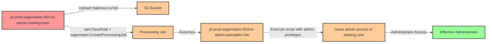

# Privilege Escalation via iam:PassRole + sagemaker:CreateProcessingJob

* **Category:** Privilege Escalation
* **Sub-Category:** new-passrole
* **Path Type:** one-hop
* **Target:** to-admin
* **Environments:** prod
* **Cost Estimate:** $0/mo
* **Pathfinding.cloud ID:** sagemaker-003
* **Technique:** User with PassRole and CreateProcessingJob can create processing job with malicious script and admin role to execute code with elevated privileges
* **Terraform Variable:** `enable_single_account_privesc_one_hop_to_admin_sagemaker_003_iam_passrole_sagemaker_createprocessingjob`
* **Schema Version:** 1.0.0
* **Attack Path:** starting_user → (upload malicious script to S3) → (PassRole + CreateProcessingJob) → processing job executes with admin role → script grants admin access to starting user → admin access
* **Attack Principals:** `arn:aws:iam::{account_id}:user/pl-prod-sagemaker-003-to-admin-starting-user`; `arn:aws:iam::{account_id}:role/pl-prod-sagemaker-003-to-admin-passable-role`; `arn:aws:s3:::pl-prod-sagemaker-003-to-admin-bucket-{account_id}-{suffix}`; `arn:aws:sagemaker:{region}:{account_id}:processing-job/pl-prod-sagemaker-003-to-admin-processing-job`
* **Required Permissions:** `iam:PassRole` on `arn:aws:iam::*:role/pl-prod-sagemaker-003-to-admin-passable-role`; `sagemaker:CreateProcessingJob` on `*`; `s3:PutObject` on `arn:aws:s3:::pl-prod-sagemaker-003-to-admin-bucket-*/*`; `s3:GetObject` on `arn:aws:s3:::pl-prod-sagemaker-003-to-admin-bucket-*/*`
* **Helpful Permissions:** `iam:ListRoles` (Discover available privileged roles to pass); `iam:GetRole` (Verify role has administrative permissions); `sagemaker:DescribeProcessingJob` (Monitor processing job status and execution); `s3:ListBucket` (Verify S3 bucket access and list contents)
* **MITRE Tactics:** TA0004 - Privilege Escalation, TA0002 - Execution
* **MITRE Techniques:** T1078.004 - Valid Accounts: Cloud Accounts, T1098.001 - Account Manipulation: Additional Cloud Credentials

## Attack Overview

This scenario demonstrates a critical privilege escalation vulnerability where a user with `iam:PassRole` and `sagemaker:CreateProcessingJob` permissions can execute arbitrary code with administrative privileges. Amazon SageMaker Processing Jobs are designed for data processing and ML feature engineering tasks, but they can be exploited to run malicious code when combined with an overly permissive execution role.

The attack works by uploading a malicious processing script to S3, then creating a SageMaker processing job that executes this script with an admin-level IAM role. The processing job runs in a container environment with the passed role's permissions, allowing the attacker to execute any AWS API calls with administrative access. This could include creating new access keys for the original user, modifying IAM policies, accessing sensitive data, or pivoting to other resources.

This technique was discovered by Spencer Gietzen of Rhino Security Labs in 2019 and represents a common pattern in cloud privilege escalation: exploiting AWS service trust relationships to execute code with elevated permissions. Unlike direct IAM permission modification, this attack leverages a legitimate AWS service (SageMaker) as an execution platform, making it potentially harder to detect. The attack is particularly dangerous because SageMaker processing jobs have broad network access and can run arbitrary code in Python, making them ideal vehicles for post-exploitation activities.

### MITRE ATT&CK Mapping

- **Tactic**: TA0004 - Privilege Escalation, TA0002 - Execution
- **Technique**: T1078.004 - Valid Accounts: Cloud Accounts
- **Sub-technique**: T1098.001 - Account Manipulation: Additional Cloud Credentials

### Principals in the attack path

- `arn:aws:iam::PROD_ACCOUNT:user/pl-prod-sagemaker-003-to-admin-starting-user` (Scenario-specific starting user with PassRole and CreateProcessingJob permissions)
- `arn:aws:iam::PROD_ACCOUNT:role/pl-prod-sagemaker-003-to-admin-passable-role` (Admin role that can be passed to SageMaker service)
- `arn:aws:s3:::pl-prod-sagemaker-003-to-admin-bucket-{ACCOUNT_ID}-{SUFFIX}` (S3 bucket for storing malicious processing script)
- `arn:aws:sagemaker:REGION:PROD_ACCOUNT:processing-job/pl-prod-sagemaker-003-to-admin-processing-job` (Processing job that executes with admin privileges)

### Attack Path Diagram



### Attack Steps

1. **Initial Access**: Start as `pl-prod-sagemaker-003-to-admin-starting-user` (credentials provided via Terraform outputs)
2. **Upload Malicious Script**: Create a Python script that uses boto3 to grant admin permissions to the starting user, then upload it to the S3 bucket
3. **Create Processing Job**: Use `sagemaker:CreateProcessingJob` to create a processing job that:
   - Uses the uploaded malicious script as its processing code
   - Passes the admin-privileged role using `iam:PassRole`
   - Executes on an ml.t3.medium instance
4. **Script Execution**: The processing job executes the malicious script with the admin role's permissions
5. **Grant Admin Access**: The script attaches AdministratorAccess policy to the starting user or creates access keys for an admin user
6. **Verification**: Verify administrator access by listing IAM users or performing other admin-level actions

### Scenario specific resources created

| ARN | Purpose |
| -- | -- |
| `arn:aws:iam::PROD_ACCOUNT:user/pl-prod-sagemaker-003-to-admin-starting-user` | Scenario-specific starting user with iam:PassRole and sagemaker:CreateProcessingJob permissions |
| `arn:aws:iam::PROD_ACCOUNT:role/pl-prod-sagemaker-003-to-admin-passable-role` | Admin role with AdministratorAccess that trusts sagemaker.amazonaws.com service |
| `arn:aws:s3:::pl-prod-sagemaker-003-to-admin-bucket-{ACCOUNT_ID}-{SUFFIX}` | S3 bucket for storing the malicious processing script and job outputs |

## Attack Lab

### Prerequisites

1. Install the `plabs` CLI:
   ```bash
   brew install pathfinding-labs/tap/plabs
   ```
2. Configure your AWS profiles in `~/.plabs/plabs.yaml` (or run `plabs init` if you haven't already)

### Deploy with plabs non-interactive

```bash
plabs enable enable_single_account_privesc_one_hop_to_admin_sagemaker_003_iam_passrole_sagemaker_createprocessingjob
plabs apply
```

### Deploy with plabs tui

1. Launch the TUI: `plabs`
2. Navigate to this scenario in the scenarios list
3. Press `space` to enable it
4. Press `d` to deploy

### Executing the automated demo_attack script

The script will:
1. Display a step-by-step walkthrough with color-coded output
2. Show the commands being executed and their results
3. Verify successful privilege escalation
4. Output standardized test results for automation

#### Resources created by attack script

- SageMaker processing job that executes the malicious script
- Inline policy or AdministratorAccess attachment on the starting user (granting admin access)
- Temporary access keys created for the starting user (if that escalation path is used)

#### With plabs non-interactive

```bash
plabs demo --list
plabs demo sagemaker-003-iam-passrole+sagemaker-createprocessingjob
```

#### With plabs tui

1. Launch the TUI: `plabs`
2. Navigate to this scenario in the scenarios list
3. Press `r` to run the demo script

### Cleanup

#### With plabs non-interactive

```bash
plabs cleanup --list
plabs cleanup sagemaker-003-iam-passrole+sagemaker-createprocessingjob
```

#### With plabs tui

1. Launch the TUI: `plabs`
2. Navigate to this scenario in the scenarios list
3. Press `c` to run the cleanup script

### Teardown with plabs non-interactive

```bash
plabs disable enable_single_account_privesc_one_hop_to_admin_sagemaker_003_iam_passrole_sagemaker_createprocessingjob
plabs apply
```

### Teardown with plabs tui

1. Launch the TUI: `plabs`
2. Navigate to this scenario in the scenarios list
3. Press `space` to disable it
4. Press `D` to destroy

## Detecting Misconfiguration (CSPM)

### What CSPM tools should detect

- IAM user has `iam:PassRole` permission granting the ability to pass a role with administrative privileges to SageMaker
- IAM user has `sagemaker:CreateProcessingJob` permission combined with `iam:PassRole`, creating a privilege escalation path
- Role `pl-prod-sagemaker-003-to-admin-passable-role` has `AdministratorAccess` and trusts `sagemaker.amazonaws.com`, making it passable for unrestricted code execution
- Privilege escalation path exists: starting user can execute arbitrary code with admin-level permissions via SageMaker processing jobs

### Prevention recommendations

- Implement least privilege principles - avoid granting `iam:PassRole` and `sagemaker:CreateProcessingJob` together unless absolutely necessary for legitimate ML workflows
- Use resource-based conditions on `iam:PassRole` to restrict which roles can be passed: `"Condition": {"StringEquals": {"iam:PassedToService": "sagemaker.amazonaws.com"}}`
- Add condition keys to prevent passing highly privileged roles: `"Condition": {"StringNotLike": {"iam:PassedToService": "*admin*"}}`
- Implement Service Control Policies (SCPs) at the organization level to restrict PassRole permissions on administrative roles
- Use IAM Access Analyzer to identify and remediate privilege escalation paths involving PassRole to SageMaker services
- Implement VPC configurations for SageMaker processing jobs to restrict network access and prevent data exfiltration
- Enable AWS Config rules to detect SageMaker processing jobs using overly permissive execution roles
- Audit existing SageMaker execution roles regularly to ensure they follow least privilege principles

## Detection Abuse (CloudSIEM)

### CloudTrail events to monitor

- `IAM: PassRole` — IAM role passed to SageMaker service; critical when the passed role has administrative permissions
- `SageMaker: CreateProcessingJob` — SageMaker processing job created; high severity when the execution role has elevated permissions
- `IAM: AttachUserPolicy` — Managed policy attached to IAM user; critical when the policy is AdministratorAccess
- `IAM: PutUserPolicy` — Inline policy added to IAM user; investigate if policy grants broad permissions
- `IAM: CreateAccessKey` — New access keys created for an IAM user; critical when the target has elevated permissions

### Detonation logs

_Detonation log integration (Stratus Red Team / Grimoire) is planned for a future release._
