# Privilege Escalation via SageMaker UpdateNotebook Lifecycle Config

* **Category:** Privilege Escalation
* **Sub-Category:** existing-passrole
* **Path Type:** one-hop
* **Target:** to-admin
* **Environments:** prod
* **Cost Estimate:** $37/mo
* **Pathfinding.cloud ID:** sagemaker-005
* **Technique:** User with SageMaker update permissions can inject malicious lifecycle config into existing notebook to execute code with notebook's admin role
* **Terraform Variable:** `enable_single_account_privesc_one_hop_to_admin_sagemaker_005_sagemaker_updatenotebook_lifecycle_config`
* **Schema Version:** 1.0.0
* **Attack Path:** starting_user → (StopNotebookInstance) → notebook → (CreateLifecycleConfig + UpdateNotebookInstance + StartNotebookInstance) → lifecycle script executes with notebook's admin role → admin access
* **Attack Principals:** `arn:aws:iam::{account_id}:user/pl-prod-sagemaker-005-to-admin-starting-user`; `arn:aws:sagemaker:{region}:{account_id}:notebook-instance/pl-prod-sagemaker-005-to-admin-notebook`; `arn:aws:iam::{account_id}:role/pl-prod-sagemaker-005-to-admin-notebook-role`
* **Required Permissions:** `sagemaker:CreateNotebookInstanceLifecycleConfig` on `*`; `sagemaker:StopNotebookInstance` on `arn:aws:sagemaker:*:*:notebook-instance/pl-prod-sagemaker-005-to-admin-notebook`; `sagemaker:UpdateNotebookInstance` on `arn:aws:sagemaker:*:*:notebook-instance/pl-prod-sagemaker-005-to-admin-notebook`; `sagemaker:StartNotebookInstance` on `arn:aws:sagemaker:*:*:notebook-instance/pl-prod-sagemaker-005-to-admin-notebook`
* **Helpful Permissions:** `sagemaker:DescribeNotebookInstance` (View notebook details, status, and attached execution role); `sagemaker:ListNotebookInstances` (Discover available notebook instances to target); `iam:GetRole` (Verify the notebook's execution role has admin permissions)
* **MITRE Tactics:** TA0004 - Privilege Escalation, TA0002 - Execution
* **MITRE Techniques:** T1078.004 - Valid Accounts: Cloud Accounts, T1525 - Implant Internal Image

## Attack Overview

This scenario demonstrates a sophisticated privilege escalation vulnerability where a user with SageMaker notebook management permissions can inject malicious code into an existing notebook instance that executes with highly privileged credentials. SageMaker notebook instances run with IAM execution roles, and lifecycle configurations allow administrators to specify scripts that run automatically when the notebook starts or is created. Critically, these lifecycle scripts execute with the notebook's execution role credentials, not the credentials of the user who modified the configuration.

When a notebook instance is configured with an administrative execution role (a common practice to allow data scientists broad access to AWS services), an attacker with permissions to update the notebook's lifecycle configuration can inject arbitrary code that will execute with those admin privileges. The attack involves stopping the notebook, creating a malicious lifecycle configuration, attaching it to the notebook, and starting the notebook again. Upon startup, the lifecycle script automatically executes with the notebook's admin role credentials, allowing the attacker to grant themselves administrative access or perform any other privileged operations.

This privilege escalation path is particularly dangerous because it's a legitimate SageMaker feature being abused for malicious purposes. Organizations often grant SageMaker update permissions broadly to data science teams without realizing that these permissions, combined with privileged notebook execution roles, create a direct path to administrative access. The attack leaves minimal forensic evidence in standard CloudTrail logs, as the malicious actions appear to be performed by the notebook's execution role rather than the attacker's user account.

This scenario is based on research published by Plerion: [Privilege Escalation with SageMaker and Execution Roles](https://www.plerion.com/blog/privilege-escalation-with-sagemaker-and-execution-roles)

### MITRE ATT&CK Mapping

- **Tactics**: TA0004 - Privilege Escalation, TA0002 - Execution
- **Techniques**:
  - T1078.004 - Valid Accounts: Cloud Accounts
  - T1525 - Implant Internal Image (lifecycle config acts as an implant mechanism)

### Principals in the attack path

- `arn:aws:iam::PROD_ACCOUNT:user/pl-prod-sagemaker-005-to-admin-starting-user` (Scenario-specific starting user with SageMaker update permissions)
- `arn:aws:sagemaker:REGION:PROD_ACCOUNT:notebook-instance/pl-prod-sagemaker-005-to-admin-notebook` (Existing SageMaker notebook instance)
- `arn:aws:iam::PROD_ACCOUNT:role/pl-prod-sagemaker-005-to-admin-notebook-role` (Notebook execution role with AdministratorAccess)

### Attack Path Diagram

```mermaid
graph LR
    A[pl-prod-sagemaker-005-to-admin-starting-user] -->|sagemaker:StopNotebookInstance| B[pl-prod-sagemaker-005-to-admin-notebook]
    B -->|sagemaker:CreateLifecycleConfig| C[Malicious Lifecycle Config]
    C -->|sagemaker:UpdateNotebookInstance| D[Updated Notebook]
    D -->|sagemaker:StartNotebookInstance| E[Lifecycle Script Execution]
    E -->|Executes with| F[pl-prod-sagemaker-005-to-admin-notebook-role]
    F -->|Administrator Access| G[Grants Admin to Starting User]
    G -->|Effective Administrator| H[Starting User has Admin]

    style A fill:#ff9999,stroke:#333,stroke-width:2px
    style B fill:#ffcc99,stroke:#333,stroke-width:2px
    style C fill:#ffcc99,stroke:#333,stroke-width:2px
    style D fill:#ffcc99,stroke:#333,stroke-width:2px
    style E fill:#ffcc99,stroke:#333,stroke-width:2px
    style F fill:#ffcc99,stroke:#333,stroke-width:2px
    style G fill:#ffcc99,stroke:#333,stroke-width:2px
    style H fill:#99ff99,stroke:#333,stroke-width:2px
```



### Attack Steps

1. **Initial Access**: Start as `pl-prod-sagemaker-005-to-admin-starting-user` (credentials provided via Terraform outputs)
2. **Stop Notebook**: Use `sagemaker:StopNotebookInstance` to stop the existing notebook instance (lifecycle configs can only be changed when notebook is stopped)
3. **Create Malicious Lifecycle Config**: Use `sagemaker:CreateNotebookInstanceLifecycleConfig` to create a lifecycle configuration containing a bash script that grants AdministratorAccess to the starting user
4. **Update Notebook**: Use `sagemaker:UpdateNotebookInstance` to attach the malicious lifecycle configuration to the notebook
5. **Start Notebook**: Use `sagemaker:StartNotebookInstance` to start the notebook, triggering the lifecycle script execution
6. **Automatic Execution**: The lifecycle script runs automatically with the notebook's execution role credentials (admin permissions)
7. **Privilege Grant**: The script attaches AdministratorAccess policy to the starting user
8. **Verification**: Verify administrator access by listing IAM users or performing other admin-level actions

### Scenario specific resources created

| ARN | Purpose |
| -- | -- |
| `arn:aws:iam::PROD_ACCOUNT:user/pl-prod-sagemaker-005-to-admin-starting-user` | Scenario-specific starting user with access keys and SageMaker management permissions |
| `arn:aws:sagemaker:REGION:PROD_ACCOUNT:notebook-instance/pl-prod-sagemaker-005-to-admin-notebook` | SageMaker notebook instance running ml.t3.medium with admin execution role |
| `arn:aws:iam::PROD_ACCOUNT:role/pl-prod-sagemaker-005-to-admin-notebook-role` | Notebook execution role with AdministratorAccess policy attached |

## Attack Lab

### Prerequisites

1. Install the `plabs` CLI:
   ```bash
   brew install pathfinding-labs/tap/plabs
   ```
2. Configure your AWS profiles in `~/.plabs/plabs.yaml` (or run `plabs init` if you haven't already)

### Deploy with plabs non-interactive

```bash
plabs enable enable_single_account_privesc_one_hop_to_admin_sagemaker_005_sagemaker_updatenotebook_lifecycle_config
plabs apply
```

### Deploy with plabs tui

1. Launch the TUI: `plabs`
2. Navigate to this scenario in the scenarios list
3. Press `space` to enable it
4. Press `d` to deploy

### Executing the automated demo_attack script

The script will:
1. Display a step-by-step walkthrough with color-coded output
2. Show the commands being executed and their results
3. Stop the notebook instance and wait for it to stop
4. Create a malicious lifecycle configuration with a privilege escalation script
5. Update the notebook to use the malicious lifecycle configuration
6. Start the notebook and wait for the lifecycle script to execute
7. Verify successful privilege escalation to administrator access
8. Output standardized test results for automation

**Note**: The demo includes wait times for the notebook to stop (~5 minutes) and start (~5-7 minutes), as SageMaker notebook state transitions take several minutes to complete.

#### Resources created by attack script

- Malicious SageMaker notebook lifecycle configuration (`AdministratorAccess` policy attachment script)
- `AdministratorAccess` managed policy attached to `pl-prod-sagemaker-005-to-admin-starting-user`

#### With plabs non-interactive

```bash
plabs demo --list
plabs demo sagemaker-005-sagemaker-updatenotebook-lifecycle-config
```

#### With plabs tui

1. Launch the TUI: `plabs`
2. Navigate to this scenario in the scenarios list
3. Press `r` to run the demo script

### Cleanup

#### With plabs non-interactive

```bash
plabs cleanup --list
plabs cleanup sagemaker-005-sagemaker-updatenotebook-lifecycle-config
```

#### With plabs tui

1. Launch the TUI: `plabs`
2. Navigate to this scenario in the scenarios list
3. Press `c` to run the cleanup script

### Teardown with plabs non-interactive

```bash
plabs disable enable_single_account_privesc_one_hop_to_admin_sagemaker_005_sagemaker_updatenotebook_lifecycle_config
plabs apply
```

### Teardown with plabs tui

1. Launch the TUI: `plabs`
2. Navigate to this scenario in the scenarios list
3. Press `space` to disable it
4. Press `D` to destroy

## Detecting Misconfiguration (CSPM)

### What CSPM tools should detect

A properly configured Cloud Security Posture Management (CSPM) tool should identify:

- **High-Risk Execution Roles**: SageMaker notebook instances configured with highly privileged execution roles (especially AdministratorAccess or similar broad permissions)
- **Broad SageMaker Permissions**: IAM principals with permissions to update notebook instance configurations, particularly when combined with CreateLifecycleConfig permissions
- **Lifecycle Configuration Changes**: Changes to notebook instance lifecycle configurations, especially when performed by non-administrative users
- **Privilege Escalation Path**: Direct privilege escalation path from SageMaker update permissions to administrative access through notebook execution roles
- **Overprivileged ML Infrastructure**: Machine learning infrastructure components running with permissions exceeding their operational requirements

### Prevention recommendations

- **Principle of Least Privilege for Execution Roles**: Never grant SageMaker notebook execution roles administrative access. Scope execution roles to only the specific S3 buckets, data sources, and AWS services required for data science workloads
- **Restrict SageMaker Management Permissions**: Limit `sagemaker:UpdateNotebookInstance` and `sagemaker:CreateNotebookInstanceLifecycleConfig` permissions to infrastructure administrators only, not data science users
- **Implement Resource-Based Conditions**: Use IAM condition keys to restrict lifecycle configuration changes: `"Condition": {"StringNotLike": {"sagemaker:LifecycleConfigName": ["approved-config-*"]}}`
- **Require Approval Workflows**: Implement approval workflows for notebook configuration changes using AWS Service Catalog or custom automation
- **Use SCPs for Guardrails**: Implement Service Control Policies to prevent creation of SageMaker execution roles with administrative permissions
- **Enable IMDSv2**: Configure notebook instances to require IMDSv2 to add an additional layer of credential security
- **Audit Existing Notebooks**: Regularly audit all SageMaker notebook instances for overprivileged execution roles and unnecessary lifecycle configurations
- **Segregate Permissions**: Use separate IAM roles for notebook creation (infrastructure team) and notebook usage (data science team)

## Detection Abuse (CloudSIEM)

### CloudTrail events to monitor

- `SageMaker: StopNotebookInstance` — Notebook instance stopped; when followed by lifecycle config changes, indicates potential injection setup
- `SageMaker: CreateNotebookInstanceLifecycleConfig` — New lifecycle configuration created; high severity when performed by non-infrastructure users
- `SageMaker: UpdateNotebookInstance` — Notebook instance configuration modified; critical when lifecycle config attachment is changed
- `SageMaker: StartNotebookInstance` — Notebook instance started; the lifecycle script executes here with the notebook's execution role credentials
- `IAM: AttachUserPolicy` — Policy attached to a user; watch for AdministratorAccess attachments originating from a SageMaker execution role

Monitor for the specific API call sequence: `StopNotebookInstance` → `CreateNotebookInstanceLifecycleConfig` → `UpdateNotebookInstance` → `StartNotebookInstance` as this pattern indicates potential exploitation.

### Detonation logs

_Detonation log integration (Stratus Red Team / Grimoire) is planned for a future release._

