# Privilege Escalation via sagemaker:CreatePresignedNotebookInstanceUrl

**Category:** Privilege Escalation
**Sub-Category:** access-resource
**Path Type:** one-hop
**Target:** to-admin
**Environments:** prod
**Pathfinding.cloud ID:** sagemaker-004
**Technique:** Generate presigned URL to access existing SageMaker notebook with admin execution role

## Overview

This scenario demonstrates a privilege escalation vulnerability where a user with only the `sagemaker:CreatePresignedNotebookInstanceUrl` permission can gain administrative access by generating a presigned URL to an existing SageMaker notebook instance that has an admin execution role attached. Once the attacker accesses the Jupyter notebook interface through the presigned URL, they can open a terminal session and execute AWS CLI commands with the permissions of the notebook's execution role.

Unlike the `sagemaker:CreateNotebookInstance` privilege escalation path (which requires creating new infrastructure and `iam:PassRole`), this technique exploits access to existing resources. This makes it particularly dangerous in environments where SageMaker notebooks are already deployed for legitimate machine learning workflows, as security teams may overlook the risk of URL generation permissions. The attack is stealthier because it leaves no new infrastructure in CloudTrail logs—only URL generation and subsequent API calls from the notebook's role.

This technique was originally documented by Spencer Gietzen from Rhino Security Labs in 2019 and represents a common misconfiguration where data scientists are granted broad SageMaker permissions without understanding the privilege escalation implications.

## Understanding the attack scenario

### Principals in the attack path

- `arn:aws:iam::PROD_ACCOUNT:user/pl-prod-cpnu-to-admin-starting-user` (Scenario-specific starting user)
- `arn:aws:sagemaker:us-east-1:PROD_ACCOUNT:notebook-instance/pl-prod-cpnu-to-admin-notebook` (Pre-existing SageMaker notebook instance)
- `arn:aws:iam::PROD_ACCOUNT:role/pl-prod-cpnu-to-admin-notebook-role` (Admin execution role attached to the notebook)

### Attack Path Diagram

```mermaid
graph LR
    A[pl-prod-cpnu-to-admin-starting-user] -->|sagemaker:CreatePresignedNotebookInstanceUrl| B[Presigned URL]
    B -->|Access Jupyter Interface| C[pl-prod-cpnu-to-admin-notebook]
    C -->|Assumes Execution Role| D[pl-prod-cpnu-to-admin-notebook-role]
    D -->|Administrator Access| E[Effective Administrator]

    style A fill:#ff9999,stroke:#333,stroke-width:2px
    style B fill:#ffcc99,stroke:#333,stroke-width:2px
    style C fill:#ffcc99,stroke:#333,stroke-width:2px
    style D fill:#ffcc99,stroke:#333,stroke-width:2px
    style E fill:#99ff99,stroke:#333,stroke-width:2px
```



### Attack Steps

1. **Initial Access**: Start as `pl-prod-cpnu-to-admin-starting-user` (credentials provided via Terraform outputs)
2. **Generate Presigned URL**: Use `sagemaker:CreatePresignedNotebookInstanceUrl` to generate a presigned URL for the existing notebook instance
3. **Access Jupyter Interface**: Open the presigned URL in a web browser to access the Jupyter notebook interface
4. **Open Terminal**: Within Jupyter, open a new terminal session which runs with the notebook's execution role permissions
5. **Execute Commands**: Run AWS CLI commands in the terminal with the admin role's permissions
6. **Verification**: Verify administrative access by listing IAM users or performing other admin operations

### Scenario specific resources created

| ARN | Purpose |
| -- | -- |
| `arn:aws:iam::PROD_ACCOUNT:user/pl-prod-cpnu-to-admin-starting-user` | Scenario-specific starting user with access keys |
| `arn:aws:iam::PROD_ACCOUNT:policy/pl-prod-cpnu-to-admin-starting-policy` | Policy granting CreatePresignedNotebookInstanceUrl permission |
| `arn:aws:sagemaker:us-east-1:PROD_ACCOUNT:notebook-instance/pl-prod-cpnu-to-admin-notebook` | Pre-existing SageMaker notebook instance with admin role |
| `arn:aws:iam::PROD_ACCOUNT:role/pl-prod-cpnu-to-admin-notebook-role` | Admin execution role attached to the notebook instance |

## Executing the attack

### Using the automated demo_attack.sh

To demonstrate the privilege escalation path, run the provided demo script:

```bash
cd modules/scenarios/single-account/privesc-one-hop/to-admin/sagemaker-createpresignednotebookinstanceurl
./demo_attack.sh
```

The script will:
1. Display a step-by-step walkthrough with color-coded output
2. Show the commands being executed and their results
3. Generate a presigned URL for accessing the notebook
4. Provide instructions for manual browser-based access to the Jupyter interface
5. Demonstrate AWS CLI commands that can be executed from the terminal
6. Verify successful privilege escalation
7. Output standardized test results for automation

**Note**: Due to the browser-based nature of this attack, the demo script will generate the presigned URL and provide instructions, but the actual Jupyter terminal access must be performed manually in a web browser.

### Cleaning up the attack artifacts

This scenario does not create any persistent attack artifacts that need cleanup. The presigned URL expires after a short period (default 5 minutes), and no resources are modified during the demonstration. The SageMaker notebook instance remains in its original state.

If you wish to verify cleanup:

```bash
cd modules/scenarios/single-account/privesc-one-hop/to-admin/sagemaker-createpresignednotebookinstanceurl
./cleanup_attack.sh
```

This will confirm that no cleanup is necessary for this scenario.

## Detection and prevention

### What should CSPM tools detect?

A properly configured Cloud Security Posture Management (CSPM) tool should identify:

1. **Overly Permissive SageMaker Permissions**: Users or roles with `sagemaker:CreatePresignedNotebookInstanceUrl` on notebook instances with privileged execution roles
2. **Admin Roles on SageMaker Resources**: SageMaker notebook instances with execution roles that have administrative permissions
3. **Privilege Escalation Path**: A complete path from a low-privileged user to admin access via SageMaker notebook URL generation
4. **Missing Resource-Based Conditions**: SageMaker permissions without proper resource restrictions or condition keys
5. **Separation of Duties Violation**: Same principals that can generate presigned URLs having access to notebooks with privileged roles

### MITRE ATT&CK Mapping

- **Tactic**: Privilege Escalation (TA0004), Execution (TA0002)
- **Technique**: T1078.004 - Valid Accounts: Cloud Accounts
- **Technique**: T1552 - Unsecured Credentials

## Prevention recommendations

1. **Restrict CreatePresignedNotebookInstanceUrl Permission**: Limit `sagemaker:CreatePresignedNotebookInstanceUrl` to only specific notebook instances that don't have privileged execution roles. Use resource-level permissions:
   ```json
   {
     "Effect": "Allow",
     "Action": "sagemaker:CreatePresignedNotebookInstanceUrl",
     "Resource": "arn:aws:sagemaker:*:*:notebook-instance/non-privileged-*",
     "Condition": {
       "StringEquals": {
         "aws:RequestedRegion": ["us-east-1"]
       }
     }
   }
   ```

2. **Implement Least Privilege for Notebook Execution Roles**: SageMaker notebook instances should use execution roles with minimal permissions required for their specific machine learning tasks. Avoid attaching `AdministratorAccess` or overly broad IAM policies:
   ```json
   {
     "Effect": "Allow",
     "Action": [
       "s3:GetObject",
       "s3:PutObject"
     ],
     "Resource": "arn:aws:s3:::ml-training-data-bucket/*"
   }
   ```

3. **Use Resource Tags and Condition Keys**: Tag SageMaker notebooks by sensitivity level and use IAM conditions to prevent presigned URL generation for high-privilege notebooks:
   ```json
   {
     "Effect": "Deny",
     "Action": "sagemaker:CreatePresignedNotebookInstanceUrl",
     "Resource": "*",
     "Condition": {
       "StringEquals": {
         "aws:ResourceTag/PrivilegeLevel": "high"
       }
     }
   }
   ```

4. **Enable CloudTrail Monitoring**: Monitor for `CreatePresignedNotebookInstanceUrl` API calls, especially from unexpected users or at unusual times. Set up CloudWatch alarms for this event:
   ```json
   {
     "eventName": "CreatePresignedNotebookInstanceUrl",
     "errorCode": null
   }
   ```

5. **Implement Network Isolation**: Use VPC-only SageMaker notebook instances with private subnets and restrict access through security groups. This prevents external attackers from accessing presigned URLs even if they obtain them.

6. **Use Service Control Policies (SCPs)**: At the AWS Organizations level, restrict SageMaker notebook creation and access in production accounts, or require MFA for presigned URL generation:
   ```json
   {
     "Effect": "Deny",
     "Action": "sagemaker:CreatePresignedNotebookInstanceUrl",
     "Resource": "*",
     "Condition": {
       "BoolIfExists": {
         "aws:MultiFactorAuthPresent": "false"
       }
     }
   }
   ```

7. **Regular Access Reviews**: Conduct periodic reviews of who has SageMaker permissions and which notebook instances have privileged execution roles. Use IAM Access Analyzer to identify cross-account or external access risks.

8. **Disable Direct Internet Access**: Configure SageMaker notebooks with `DirectInternetAccess: Disabled` to prevent outbound internet connections from the notebook, limiting the attacker's ability to exfiltrate data or credentials.
