# Privilege Escalation via SageMaker UpdateNotebook Lifecycle Config

**Category:** Privilege Escalation
**Sub-Category:** access-resource
**Path Type:** one-hop
**Target:** to-admin
**Environments:** prod
**Technique:** Injecting malicious lifecycle configuration into existing SageMaker notebook to execute code with notebook's admin role

## Overview

This scenario demonstrates a sophisticated privilege escalation vulnerability where a user with SageMaker notebook management permissions can inject malicious code into an existing notebook instance that executes with highly privileged credentials. SageMaker notebook instances run with IAM execution roles, and lifecycle configurations allow administrators to specify scripts that run automatically when the notebook starts or is created. Critically, these lifecycle scripts execute with the notebook's execution role credentials, not the credentials of the user who modified the configuration.

When a notebook instance is configured with an administrative execution role (a common practice to allow data scientists broad access to AWS services), an attacker with permissions to update the notebook's lifecycle configuration can inject arbitrary code that will execute with those admin privileges. The attack involves stopping the notebook, creating a malicious lifecycle configuration, attaching it to the notebook, and starting the notebook again. Upon startup, the lifecycle script automatically executes with the notebook's admin role credentials, allowing the attacker to grant themselves administrative access or perform any other privileged operations.

This privilege escalation path is particularly dangerous because it's a legitimate SageMaker feature being abused for malicious purposes. Organizations often grant SageMaker update permissions broadly to data science teams without realizing that these permissions, combined with privileged notebook execution roles, create a direct path to administrative access. The attack leaves minimal forensic evidence in standard CloudTrail logs, as the malicious actions appear to be performed by the notebook's execution role rather than the attacker's user account.

This scenario is based on research published by Plerion: [Privilege Escalation with SageMaker and Execution Roles](https://www.plerion.com/blog/privilege-escalation-with-sagemaker-and-execution-roles)

## Understanding the attack scenario

### Principals in the attack path

- `arn:aws:iam::PROD_ACCOUNT:user/pl-prod-sulc-to-admin-starting-user` (Scenario-specific starting user with SageMaker update permissions)
- `arn:aws:sagemaker:REGION:PROD_ACCOUNT:notebook-instance/pl-prod-sulc-to-admin-notebook` (Existing SageMaker notebook instance)
- `arn:aws:iam::PROD_ACCOUNT:role/pl-prod-sulc-to-admin-notebook-role` (Notebook execution role with AdministratorAccess)

### Attack Path Diagram

```mermaid
graph LR
    A[pl-prod-sulc-to-admin-starting-user] -->|sagemaker:StopNotebookInstance| B[pl-prod-sulc-to-admin-notebook]
    B -->|sagemaker:CreateLifecycleConfig| C[Malicious Lifecycle Config]
    C -->|sagemaker:UpdateNotebookInstance| D[Updated Notebook]
    D -->|sagemaker:StartNotebookInstance| E[Lifecycle Script Execution]
    E -->|Executes with| F[pl-prod-sulc-to-admin-notebook-role]
    F -->|Administrator Access| G[Grants Admin to Starting User]
    G -->|Effective Administrator| H[Starting User has Admin]

    style A fill:#ff9999,stroke:#333,stroke-width:2px
    style B fill:#ffcc99,stroke:#333,stroke-width:2px
    style C fill:#ffcc99,stroke:#333,stroke-width:2px
    style D fill:#ffcc99,stroke:#333,stroke-width:2px
    style E fill:#ffcc99,stroke:#333,stroke-width:2px
    style F fill:#ffcc99,stroke:#333,stroke-width:2px
    style G fill:#ffcc99,stroke:#333,stroke-width:2px
    style H fill:#99ff99,stroke:#333,stroke-width:2px
```



### Attack Steps

1. **Initial Access**: Start as `pl-prod-sulc-to-admin-starting-user` (credentials provided via Terraform outputs)
2. **Stop Notebook**: Use `sagemaker:StopNotebookInstance` to stop the existing notebook instance (lifecycle configs can only be changed when notebook is stopped)
3. **Create Malicious Lifecycle Config**: Use `sagemaker:CreateNotebookInstanceLifecycleConfig` to create a lifecycle configuration containing a bash script that grants AdministratorAccess to the starting user
4. **Update Notebook**: Use `sagemaker:UpdateNotebookInstance` to attach the malicious lifecycle configuration to the notebook
5. **Start Notebook**: Use `sagemaker:StartNotebookInstance` to start the notebook, triggering the lifecycle script execution
6. **Automatic Execution**: The lifecycle script runs automatically with the notebook's execution role credentials (admin permissions)
7. **Privilege Grant**: The script attaches AdministratorAccess policy to the starting user
8. **Verification**: Verify administrator access by listing IAM users or performing other admin-level actions

### Scenario specific resources created

| ARN | Purpose |
| -- | -- |
| `arn:aws:iam::PROD_ACCOUNT:user/pl-prod-sulc-to-admin-starting-user` | Scenario-specific starting user with access keys and SageMaker management permissions |
| `arn:aws:sagemaker:REGION:PROD_ACCOUNT:notebook-instance/pl-prod-sulc-to-admin-notebook` | SageMaker notebook instance running ml.t3.medium with admin execution role |
| `arn:aws:iam::PROD_ACCOUNT:role/pl-prod-sulc-to-admin-notebook-role` | Notebook execution role with AdministratorAccess policy attached |

## Executing the attack

### Using the automated demo_attack.sh

To demonstrate the privilege escalation path, run the provided demo script:

```bash
cd modules/scenarios/single-account/privesc-one-hop/to-admin/sagemaker-updatenotebook-lifecycle-config
./demo_attack.sh
```

The script will:
1. Display a step-by-step walkthrough with color-coded output
2. Show the commands being executed and their results
3. Stop the notebook instance and wait for it to stop
4. Create a malicious lifecycle configuration with a privilege escalation script
5. Update the notebook to use the malicious lifecycle configuration
6. Start the notebook and wait for the lifecycle script to execute
7. Verify successful privilege escalation to administrator access
8. Output standardized test results for automation

**Note**: The demo includes wait times for the notebook to stop (~5 minutes) and start (~5-7 minutes), as SageMaker notebook state transitions take several minutes to complete.

### Cleaning up the attack artifacts

After demonstrating the attack, clean up the malicious lifecycle configuration and revoke the admin permissions granted during the demo:

```bash
cd modules/scenarios/single-account/privesc-one-hop/to-admin/sagemaker-updatenotebook-lifecycle-config
./cleanup_attack.sh
```

The cleanup script will:
- Remove the AdministratorAccess policy from the starting user
- Stop the notebook instance
- Remove the malicious lifecycle configuration from the notebook
- Delete the malicious lifecycle configuration
- Restore the notebook to its original state (without lifecycle config)
- Restart the notebook

## Detection and prevention

### What CSPM Tools Should Detect

A properly configured Cloud Security Posture Management (CSPM) tool should identify:

- **High-Risk Execution Roles**: SageMaker notebook instances configured with highly privileged execution roles (especially AdministratorAccess or similar broad permissions)
- **Broad SageMaker Permissions**: IAM principals with permissions to update notebook instance configurations, particularly when combined with CreateLifecycleConfig permissions
- **Lifecycle Configuration Changes**: Changes to notebook instance lifecycle configurations, especially when performed by non-administrative users
- **Privilege Escalation Path**: Direct privilege escalation path from SageMaker update permissions to administrative access through notebook execution roles
- **Overprivileged ML Infrastructure**: Machine learning infrastructure components running with permissions exceeding their operational requirements

### MITRE ATT&CK Mapping

- **Tactics**: TA0004 - Privilege Escalation, TA0002 - Execution
- **Techniques**:
  - T1078.004 - Valid Accounts: Cloud Accounts
  - T1525 - Implant Internal Image (lifecycle config acts as an implant mechanism)

## Prevention recommendations

- **Principle of Least Privilege for Execution Roles**: Never grant SageMaker notebook execution roles administrative access. Scope execution roles to only the specific S3 buckets, data sources, and AWS services required for data science workloads
- **Restrict SageMaker Management Permissions**: Limit `sagemaker:UpdateNotebookInstance` and `sagemaker:CreateNotebookInstanceLifecycleConfig` permissions to infrastructure administrators only, not data science users
- **Implement Resource-Based Conditions**: Use IAM condition keys to restrict lifecycle configuration changes: `"Condition": {"StringNotLike": {"sagemaker:LifecycleConfigName": ["approved-config-*"]}}`
- **Require Approval Workflows**: Implement approval workflows for notebook configuration changes using AWS Service Catalog or custom automation
- **Monitor Lifecycle Configuration Changes**: Create CloudWatch alarms for `CreateNotebookInstanceLifecycleConfig` and `UpdateNotebookInstance` API calls, especially when performed outside of normal change windows
- **Use SCPs for Guardrails**: Implement Service Control Policies to prevent creation of SageMaker execution roles with administrative permissions
- **Enable IMDSv2**: Configure notebook instances to require IMDSv2 to add an additional layer of credential security
- **Audit Existing Notebooks**: Regularly audit all SageMaker notebook instances for overprivileged execution roles and unnecessary lifecycle configurations
- **Segregate Permissions**: Use separate IAM roles for notebook creation (infrastructure team) and notebook usage (data science team)
- **CloudTrail Monitoring**: Monitor for the specific API call sequence: StopNotebookInstance → CreateLifecycleConfig → UpdateNotebookInstance → StartNotebookInstance as this pattern indicates potential exploitation

## Cost considerations

This scenario creates a SageMaker notebook instance running on an `ml.t3.medium` instance type:

- **Hourly cost**: Approximately $0.07 per hour
- **Monthly cost**: Approximately $5 per month if left running 24/7
- **Cost optimization**: The notebook can be stopped when not in use to reduce costs to $0. Terraform will create the notebook in a `Stopped` state, which incurs no charges until started.

The demonstration script starts the notebook temporarily for testing and can stop it afterward to minimize costs.
