# One-Hop Privilege Escalation: ssm:StartSession to EC2 with Admin Role

* **Category:** Privilege Escalation
* **Sub-Category:** access-resource
* **Path Type:** one-hop
* **Target:** to-admin
* **Environments:** prod
* **Pathfinding.cloud ID:** ssm-001
* **Technique:** Start interactive session on EC2 instances with privileged roles to extract credentials via SSM StartSession

## Overview

This scenario demonstrates a privilege escalation vulnerability where an IAM user has permission to start interactive sessions on EC2 instances via AWS Systems Manager (SSM) Session Manager. The attacker can establish an interactive shell session on an EC2 instance that has an administrative IAM role attached, extract the temporary credentials from the EC2 instance metadata service (IMDS), and then use those credentials locally to gain full administrator access.

This attack vector is particularly dangerous because SSM Session Manager provides SSH-like access through the AWS API without requiring any network connectivity, open SSH ports, or SSH keys. The access is completely API-driven, making it attractive for attackers and often granted broadly across engineering teams for legitimate troubleshooting purposes. Unlike traditional SSH, SSM sessions can be initiated from anywhere with valid AWS credentials, bypassing traditional network security controls like security groups and NACLs.

The attack leaves minimal forensic evidence if SSM Session Manager logging is not properly configured, and the extracted credentials are time-limited but fully functional AWS credentials that can be used from any location to perform any action the instance role permits.

## Understanding the attack scenario

### Principals in the attack path

- `arn:aws:iam::PROD_ACCOUNT:user/pl-prod-ssm-001-to-admin-starting-user` (Scenario-specific starting user)
- `arn:aws:ec2:REGION:PROD_ACCOUNT:instance/i-xxxxxxxxx` (EC2 instance with SSM agent)
- `arn:aws:iam::PROD_ACCOUNT:role/pl-prod-ssm-001-to-admin-ec2-role` (Administrative role attached to EC2 instance)

### Attack Path Diagram

```mermaid
graph LR
    A[pl-prod-ssm-001-to-admin-starting-user] -->|ssm:StartSession| B[EC2 Instance]
    B -->|Interactive Shell| C[Shell Access on Instance]
    C -->|curl IMDS| D[Extract Admin Role Credentials]
    D -->|Use Locally| E[Effective Administrator]

    style A fill:#ff9999,stroke:#333,stroke-width:2px
    style B fill:#ffcc99,stroke:#333,stroke-width:2px
    style C fill:#ffcc99,stroke:#333,stroke-width:2px
    style D fill:#ffcc99,stroke:#333,stroke-width:2px
    style E fill:#99ff99,stroke:#333,stroke-width:2px
```



### Attack Steps

1. **Initial Access**: Start as `pl-prod-ssm-001-to-admin-starting-user` (credentials provided via Terraform outputs)
2. **Discover Target Instances**: Use `ec2:DescribeInstances` to identify EC2 instances with privileged IAM roles
3. **Start Interactive Session**: Use `ssm:StartSession` to establish an interactive shell session on the target EC2 instance with the admin role attached
4. **Extract Credentials from IMDS**: Within the interactive session, query the instance metadata endpoint at `http://169.254.169.254/latest/meta-data/iam/security-credentials/ROLE_NAME` to retrieve temporary AWS credentials (access key, secret key, session token)
5. **Configure Local Credentials**: Export the extracted credentials as environment variables in your local shell or configure them in the AWS CLI
6. **Verification**: Verify administrator access by executing privileged AWS API calls (e.g., `iam:ListUsers`)

### Scenario specific resources created

| ARN | Purpose |
| -- | -- |
| `arn:aws:iam::PROD_ACCOUNT:user/pl-prod-ssm-001-to-admin-starting-user` | Scenario-specific starting user with access keys and SSM permissions |
| `arn:aws:iam::PROD_ACCOUNT:policy/pl-prod-ssm-001-to-admin-policy` | Allows `ssm:StartSession`, `ssm:TerminateSession`, `ssm:ResumeSession`, `ssm:DescribeInstanceInformation`, and `ec2:DescribeInstances` |
| `arn:aws:iam::PROD_ACCOUNT:role/pl-prod-ssm-001-to-admin-ec2-role` | Administrative role attached to the EC2 instance (target for credential extraction) |
| `arn:aws:iam::PROD_ACCOUNT:instance-profile/pl-prod-ssm-001-to-admin-ec2-profile` | Instance profile associating the admin role with the EC2 instance |
| `arn:aws:ec2:REGION:PROD_ACCOUNT:instance/i-xxxxxxxxx` | EC2 instance with SSM agent and admin role attached |

## Executing the attack

### Using the automated demo_attack.sh

To demonstrate the privilege escalation path, run the provided demo script:

```bash
cd modules/scenarios/single-account/privesc-one-hop/to-admin/ssm-001-ssm-startsession
./demo_attack.sh
```

The script will:
1. Display a step-by-step walkthrough with color-coded output
2. Show the commands being executed and their results
3. Verify successful privilege escalation
4. Output standardized test results for automation

### Cleaning up the attack artifacts

After demonstrating the attack, clean up the extracted credentials and any temporary files:

```bash
cd modules/scenarios/single-account/privesc-one-hop/to-admin/ssm-startsession
./cleanup_attack.sh
```

Note: The cleanup script removes temporary credential files and clears environment variables but does not terminate the EC2 instance, as that is managed by Terraform.

## Detection and prevention

### What CSPM tools should detect

A properly configured Cloud Security Posture Management (CSPM) tool should identify the following security issues:

1. **EC2 instances with overly privileged IAM roles**: Instances should follow the principle of least privilege. An EC2 instance with `AdministratorAccess` or similar broad permissions represents a significant risk, especially when combined with SSM access.

2. **Principals with ssm:StartSession on wildcard resources**: The ability to start interactive sessions on any EC2 instance in the account should be restricted to specific instances using resource ARNs or IAM condition keys.

3. **Lack of IAM condition keys restricting SSM access**: Policies should use conditions like `ssm:resourceTag/Environment` to limit which instances can be accessed via Session Manager.

4. **Missing AWS Systems Manager Session Manager logging**: SSM sessions should be logged to CloudWatch Logs or S3 for audit and forensic purposes. Interactive sessions can be particularly risky without proper logging.

5. **EC2 instances without IMDSv2 enforcement**: The Instance Metadata Service should be configured to require IMDSv2, which provides protection against SSRF attacks and makes metadata extraction more difficult. IMDSv2 requires session tokens before accessing metadata.

6. **Session Manager access without MFA requirements**: Sensitive operations like starting sessions on instances with privileged roles should require multi-factor authentication.

### CloudTrail detection patterns

Monitor for the following suspicious event patterns:

**Credential Extraction Pattern**:
```
1. ssm:StartSession (targeting instance with privileged role)
2. Extended session duration (may indicate manual credential extraction)
3. AWS API calls using instance role credentials from non-EC2 IP addresses
```

**Anomalous API Usage**:
- Instance role credentials being used from geographic locations inconsistent with the EC2 instance region
- High-volume API calls from instance role credentials outside normal usage patterns
- Instance role credentials used after the EC2 instance has been terminated
- Instance role credentials used simultaneously from both the EC2 instance and external locations

**Session Manager Abuse Indicators**:
- Multiple rapid `ssm:StartSession` attempts across different instances (reconnaissance)
- Sessions started outside normal business hours or by unusual principals
- Long-duration sessions on instances that typically don't require interactive access
- Sessions started on instances with administrative roles by non-administrative users

### MITRE ATT&CK Mapping

- **Tactic**: TA0004 - Privilege Escalation, TA0006 - Credential Access
- **Technique**: T1552.005 - Unsecured Credentials: Cloud Instance Metadata API
- **Technique**: T1078.004 - Valid Accounts: Cloud Accounts

## Prevention recommendations

- **Restrict ssm:StartSession with resource conditions**: Use IAM policy conditions to limit SSM session access to specific instances or instances with specific tags:
  ```json
  {
    "Effect": "Allow",
    "Action": "ssm:StartSession",
    "Resource": "arn:aws:ec2:*:*:instance/*",
    "Condition": {
      "StringEquals": {
        "ssm:resourceTag/Environment": "dev",
        "ssm:resourceTag/SSMAccess": "Allowed"
      }
    }
  }
  ```

- **Apply least privilege to EC2 instance roles**: EC2 instances should only have the minimum permissions necessary for their function. Avoid attaching `AdministratorAccess` or other broad policies to instance profiles. If an instance needs administrative access, consider using more granular permissions or temporary credential vending mechanisms.

- **Enforce IMDSv2 on all EC2 instances**: Require Instance Metadata Service Version 2 (IMDSv2), which uses session-based authentication and provides protection against SSRF attacks:
  ```bash
  aws ec2 modify-instance-metadata-options \
    --instance-id i-1234567890abcdef0 \
    --http-tokens required \
    --http-put-response-hop-limit 1
  ```

- **Enable SSM Session Manager logging**: Configure AWS Systems Manager to log all session activity to CloudWatch Logs or S3 for audit and forensic analysis. This is critical for detecting and investigating unauthorized access:
  ```json
  {
    "sessionLogging": {
      "cloudWatchLogGroupName": "/aws/ssm/session-logs",
      "cloudWatchEncryptionEnabled": true,
      "s3BucketName": "my-session-logs-bucket",
      "s3EncryptionEnabled": true
    }
  }
  ```

- **Require MFA for sensitive SSM operations**: Use IAM policy conditions to require multi-factor authentication for starting sessions on instances with privileged roles:
  ```json
  {
    "Effect": "Allow",
    "Action": "ssm:StartSession",
    "Resource": "arn:aws:ec2:*:*:instance/*",
    "Condition": {
      "BoolIfExists": {
        "aws:MultiFactorAuthPresent": "true"
      },
      "StringEquals": {
        "ssm:resourceTag/RequiresMFA": "true"
      }
    }
  }
  ```

- **Monitor CloudTrail for suspicious SSM activity**: Create CloudWatch alarms or SIEM rules for:
  - `ssm:StartSession` events targeting instances with privileged roles
  - Extended session durations on sensitive instances
  - Unusual API activity patterns from instance role credentials
  - Instance role credentials used from non-EC2 IP addresses

- **Implement Service Control Policies (SCPs)**: Use AWS Organizations SCPs to prevent overly broad SSM permissions at the organization level and ensure consistent security controls:
  ```json
  {
    "Version": "2012-10-17",
    "Statement": [{
      "Effect": "Deny",
      "Action": "ssm:StartSession",
      "Resource": "*",
      "Condition": {
        "StringNotEquals": {
          "ssm:resourceTag/SSMAccess": "Allowed"
        }
      }
    }]
  }
  ```

- **Use VPC endpoints for SSM**: Configure VPC endpoints for Systems Manager to keep SSM traffic within your VPC and enable more granular network-level controls through security groups and VPC endpoint policies.

- **Implement credential guard mechanisms**: Consider using tools or scripts on EC2 instances to detect and alert on unusual IMDS access patterns, such as repeated queries to the credentials endpoint or access from unexpected processes.

- **Use IAM Access Analyzer**: Regularly scan for privilege escalation paths involving SSM and EC2 instance roles using AWS IAM Access Analyzer or third-party tools like Pathfinding.cloud to identify these attack vectors before they can be exploited.
