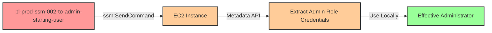

# One-Hop Privilege Escalation: ssm:SendCommand to EC2 with Admin Role

* **Category:** Privilege Escalation
* **Sub-Category:** access-resource
* **Path Type:** one-hop
* **Target:** to-admin
* **Environments:** prod
* **Technique:** Execute commands on EC2 instances with privileged roles to extract credentials via SSM SendCommand

## Overview

This scenario demonstrates a privilege escalation vulnerability where an IAM user has permission to execute commands on EC2 instances via AWS Systems Manager (SSM) SendCommand. The attacker can execute arbitrary commands on an EC2 instance that has an administrative IAM role attached, extract the temporary credentials from the EC2 instance metadata service, and then use those credentials locally to gain full administrator access.

This attack vector is particularly dangerous because it combines the operational convenience of SSM (remote command execution without SSH/RDP access) with the common misconfiguration of assigning overly privileged IAM roles to EC2 instances. Unlike SSH-based attacks, SSM access is often granted broadly across engineering teams for legitimate troubleshooting purposes, making this a realistic initial access vector.

The attack leaves minimal forensic evidence if SSM Session Manager logging is not properly configured, and the extracted credentials are time-limited but fully functional AWS credentials that can be used from any location.

## Understanding the attack scenario

### Principals in the attack path

- `arn:aws:iam::PROD_ACCOUNT:user/pl-prod-ssm-002-to-admin-starting-user` (Scenario-specific starting user)
- `arn:aws:ec2:REGION:PROD_ACCOUNT:instance/i-xxxxxxxxx` (EC2 instance with SSM agent)
- `arn:aws:iam::PROD_ACCOUNT:role/pl-prod-ssm-002-to-admin-ec2-admin-role` (Administrative role attached to EC2 instance)

### Attack Path Diagram



### Attack Steps

1. **Initial Access**: Start as `pl-prod-ssm-002-to-admin-starting-user` (credentials provided via Terraform outputs)
2. **Discover Target Instances**: Use `ec2:DescribeInstances` to identify EC2 instances with privileged IAM roles
3. **Execute Remote Command**: Use `ssm:SendCommand` to execute a shell command on the target EC2 instance that extracts credentials from the instance metadata endpoint using IMDSv2 (session-based token authentication to `http://169.254.169.254/latest/meta-data/iam/security-credentials/ROLE_NAME`)
4. **Retrieve Command Output**: Use `ssm:ListCommandInvocations` to retrieve the command output containing the temporary AWS credentials (access key, secret key, session token)
5. **Configure Local Credentials**: Export the extracted credentials as environment variables in the local shell
6. **Verification**: Verify administrator access by executing privileged AWS API calls (e.g., `iam:ListUsers`)

### Scenario specific resources created

| ARN | Purpose |
| -- | -- |
| `arn:aws:iam::PROD_ACCOUNT:user/pl-prod-ssm-002-to-admin-starting-user` | Scenario-specific starting user with access keys and SSM permissions |
| `arn:aws:iam::PROD_ACCOUNT:policy/pl-prod-ssm-002-to-admin-policy` | Allows `ssm:SendCommand`, `ssm:ListCommands`, `ssm:ListCommandInvocations`, and `ec2:DescribeInstances` |
| `arn:aws:iam::PROD_ACCOUNT:role/pl-prod-ssm-002-to-admin-ec2-admin-role` | Administrative role attached to the EC2 instance (target for credential extraction) |
| `arn:aws:iam::PROD_ACCOUNT:instance-profile/pl-prod-ssm-002-to-admin-ec2-admin-profile` | Instance profile associating the admin role with the EC2 instance |
| `arn:aws:ec2:REGION:PROD_ACCOUNT:instance/i-xxxxxxxxx` | EC2 instance with SSM agent and admin role attached |

## Executing the attack

### Using the automated demo_attack.sh

To demonstrate the privilege escalation path, run the provided demo script:

```bash
cd modules/scenarios/single-account/privesc-one-hop/to-admin/ssm-002-ssm-sendcommand
./demo_attack.sh
```

The script will:
1. Display a step-by-step walkthrough with color-coded output
2. Show the commands being executed and their results
3. Verify successful privilege escalation
4. Output standardized test results for automation

### Cleaning up the attack artifacts

After demonstrating the attack, clean up the extracted access keys and any temporary files:

```bash
cd modules/scenarios/single-account/privesc-one-hop/to-admin/ssm-002-ssm-sendcommand
./cleanup_attack.sh
```

Note: The cleanup script removes temporary credential files and clears environment variables but does not terminate the EC2 instance, as that is managed by Terraform.

## Detection and prevention

### What CSPM tools should detect

A properly configured Cloud Security Posture Management (CSPM) tool should identify the following security issues:

1. **EC2 instances with overly privileged IAM roles**: Instances should follow the principle of least privilege. An EC2 instance with `AdministratorAccess` or similar broad permissions represents a significant risk.

2. **Principals with ssm:SendCommand on wildcard resources**: The ability to execute commands on any EC2 instance in the account should be restricted to specific instances using resource ARNs or IAM condition keys.

3. **Lack of IAM condition keys restricting SSM access**: Policies should use conditions like `ssm:resourceTag/Environment` to limit which instances can be targeted.

4. **Missing AWS Systems Manager Session Manager logging**: SSM commands should be logged to CloudWatch Logs or S3 for audit and forensic purposes.

5. **EC2 instances without IMDSv2 enforcement**: The Instance Metadata Service should be configured to require IMDSv2, which provides protection against SSRF attacks and makes metadata extraction more difficult.

### CloudTrail detection patterns

Monitor for the following suspicious event patterns:

**Credential Extraction Pattern**:
```
1. ssm:SendCommand (targeting instance with privileged role)
2. ssm:ListCommandInvocations (retrieving command output)
3. AWS API calls using instance role credentials from non-EC2 IP addresses
```

**Anomalous API Usage**:
- Instance role credentials being used from geographic locations inconsistent with the EC2 instance region
- High-volume API calls from instance role credentials outside normal usage patterns
- Instance role credentials used after the EC2 instance has been terminated

### MITRE ATT&CK Mapping

- **Tactic**: TA0004 - Privilege Escalation, TA0008 - Lateral Movement
- **Technique**: T1651 - Cloud Administration Command
- **Technique**: T1552.005 - Unsecured Credentials: Cloud Instance Metadata API

## Prevention recommendations

- **Restrict ssm:SendCommand with resource conditions**: Use IAM policy conditions to limit SSM command execution to specific instances or instances with specific tags:
  ```json
  {
    "Effect": "Allow",
    "Action": "ssm:SendCommand",
    "Resource": "arn:aws:ec2:*:*:instance/*",
    "Condition": {
      "StringEquals": {
        "ssm:resourceTag/Environment": "dev"
      }
    }
  }
  ```

- **Apply least privilege to EC2 instance roles**: EC2 instances should only have the minimum permissions necessary for their function. Avoid attaching `AdministratorAccess` or other broad policies to instance profiles.

- **Enforce IMDSv2 on all EC2 instances**: Require Instance Metadata Service Version 2 (IMDSv2), which uses session-based authentication and provides protection against SSRF attacks:
  ```bash
  aws ec2 modify-instance-metadata-options \
    --instance-id i-1234567890abcdef0 \
    --http-tokens required
  ```

- **Enable SSM Session Manager logging**: Configure AWS Systems Manager to log all command executions to CloudWatch Logs or S3 for audit and forensic analysis.

- **Monitor CloudTrail for suspicious SSM activity**: Create CloudWatch alarms or SIEM rules for:
  - `ssm:SendCommand` events targeting instances with privileged roles
  - `ssm:ListCommandInvocations` retrieving command outputs
  - Unusual API activity patterns from instance role credentials

- **Implement Service Control Policies (SCPs)**: Use AWS Organizations SCPs to prevent overly broad SSM permissions at the organization level:
  ```json
  {
    "Version": "2012-10-17",
    "Statement": [{
      "Effect": "Deny",
      "Action": "ssm:SendCommand",
      "Resource": "*",
      "Condition": {
        "StringNotEquals": {
          "ssm:resourceTag/SSMAccess": "Allowed"
        }
      }
    }]
  }
  ```

- **Use IAM Access Analyzer**: Regularly scan for privilege escalation paths involving SSM and EC2 instance roles using AWS IAM Access Analyzer or third-party tools.
