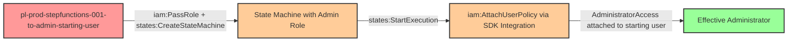

# Privilege Escalation via iam:PassRole + states:CreateStateMachine + states:StartExecution

* **Category:** Privilege Escalation
* **Sub-Category:** new-passrole
* **Path Type:** one-hop
* **Target:** to-admin
* **Environments:** prod
* **Pathfinding.cloud ID:** stepfunctions-001
* **Technique:** Passing an admin role to a Step Functions state machine that calls IAM APIs to grant the attacker administrative access

## Overview

This scenario demonstrates a privilege escalation path where a user with `iam:PassRole`, `states:CreateStateMachine`, and `states:StartExecution` permissions can escalate to full administrative access through AWS Step Functions. The attacker creates a state machine with a JSON definition that uses the Step Functions AWS SDK service integration to call IAM APIs directly, attaching `AdministratorAccess` to themselves using the credentials of a passed admin role.

AWS Step Functions supports direct SDK service integrations for over 9,000 AWS API actions, including every IAM API action with zero unsupported operations. Unlike Lambda-based privilege escalation paths that require writing and deploying code, Step Functions state machines are defined entirely in JSON using Amazon States Language (ASL). No compute infrastructure, containers, S3 buckets, or VPC configuration is needed -- just IAM resources and a JSON definition. This makes the attack extremely lightweight and fast to execute, completing in seconds.

This path is architecturally similar to CloudFormation's `CreateStack` privilege escalation but arguably more dangerous. CloudFormation is limited to resources that have CloudFormation resource type support, while Step Functions can call any supported AWS API action directly. This means an attacker can perform operations through Step Functions that have no CloudFormation equivalent, significantly expanding the attack surface. Organizations that restrict Lambda or CloudFormation but overlook Step Functions leave a wide-open escalation path.

## Understanding the attack scenario

### Principals in the attack path

- `arn:aws:iam::PROD_ACCOUNT:user/pl-prod-stepfunctions-001-to-admin-starting-user` (Scenario-specific starting user with PassRole and Step Functions permissions)
- `arn:aws:iam::PROD_ACCOUNT:role/pl-prod-stepfunctions-001-to-admin-admin-role` (Admin role that trusts states.amazonaws.com, used as the state machine execution role)

### Attack Path Diagram



### Attack Steps

1. **Initial Access**: Start as `pl-prod-stepfunctions-001-to-admin-starting-user` (credentials provided via Terraform outputs)
2. **Create State Machine**: Use `states:CreateStateMachine` to create a new state machine, passing `pl-prod-stepfunctions-001-to-admin-admin-role` as the execution role via `iam:PassRole`. The state machine definition contains a single task state that calls `arn:aws:states:::aws-sdk:iam:attachUserPolicy` with parameters specifying the starting user's ARN and the `AdministratorAccess` policy ARN.
3. **Start Execution**: Use `states:StartExecution` to run the state machine. Step Functions assumes the admin role and executes the IAM API call, attaching `AdministratorAccess` to the starting user. Execution completes in seconds.
4. **Verification**: Verify administrator access by calling `iam:ListUsers` or other admin-level actions as the starting user, confirming the `AdministratorAccess` policy is now attached.

### Scenario specific resources created

| ARN | Purpose |
| -- | -- |
| `arn:aws:iam::PROD_ACCOUNT:user/pl-prod-stepfunctions-001-to-admin-starting-user` | Scenario-specific starting user with iam:PassRole, states:CreateStateMachine, and states:StartExecution permissions |
| `arn:aws:iam::PROD_ACCOUNT:role/pl-prod-stepfunctions-001-to-admin-admin-role` | Admin role trusting states.amazonaws.com with AdministratorAccess policy attached |
| `arn:aws:iam::PROD_ACCOUNT:policy/pl-prod-stepfunctions-001-to-admin-starting-user-policy` | Policy granting the starting user PassRole and Step Functions permissions |

## Executing the attack

### Using the automated demo_attack.sh

To demonstrate the privilege escalation path, run the provided demo script:

```bash
cd modules/scenarios/single-account/privesc-one-hop/to-admin/stepfunctions-001-iam-passrole+states-createstatemachine+states-startexecution
./demo_attack.sh
```

The script will:
1. Display a step-by-step walkthrough with color-coded output
2. Show the commands being executed and their results
3. Verify successful privilege escalation
4. Output standardized test results for automation

### Cleaning up the attack artifacts

After demonstrating the attack, clean up the state machine and attached policy created during the demo:

```bash
cd modules/scenarios/single-account/privesc-one-hop/to-admin/stepfunctions-001-iam-passrole+states-createstatemachine+states-startexecution
./cleanup_attack.sh
```

The cleanup script will delete the state machine created during the demonstration and detach the `AdministratorAccess` policy from the starting user, restoring the environment to its original state while preserving the deployed infrastructure.

## Detection and prevention


### MITRE ATT&CK Mapping

- **Tactic**: TA0004 - Privilege Escalation, TA0002 - Execution
- **Technique**: T1078.004 - Valid Accounts: Cloud Accounts


## Prevention recommendations

- Restrict `iam:PassRole` scope to specific roles and use the `iam:PassedToService` condition key to limit which services can receive roles: `"Condition": {"StringEquals": {"iam:PassedToService": "states.amazonaws.com"}}` -- and further restrict which roles can be passed
- Avoid granting `states:CreateStateMachine` and `states:StartExecution` together unless absolutely necessary, as this combination enables arbitrary AWS API execution when paired with `iam:PassRole`
- Audit all IAM roles with trust policies allowing `states.amazonaws.com` and ensure they follow least privilege -- admin roles should never trust the Step Functions service principal
- Monitor CloudTrail for `CreateStateMachine` events where the state machine definition contains `aws-sdk:iam:` resource ARNs, which indicates potential IAM manipulation via Step Functions
- Implement Service Control Policies (SCPs) to prevent creation of state machines that reference sensitive IAM API actions in their definitions, or restrict `states:CreateStateMachine` to authorized automation principals only
- Alert on rapid create-execute-delete patterns for state machines, as this is a strong indicator of privilege escalation attempts that aim to minimize forensic evidence
- Use IAM Access Analyzer to identify and remediate privilege escalation paths where users can pass privileged roles to Step Functions
- Monitor for IAM policy attachment events (`AttachUserPolicy`, `AttachRolePolicy`) where the source principal is a Step Functions execution role, as legitimate automation rarely modifies IAM permissions this way
