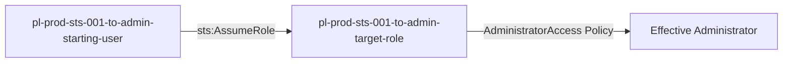

# One-Hop Privilege Escalation: sts:AssumeRole

* **Category:** Privilege Escalation
* **Sub-Category:** lateral-movement
* **Path Type:** one-hop
* **Target:** to-admin
* **Environments:** prod
* **Cost Estimate:** $0/mo
* **Technique:** Direct role assumption via sts:AssumeRole
* **Terraform Variable:** `enable_single_account_privesc_one_hop_to_admin_sts_001_sts_assumerole`
* **Schema Version:** 1.0.0
* **Pathfinding.cloud ID:** sts-001
* **Attack Path:** starting_user → (sts:AssumeRole) → admin_role → admin access
* **Attack Principals:** `arn:aws:iam::{account_id}:user/pl-prod-sts-001-to-admin-starting-user`; `arn:aws:iam::{account_id}:role/pl-prod-sts-001-to-admin-target-role`
* **Required Permissions:** `sts:AssumeRole` on `arn:aws:iam::*:role/pl-prod-sts-001-to-admin-target-role`
* **Helpful Permissions:** `iam:ListRoles` (Discover available roles to assume); `iam:GetRole` (View role permissions and trust policy)
* **MITRE Tactics:** TA0004 - Privilege Escalation
* **MITRE Techniques:** T1078.004 - Valid Accounts: Cloud Accounts

## Attack Overview

This scenario demonstrates a simple but critical privilege escalation vulnerability where a user can directly assume a role with administrator permissions. The attacker starts with minimal permissions but can assume a role that has the AWS-managed AdministratorAccess policy attached, instantly gaining full administrative privileges.

### MITRE ATT&CK Mapping

- **Tactic**: Privilege Escalation
- **Technique**: T1078.004 - Valid Accounts: Cloud Accounts
- **Sub-technique**: Abuse of cloud credentials to gain elevated access

### Principals in the attack path

- `arn:aws:iam::PROD_ACCOUNT:user/pl-prod-sts-001-to-admin-starting-user`
- `arn:aws:iam::PROD_ACCOUNT:role/pl-prod-sts-001-to-admin-target-role`

### Attack Path Diagram



### Attack Steps

1. **Starting Point**: Begin as `pl-prod-sts-001-to-admin-starting-user` with minimal permissions
2. **Assume Admin Role**: The user directly assumes `pl-prod-sts-001-to-admin-target-role` which has AdministratorAccess attached
3. **Verification**: Verify administrator access with the assumed role

### Scenario specific resources created

| ARN | Purpose |
| -- | -- |
| `arn:aws:iam::PROD_ACCOUNT:user/pl-prod-sts-001-to-admin-starting-user` | Starting user with sts:AssumeRole permission |
| `arn:aws:iam::PROD_ACCOUNT:role/pl-prod-sts-001-to-admin-target-role` | Admin role with AdministratorAccess policy attached |
| `arn:aws:iam::aws:policy/AdministratorAccess` | AWS-managed policy granting full admin permissions |

## Attack Lab

### Prerequisites

1. Install the `plabs` CLI:
   ```bash
   brew install pathfinding-labs/tap/plabs
   ```
2. Configure your AWS profiles in `~/.plabs/plabs.yaml` (or run `plabs init` if you haven't already)

### Deploy with plabs non-interactive

```bash
plabs enable enable_single_account_privesc_one_hop_to_admin_sts_001_sts_assumerole
plabs apply
```

### Deploy with plabs tui

1. Launch the TUI: `plabs`
2. Navigate to this scenario in the scenarios list
3. Press `space` to enable it
4. Press `d` to deploy

### Executing the automated demo_attack script

The script will:
1. Display a step-by-step walkthrough with color-coded output
2. Show the commands being executed and their results
3. Verify successful privilege escalation
4. Output standardized test results for automation

#### Resources created by attack script

- No persistent artifacts are created; this scenario only involves role assumption (temporary session credentials are used in-memory)

#### With plabs non-interactive

```bash
plabs demo --list
plabs demo sts-001-sts-assumerole
```

#### With plabs tui

1. Launch the TUI: `plabs`
2. Navigate to this scenario in the scenarios list
3. Press `r` to run the demo script

### Cleanup

#### With plabs non-interactive

```bash
plabs cleanup --list
plabs cleanup sts-001-sts-assumerole
```

#### With plabs tui

1. Launch the TUI: `plabs`
2. Navigate to this scenario in the scenarios list
3. Press `c` to run the cleanup script

### Teardown with plabs non-interactive

```bash
plabs disable enable_single_account_privesc_one_hop_to_admin_sts_001_sts_assumerole
plabs apply
```

### Teardown with plabs tui

1. Launch the TUI: `plabs`
2. Navigate to this scenario in the scenarios list
3. Press `space` to disable it
4. Press `D` to destroy

## Detecting Misconfiguration (CSPM)

### What CSPM tools should detect

- IAM user `pl-prod-sts-001-to-admin-starting-user` has `sts:AssumeRole` permission targeting an administrative role
- Role `pl-prod-sts-001-to-admin-target-role` has a trust policy allowing assumption by a non-privileged user
- Privilege escalation path exists: non-admin user can directly assume a role with `AdministratorAccess`
- Role trust policy does not enforce MFA or session conditions for assumption of an admin-level role

### Prevention recommendations

- Avoid allowing direct assumption of roles with administrative permissions
- Use the principle of least privilege when configuring trust relationships
- Implement SCPs to restrict who can assume privileged roles
- Monitor CloudTrail for `AssumeRole` API calls to administrative roles
- Enable MFA requirements for assuming sensitive roles
- Use IAM Access Analyzer to identify overly permissive trust policies
- Implement session policies to limit permissions even when assuming privileged roles
- Use AWS Config rules to detect roles with administrative permissions that can be assumed by users

## Detection Abuse (CloudSIEM)

### CloudTrail events to monitor

- `STS: AssumeRole` — Role assumption call; high severity when the target role has administrative permissions attached

### Detonation logs

_Detonation log integration (Stratus Red Team / Grimoire) is planned for a future release._