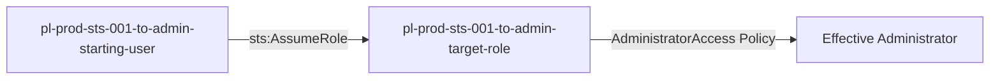

# One-Hop Privilege Escalation: sts:AssumeRole

* **Category:** Privilege Escalation
* **Sub-Category:** lateral-movement
* **Path Type:** one-hop
* **Target:** to-admin
* **Environments:** prod
* **Pathfinding.cloud ID:** sts-001
* **Technique:** Direct role assumption via sts:AssumeRole

## Overview

This scenario demonstrates a simple but critical privilege escalation vulnerability where a user can directly assume a role with administrator permissions. The attacker starts with minimal permissions but can assume a role that has the AWS-managed AdministratorAccess policy attached, instantly gaining full administrative privileges.

## Understanding the attack scenario

### Principals in the attack path

- `arn:aws:iam::PROD_ACCOUNT:user/pl-prod-sts-001-to-admin-starting-user`
- `arn:aws:iam::PROD_ACCOUNT:role/pl-prod-sts-001-to-admin-target-role`

### Attack Path Diagram



### Attack Steps

1. **Starting Point**: Begin as `pl-prod-sts-001-to-admin-starting-user` with minimal permissions
2. **Assume Admin Role**: The user directly assumes `pl-prod-sts-001-to-admin-target-role` which has AdministratorAccess attached
3. **Verification**: Verify administrator access with the assumed role

### Scenario specific resources created

| ARN | Purpose |
| -- | -- |
| `arn:aws:iam::PROD_ACCOUNT:user/pl-prod-sts-001-to-admin-starting-user` | Starting user with sts:AssumeRole permission |
| `arn:aws:iam::PROD_ACCOUNT:role/pl-prod-sts-001-to-admin-target-role` | Admin role with AdministratorAccess policy attached |
| `arn:aws:iam::aws:policy/AdministratorAccess` | AWS-managed policy granting full admin permissions |

## Executing the attack

### Using the automated demo_attack.sh

To demonstrate the privilege escalation path, run the provided demo script:

```bash
cd modules/scenarios/single-account/privesc-one-hop/to-admin/sts-001-sts-assumerole
./demo_attack.sh
```

The script will:
1. Display a step-by-step walkthrough with color-coded output
2. Show the commands being executed and their results
3. Verify successful privilege escalation
4. Output standardized test results for automation

### Cleaning up the attack artifacts

After demonstrating the attack, there are no artifacts to clean up as this scenario only involves role assumption:

```bash
cd modules/scenarios/single-account/privesc-one-hop/to-admin/sts-001-sts-assumerole
./cleanup_attack.sh
```

## Detection and prevention


### MITRE ATT&CK Mapping

- **Tactic**: Privilege Escalation
- **Technique**: T1078.004 - Valid Accounts: Cloud Accounts
- **Sub-technique**: Abuse of cloud credentials to gain elevated access


## Prevention recommendations

- Avoid allowing direct assumption of roles with administrative permissions
- Use the principle of least privilege when configuring trust relationships
- Implement SCPs to restrict who can assume privileged roles
- Monitor CloudTrail for `AssumeRole` API calls to administrative roles
- Enable MFA requirements for assuming sensitive roles
- Use IAM Access Analyzer to identify overly permissive trust policies
- Implement session policies to limit permissions even when assuming privileged roles
- Use AWS Config rules to detect roles with administrative permissions that can be assumed by users