# Privilege Escalation via iam:PassRole + synthetics:CreateCanary + synthetics:StartCanary

* **Category:** Privilege Escalation
* **Sub-Category:** new-passrole
* **Path Type:** one-hop
* **Target:** to-admin
* **Environments:** prod
* **Pathfinding.cloud ID:** synthetics-001
* **Technique:** Creating a CloudWatch Synthetics canary with inline malicious code and an admin execution role to attach AdministratorAccess to the starting user

## Overview

This scenario demonstrates a privilege escalation vulnerability where a user with `iam:PassRole`, `synthetics:CreateCanary`, and `synthetics:StartCanary` permissions can escalate to full administrator access. The attacker creates a CloudWatch Synthetics canary with inline malicious Python code (via ZipFile) that executes with an administrative IAM role, then starts the canary to trigger the exploit.

CloudWatch Synthetics canaries are Lambda functions under the hood. When a canary is created, the Synthetics service provisions a Lambda function with the specified execution role. This means the canary's inline code runs with the full privileges of whatever IAM role is passed during creation. An attacker can craft a canary that uses `boto3` (pre-installed in the Lambda Python runtime) to attach `AdministratorAccess` to their own IAM user, achieving persistent admin access that survives even after the canary is deleted.

This attack is particularly noteworthy because it uses inline code (ZipFile) rather than requiring an S3 upload, making the exploit self-contained within a single API call sequence. The canary does not auto-start upon creation, so the attacker must explicitly call `synthetics:StartCanary` to trigger execution. The caller also needs several Lambda permissions scoped to the `cwsyn-*` prefix, as well as S3 permissions for the canary artifact bucket. Organizations that restrict Lambda creation directly may overlook this indirect path through CloudWatch Synthetics.

## Understanding the attack scenario

### Principals in the attack path

- `arn:aws:iam::PROD_ACCOUNT:user/pl-prod-synthetics-001-to-admin-starting-user` (Scenario-specific starting user with PassRole and Synthetics permissions)
- `arn:aws:iam::PROD_ACCOUNT:role/pl-prod-synthetics-001-to-admin-admin-role` (Admin execution role trusted by lambda.amazonaws.com)

### Attack Path Diagram

```mermaid
graph LR
    A[pl-prod-synthetics-001-to-admin-starting-user] -->|iam:PassRole + synthetics:CreateCanary| B[Synthetics Canary]
    B -->|synthetics:StartCanary| C[Canary Executes as Admin Role]
    C -->|iam:AttachUserPolicy| D[Starting User Gets AdministratorAccess]
    D -->|Administrator Access| E[Effective Administrator]

    style A fill:#ff9999,stroke:#333,stroke-width:2px
    style B fill:#ffcc99,stroke:#333,stroke-width:2px
    style C fill:#ffcc99,stroke:#333,stroke-width:2px
    style D fill:#ffcc99,stroke:#333,stroke-width:2px
    style E fill:#99ff99,stroke:#333,stroke-width:2px
```



### Attack Steps

1. **Initial Access**: Start as `pl-prod-synthetics-001-to-admin-starting-user` (credentials provided via Terraform outputs)
2. **Create Canary**: Use `synthetics:CreateCanary` with `iam:PassRole` to create a CloudWatch Synthetics canary that uses the admin role as its execution role. The canary contains inline Python code (ZipFile with `python/my_script.py` structure, handler `my_script.handler`) that calls `iam:AttachUserPolicy` to attach `AdministratorAccess` to the starting user. Set the schedule to `rate(0 minute)` for single execution.
3. **Start Canary**: Use `synthetics:StartCanary` to trigger the canary execution. The canary's Lambda function runs with the admin role's credentials and attaches the admin policy.
4. **Verification**: Verify administrator access by listing IAM users or performing other admin-level actions with the starting user's original credentials.

### Scenario specific resources created

| ARN | Purpose |
| -- | -- |
| `arn:aws:iam::PROD_ACCOUNT:user/pl-prod-synthetics-001-to-admin-starting-user` | Scenario-specific starting user with access keys, PassRole, Synthetics, Lambda (cwsyn-*), and S3 permissions |
| `arn:aws:iam::PROD_ACCOUNT:role/pl-prod-synthetics-001-to-admin-admin-role` | Admin execution role with AdministratorAccess, trusted by lambda.amazonaws.com |
| S3 artifact bucket (`cw-syn-results-*`) | Required by CloudWatch Synthetics for storing canary run artifacts |

## Executing the attack

### Using the automated demo_attack.sh

To demonstrate the privilege escalation path, run the provided demo script:

```bash
cd modules/scenarios/single-account/privesc-one-hop/to-admin/synthetics-001-iam-passrole+synthetics-createcanary+synthetics-startcanary
./demo_attack.sh
```

The script will:
1. Display a step-by-step walkthrough with color-coded output
2. Show the commands being executed and their results
3. Verify successful privilege escalation
4. Output standardized test results for automation

### Cleaning up the attack artifacts

After demonstrating the attack, clean up the canary and attached policy created during the demo:

```bash
cd modules/scenarios/single-account/privesc-one-hop/to-admin/synthetics-001-iam-passrole+synthetics-createcanary+synthetics-startcanary
./cleanup_attack.sh
```

The cleanup script will delete the Synthetics canary created during the demonstration and detach the `AdministratorAccess` policy from the starting user, restoring the environment to its original state while preserving the deployed infrastructure.

## Detection and prevention


### MITRE ATT&CK Mapping

- **Tactic**: TA0004 - Privilege Escalation, TA0002 - Execution
- **Technique**: T1078.004 - Valid Accounts: Cloud Accounts


## Prevention recommendations

- Restrict `iam:PassRole` permissions using strict resource conditions to limit which roles can be passed, and use the `iam:PassedToService` condition key to restrict PassRole to only the specific AWS services required
- Avoid granting `synthetics:CreateCanary` permissions broadly; most users and roles do not need the ability to create Synthetics canaries
- Implement Service Control Policies (SCPs) that prevent passing roles with administrative permissions to Lambda or Synthetics services
- Monitor CloudTrail for `CreateCanary` and `StartCanary` API calls, especially when the execution role has elevated permissions
- Use IAM Access Analyzer to identify privilege escalation paths involving `iam:PassRole` combined with Synthetics or Lambda permissions
- Enable AWS Config rules to detect IAM roles with administrative policies that trust `lambda.amazonaws.com`, and restrict which roles can be used as canary execution roles
- Implement automated alerting on `AttachUserPolicy` or `AttachRolePolicy` events where `AdministratorAccess` is the target policy, as these indicate potential privilege escalation in progress
