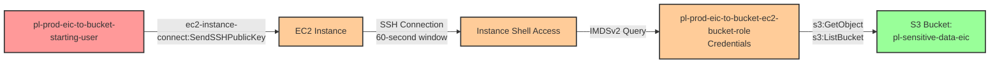

# Privilege Escalation via ec2-instance-connect:SendSSHPublicKey to S3 Bucket

* **Category:** Privilege Escalation
* **Sub-Category:** access-resource
* **Path Type:** one-hop
* **Target:** to-bucket
* **Environments:** prod
* **Pathfinding.cloud ID:** ec2-003
* **Technique:** SSH into EC2 instance via Instance Connect and extract IAM role credentials from IMDS for S3 bucket access

## Overview

EC2 Instance Connect provides a secure way to connect to EC2 instances by pushing temporary SSH public keys that remain valid for 60 seconds. However, if a user has the `ec2-instance-connect:SendSSHPublicKey` permission on an instance with a privileged IAM role attached, they can SSH into the instance and extract the role's temporary credentials from the Instance Metadata Service (IMDS).

This scenario demonstrates a privilege escalation path where a low-privileged user leverages EC2 Instance Connect to access an EC2 instance that has an IAM role with S3 bucket access. Once on the instance, the attacker extracts the role credentials via IMDSv2 and uses them to access sensitive data in an S3 bucket. This technique is particularly dangerous because it combines legitimate AWS services (EC2 Instance Connect and IMDS) to bypass IAM restrictions, and the 60-second window for the SSH key makes detection challenging.

The attack highlights the importance of restricting `ec2-instance-connect:SendSSHPublicKey` permissions and carefully evaluating which IAM roles are attached to EC2 instances, especially those accessible via Instance Connect. Organizations should treat EC2 Instance Connect permissions with the same scrutiny as direct IAM role assumption permissions, as they provide an indirect path to role credentials.

## Understanding the attack scenario

### Principals in the attack path

- `arn:aws:iam::PROD_ACCOUNT:user/pl-prod-eic-to-bucket-starting-user` (Scenario-specific starting user)
- `arn:aws:ec2:REGION:PROD_ACCOUNT:instance/i-xxxxxxxxx` (EC2 instance with bucket access role)
- `arn:aws:iam::PROD_ACCOUNT:role/pl-prod-eic-to-bucket-ec2-bucket-role` (IAM role attached to EC2 instance with S3 bucket access)
- `arn:aws:s3:::pl-sensitive-data-eic-PROD_ACCOUNT-SUFFIX` (Target S3 bucket with sensitive data)

### Attack Path Diagram



### Attack Steps

1. **Initial Access**: Start as `pl-prod-eic-to-bucket-starting-user` with `ec2-instance-connect:SendSSHPublicKey` permission (credentials provided via Terraform outputs)
2. **Generate SSH Key Pair**: Create a temporary SSH key pair for authentication
3. **Push Public Key**: Use `ec2-instance-connect:SendSSHPublicKey` to push the public key to the target EC2 instance (valid for 60 seconds)
4. **Establish SSH Connection**: Connect to the EC2 instance via SSH within the 60-second window
5. **Extract Role Credentials**: Query the Instance Metadata Service (IMDSv2) from within the instance to retrieve temporary IAM role credentials
6. **Configure AWS CLI**: Use the extracted credentials (AccessKeyId, SecretAccessKey, SessionToken) to configure AWS CLI
7. **Access S3 Bucket**: Use the role credentials to list and download objects from the sensitive S3 bucket
8. **Verification**: Verify successful S3 bucket access and data exfiltration

### Scenario specific resources created

| ARN | Purpose |
| -- | -- |
| `arn:aws:iam::PROD_ACCOUNT:user/pl-prod-eic-to-bucket-starting-user` | Scenario-specific starting user with access keys and ec2-instance-connect:SendSSHPublicKey permission |
| `arn:aws:iam::PROD_ACCOUNT:policy/pl-prod-eic-to-bucket-starting-user-policy` | Policy granting SendSSHPublicKey, DescribeInstances, GetInstanceProfile, and GetRole permissions |
| `arn:aws:ec2:REGION:PROD_ACCOUNT:instance/i-xxxxxxxxx` | EC2 instance (Amazon Linux 2023) with Instance Connect enabled and bucket access role attached |
| `arn:aws:iam::PROD_ACCOUNT:role/pl-prod-eic-to-bucket-ec2-bucket-role` | IAM role attached to EC2 instance with S3 bucket read access |
| `arn:aws:iam::PROD_ACCOUNT:instance-profile/pl-prod-eic-to-bucket-ec2-bucket-profile` | Instance profile linking the IAM role to the EC2 instance |
| `arn:aws:s3:::pl-sensitive-data-eic-PROD_ACCOUNT-SUFFIX` | Target S3 bucket containing sensitive data files |

## Executing the attack

### Using the automated demo_attack.sh

To demonstrate the privilege escalation path, run the provided demo script:

```bash
cd modules/scenarios/single-account/privesc-one-hop/to-bucket/ec2-instance-connect-sendsshpublickey
./demo_attack.sh
```

The script will:
1. Display a step-by-step walkthrough with color-coded output
2. Generate a temporary SSH key pair
3. Push the public key to the EC2 instance using EC2 Instance Connect
4. Establish SSH connection within the 60-second window
5. Extract IAM role credentials from IMDSv2
6. Use the extracted credentials to access the S3 bucket
7. Verify successful data exfiltration
8. Output standardized test results for automation

### Cleaning up the attack artifacts

After demonstrating the attack, clean up the temporary SSH key pair and any downloaded files:

```bash
cd modules/scenarios/single-account/privesc-one-hop/to-bucket/ec2-instance-connect-sendsshpublickey
./cleanup_attack.sh
```

The cleanup script removes temporary SSH keys and downloaded S3 objects. The EC2 instance and S3 bucket infrastructure remain intact and are managed by Terraform.

## Detection and prevention

### What CSPM tools should detect

A properly configured Cloud Security Posture Management (CSPM) tool should identify:

1. **Overly Permissive EC2 Instance Connect Permissions**: User with `ec2-instance-connect:SendSSHPublicKey` on instances with privileged IAM roles
2. **Sensitive Instance Profiles**: EC2 instances with IAM roles that have broad S3 access (especially `s3:GetObject` on sensitive buckets)
3. **Missing Resource Constraints**: SendSSHPublicKey permissions without resource ARN restrictions or condition keys
4. **Lack of OS User Restrictions**: SendSSHPublicKey permissions without `ec2:osuser` condition constraints
5. **IMDSv1 Enabled**: Instances using IMDSv1 instead of IMDSv2 (makes credential theft easier)
6. **Missing Network Restrictions**: Security groups allowing SSH (port 22) from broad IP ranges on instances with privileged roles
7. **Privilege Escalation Path**: One-hop path from low-privileged user to S3 bucket access via EC2 Instance Connect

### MITRE ATT&CK Mapping

- **Tactic**: TA0004 - Privilege Escalation, TA0006 - Credential Access, TA0009 - Collection
- **Technique**: T1552.005 - Unsecured Credentials: Cloud Instance Metadata API
- **Technique**: T1078.004 - Valid Accounts: Cloud Accounts
- **Technique**: T1530 - Data from Cloud Storage Object

### CloudTrail detection opportunities

Monitor for the following CloudTrail events:

- `SendSSHPublicKey` events, especially:
  - To instances with privileged IAM roles
  - From users who don't normally use EC2 Instance Connect
  - Multiple attempts in short time windows
  - Outside of normal business hours
- `DescribeInstances` API calls followed by `SendSSHPublicKey` (reconnaissance pattern)
- `GetInstanceProfile` or `GetRole` calls to identify instances with privileged roles
- `ListBucket` and `GetObject` S3 API calls from EC2 instance roles (normal) but with unusual patterns:
  - Accessing buckets not typically accessed by that instance
  - Large volume downloads
  - Access to sensitive objects

## Prevention recommendations

- **Restrict SendSSHPublicKey with resource-based constraints**:
  ```json
  {
    "Effect": "Allow",
    "Action": "ec2-instance-connect:SendSSHPublicKey",
    "Resource": "arn:aws:ec2:REGION:ACCOUNT_ID:instance/i-specificinstance",
    "Condition": {
      "StringEquals": {
        "ec2:osuser": "ec2-user"
      }
    }
  }
  ```
- **Use security groups to restrict SSH access** to known IP ranges or VPN endpoints, not 0.0.0.0/0
- **Monitor CloudTrail for SendSSHPublicKey events**, especially to instances with privileged roles attached
- **Implement IMDSv2** (session-oriented metadata service) to make credential theft more difficult by requiring a session token
- **Use AWS Systems Manager Session Manager instead of SSH** for remote access - it provides better auditing and doesn't expose ports
- **Alert on unusual SSH connections** to sensitive instances, especially those with S3 or admin access roles
- **Consider disabling EC2 Instance Connect** on instances with privileged roles if SSH access is not required
- **Use VPC endpoints for S3** to restrict which instances can access specific buckets
- **Apply least privilege to instance profiles** - instances should only have access to the specific S3 buckets and objects they need
- **Implement S3 bucket policies** that restrict access based on source VPC or VPC endpoints
- **Use SCPs to prevent overly broad SendSSHPublicKey permissions** across your AWS Organization
- **Enable GuardDuty** to detect unusual API activity from EC2 instances, including anomalous S3 access patterns
