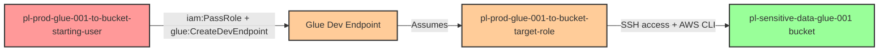

# Privilege Escalation via iam:PassRole + glue:CreateDevEndpoint

* **Category:** Privilege Escalation
* **Sub-Category:** service-passrole
* **Path Type:** one-hop
* **Target:** to-bucket
* **Environments:** prod
* **Pathfinding.cloud ID:** glue-001
* **Technique:** Pass privileged role to AWS Glue dev endpoint and access S3 buckets via SSH

## Cost Warning

**This scenario creates a Glue development endpoint that costs approximately $2.20/hour while running (using minimum 2 node configuration).** The demo script automatically cleans up the endpoint after demonstration, but if the script fails or is interrupted, you may incur ongoing charges until the endpoint is manually deleted. Always verify cleanup completion using `aws glue get-dev-endpoint`.

## Overview

This scenario demonstrates a privilege escalation vulnerability where a user has permissions to pass a role to AWS Glue (`iam:PassRole`) and create Glue development endpoints (`glue:CreateDevEndpoint`). By creating a development endpoint with a role that has S3 bucket access, an attacker can SSH into the endpoint and execute AWS CLI commands with the elevated permissions of the passed role.

AWS Glue development endpoints are interactive compute environments used for developing, testing, and debugging ETL scripts. When a development endpoint is created, it assumes the specified IAM role and makes those credentials available within the endpoint environment. An attacker who can SSH into the endpoint inherits these elevated permissions without needing to know the role's credentials directly.

This attack is particularly dangerous because Glue dev endpoints provide a persistent compute environment with internet connectivity, SSH access, and the ability to install arbitrary tools. Unlike ephemeral Lambda functions, dev endpoints remain running until explicitly deleted, giving attackers extended time to explore and exfiltrate data.

**Important Note:** Glue development endpoints only support Glue versions **0.9** and **1.0** (legacy versions). Newer Glue versions (2.0, 3.0, 4.0) are not supported for dev endpoints. This scenario uses Glue 1.0.

## Understanding the attack scenario

### Principals in the attack path

- `arn:aws:iam::PROD_ACCOUNT:user/pl-prod-glue-001-to-bucket-starting-user` (Scenario-specific starting user)
- `arn:aws:iam::PROD_ACCOUNT:role/pl-prod-glue-001-to-bucket-target-role` (Target role with S3 bucket access)
- `arn:aws:s3:::pl-sensitive-data-glue-001-PROD_ACCOUNT-SUFFIX` (Target sensitive S3 bucket)

### Attack Path Diagram



### Attack Steps

1. **Initial Access**: Start as `pl-prod-glue-001-to-bucket-starting-user` (credentials provided via Terraform outputs)
2. **Create SSH Key Pair**: Generate an SSH public key for endpoint authentication
3. **Create Dev Endpoint**: Use `glue:CreateDevEndpoint` to create a development endpoint with the target role containing S3 permissions
4. **Wait for Provisioning**: Poll endpoint status until it becomes `READY` (typically 5-10 minutes)
5. **SSH Access**: SSH into the dev endpoint using the private key
6. **Execute AWS Commands**: Run AWS CLI commands (e.g., `aws s3 ls`, `aws s3 cp`) with the elevated permissions of the passed role
7. **Access Sensitive Data**: List and download objects from the sensitive S3 bucket
8. **Cleanup**: Delete the dev endpoint to stop incurring charges

### Scenario specific resources created

| ARN | Purpose |
| -- | -- |
| `arn:aws:iam::PROD_ACCOUNT:user/pl-prod-glue-001-to-bucket-starting-user` | Scenario-specific starting user with access keys |
| `arn:aws:iam::PROD_ACCOUNT:policy/pl-prod-glue-001-to-bucket-starting-policy` | Allows `iam:PassRole` and `glue:CreateDevEndpoint` |
| `arn:aws:iam::PROD_ACCOUNT:role/pl-prod-glue-001-to-bucket-target-role` | Target role with S3 bucket read permissions |
| `arn:aws:iam::PROD_ACCOUNT:policy/pl-prod-glue-001-to-bucket-target-policy` | Grants `s3:GetObject` and `s3:ListBucket` on sensitive bucket |
| `arn:aws:s3:::pl-sensitive-data-glue-001-PROD_ACCOUNT-SUFFIX` | Target sensitive S3 bucket containing sample data |

## Executing the attack

### Using the automated demo_attack.sh

To demonstrate the privilege escalation path, run the provided demo script:

```bash
cd modules/scenarios/single-account/privesc-one-hop/to-bucket/glue-001-iam-passrole+glue-createdevendpoint
./demo_attack.sh
```

The script will:
1. Display a step-by-step walkthrough with color-coded output
2. Generate an SSH key pair for endpoint access
3. Create a Glue development endpoint with the target role
4. Wait for the endpoint to become ready (5-10 minutes)
5. SSH into the endpoint and execute AWS S3 commands
6. Verify successful access to the sensitive S3 bucket
7. Automatically delete the endpoint and clean up resources
8. Output standardized test results for automation

**Note**: The script includes automatic cleanup of the Glue dev endpoint to prevent ongoing charges. If the script is interrupted, manually delete the endpoint using:

```bash
aws glue delete-dev-endpoint --endpoint-name pl-prod-gcd-escalation-endpoint
```

### Cleaning up the attack artifacts

After demonstrating the attack, the demo script automatically cleans up the Glue dev endpoint. If manual cleanup is needed:

```bash
cd modules/scenarios/single-account/privesc-one-hop/to-bucket/glue-001-iam-passrole+glue-createdevendpoint
./cleanup_attack.sh
```

This will remove:
- The Glue development endpoint
- Generated SSH key pair files
- Any temporary AWS CLI configuration

## Detection and prevention

### MITRE ATT&CK Mapping

- **Tactic**: TA0004 - Privilege Escalation
- **Technique**: T1098.001 - Account Manipulation: Additional Cloud Credentials
- **Technique**: T1578 - Modify Cloud Compute Infrastructure
- **Sub-technique**: Using PassRole to escalate privileges via AWS services

### What should CSPM tools detect?

A properly configured Cloud Security Posture Management (CSPM) tool should detect:

1. **Overly Permissive PassRole**: User/role has `iam:PassRole` permission on roles with sensitive permissions
2. **Glue Service Escalation Path**: Combination of `iam:PassRole` and `glue:CreateDevEndpoint` that could lead to privilege escalation
3. **Privileged Role for Glue**: IAM roles with S3 or admin permissions that can be passed to Glue services
4. **Unrestricted Glue Access**: Principals with `glue:CreateDevEndpoint` without resource or condition constraints
5. **S3 Access via Compute Services**: Detection of privilege escalation paths where compute services (Glue, Lambda, EC2) can access sensitive S3 buckets

## Prevention recommendations

- **Restrict PassRole permissions**: Use resource-level conditions to limit which roles can be passed to Glue services:
  ```json
  {
    "Effect": "Allow",
    "Action": "iam:PassRole",
    "Resource": "arn:aws:iam::*:role/GlueServiceRole-*",
    "Condition": {
      "StringEquals": {
        "iam:PassedToService": "glue.amazonaws.com"
      }
    }
  }
  ```

- **Implement SCPs**: Use Service Control Policies to prevent creation of Glue dev endpoints in production accounts:
  ```json
  {
    "Effect": "Deny",
    "Action": "glue:CreateDevEndpoint",
    "Resource": "*"
  }
  ```

- **Minimize Glue role permissions**: Ensure roles used by Glue dev endpoints follow least privilege principles and avoid S3 or admin access

- **Enable CloudTrail monitoring**: Alert on `CreateDevEndpoint` API calls, especially when combined with high-privilege roles:
  - `glue:CreateDevEndpoint`
  - `glue:GetDevEndpoint`
  - `sts:AssumeRole` by Glue service principal

- **Use IAM Access Analyzer**: Regularly scan for privilege escalation paths involving PassRole and Glue services

- **Require MFA**: Enforce MFA for creating Glue dev endpoints or passing roles to AWS services

- **Network restrictions**: Configure VPC endpoints and security groups to limit SSH access to Glue dev endpoints from trusted networks only

- **Consider alternatives**: For production environments, prefer AWS Glue jobs or notebooks with appropriate IAM roles instead of persistent dev endpoints
