# Privilege Escalation via glue:UpdateDevEndpoint

**Category:** Privilege Escalation
**Sub-Category:** access-resource
**Path Type:** one-hop
**Target:** to-bucket
**Environments:** prod
**Pathfinding.cloud ID:** glue-002
**Technique:** Add SSH public key to existing Glue dev endpoint and access S3 buckets with the endpoint's attached role

---

## COST WARNING

**This scenario incurs AWS charges of approximately $2.20/hour (~$1,600/month) while deployed.**

AWS Glue Development Endpoints run continuously once created and bill per DPU (Data Processing Unit) hour. The endpoint created in this scenario uses the default 5 DPUs configuration.

**Recommendations:**
- Only deploy this scenario when actively testing
- Run `terraform destroy` immediately after completing testing
- Set up AWS billing alerts before deployment
- Monitor your AWS costs during testing

---

## Overview

This scenario demonstrates a privilege escalation vulnerability where a user has permission to update an existing AWS Glue Development Endpoint. Unlike the `glue:CreateDevEndpoint` scenario, the attacker doesn't need `iam:PassRole` permissions since the role is already attached to the pre-existing endpoint.

The attack leverages `glue:UpdateDevEndpoint` to add the attacker's SSH public key to an existing development endpoint that has a privileged IAM role attached. Once the SSH key is added, the attacker can SSH into the endpoint and use the attached role's credentials to access sensitive S3 buckets. This is particularly dangerous because Glue dev endpoints often have broad S3 permissions to support ETL development workflows.

AWS Glue Development Endpoints are Apache Spark environments used for developing, testing, and debugging ETL (Extract, Transform, Load) scripts. They persist until explicitly deleted, providing attackers with a stable environment for credential access and lateral movement.

## Understanding the attack scenario

### Principals in the attack path

- `arn:aws:iam::PROD_ACCOUNT:user/pl-prod-gud-to-bucket-starting-user` (Scenario-specific starting user)
- `arn:aws:iam::PROD_ACCOUNT:role/pl-prod-gud-to-bucket-target-role` (Pre-existing Glue dev endpoint role with S3 access)
- `arn:aws:s3:::pl-sensitive-data-gud-PROD_ACCOUNT-SUFFIX` (Sensitive S3 bucket containing valuable data)

### Attack Path Diagram

```mermaid
graph LR
    A[pl-prod-gud-to-bucket-starting-user] -->|glue:UpdateDevEndpoint| B[Pre-existing Dev Endpoint]
    B -->|Add SSH public key| C[Endpoint with Attacker Access]
    C -->|SSH connection| D[pl-prod-gud-to-bucket-target-role]
    D -->|s3:GetObject| E[pl-sensitive-data-gud bucket]

    style A fill:#ff9999,stroke:#333,stroke-width:2px
    style B fill:#ffcc99,stroke:#333,stroke-width:2px
    style C fill:#ffcc99,stroke:#333,stroke-width:2px
    style D fill:#ffcc99,stroke:#333,stroke-width:2px
    style E fill:#99ff99,stroke:#333,stroke-width:2px
```



### Attack Steps

1. **Initial Access**: Start as `pl-prod-gud-to-bucket-starting-user` (credentials provided via Terraform outputs)
2. **Generate SSH Key Pair**: Create a new SSH key pair locally (attacker-controlled)
3. **Update Dev Endpoint**: Use `glue:UpdateDevEndpoint` to add the attacker's SSH public key to the existing endpoint
4. **Wait for Update**: Wait for the endpoint update to propagate (typically 2-5 minutes)
5. **SSH Connection**: SSH into the dev endpoint using the private key and the endpoint's address
6. **Extract Credentials**: Once connected, extract IAM role credentials from the instance metadata service
7. **Access S3**: Use the extracted credentials to access the sensitive S3 bucket
8. **Verification**: Download objects from the sensitive bucket to confirm access

### Scenario specific resources created

| ARN | Purpose |
| -- | -- |
| `arn:aws:iam::PROD_ACCOUNT:user/pl-prod-gud-to-bucket-starting-user` | Scenario-specific starting user with access keys |
| `arn:aws:iam::PROD_ACCOUNT:policy/pl-prod-gud-to-bucket-starting-policy` | Grants `glue:UpdateDevEndpoint`, `glue:GetDevEndpoint`, and `glue:GetDevEndpoints` permissions |
| `arn:aws:iam::PROD_ACCOUNT:role/pl-prod-gud-to-bucket-target-role` | Privileged role attached to the dev endpoint with S3 bucket access |
| `arn:aws:glue:REGION:PROD_ACCOUNT:devEndpoint/pl-prod-gud-to-bucket-endpoint` | Pre-existing Glue dev endpoint with the target role attached |
| `arn:aws:s3:::pl-sensitive-data-gud-PROD_ACCOUNT-SUFFIX` | Sensitive S3 bucket containing test data |

## Executing the attack

### Using the automated demo_attack.sh

To demonstrate the privilege escalation path, run the provided demo script:

```bash
cd modules/scenarios/single-account/privesc-one-hop/to-bucket/glue-updatedevendpoint
./demo_attack.sh
```

The script will:
1. Display a step-by-step walkthrough with color-coded output
2. Generate an SSH key pair for the demonstration
3. Update the dev endpoint with the attacker's public key
4. Wait for the endpoint to become ready
5. Establish an SSH connection to the endpoint
6. Extract IAM credentials from the instance metadata service
7. Access the sensitive S3 bucket using the extracted credentials
8. Verify successful privilege escalation
9. Output standardized test results for automation

**Note**: The demo script requires SSH client and AWS CLI to be installed. The endpoint takes approximately 2-5 minutes to update after adding the SSH key.

### Cleaning up the attack artifacts

After demonstrating the attack, clean up the SSH key added to the dev endpoint:

```bash
cd modules/scenarios/single-account/privesc-one-hop/to-bucket/glue-updatedevendpoint
./cleanup_attack.sh
```

The cleanup script will:
- Remove the attacker's SSH public key from the dev endpoint
- Delete the local SSH key pair generated during the demo
- Restore the endpoint to its original state

**Important**: The cleanup script only removes the SSH key. To stop AWS charges, you must run `terraform destroy` to delete the entire dev endpoint.

## Detection and prevention

### What CSPM tools should detect

A properly configured Cloud Security Posture Management (CSPM) tool should identify:

1. **Overly Permissive Glue Permissions**
   - IAM principals with `glue:UpdateDevEndpoint` on `*` resources
   - Lack of resource-based conditions restricting which endpoints can be updated

2. **Privilege Escalation Path**
   - User can update dev endpoint → Dev endpoint has privileged role → Role has S3 access
   - Detection should show the full attack path from user to sensitive bucket

3. **High-Risk Glue Configuration**
   - Development endpoints with broad S3 permissions
   - Endpoints without network access restrictions (public subnet placement)
   - Lack of encryption for dev endpoints

4. **Missing Preventive Controls**
   - No SCP restrictions on Glue dev endpoint operations
   - Absence of resource tags for endpoint ownership and approval
   - No CloudTrail monitoring for `UpdateDevEndpoint` API calls

### MITRE ATT&CK Mapping

- **Tactic**: TA0004 - Privilege Escalation
- **Technique**: T1098.001 - Account Manipulation: Additional Cloud Credentials
- **Sub-technique**: Adding SSH credentials to cloud compute resources
- **Technique**: T1021.004 - Remote Services: SSH
- **Sub-technique**: SSH access to cloud development environments

## Prevention recommendations

1. **Restrict glue:UpdateDevEndpoint permissions**
   ```json
   {
     "Effect": "Deny",
     "Action": "glue:UpdateDevEndpoint",
     "Resource": "*",
     "Condition": {
       "StringNotEquals": {
         "aws:PrincipalTag/GlueAdmin": "true"
       }
     }
   }
   ```

2. **Use resource-based conditions to limit endpoint access**
   - Implement IAM conditions that restrict which endpoints can be updated
   - Use `glue:ResourceTag` conditions to enforce endpoint ownership
   - Require specific tags on endpoints before allowing updates

3. **Implement SCPs to prevent unauthorized endpoint updates**
   ```json
   {
     "Effect": "Deny",
     "Action": [
       "glue:UpdateDevEndpoint",
       "glue:CreateDevEndpoint"
     ],
     "Resource": "*",
     "Condition": {
       "StringNotEquals": {
         "aws:RequestedRegion": ["us-east-1"]
       }
     }
   }
   ```

4. **Monitor CloudTrail for suspicious Glue API activity**
   - Alert on `UpdateDevEndpoint` calls, especially adding new public keys
   - Monitor `GetDevEndpoint` calls that might indicate reconnaissance
   - Track patterns of Glue API calls followed by S3 access from endpoint IPs

5. **Apply least privilege to Glue endpoint roles**
   - Limit S3 permissions to specific buckets required for ETL workflows
   - Avoid attaching `AdministratorAccess` or overly broad policies
   - Use S3 bucket policies with `aws:SourceVpce` conditions to restrict access

6. **Use VPC endpoints and private subnets for dev endpoints**
   - Deploy endpoints in private subnets without internet access
   - Use VPC endpoints for AWS service communication
   - Implement security groups that restrict SSH access to specific IP ranges

7. **Enable encryption for Glue dev endpoints**
   - Use AWS KMS for encrypting data at rest
   - Enable SSL/TLS for data in transit
   - Implement key policies that restrict who can use encryption keys

8. **Implement approval workflows for endpoint modifications**
   - Require change management tickets before endpoint updates
   - Use AWS Service Catalog to standardize endpoint creation
   - Implement AWS Systems Manager Change Manager for controlled updates

9. **Use IAM Access Analyzer to identify privilege escalation paths**
   - Regularly scan for paths from low-privilege principals to sensitive resources
   - Review findings related to Glue permissions and S3 access
   - Implement automated remediation for high-risk findings

10. **Consider using AWS Glue Studio notebooks instead**
    - Glue Studio notebooks provide similar functionality with better security controls
    - They automatically shut down after periods of inactivity (cost savings)
    - Integration with AWS IAM Identity Center for authentication
    - Better isolation between users and workloads
