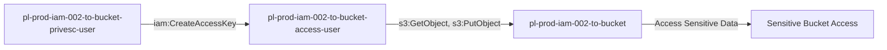

# One-Hop Privilege Escalation: iam:CreateAccessKey

* **Category:** Privilege Escalation
* **Sub-Category:** credential-access
* **Path Type:** one-hop
* **Target:** to-bucket
* **Environments:** prod
* **Cost Estimate:** $0/mo
* **Pathfinding.cloud ID:** iam-002
* **Technique:** User with iam:CreateAccessKey can create credentials for user with S3 bucket access
* **Terraform Variable:** `enable_single_account_privesc_one_hop_to_bucket_iam_002_iam_createaccesskey`
* **Schema Version:** 1.0.0
* **Attack Path:** starting_user → (iam:CreateAccessKey) → bucket_user credentials → S3 bucket access
* **Attack Principals:** `arn:aws:iam::{account_id}:user/pl-prod-iam-002-to-bucket-privesc-user`; `arn:aws:iam::{account_id}:user/pl-prod-iam-002-to-bucket-access-user`; `arn:aws:s3:::pl-prod-iam-002-to-bucket-{account_id}`
* **Required Permissions:** `iam:CreateAccessKey` on `arn:aws:iam::*:user/pl-prod-iam-002-to-bucket-access-user`
* **Helpful Permissions:** `iam:ListUsers` (Discover users with S3 access); `iam:GetUserPolicy` (View user's inline policies); `iam:ListAttachedUserPolicies` (Identify users with S3 permissions)
* **MITRE Tactics:** TA0004 - Privilege Escalation, TA0009 - Collection
* **MITRE Techniques:** T1098.001 - Account Manipulation: Additional Cloud Credentials, T1530 - Data from Cloud Storage Object

## Attack Overview

This scenario demonstrates a privilege escalation vulnerability where a user has permission to create access keys for another user with S3 bucket access. The attacker creates new access keys for the privileged user and uses those credentials to access sensitive S3 buckets.

### MITRE ATT&CK Mapping

- **Tactic**: Privilege Escalation, Persistence, Collection
- **Technique**: T1098.001 - Account Manipulation: Additional Cloud Credentials
- **Sub-technique**: T1530 - Data from Cloud Storage Object

### Principals in the attack path

- `arn:aws:iam::PROD_ACCOUNT:user/pl-prod-iam-002-to-bucket-privesc-user`
- `arn:aws:iam::PROD_ACCOUNT:user/pl-prod-iam-002-to-bucket-access-user`
- `arn:aws:s3:::pl-prod-iam-002-to-bucket-ACCOUNT_ID-SUFFIX`

### Attack Path Diagram



### Attack Steps

1. **Scaffolding aka Initial Access**: Authenticate as `pl-prod-iam-002-to-bucket-privesc-user` to begin the scenario
2. **Create Access Keys**: Use `iam:CreateAccessKey` to create new access keys for `pl-prod-iam-002-to-bucket-access-user`
3. **Switch Context**: Configure AWS CLI to use the newly created access keys
4. **Access S3 Bucket**: Read and download sensitive data from the target bucket

### Scenario specific resources created

| ARN | Purpose |
| -- | -- |
| `arn:aws:iam::PROD_ACCOUNT:user/pl-prod-iam-002-to-bucket-privesc-user` | Starting principal with CreateAccessKey permission |
| `arn:aws:iam::PROD_ACCOUNT:user/pl-prod-iam-002-to-bucket-access-user` | Destination principal with S3 bucket access |
| `arn:aws:s3:::pl-prod-iam-002-to-bucket-ACCOUNT_ID-SUFFIX` | Target S3 bucket containing sensitive data |
| `arn:aws:s3:::pl-prod-iam-002-to-bucket-ACCOUNT_ID-SUFFIX/sensitive-data.txt` | Sensitive file in the target bucket |

## Attack Lab

### Prerequisites

1. Install the `plabs` CLI:
   ```bash
   brew install pathfinding-labs/tap/plabs
   ```
2. Configure your AWS profiles in `~/.plabs/plabs.yaml` (or run `plabs init` if you haven't already)

### Deploy with plabs non-interactive

```bash
plabs enable enable_single_account_privesc_one_hop_to_bucket_iam_002_iam_createaccesskey
plabs apply
```

### Deploy with plabs tui

1. Launch the TUI: `plabs`
2. Navigate to this scenario in the scenarios list
3. Press `space` to enable it
4. Press `d` to deploy

### Executing the automated demo_attack script

The script will:
1. Display a step-by-step walkthrough with color-coded output
2. Show the commands being executed and their results
3. Verify successful privilege escalation to bucket access
4. Output standardized test results for automation

#### Resources created by attack script

- New IAM access key for `pl-prod-iam-002-to-bucket-access-user`

#### With plabs non-interactive

```bash
plabs demo --list
plabs demo iam-002-iam-createaccesskey
```

#### With plabs tui

1. Launch the TUI: `plabs`
2. Navigate to this scenario in the scenarios list
3. Press `r` to run the demo script

### Cleanup

#### With plabs non-interactive

```bash
plabs cleanup --list
plabs cleanup iam-002-iam-createaccesskey
```

#### With plabs tui

1. Launch the TUI: `plabs`
2. Navigate to this scenario in the scenarios list
3. Press `c` to run the cleanup script

### Teardown with plabs non-interactive

```bash
plabs disable enable_single_account_privesc_one_hop_to_bucket_iam_002_iam_createaccesskey
plabs apply
```

### Teardown with plabs tui

1. Launch the TUI: `plabs`
2. Navigate to this scenario in the scenarios list
3. Press `space` to disable it
4. Press `D` to destroy

## Detecting Misconfiguration (CSPM)

### What CSPM tools should detect

- IAM user (`pl-prod-iam-002-to-bucket-privesc-user`) has `iam:CreateAccessKey` permission on another user with S3 bucket access
- Privilege escalation path: starting user can obtain credentials for a user with S3 read/write permissions
- No resource-based condition restricts which users can have access keys created on their behalf

### Prevention recommendations

- Avoid granting `iam:CreateAccessKey` permissions on privileged users
- Use resource-based conditions to restrict which users can have keys created
- Implement SCPs to prevent access key creation on privileged users
- Monitor CloudTrail for `CreateAccessKey` API calls on privileged accounts
- Enable MFA requirements for sensitive operations
- Use IAM Access Analyzer to identify privilege escalation paths
- Implement S3 bucket policies that restrict access even for privileged users
- Enable S3 access logging to track data access patterns

## Detection Abuse (CloudSIEM)

### CloudTrail events to monitor

- `IAM: CreateAccessKey` — New access keys created for an IAM user; critical when the target user has S3 bucket access permissions
- `S3: GetObject` — Object retrieved from S3 bucket; high severity when accessed using newly created credentials
- `S3: PutObject` — Object written to S3 bucket; high severity when performed with freshly minted access keys
- `STS: GetCallerIdentity` — Identity verification call; commonly seen at the start of an attack after credential theft

### Detonation logs

_Detonation log integration (Stratus Red Team / Grimoire) is planned for a future release._

