# Privilege Escalation via iam:DeleteAccessKey + iam:CreateAccessKey

* **Category:** Privilege Escalation
* **Sub-Category:** credential-access
* **Path Type:** one-hop
* **Target:** to-bucket
* **Environments:** prod
* **Cost Estimate:** $0/mo
* **Technique:** Bypassing AWS 2-key limit by deleting an existing access key before creating a new one for a user with S3 bucket access
* **Terraform Variable:** `enable_single_account_privesc_one_hop_to_bucket_iam_003_iam_deleteaccesskey_createaccesskey`
* **Schema Version:** 1.0.0
* **Pathfinding.cloud ID:** iam-003
* **Attack Path:** starting_user → (iam:ListAccessKeys) → list existing keys → (iam:DeleteAccessKey) → delete one key → (iam:CreateAccessKey) → create new key for target_user → S3 bucket access
* **Attack Principals:** `arn:aws:iam::{account_id}:user/pl-prod-iam-003-to-bucket-starting-user`; `arn:aws:iam::{account_id}:user/pl-prod-iam-003-to-bucket-target-user`
* **Required Permissions:** `iam:DeleteAccessKey` on `arn:aws:iam::*:user/pl-prod-iam-003-to-bucket-target-user`; `iam:CreateAccessKey` on `arn:aws:iam::*:user/pl-prod-iam-003-to-bucket-target-user`
* **Helpful Permissions:** `iam:ListAccessKeys` (List existing access keys to identify which one to delete); `iam:ListUsers` (Discover users with S3 bucket access to target); `iam:GetUser` (View user details and attached policies); `iam:ListAttachedUserPolicies` (Identify users with S3 permissions)
* **MITRE Tactics:** TA0004 - Privilege Escalation, TA0003 - Persistence
* **MITRE Techniques:** T1098.001 - Account Manipulation: Additional Cloud Credentials

## Attack Overview

This scenario demonstrates a sophisticated variation of the `iam:CreateAccessKey` privilege escalation technique that overcomes AWS's built-in security control limiting users to a maximum of two access keys. When an attacker has both `iam:DeleteAccessKey` and `iam:CreateAccessKey` permissions on a target user who already has two active access keys, the standard key creation approach would fail. However, by first deleting one of the existing keys and then creating a new one, the attacker bypasses this limit and gains access to the target user's credentials.

This attack pattern is particularly dangerous because it targets users who already have S3 bucket access permissions. In real-world environments, service accounts and automation users often have both access keys actively in use for different applications or services. The deletion of an existing key might cause a service disruption, but it also provides the attacker with fresh credentials that can be used to access sensitive data stored in S3 buckets.

The combination of these two permissions creates a powerful privilege escalation path that CSPM tools must detect. While many security tools flag `iam:CreateAccessKey` as a risk, fewer recognize that the pairing with `iam:DeleteAccessKey` enables an attacker to bypass AWS's native control mechanism. Detection systems should specifically monitor for sequential DeleteAccessKey/CreateAccessKey operations on the same user, as this pattern indicates potential credential theft in progress.

### MITRE ATT&CK Mapping

- **Tactic**: TA0004 - Privilege Escalation, TA0003 - Persistence
- **Technique**: T1098.001 - Account Manipulation: Additional Cloud Credentials

### Principals in the attack path

- `arn:aws:iam::PROD_ACCOUNT:user/pl-prod-iam-003-to-bucket-starting-user` (Scenario-specific starting user with DeleteAccessKey and CreateAccessKey permissions)
- `arn:aws:iam::PROD_ACCOUNT:user/pl-prod-iam-003-to-bucket-target-user` (Target user with S3 bucket access and 2 existing access keys)
- `arn:aws:s3:::pl-sensitive-data-PROD_ACCOUNT-SUFFIX` (Target S3 bucket with sensitive data)

### Attack Path Diagram

```mermaid
graph LR
    A[pl-prod-iam-003-to-bucket-starting-user] -->|iam:ListAccessKeys| B[List Existing Keys]
    B -->|iam:DeleteAccessKey| C[Delete One Key]
    C -->|iam:CreateAccessKey| D[pl-prod-iam-003-to-bucket-target-user]
    D -->|New Credentials| E[S3 Bucket Access]

    style A fill:#ff9999,stroke:#333,stroke-width:2px
    style B fill:#ffcc99,stroke:#333,stroke-width:2px
    style C fill:#ffcc99,stroke:#333,stroke-width:2px
    style D fill:#ffcc99,stroke:#333,stroke-width:2px
    style E fill:#99ff99,stroke:#333,stroke-width:2px
```



### Attack Steps

1. **Initial Access**: Start as `pl-prod-iam-003-to-bucket-starting-user` (credentials provided via Terraform outputs)
2. **List Access Keys**: Use `iam:ListAccessKeys` to discover that the target user already has 2 active access keys (AWS maximum)
3. **Delete Access Key**: Use `iam:DeleteAccessKey` to delete one of the existing access keys, freeing up a slot
4. **Create Access Key**: Use `iam:CreateAccessKey` to create a new access key for the target user (which would have failed without the deletion step)
5. **Switch Context**: Configure AWS CLI with the newly created access key and secret key
6. **Verification**: Verify S3 bucket access by listing objects and reading sensitive data from the bucket

### Scenario specific resources created

| ARN | Purpose |
| -- | -- |
| `arn:aws:iam::PROD_ACCOUNT:user/pl-prod-iam-003-to-bucket-starting-user` | Scenario-specific starting user with iam:DeleteAccessKey and iam:CreateAccessKey permissions |
| `arn:aws:iam::PROD_ACCOUNT:user/pl-prod-iam-003-to-bucket-target-user` | Target user with 2 pre-existing access keys and S3 bucket read permissions |
| `arn:aws:iam::PROD_ACCOUNT:policy/pl-prod-iam-003-to-bucket-starting-policy` | Policy granting DeleteAccessKey and CreateAccessKey permissions on target user |
| `arn:aws:s3:::pl-sensitive-data-PROD_ACCOUNT-SUFFIX` | Target S3 bucket containing sensitive data |

## Attack Lab

### Prerequisites

1. Install the `plabs` CLI:
   ```bash
   brew install pathfinding-labs/tap/plabs
   ```
2. Configure your AWS profiles in `~/.plabs/plabs.yaml` (or run `plabs init` if you haven't already)

### Deploy with plabs non-interactive

```bash
plabs enable enable_single_account_privesc_one_hop_to_bucket_iam_003_iam_deleteaccesskey_createaccesskey
plabs apply
```

### Deploy with plabs tui

1. Launch the TUI: `plabs`
2. Navigate to this scenario in the scenarios list
3. Press `space` to enable it
4. Press `d` to deploy

### Executing the automated demo_attack script

The script will:
1. Display a step-by-step walkthrough with color-coded output
2. Show the commands being executed and their results
3. Demonstrate the 2-key limit and bypass technique
4. Verify successful privilege escalation to bucket access
5. Output standardized test results for automation

#### Resources created by attack script

- New access key for `pl-prod-iam-003-to-bucket-target-user` (created after deleting one of the two pre-existing keys)

#### With plabs non-interactive

```bash
plabs demo --list
plabs demo iam-003-iam-deleteaccesskey+createaccesskey
```

#### With plabs tui

1. Launch the TUI: `plabs`
2. Navigate to this scenario in the scenarios list
3. Press `r` to run the demo script

### Cleanup

After demonstrating the attack, clean up the access keys created during the demo. The cleanup script will remove the access key created during the demonstration and restore the original access key that was deleted, returning the target user to its pre-attack state while preserving the deployed infrastructure.

#### With plabs non-interactive

```bash
plabs cleanup --list
plabs cleanup iam-003-iam-deleteaccesskey+createaccesskey
```

#### With plabs tui

1. Launch the TUI: `plabs`
2. Navigate to this scenario in the scenarios list
3. Press `c` to run the cleanup script

### Teardown with plabs non-interactive

```bash
plabs disable enable_single_account_privesc_one_hop_to_bucket_iam_003_iam_deleteaccesskey_createaccesskey
plabs apply
```

### Teardown with plabs tui

1. Launch the TUI: `plabs`
2. Navigate to this scenario in the scenarios list
3. Press `space` to disable it
4. Press `D` to destroy

## Detecting Misconfiguration (CSPM)

### What CSPM tools should detect

- IAM user `pl-prod-iam-003-to-bucket-starting-user` has both `iam:DeleteAccessKey` and `iam:CreateAccessKey` permissions on `pl-prod-iam-003-to-bucket-target-user`, enabling bypass of the AWS 2-key limit
- A privilege escalation path exists: starting user can create credentials for a user with S3 bucket read access
- The target user `pl-prod-iam-003-to-bucket-target-user` has both active access keys at maximum capacity, increasing the impact of a delete-then-create attack
- The combination of `iam:DeleteAccessKey` + `iam:CreateAccessKey` on the same target resource should be flagged as a credential theft risk, distinct from either permission alone

### Prevention recommendations

- Implement least privilege principles - avoid granting both `iam:DeleteAccessKey` and `iam:CreateAccessKey` permissions unless absolutely necessary for legitimate key rotation workflows
- Use resource-based conditions to restrict which users can have access keys manipulated: `"Condition": {"StringNotEquals": {"aws:username": ["service-account-1", "service-account-2"]}}`
- Implement Service Control Policies (SCPs) to prevent access key deletion and creation on privileged accounts or sensitive service accounts
- Monitor CloudTrail for sequential `DeleteAccessKey` followed by `CreateAccessKey` API calls on the same user within a short time window - this is a strong indicator of malicious activity
- Enable MFA requirements for sensitive IAM operations using condition keys like `aws:MultiFactorAuthPresent` to require MFA for access key management operations
- Use IAM Access Analyzer to identify principals with permissions to manipulate access keys for users with sensitive permissions (S3 access, admin access, etc.)
- Implement automated alerting on access key deletion events, especially for service accounts and users with data access permissions, using CloudWatch Events or EventBridge
- Consider using IAM roles with temporary credentials instead of IAM users with long-lived access keys for S3 bucket access
- Deploy CSPM rules that specifically detect the combination of DeleteAccessKey + CreateAccessKey permissions on the same resource, as this combination enables bypassing the 2-key limit
- Implement automated key rotation procedures that use a controlled service with audit logging rather than granting key management permissions to individual users

## Detection Abuse (CloudSIEM)

### CloudTrail events to monitor

- `IAM: DeleteAccessKey` — Existing access key deleted for a user; when followed immediately by CreateAccessKey on the same user, indicates 2-key limit bypass and potential credential theft
- `IAM: CreateAccessKey` — New access key created for an IAM user; critical when the target user has S3 bucket access permissions
- `S3: GetObject` — Object retrieved from the sensitive S3 bucket; indicates the newly created credentials were used for data access
- `S3: ListBucket` — Bucket contents listed; used to enumerate sensitive data after gaining target user credentials

### Detonation logs

_Detonation log integration (Stratus Red Team / Grimoire) is planned for a future release._
