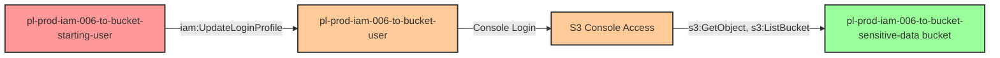

# One-Hop Privilege Escalation: iam:UpdateLoginProfile

* **Category:** Privilege Escalation
* **Sub-Category:** credential-access
* **Path Type:** one-hop
* **Target:** to-bucket
* **Environments:** prod
* **Cost Estimate:** $0/mo
* **Pathfinding.cloud ID:** iam-006
* **Technique:** User with iam:UpdateLoginProfile can reset password for user with S3 bucket access
* **Terraform Variable:** `enable_single_account_privesc_one_hop_to_bucket_iam_006_iam_updateloginprofile`
* **Schema Version:** 1.0.0
* **Attack Path:** starting_user → (iam:UpdateLoginProfile) → reset bucket_user password → console login → S3 bucket access
* **Attack Principals:** `arn:aws:iam::{account_id}:user/pl-prod-iam-006-to-bucket-starting-user`; `arn:aws:iam::{account_id}:user/pl-prod-iam-006-to-bucket-user`; `arn:aws:s3:::pl-prod-iam-006-to-bucket-sensitive-data-{account_id}`
* **Required Permissions:** `iam:UpdateLoginProfile` on `arn:aws:iam::*:user/pl-prod-iam-006-to-bucket-user`
* **Helpful Permissions:** `iam:ListUsers` (Discover users with login profiles); `iam:GetUser` (View user details); `iam:GetLoginProfile` (Verify user has login profile)
* **MITRE Tactics:** TA0004 - Privilege Escalation, TA0009 - Collection
* **MITRE Techniques:** T1098.001 - Account Manipulation: Additional Cloud Credentials, T1530 - Data from Cloud Storage Object

## Attack Overview

This scenario demonstrates a privilege escalation vulnerability where a user has permission to update the login profile (console password) of another user with S3 bucket access. Unlike the to-admin variant which targets administrative privileges, this scenario focuses on data exfiltration - showing that privilege escalation to sensitive data access can be just as critical as gaining admin rights.

The attacker modifies the console password for a user with S3 bucket access permissions, logs into the AWS console with the new credentials, and directly accesses sensitive data stored in S3 buckets. This path demonstrates that not all privilege escalation leads to admin access, yet the impact can be equally severe when sensitive data is the target.

### MITRE ATT&CK Mapping

- **Tactic**: Privilege Escalation (TA0004), Persistence (TA0003), Collection (TA0009)
- **Technique**: T1098.001 - Account Manipulation: Additional Cloud Credentials
- **Sub-technique**: T1530 - Data from Cloud Storage Object

### Principals in the attack path

- `arn:aws:iam::PROD_ACCOUNT:user/pl-prod-iam-006-to-bucket-starting-user` (Scenario-specific starting user)
- `arn:aws:iam::PROD_ACCOUNT:user/pl-prod-iam-006-to-bucket-user` (Target user with S3 bucket access)
- `arn:aws:s3:::pl-prod-iam-006-to-bucket-sensitive-data-ACCOUNT_ID-SUFFIX` (Sensitive data bucket)

### Attack Path Diagram



### Attack Steps

1. **Initial Access**: Start as `pl-prod-iam-006-to-bucket-starting-user` (credentials provided via Terraform outputs)
2. **Update Login Profile**: Use `iam:UpdateLoginProfile` to change the console password for `pl-prod-iam-006-to-bucket-user`
3. **Console Login**: Log into the AWS Management Console using the target user's credentials with the new password
4. **Access S3 Bucket**: Navigate to the S3 console and access the sensitive data bucket `pl-prod-iam-006-to-bucket-sensitive-data-*`
5. **Verification**: Read and download sensitive data using S3 read permissions

### Scenario specific resources created

| ARN | Purpose |
| -- | -- |
| `arn:aws:iam::PROD_ACCOUNT:user/pl-prod-iam-006-to-bucket-starting-user` | Scenario-specific starting user with access keys and UpdateLoginProfile permission |
| `arn:aws:iam::PROD_ACCOUNT:user/pl-prod-iam-006-to-bucket-user` | Target user with S3 bucket access and console login enabled |
| `arn:aws:iam::PROD_ACCOUNT:policy/pl-prod-iam-006-to-bucket-policy` | Allows `iam:UpdateLoginProfile` on `pl-prod-iam-006-to-bucket-user` only |
| `arn:aws:s3:::pl-prod-iam-006-to-bucket-sensitive-data-ACCOUNT_ID-SUFFIX` | Target S3 bucket containing sensitive data |
| `arn:aws:s3:::pl-prod-iam-006-to-bucket-sensitive-data-ACCOUNT_ID-SUFFIX/sensitive-data.txt` | Sensitive file in the target bucket |

## Attack Lab

### Prerequisites

1. Install the `plabs` CLI:
   ```bash
   brew install pathfinding-labs/tap/plabs
   ```
2. Configure your AWS profiles in `~/.plabs/plabs.yaml` (or run `plabs init` if you haven't already)

### Deploy with plabs non-interactive

```bash
plabs enable enable_single_account_privesc_one_hop_to_bucket_iam_006_iam_updateloginprofile
plabs apply
```

### Deploy with plabs tui

1. Launch the TUI: `plabs`
2. Navigate to this scenario in the scenarios list
3. Press `space` to enable it
4. Press `d` to deploy

### Executing the automated demo_attack script

The script will:
1. Display a step-by-step walkthrough with color-coded output
2. Show the commands being executed and their results
3. Verify successful privilege escalation to bucket access
4. Output standardized test results for automation

#### Resources created by attack script

- Updated console login profile password for `pl-prod-iam-006-to-bucket-user`

#### With plabs non-interactive

```bash
plabs demo --list
plabs demo iam-006-iam-updateloginprofile
```

#### With plabs tui

1. Launch the TUI: `plabs`
2. Navigate to this scenario in the scenarios list
3. Press `r` to run the demo script

### Cleanup

#### With plabs non-interactive

```bash
plabs cleanup --list
plabs cleanup iam-006-iam-updateloginprofile
```

#### With plabs tui

1. Launch the TUI: `plabs`
2. Navigate to this scenario in the scenarios list
3. Press `c` to run the cleanup script

### Teardown with plabs non-interactive

```bash
plabs disable enable_single_account_privesc_one_hop_to_bucket_iam_006_iam_updateloginprofile
plabs apply
```

### Teardown with plabs tui

1. Launch the TUI: `plabs`
2. Navigate to this scenario in the scenarios list
3. Press `space` to disable it
4. Press `D` to destroy

## Detecting Misconfiguration (CSPM)

### What CSPM tools should detect

- IAM user `pl-prod-iam-006-to-bucket-starting-user` has `iam:UpdateLoginProfile` permission on `pl-prod-iam-006-to-bucket-user`, enabling console credential takeover
- `pl-prod-iam-006-to-bucket-user` has S3 read permissions on a sensitive data bucket, making it a high-value target for credential takeover
- Privilege escalation path exists: starting user can reset another user's console password to gain S3 bucket access

### Prevention recommendations

- Avoid granting `iam:UpdateLoginProfile` permissions on users with sensitive data access (S3, databases, etc.)
- Use resource-based conditions to restrict which users can have login profiles updated: `"Condition": {"StringEquals": {"aws:username": "${aws:username}"}}`
- Implement SCPs to prevent login profile updates on users with data access roles
- Monitor CloudTrail for `UpdateLoginProfile` API calls, especially on users with S3 permissions
- Enable MFA requirements for users with sensitive data access
- Use IAM Access Analyzer to identify privilege escalation paths to sensitive resources, not just admin access
- Implement S3 bucket policies that require MFA for object access
- Enable S3 access logging and CloudTrail data events to track data access patterns
- Consider using AWS Secrets Manager or Parameter Store instead of long-lived IAM user credentials
- Regularly review and rotate console passwords for users with data access

## Detection Abuse (CloudSIEM)

### CloudTrail events to monitor

- `IAM: UpdateLoginProfile` — Console password reset for an IAM user; critical when the target user has S3 bucket access permissions
- `S3: GetObject` — Object retrieval from S3; high severity when preceded by a login profile update on the accessing user
- `S3: ListBucket` — Bucket enumeration; monitor for access following a login profile change event

### Detonation logs

_Detonation log integration (Stratus Red Team / Grimoire) is planned for a future release._
