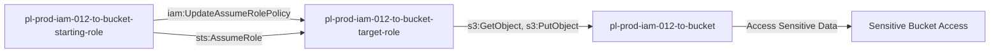

# One-Hop Privilege Escalation: iam:UpdateAssumeRolePolicy

* **Category:** Privilege Escalation
* **Sub-Category:** principal-access
* **Path Type:** one-hop
* **Target:** to-bucket
* **Environments:** prod
* **Cost Estimate:** $0/mo
* **Pathfinding.cloud ID:** iam-012
* **Technique:** User with iam:UpdateAssumeRolePolicy can modify role trust policy to assume role with S3 access
* **Terraform Variable:** `enable_single_account_privesc_one_hop_to_bucket_iam_012_iam_updateassumerolepolicy`
* **Schema Version:** 1.0.0
* **Attack Path:** starting_user → (iam:UpdateAssumeRolePolicy) → modify role trust → (sts:AssumeRole) → S3 bucket access
* **Attack Principals:** `arn:aws:iam::{account_id}:user/pl-prod-iam-012-to-bucket-starting-user`; `arn:aws:iam::{account_id}:role/pl-prod-iam-012-to-bucket-starting-role`; `arn:aws:iam::{account_id}:role/pl-prod-iam-012-to-bucket-target-role`; `arn:aws:s3:::pl-prod-iam-012-to-bucket-{account_id}-{resource_suffix}`
* **Required Permissions:** `iam:UpdateAssumeRolePolicy` on `arn:aws:iam::*:role/pl-prod-iam-012-to-bucket-target-role`; `sts:AssumeRole` on `arn:aws:iam::*:role/pl-prod-iam-012-to-bucket-target-role`
* **Helpful Permissions:** `iam:ListRoles` (Discover roles with S3 access); `iam:GetRole` (View current trust policy before modification)
* **MITRE Tactics:** TA0004 - Privilege Escalation, TA0009 - Collection
* **MITRE Techniques:** T1098 - Account Manipulation, T1530 - Data from Cloud Storage Object

## Attack Overview

This scenario demonstrates privilege escalation where an attacker with `iam:UpdateAssumeRolePolicy` permission can modify a role's trust policy to allow themselves to assume it. The attacker modifies a role with S3 bucket access, adds their own role to the trust policy, and then assumes the role to access sensitive data.

### MITRE ATT&CK Mapping

- **Tactic**: Privilege Escalation, Collection
- **Technique**: T1078.004 - Valid Accounts: Cloud Accounts
- **Sub-technique**: T1530 - Data from Cloud Storage Object

### Principals in the attack path

- `arn:aws:iam::PROD_ACCOUNT:user/pl-prod-iam-012-to-bucket-starting-user`
- `arn:aws:iam::PROD_ACCOUNT:role/pl-prod-iam-012-to-bucket-starting-role`
- `arn:aws:iam::PROD_ACCOUNT:role/pl-prod-iam-012-to-bucket-target-role`
- `arn:aws:s3:::pl-prod-iam-012-to-bucket-ACCOUNT_ID-SUFFIX`

### Attack Path Diagram



### Attack Steps

1. **Scaffolding aka Initial Access**: `pl-prod-iam-012-to-bucket-starting-user` assumes the role `pl-prod-iam-012-to-bucket-starting-role` to begin the scenario
2. **Modify Trust Policy**: Use `iam:UpdateAssumeRolePolicy` to update the trust policy of `pl-prod-iam-012-to-bucket-target-role` to allow the starting role to assume it
3. **Assume Bucket Access Role**: Assume the `pl-prod-iam-012-to-bucket-target-role` which has S3 permissions
4. **Access S3 Bucket**: Read and download sensitive data from the target bucket

### Scenario specific resources created

| ARN | Purpose |
| -- | -- |
| `arn:aws:iam::PROD_ACCOUNT:user/pl-prod-iam-012-to-bucket-starting-user` | Starting user for the scenario |
| `arn:aws:iam::PROD_ACCOUNT:role/pl-prod-iam-012-to-bucket-starting-role` | Starting principal with UpdateAssumeRolePolicy permission |
| `arn:aws:iam::PROD_ACCOUNT:role/pl-prod-iam-012-to-bucket-target-role` | Target role with S3 bucket permissions |
| `arn:aws:s3:::pl-prod-iam-012-to-bucket-ACCOUNT_ID-SUFFIX` | Target S3 bucket containing sensitive data |
| `arn:aws:s3:::pl-prod-iam-012-to-bucket-ACCOUNT_ID-SUFFIX/sensitive-data.txt` | Sensitive file in the target bucket |

## Attack Lab

### Prerequisites

1. Install the `plabs` CLI:
   ```bash
   brew install pathfinding-labs/tap/plabs
   ```
2. Configure your AWS profiles in `~/.plabs/plabs.yaml` (or run `plabs init` if you haven't already)

### Deploy with plabs non-interactive

```bash
plabs enable enable_single_account_privesc_one_hop_to_bucket_iam_012_iam_updateassumerolepolicy
plabs apply
```

### Deploy with plabs tui

1. Launch the TUI: `plabs`
2. Navigate to this scenario in the scenarios list
3. Press `space` to enable it
4. Press `d` to deploy

### Executing the automated demo_attack script

The script will:
1. Display a step-by-step walkthrough with color-coded output
2. Show the commands being executed and their results
3. Verify successful privilege escalation to bucket access
4. Output standardized test results for automation

#### Resources created by attack script

- Modified trust policy on `pl-prod-iam-012-to-bucket-target-role` allowing the starting role to assume it

#### With plabs non-interactive

```bash
plabs demo --list
plabs demo iam-012-iam-updateassumerolepolicy
```

#### With plabs tui

1. Launch the TUI: `plabs`
2. Navigate to this scenario in the scenarios list
3. Press `r` to run the demo script

### Cleanup

#### With plabs non-interactive

```bash
plabs cleanup --list
plabs cleanup iam-012-iam-updateassumerolepolicy
```

#### With plabs tui

1. Launch the TUI: `plabs`
2. Navigate to this scenario in the scenarios list
3. Press `c` to run the cleanup script

### Teardown with plabs non-interactive

```bash
plabs disable enable_single_account_privesc_one_hop_to_bucket_iam_012_iam_updateassumerolepolicy
plabs apply
```

### Teardown with plabs tui

1. Launch the TUI: `plabs`
2. Navigate to this scenario in the scenarios list
3. Press `space` to disable it
4. Press `D` to destroy

## Detecting Misconfiguration (CSPM)

### What CSPM tools should detect

- IAM principal has `iam:UpdateAssumeRolePolicy` permission, enabling modification of role trust policies for privilege escalation
- Role trust policy can be modified to allow unintended principals to assume it
- Role with S3 bucket access (`pl-prod-iam-012-to-bucket-target-role`) has a trust policy modifiable by a lower-privileged principal
- Privilege escalation path exists: starting role → UpdateAssumeRolePolicy → target role → S3 access

### Prevention recommendations

- Avoid granting `iam:UpdateAssumeRolePolicy` permissions
- Use resource-based conditions to restrict which roles can have trust policies modified
- Implement SCPs to prevent trust policy modification for sensitive roles
- Monitor CloudTrail for `UpdateAssumeRolePolicy` API calls followed by `AssumeRole` and S3 access
- Enable MFA requirements for sensitive operations
- Use IAM Access Analyzer to identify privilege escalation paths
- Implement S3 bucket policies that restrict access even for privileged roles
- Enable S3 access logging to track data access patterns
- Use AWS Config rules to detect unauthorized trust policy changes

## Detection Abuse (CloudSIEM)

### CloudTrail events to monitor

- `IAM: UpdateAssumeRolePolicy` — Trust policy of a role was modified; critical when performed by a non-admin principal on a role with elevated permissions
- `STS: AssumeRole` — Role assumption event; suspicious when the assuming principal recently modified the target role's trust policy
- `S3: GetObject` — Object retrieved from S3; high severity when the accessing role was recently assumed via a modified trust policy
- `STS: GetCallerIdentity` — Identity check often performed by attackers to verify successful role assumption

### Detonation logs

_Detonation log integration (Stratus Red Team / Grimoire) is planned for a future release._

