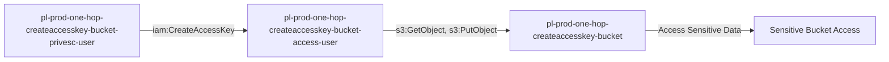

# One-Hop Privilege Escalation: iam:CreateAccessKey

**Scenario Type:** One-Hop
**Target:** S3 Bucket Access
**Technique:** Access key creation for bucket-access user via iam:CreateAccessKey

## Overview

This scenario demonstrates a privilege escalation vulnerability where a user has permission to create access keys for another user with S3 bucket access. The attacker creates new access keys for the privileged user and uses those credentials to access sensitive S3 buckets.

## Understanding the attack scenario

### Principals in the attack path

- `arn:aws:iam::PROD_ACCOUNT:user/pl-prod-one-hop-createaccesskey-bucket-privesc-user`
- `arn:aws:iam::PROD_ACCOUNT:user/pl-prod-one-hop-createaccesskey-bucket-access-user`
- `arn:aws:s3:::pl-prod-one-hop-createaccesskey-bucket-ACCOUNT_ID-SUFFIX`

### Attack Path Diagram



### Attack Steps

1. **Scaffolding aka Initial Access**: Authenticate as `pl-prod-one-hop-createaccesskey-bucket-privesc-user` to begin the scenario
2. **Create Access Keys**: Use `iam:CreateAccessKey` to create new access keys for `pl-prod-one-hop-createaccesskey-bucket-access-user`
3. **Switch Context**: Configure AWS CLI to use the newly created access keys
4. **Access S3 Bucket**: Read and download sensitive data from the target bucket

### Scenario specific resources created

| ARN | Purpose |
| -- | -- |
| `arn:aws:iam::PROD_ACCOUNT:user/pl-prod-one-hop-createaccesskey-bucket-privesc-user` | Starting principal with CreateAccessKey permission |
| `arn:aws:iam::PROD_ACCOUNT:user/pl-prod-one-hop-createaccesskey-bucket-access-user` | Destination principal with S3 bucket access |
| `arn:aws:s3:::pl-prod-one-hop-createaccesskey-bucket-ACCOUNT_ID-SUFFIX` | Target S3 bucket containing sensitive data |
| `arn:aws:s3:::pl-prod-one-hop-createaccesskey-bucket-ACCOUNT_ID-SUFFIX/sensitive-data.txt` | Sensitive file in the target bucket |

## Executing the attack

### Using the automated demo_attack.sh

To demonstrate the privilege escalation path, run the provided demo script:

```bash
cd modules/scenarios/single-account/privesc-one-hop/to-bucket/iam-createaccesskey
./demo_attack.sh
```

The script will:
1. Display a step-by-step walkthrough with color-coded output
2. Show the commands being executed and their results
3. Verify successful privilege escalation to bucket access
4. Output standardized test results for automation

### Cleaning up the attack artifacts

After demonstrating the attack, clean up the access keys created during the demo:

```bash
cd modules/scenarios/single-account/privesc-one-hop/to-bucket/iam-createaccesskey
./cleanup_attack.sh
```

## Detection and prevention


### MITRE ATT&CK Mapping

- **Tactic**: Privilege Escalation, Persistence, Collection
- **Technique**: T1098.001 - Account Manipulation: Additional Cloud Credentials
- **Sub-technique**: T1530 - Data from Cloud Storage Object


## Prevention recommendations

- Avoid granting `iam:CreateAccessKey` permissions on privileged users
- Use resource-based conditions to restrict which users can have keys created
- Implement SCPs to prevent access key creation on privileged users
- Monitor CloudTrail for `CreateAccessKey` API calls on privileged accounts
- Enable MFA requirements for sensitive operations
- Use IAM Access Analyzer to identify privilege escalation paths
- Implement S3 bucket policies that restrict access even for privileged users
- Enable S3 access logging to track data access patterns

