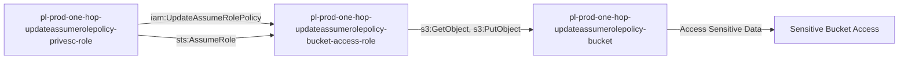

# One-Hop Privilege Escalation: iam:UpdateAssumeRolePolicy

**Scenario Type:** One-Hop
* **Target:** S3 Bucket Access
* **Technique:** Trust policy modification via iam:UpdateAssumeRolePolicy

## Overview

This scenario demonstrates privilege escalation where an attacker with `iam:UpdateAssumeRolePolicy` permission can modify a role's trust policy to allow themselves to assume it. The attacker modifies a role with S3 bucket access, adds their own role to the trust policy, and then assumes the role to access sensitive data.

## Understanding the attack scenario

### Principals in the attack path

- `arn:aws:iam::PROD_ACCOUNT:user/pl-pathfinder-starting-user-prod`
- `arn:aws:iam::PROD_ACCOUNT:role/pl-prod-one-hop-updateassumerolepolicy-privesc-role`
- `arn:aws:iam::PROD_ACCOUNT:role/pl-prod-one-hop-updateassumerolepolicy-bucket-access-role`
- `arn:aws:s3:::pl-prod-one-hop-updateassumerolepolicy-bucket-SUFFIX`

### Attack Path Diagram



### Attack Steps

1. **Scaffolding aka Initial Access**: `pl-pathfinder-starting-user-prod` assumes the role `pl-prod-one-hop-updateassumerolepolicy-privesc-role` to begin the scenario
2. **Modify Trust Policy**: Use `iam:UpdateAssumeRolePolicy` to update the trust policy of `pl-prod-one-hop-updateassumerolepolicy-bucket-access-role` to allow the privesc role to assume it
3. **Assume Bucket Access Role**: Assume the `pl-prod-one-hop-updateassumerolepolicy-bucket-access-role` which has S3 permissions
4. **Access S3 Bucket**: Read and download sensitive data from the target bucket

### Scenario specific resources created

| ARN | Purpose |
| -- | -- |
| `arn:aws:iam::PROD_ACCOUNT:role/pl-prod-one-hop-updateassumerolepolicy-privesc-role` | Starting principal with UpdateAssumeRolePolicy permission |
| `arn:aws:iam::PROD_ACCOUNT:role/pl-prod-one-hop-updateassumerolepolicy-bucket-access-role` | Target role with S3 bucket permissions |
| `arn:aws:s3:::pl-prod-one-hop-updateassumerolepolicy-bucket-SUFFIX` | Target S3 bucket containing sensitive data |
| `arn:aws:s3:::pl-prod-one-hop-updateassumerolepolicy-bucket-SUFFIX/sensitive-data.txt` | Sensitive file in the target bucket |

## Executing the attack

### Using the automated demo_attack.sh

To demonstrate the privilege escalation path, run the provided demo script:

```bash
cd modules/scenarios/single-account/privesc-one-hop/to-bucket/iam-updateassumerolepolicy
./demo_attack.sh
```

The script will:
1. Display a step-by-step walkthrough with color-coded output
2. Show the commands being executed and their results
3. Verify successful privilege escalation to bucket access
4. Output standardized test results for automation

### Cleaning up the attack artifacts

After demonstrating the attack, clean up the modified trust policy:

```bash
cd modules/scenarios/single-account/privesc-one-hop/to-bucket/iam-updateassumerolepolicy
./cleanup_attack.sh
```

## Detection and prevention


### MITRE ATT&CK Mapping

- **Tactic**: Privilege Escalation, Collection
- **Technique**: T1078.004 - Valid Accounts: Cloud Accounts
- **Sub-technique**: T1530 - Data from Cloud Storage Object


## Prevention recommendations

- Avoid granting `iam:UpdateAssumeRolePolicy` permissions
- Use resource-based conditions to restrict which roles can have trust policies modified
- Implement SCPs to prevent trust policy modification for sensitive roles
- Monitor CloudTrail for `UpdateAssumeRolePolicy` API calls followed by `AssumeRole` and S3 access
- Enable MFA requirements for sensitive operations
- Use IAM Access Analyzer to identify privilege escalation paths
- Implement S3 bucket policies that restrict access even for privileged roles
- Enable S3 access logging to track data access patterns
- Use AWS Config rules to detect unauthorized trust policy changes

