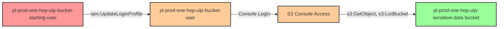

# One-Hop Privilege Escalation: iam:UpdateLoginProfile

**Scenario Type:** One-Hop
* **Target:** S3 Bucket Access
* **Technique:** Login profile modification for bucket-access user via iam:UpdateLoginProfile

## Overview

This scenario demonstrates a privilege escalation vulnerability where a user has permission to update the login profile (console password) of another user with S3 bucket access. Unlike the to-admin variant which targets administrative privileges, this scenario focuses on data exfiltration - showing that privilege escalation to sensitive data access can be just as critical as gaining admin rights.

The attacker modifies the console password for a user with S3 bucket access permissions, logs into the AWS console with the new credentials, and directly accesses sensitive data stored in S3 buckets. This path demonstrates that not all privilege escalation leads to admin access, yet the impact can be equally severe when sensitive data is the target.

## Understanding the attack scenario

### Principals in the attack path

- `arn:aws:iam::PROD_ACCOUNT:user/pl-prod-one-hop-ulp-bucket-starting-user` (Scenario-specific starting user)
- `arn:aws:iam::PROD_ACCOUNT:user/pl-prod-one-hop-ulp-bucket-user` (Target user with S3 bucket access)
- `arn:aws:s3:::pl-prod-one-hop-ulp-sensitive-data-ACCOUNT_ID-SUFFIX` (Sensitive data bucket)

### Attack Path Diagram



### Attack Steps

1. **Initial Access**: Start as `pl-prod-one-hop-ulp-bucket-starting-user` (credentials provided via Terraform outputs)
2. **Update Login Profile**: Use `iam:UpdateLoginProfile` to change the console password for `pl-prod-one-hop-ulp-bucket-user`
3. **Console Login**: Log into the AWS Management Console using the target user's credentials with the new password
4. **Access S3 Bucket**: Navigate to the S3 console and access the sensitive data bucket `pl-prod-one-hop-ulp-sensitive-data-*`
5. **Verification**: Read and download sensitive data using S3 read permissions

### Scenario specific resources created

| ARN | Purpose |
| -- | -- |
| `arn:aws:iam::PROD_ACCOUNT:user/pl-prod-one-hop-ulp-bucket-starting-user` | Scenario-specific starting user with access keys and UpdateLoginProfile permission |
| `arn:aws:iam::PROD_ACCOUNT:user/pl-prod-one-hop-ulp-bucket-user` | Target user with S3 bucket access and console login enabled |
| `arn:aws:iam::PROD_ACCOUNT:policy/pl-prod-one-hop-updateloginprofile-bucket-policy` | Allows `iam:UpdateLoginProfile` on `pl-prod-one-hop-ulp-bucket-user` only |
| `arn:aws:s3:::pl-prod-one-hop-ulp-sensitive-data-ACCOUNT_ID-SUFFIX` | Target S3 bucket containing sensitive data |
| `arn:aws:s3:::pl-prod-one-hop-ulp-sensitive-data-ACCOUNT_ID-SUFFIX/sensitive-data.txt` | Sensitive file in the target bucket |

## Executing the attack

### Using the automated demo_attack.sh

To demonstrate the privilege escalation path, run the provided demo script:

```bash
cd modules/scenarios/single-account/privesc-one-hop/to-bucket/iam-updateloginprofile
./demo_attack.sh
```

The script will:
1. Display a step-by-step walkthrough with color-coded output
2. Show the commands being executed and their results
3. Verify successful privilege escalation to bucket access
4. Output standardized test results for automation

### Cleaning up the attack artifacts

After demonstrating the attack, clean up the password change by restoring the original login profile:

```bash
cd modules/scenarios/single-account/privesc-one-hop/to-bucket/iam-updateloginprofile
./cleanup_attack.sh
```

## Detection and prevention


### MITRE ATT&CK Mapping

- **Tactic**: Privilege Escalation (TA0004), Persistence (TA0003), Collection (TA0009)
- **Technique**: T1098.001 - Account Manipulation: Additional Cloud Credentials
- **Sub-technique**: T1530 - Data from Cloud Storage Object


## Prevention recommendations

- Avoid granting `iam:UpdateLoginProfile` permissions on users with sensitive data access (S3, databases, etc.)
- Use resource-based conditions to restrict which users can have login profiles updated: `"Condition": {"StringEquals": {"aws:username": "${aws:username}"}}`
- Implement SCPs to prevent login profile updates on users with data access roles
- Monitor CloudTrail for `UpdateLoginProfile` API calls, especially on users with S3 permissions
- Enable MFA requirements for users with sensitive data access
- Use IAM Access Analyzer to identify privilege escalation paths to sensitive resources, not just admin access
- Implement S3 bucket policies that require MFA for object access
- Enable S3 access logging and CloudTrail data events to track data access patterns
- Consider using AWS Secrets Manager or Parameter Store instead of long-lived IAM user credentials
- Regularly review and rotate console passwords for users with data access
