# One-Hop Privilege Escalation: ssm:StartSession to EC2 with S3 Bucket Access

* **Category:** Privilege Escalation
* **Sub-Category:** existing-passrole
* **Path Type:** one-hop
* **Target:** to-bucket
* **Environments:** prod
* **Pathfinding.cloud ID:** ssm-001
* **Technique:** Start interactive shell sessions on EC2 instances with S3 access roles to extract credentials via IMDS and access sensitive buckets

## Overview

This scenario demonstrates a privilege escalation vulnerability where an IAM user has permission to start interactive shell sessions on EC2 instances via AWS Systems Manager (SSM) Session Manager. The attacker can establish an SSH-like interactive session to an EC2 instance that has an IAM role with S3 bucket access permissions, extract the temporary credentials from the EC2 Instance Metadata Service (IMDS), and then use those credentials locally to access sensitive S3 buckets.

This attack vector is particularly stealthy because SSM Session Manager provides shell access without requiring network connectivity, open SSH ports, or SSH keys. Unlike traditional SSH-based attacks, session access is often granted broadly across engineering teams for legitimate troubleshooting purposes, making this a realistic initial access vector. The technique provides SSH-like access via AWS API calls, bypassing traditional network security controls and leaving minimal forensic evidence if SSM Session Manager logging is not properly configured.

The extracted credentials are time-limited but fully functional AWS credentials (AccessKeyId, SecretAccessKey, and SessionToken) that can be used from any location to access sensitive data stores. The Instance Metadata Service (IMDS) at http://169.254.169.254 exposes these credentials to any process running on the EC2 instance, including an attacker with SSM session access.

## Understanding the attack scenario

### Principals in the attack path

- `arn:aws:iam::PROD_ACCOUNT:user/pl-prod-ssm-001-to-bucket-starting-user` (Scenario-specific starting user)
- `arn:aws:ec2:REGION:PROD_ACCOUNT:instance/i-xxxxxxxxx` (EC2 instance with SSM agent)
- `arn:aws:iam::PROD_ACCOUNT:role/pl-prod-ssm-001-to-bucket-ec2-role` (S3 access role attached to EC2 instance)
- `arn:aws:s3:::pl-sensitive-data-ssm-001-to-bucket-PROD_ACCOUNT-SUFFIX` (Target sensitive S3 bucket)

### Attack Path Diagram

```mermaid
graph LR
    A[pl-prod-ssm-001-to-bucket-starting-user] -->|ssm:StartSession| B[Interactive Shell on EC2]
    B -->|curl IMDS| C[Extract S3 Role Credentials]
    C -->|Use Locally| D[Access S3 Bucket]
    D -->|s3:GetObject| E[Download Sensitive Data]

    style A fill:#ff9999,stroke:#333,stroke-width:2px
    style B fill:#ffcc99,stroke:#333,stroke-width:2px
    style C fill:#ffcc99,stroke:#333,stroke-width:2px
    style D fill:#99ff99,stroke:#333,stroke-width:2px
    style E fill:#99ff99,stroke:#333,stroke-width:2px
```



### Attack Steps

1. **Initial Access**: Start as `pl-prod-ssm-001-to-bucket-starting-user` (credentials provided via Terraform outputs)
2. **Discover Target Instances**: Use `ec2:DescribeInstances` or `ssm:DescribeInstanceInformation` to identify EC2 instances with IAM roles that have S3 access permissions
3. **Start Interactive Session**: Use `ssm:StartSession` to establish an interactive shell session on the target EC2 instance
4. **Extract Credentials via IMDS**: From within the interactive session, query the Instance Metadata Service using IMDSv2 token-based authentication:
   - First, obtain a session token: `TOKEN=$(curl -X PUT "http://169.254.169.254/latest/api/token" -H "X-aws-ec2-metadata-token-ttl-seconds: 21600")`
   - Then, extract the role name: `ROLE=$(curl -H "X-aws-ec2-metadata-token: $TOKEN" http://169.254.169.254/latest/meta-data/iam/security-credentials/)`
   - Finally, retrieve credentials: `curl -H "X-aws-ec2-metadata-token: $TOKEN" http://169.254.169.254/latest/meta-data/iam/security-credentials/$ROLE`
5. **Configure Local Credentials**: Exit the SSM session and export the extracted credentials (access key, secret key, session token) as environment variables in the local shell
6. **Access S3 Bucket**: Use the extracted credentials to list and download objects from the sensitive S3 bucket
7. **Verification**: Verify successful bucket access by downloading sensitive data files

### Scenario specific resources created

| ARN | Purpose |
| -- | -- |
| `arn:aws:iam::PROD_ACCOUNT:user/pl-prod-ssm-001-to-bucket-starting-user` | Scenario-specific starting user with access keys and SSM StartSession permissions |
| `arn:aws:iam::PROD_ACCOUNT:role/pl-prod-ssm-001-to-bucket-ec2-role` | S3 access role attached to the EC2 instance (target for credential extraction) |
| `arn:aws:iam::PROD_ACCOUNT:instance-profile/pl-prod-ssm-001-to-bucket-instance-profile` | Instance profile associating the S3 role with the EC2 instance |
| `arn:aws:ec2:REGION:PROD_ACCOUNT:instance/i-xxxxxxxxx` | EC2 instance with SSM agent and S3 access role attached |
| `arn:aws:s3:::pl-sensitive-data-ssm-001-to-bucket-PROD_ACCOUNT-SUFFIX` | Target S3 bucket containing sensitive data |
| `arn:aws:s3:::pl-sensitive-data-ssm-001-to-bucket-PROD_ACCOUNT-SUFFIX/sensitive-data.txt` | Sensitive file in the target bucket |

## Executing the attack

### Using the automated demo_attack.sh

To demonstrate the privilege escalation path, run the provided demo script:

```bash
cd modules/scenarios/single-account/privesc-one-hop/to-bucket/ssm-001-ssm-startsession
./demo_attack.sh
```

The script will:
1. Display a step-by-step walkthrough with color-coded output
2. Show the commands being executed and their results
3. Verify successful privilege escalation to S3 bucket access
4. Output standardized test results for automation

### Cleaning up the attack artifacts

After demonstrating the attack, clean up the extracted credentials and any temporary files:

```bash
cd modules/scenarios/single-account/privesc-one-hop/to-bucket/ssm-001-ssm-startsession
./cleanup_attack.sh
```

Note: The cleanup script removes temporary credential files and downloaded data but does not terminate the EC2 instance or delete the S3 bucket, as those are managed by Terraform.

## Detection and prevention

### What CSPM tools should detect

A properly configured Cloud Security Posture Management (CSPM) tool should identify the following security issues:

1. **EC2 instances with sensitive data access**: Instances with IAM roles that grant access to sensitive S3 buckets or other data stores represent a significant risk, especially if those instances are also accessible via SSM Session Manager.

2. **Principals with ssm:StartSession on wildcard resources**: The ability to start interactive sessions on any EC2 instance in the account should be restricted to specific instances using resource ARNs or IAM condition keys.

3. **Lack of IAM condition keys restricting SSM access**: Policies should use conditions like `ssm:resourceTag/Environment` to limit which instances can be targeted for interactive sessions.

4. **Missing AWS Systems Manager Session Manager logging**: SSM sessions should be logged to CloudWatch Logs or S3 for audit and forensic purposes.

5. **EC2 instances without IMDSv2 enforcement**: The Instance Metadata Service should be configured to require IMDSv2, which provides protection against SSRF attacks and makes metadata extraction more difficult (though still possible from an interactive shell).

6. **Overly permissive S3 bucket access from EC2 roles**: EC2 instance roles should only have access to specific S3 prefixes or objects, not entire buckets with sensitive data.

7. **Privilege escalation path via SSM**: Tools should detect that a principal with ssm:StartSession can gain access to credentials of EC2 instance roles, creating a privilege escalation path to S3 bucket access.

### CloudTrail detection patterns

Monitor for the following suspicious event patterns:

**Credential Extraction Pattern**:
```
1. ssm:StartSession (targeting instance with S3 access role)
2. S3 API calls using instance role credentials from non-EC2 IP addresses
3. S3 API calls using instance role credentials from different geographic locations than the EC2 instance
```

**Anomalous S3 Access**:
- Instance role credentials being used for S3 access from IP addresses that don't match the EC2 instance's IP
- Instance role credentials being used for S3 access from geographic locations inconsistent with the EC2 instance region
- High-volume S3 GetObject operations from instance role credentials outside normal usage patterns
- Instance role credentials used for S3 access after the EC2 instance has been terminated or stopped
- Unusual access patterns to sensitive S3 buckets (e.g., full bucket downloads, access to rarely accessed objects)

**SSM Session Anomalies**:
- SSM session initiated by principals who rarely or never use SSM
- SSM sessions to instances with sensitive data access roles
- Multiple SSM sessions initiated in rapid succession
- SSM sessions outside normal business hours

### MITRE ATT&CK Mapping

- **Tactic**: TA0004 - Privilege Escalation
- **Tactic**: TA0006 - Credential Access
- **Technique**: T1552.005 - Unsecured Credentials: Cloud Instance Metadata API
- **Technique**: T1078.004 - Valid Accounts: Cloud Accounts

## Prevention recommendations

- **Restrict ssm:StartSession with resource conditions**: Use IAM policy conditions to limit SSM session access to specific instances or instances with specific tags:
  ```json
  {
    "Effect": "Allow",
    "Action": "ssm:StartSession",
    "Resource": "arn:aws:ec2:*:*:instance/*",
    "Condition": {
      "StringEquals": {
        "ssm:resourceTag/Environment": "dev"
      }
    }
  }
  ```

- **Apply least privilege to EC2 instance roles**: EC2 instances should only have the minimum S3 permissions necessary for their function. Restrict bucket access to specific prefixes and use `s3:GetObject` instead of `s3:*`:
  ```json
  {
    "Effect": "Allow",
    "Action": ["s3:GetObject", "s3:PutObject"],
    "Resource": "arn:aws:s3:::my-bucket/application-data/*"
  }
  ```

- **Enforce IMDSv2 on all EC2 instances**: Require Instance Metadata Service Version 2 (IMDSv2), which uses session-based authentication and provides protection against SSRF attacks. Note that IMDSv2 does not prevent credential extraction from interactive shell access, but it does prevent SSRF-based extraction:
  ```bash
  aws ec2 modify-instance-metadata-options \
    --instance-id i-1234567890abcdef0 \
    --http-tokens required
  ```

- **Enable SSM Session Manager logging**: Configure AWS Systems Manager to log all session activity to CloudWatch Logs or S3 for audit and forensic analysis:
  ```json
  {
    "schemaVersion": "1.0",
    "description": "Document to hold regional settings for Session Manager",
    "sessionType": "Standard_Stream",
    "inputs": {
      "s3BucketName": "my-session-logs-bucket",
      "s3KeyPrefix": "session-logs/",
      "cloudWatchLogGroupName": "/aws/ssm/sessions",
      "cloudWatchEncryptionEnabled": true
    }
  }
  ```

- **Implement S3 bucket policies with VPC endpoint restrictions**: Restrict S3 bucket access to specific VPC endpoints, ensuring that only resources within the expected VPC can access the bucket:
  ```json
  {
    "Effect": "Deny",
    "Principal": "*",
    "Action": "s3:*",
    "Resource": ["arn:aws:s3:::my-bucket/*", "arn:aws:s3:::my-bucket"],
    "Condition": {
      "StringNotEquals": {
        "aws:sourceVpce": "vpce-1234567"
      }
    }
  }
  ```

- **Monitor CloudTrail for suspicious SSM and S3 activity**: Create CloudWatch alarms or SIEM rules for:
  - `ssm:StartSession` events targeting instances with S3 access roles
  - S3 API calls from instance role credentials originating from non-EC2 IP addresses
  - Unusual S3 access patterns (bulk downloads, accessing many objects rapidly)
  - S3 access using instance role credentials after the instance has been terminated

- **Implement Service Control Policies (SCPs)**: Use AWS Organizations SCPs to prevent overly broad SSM permissions at the organization level:
  ```json
  {
    "Version": "2012-10-17",
    "Statement": [{
      "Effect": "Deny",
      "Action": "ssm:StartSession",
      "Resource": "*",
      "Condition": {
        "StringNotEquals": {
          "ssm:resourceTag/SSMAccess": "Allowed"
        }
      }
    }]
  }
  ```

- **Use IAM Access Analyzer**: Regularly scan for privilege escalation paths involving SSM and EC2 instance roles using AWS IAM Access Analyzer or third-party tools like Pathfinding.cloud.

- **Enable S3 Access Logging**: Configure S3 access logging to track all access to sensitive buckets, enabling detection of unusual access patterns:
  ```bash
  aws s3api put-bucket-logging \
    --bucket my-sensitive-bucket \
    --bucket-logging-status file://logging.json
  ```

- **Tag sensitive resources**: Apply consistent tags to sensitive S3 buckets and EC2 instances with access to those buckets, enabling automated policy enforcement and monitoring.

- **Implement session duration limits**: Configure maximum session durations for EC2 instance roles to limit the window of opportunity for credential extraction:
  ```json
  {
    "Effect": "Allow",
    "Principal": {
      "Service": "ec2.amazonaws.com"
    },
    "Action": "sts:AssumeRole",
    "Condition": {
      "NumericLessThanEquals": {
        "sts:DurationSeconds": 3600
      }
    }
  }
  ```

- **Use AWS PrivateLink for S3**: Configure VPC endpoints for S3 and enforce that all S3 access must come through the VPC endpoint, preventing access from extracted credentials used outside the VPC.

- **Enable GuardDuty**: AWS GuardDuty can detect anomalous behavior such as unusual S3 API calls or credential usage patterns that may indicate compromised instance credentials.
