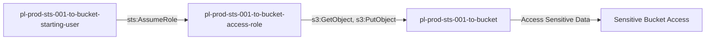

# One-Hop Privilege Escalation: sts:AssumeRole

* **Category:** Privilege Escalation
* **Sub-Category:** existing-passrole
* **Path Type:** one-hop
* **Target:** to-bucket
* **Environments:** prod
* **Cost Estimate:** $0/mo
* **Pathfinding.cloud ID:** sts-001
* **Technique:** User with sts:AssumeRole can directly assume role with S3 bucket access
* **Terraform Variable:** `enable_single_account_privesc_one_hop_to_bucket_sts_001_sts_assumerole`
* **Schema Version:** 1.0.0
* **Attack Path:** starting_user → (sts:AssumeRole) → bucket_role → S3 bucket access
* **Attack Principals:** `arn:aws:iam::{account_id}:user/pl-prod-sts-001-to-bucket-starting-user`; `arn:aws:iam::{account_id}:role/pl-prod-sts-001-to-bucket-access-role`; `arn:aws:s3:::pl-prod-sts-001-to-bucket-{account_id}`
* **Required Permissions:** `sts:AssumeRole` on `arn:aws:iam::*:role/pl-prod-sts-001-to-bucket-access-role`
* **Helpful Permissions:** `iam:ListRoles` (Discover available roles to assume); `iam:GetRole` (View role permissions and trust policy); `s3:ListBucket` (Verify S3 access after role assumption)
* **MITRE Tactics:** TA0004 - Privilege Escalation, TA0009 - Collection
* **MITRE Techniques:** T1078.004 - Valid Accounts: Cloud Accounts, T1530 - Data from Cloud Storage Object

## Attack Overview

This scenario demonstrates a simple but common privilege escalation pattern where a user can assume a role that grants access to sensitive S3 buckets. The attacker starts with minimal permissions but can assume a role with S3 access permissions, allowing them to read and write to a sensitive bucket.

### MITRE ATT&CK Mapping

- **Tactic**: Privilege Escalation, Collection
- **Technique**: T1078.004 - Valid Accounts: Cloud Accounts
- **Sub-technique**: Abuse of cloud credentials to access resources

### Principals in the attack path

- `arn:aws:iam::PROD_ACCOUNT:user/pl-prod-sts-001-to-bucket-starting-user`
- `arn:aws:iam::PROD_ACCOUNT:role/pl-prod-sts-001-to-bucket-access-role`
- `arn:aws:s3:::pl-prod-sts-001-to-bucket-ACCOUNT_ID-SUFFIX`

### Attack Path Diagram



### Attack Steps

1. **Scaffolding aka Initial Access**: `pl-prod-sts-001-to-bucket-starting-user` assumes the role `pl-prod-sts-001-to-bucket-access-role` to begin the scenario
2. **Access S3 Bucket**: The assumed role has `s3:ListBucket`, `s3:GetObject`, and `s3:PutObject` permissions on the target bucket
3. **Verification**: Access and download sensitive data from the bucket

### Scenario specific resources created

| ARN | Purpose |
| -- | -- |
| `arn:aws:iam::PROD_ACCOUNT:role/pl-prod-sts-001-to-bucket-access-role` | Role with S3 bucket access permissions |
| `arn:aws:s3:::pl-prod-sts-001-to-bucket-ACCOUNT_ID-SUFFIX` | Target S3 bucket containing sensitive data |
| `arn:aws:s3:::pl-prod-sts-001-to-bucket-ACCOUNT_ID-SUFFIX/sensitive-data.txt` | Sensitive file in the target bucket |

## Attack Lab

### Prerequisites

1. Install the `plabs` CLI:
   ```bash
   brew install pathfinding-labs/tap/plabs
   ```
2. Configure your AWS profiles in `~/.plabs/plabs.yaml` (or run `plabs init` if you haven't already)

### Deploy with plabs non-interactive

```bash
plabs enable enable_single_account_privesc_one_hop_to_bucket_sts_001_sts_assumerole
plabs apply
```

### Deploy with plabs tui

1. Launch the TUI: `plabs`
2. Navigate to this scenario in the scenarios list
3. Press `space` to enable it
4. Press `d` to deploy

### Executing the automated demo_attack script

The script will:
1. Display a step-by-step walkthrough with color-coded output
2. Show the commands being executed and their results
3. Verify successful privilege escalation to bucket access
4. Output standardized test results for automation

#### Resources created by attack script

- Temporary AWS credentials obtained via `sts:AssumeRole` for `pl-prod-sts-001-to-bucket-access-role`

#### With plabs non-interactive

```bash
plabs demo --list
plabs demo sts-001-sts-assumerole
```

#### With plabs tui

1. Launch the TUI: `plabs`
2. Navigate to this scenario in the scenarios list
3. Press `r` to run the demo script

### Cleanup

#### With plabs non-interactive

```bash
plabs cleanup --list
plabs cleanup sts-001-sts-assumerole
```

#### With plabs tui

1. Launch the TUI: `plabs`
2. Navigate to this scenario in the scenarios list
3. Press `c` to run the cleanup script

### Teardown with plabs non-interactive

```bash
plabs disable enable_single_account_privesc_one_hop_to_bucket_sts_001_sts_assumerole
plabs apply
```

### Teardown with plabs tui

1. Launch the TUI: `plabs`
2. Navigate to this scenario in the scenarios list
3. Press `space` to disable it
4. Press `D` to destroy

## Detecting Misconfiguration (CSPM)

### What CSPM tools should detect

- IAM user `pl-prod-sts-001-to-bucket-starting-user` has `sts:AssumeRole` permission allowing it to assume `pl-prod-sts-001-to-bucket-access-role`, which grants access to a sensitive S3 bucket
- Privilege escalation path detected: starting user can reach sensitive S3 data via role assumption
- Role trust policy on `pl-prod-sts-001-to-bucket-access-role` permits assumption by a low-privilege user principal
- Sensitive S3 bucket accessible to principals reachable via role assumption chains

### Prevention recommendations

- Avoid granting `sts:AssumeRole` permissions to roles with access to sensitive resources
- Use resource-based conditions to restrict which principals can assume sensitive roles
- Implement SCPs to enforce least-privilege access patterns
- Enable MFA requirements for assuming roles with access to sensitive data
- Use IAM Access Analyzer to identify privilege escalation paths
- Implement S3 bucket policies that restrict access even for assumed roles
- Enable S3 access logging to track data access patterns

## Detection Abuse (CloudSIEM)

### CloudTrail events to monitor

- `STS: AssumeRole` — Role assumption by the starting user; critical when the assumed role has access to sensitive S3 resources
- `S3: GetObject` — Object download from the sensitive bucket; high severity when performed under a newly assumed role session
- `S3: ListBucket` — Bucket enumeration; watch for listing activity immediately following a role assumption event

### Detonation logs

_Detonation log integration (Stratus Red Team / Grimoire) is planned for a future release._
