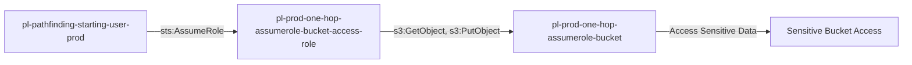

# One-Hop Privilege Escalation: sts:AssumeRole

* **Category:** Privilege Escalation
* **Sub-Category:** access-resource
* **Path Type:** one-hop
* **Target:** to-bucket
* **Environments:** prod
* **Pathfinding.cloud ID:** sts-001
* **Technique:** User with sts:AssumeRole can directly assume role with S3 bucket access

## Overview

This scenario demonstrates a simple but common privilege escalation pattern where a user can assume a role that grants access to sensitive S3 buckets. The attacker starts with minimal permissions but can assume a role with S3 access permissions, allowing them to read and write to a sensitive bucket.

## Understanding the attack scenario

### Principals in the attack path

- `arn:aws:iam::PROD_ACCOUNT:user/pl-pathfinding-starting-user-prod`
- `arn:aws:iam::PROD_ACCOUNT:role/pl-prod-one-hop-assumerole-bucket-access-role`
- `arn:aws:s3:::pl-prod-one-hop-assumerole-bucket-ACCOUNT_ID-SUFFIX`

### Attack Path Diagram



### Attack Steps

1. **Scaffolding aka Initial Access**: `pl-pathfinding-starting-user-prod` assumes the role `pl-prod-one-hop-assumerole-bucket-access-role` to begin the scenario
2. **Access S3 Bucket**: The assumed role has `s3:ListBucket`, `s3:GetObject`, and `s3:PutObject` permissions on the target bucket
3. **Verification**: Access and download sensitive data from the bucket

### Scenario specific resources created

| ARN | Purpose |
| -- | -- |
| `arn:aws:iam::PROD_ACCOUNT:role/pl-prod-one-hop-assumerole-bucket-access-role` | Role with S3 bucket access permissions |
| `arn:aws:s3:::pl-prod-one-hop-assumerole-bucket-ACCOUNT_ID-SUFFIX` | Target S3 bucket containing sensitive data |
| `arn:aws:s3:::pl-prod-one-hop-assumerole-bucket-ACCOUNT_ID-SUFFIX/sensitive-data.txt` | Sensitive file in the target bucket |

## Executing the attack

### Using the automated demo_attack.sh

To demonstrate the privilege escalation path, run the provided demo script:

```bash
cd modules/scenarios/single-account/privesc-one-hop/to-bucket/sts-assumerole
./demo_attack.sh
```

The script will:
1. Display a step-by-step walkthrough with color-coded output
2. Show the commands being executed and their results
3. Verify successful privilege escalation to bucket access
4. Output standardized test results for automation

### Cleaning up the attack artifacts

After demonstrating the attack, clean up any files created during the demo:

```bash
cd modules/scenarios/single-account/privesc-one-hop/to-bucket/sts-assumerole
./cleanup_attack.sh
```

## Detection and prevention


### MITRE ATT&CK Mapping

- **Tactic**: Privilege Escalation, Collection
- **Technique**: T1078.004 - Valid Accounts: Cloud Accounts
- **Sub-technique**: Abuse of cloud credentials to access resources


## Prevention recommendations

- Avoid granting `sts:AssumeRole` permissions to roles with access to sensitive resources
- Use resource-based conditions to restrict which principals can assume sensitive roles
- Implement SCPs to enforce least-privilege access patterns
- Monitor CloudTrail for `AssumeRole` API calls followed by S3 access to sensitive buckets
- Enable MFA requirements for assuming roles with access to sensitive data
- Use IAM Access Analyzer to identify privilege escalation paths
- Implement S3 bucket policies that restrict access even for assumed roles
- Enable S3 access logging to track data access patterns

