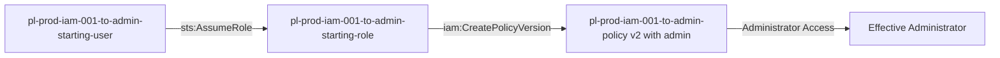

# Self-Escalation Privilege Escalation: iam:CreatePolicyVersion

* **Category:** Privilege Escalation
* **Sub-Category:** self-escalation
* **Path Type:** self-escalation
* **Target:** to-admin
* **Environments:** prod
* **Cost Estimate:** $0/mo
* **Pathfinding.cloud ID:** iam-001
* **Technique:** Self-modification via iam:CreatePolicyVersion
* **Terraform Variable:** `enable_single_account_privesc_self_escalation_to_admin_iam_001_iam_createpolicyversion`
* **Schema Version:** 1.0.0
* **Attack Path:** starting_user → (AssumeRole) → starting_role → (iam:CreatePolicyVersion) → new policy version with admin → admin access
* **Attack Principals:** `arn:aws:iam::{account_id}:user/pl-prod-iam-001-to-admin-starting-user`; `arn:aws:iam::{account_id}:role/pl-prod-iam-001-to-admin-starting-role`
* **Required Permissions:** `iam:CreatePolicyVersion` on `arn:aws:iam::*:policy/*`
* **Helpful Permissions:** `iam:ListPolicyVersions` (List existing policy versions); `iam:GetPolicyVersion` (View content of policy versions)
* **MITRE Tactics:** TA0004 - Privilege Escalation, TA0003 - Persistence
* **MITRE Techniques:** T1098 - Account Manipulation, T1098.001 - Additional Cloud Credentials

## Attack Overview

This scenario demonstrates a privilege escalation vulnerability where a role can modify its own permissions by creating new versions of policies attached to itself. The attacker starts with minimal permissions but can grant themselves administrator access by creating a new policy version with elevated permissions.

### MITRE ATT&CK Mapping

- **Tactic**: Privilege Escalation
- **Technique**: T1078.004 - Valid Accounts: Cloud Accounts
- **Sub-technique**: Abuse of IAM Permissions

### Principals in the attack path

- `arn:aws:iam::PROD_ACCOUNT:user/pl-prod-iam-001-to-admin-starting-user`
- `arn:aws:iam::PROD_ACCOUNT:role/pl-prod-iam-001-to-admin-starting-role`

### Attack Path Diagram



### Attack Steps

1. **Initial Access**: `pl-prod-iam-001-to-admin-starting-user` assumes the role `pl-prod-iam-001-to-admin-starting-role` to begin the scenario
2. **Create New Policy Version**: `pl-prod-iam-001-to-admin-starting-role` uses `iam:CreatePolicyVersion` to create a new version of its attached policy with administrator permissions
3. **Verification**: Verify administrator access with the modified policy

### Scenario specific resources created

| ARN | Purpose |
| -- | -- |
| `arn:aws:iam::PROD_ACCOUNT:user/pl-prod-iam-001-to-admin-starting-user` | Scenario-specific starting user with AssumeRole permission |
| `arn:aws:iam::PROD_ACCOUNT:role/pl-prod-iam-001-to-admin-starting-role` | Starting role with policy versioning capability |
| `arn:aws:iam::PROD_ACCOUNT:policy/pl-prod-iam-001-to-admin-policy` | Allows `iam:CreatePolicyVersion` and `iam:ListPolicyVersions` on itself |

## Attack Lab

### Prerequisites

1. Install the `plabs` CLI:
   ```bash
   brew install pathfinding-labs/tap/plabs
   ```
2. Configure your AWS profiles in `~/.plabs/plabs.yaml` (or run `plabs init` if you haven't already)

### Deploy with plabs non-interactive

```bash
plabs enable enable_single_account_privesc_self_escalation_to_admin_iam_001_iam_createpolicyversion
plabs apply
```

### Deploy with plabs tui

1. Launch the TUI: `plabs`
2. Navigate to this scenario in the scenarios list
3. Press `space` to enable it
4. Press `d` to deploy

### Executing the automated demo_attack script

The script will:
1. Display a step-by-step walkthrough with color-coded output
2. Show the commands being executed and their results
3. Verify successful privilege escalation
4. Output standardized test results for automation

#### Resources created by attack script

- New IAM policy version (v2) with `AdministratorAccess` permissions attached to `pl-prod-iam-001-to-admin-policy`

#### With plabs non-interactive

```bash
plabs demo --list
plabs demo iam-001-iam-createpolicyversion
```

#### With plabs tui

1. Launch the TUI: `plabs`
2. Navigate to this scenario in the scenarios list
3. Press `r` to run the demo script

### Cleanup

#### With plabs non-interactive

```bash
plabs cleanup --list
plabs cleanup iam-001-iam-createpolicyversion
```

#### With plabs tui

1. Launch the TUI: `plabs`
2. Navigate to this scenario in the scenarios list
3. Press `c` to run the cleanup script

### Teardown with plabs non-interactive

```bash
plabs disable enable_single_account_privesc_self_escalation_to_admin_iam_001_iam_createpolicyversion
plabs apply
```

### Teardown with plabs tui

1. Launch the TUI: `plabs`
2. Navigate to this scenario in the scenarios list
3. Press `space` to disable it
4. Press `D` to destroy

## Detecting Misconfiguration (CSPM)

### What CSPM tools should detect

- IAM role has `iam:CreatePolicyVersion` permission on policies attached to itself, enabling self-escalation
- Policy allows modification of the same policy that grants the permission (circular privilege escalation path)
- Role can effectively grant itself `AdministratorAccess` without any external approval

### Prevention recommendations

- Avoid granting `iam:CreatePolicyVersion` permissions on policies attached to the same role
- If required, use resource-based conditions to restrict which policies can be modified
- Implement SCPs to prevent policy version manipulation for privilege escalation
- Enable MFA requirements for sensitive operations
- Use IAM Access Analyzer to identify privilege escalation paths
- Implement alerting on policy version changes for critical roles
- Limit the number of policy versions that can exist (AWS allows up to 5)

## Detection Abuse (CloudSIEM)

### CloudTrail events to monitor

- `IAM: CreatePolicyVersion` — New policy version created; critical when the creating principal is also attached to the modified policy, indicating self-escalation
- `IAM: ListPolicyVersions` — Reconnaissance to enumerate existing policy versions before creating a new one
- `STS: AssumeRole` — Role assumption from starting user; monitor for assumption of roles with policy modification capabilities

### Detonation logs

_Detonation log integration (Stratus Red Team / Grimoire) is planned for a future release._
